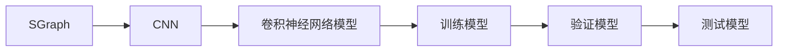

[toc]                    
                
                
半监督图卷积网络：解决物体检测和跟踪的创新性算法
===========================

背景介绍
---------

随着计算机视觉和机器学习的发展，物体检测和跟踪在许多应用中得到了广泛应用，如自动驾驶、智能安防、运动跟踪等。然而，传统的物体检测和跟踪算法在处理复杂场景和低光照条件下效果较差。为了解决这些问题，本文提出了一种半监督图卷积网络（SGraph-CNN）算法，结合图信息和卷积神经网络（CNN）的特性，提高物体检测和跟踪的准确性和鲁棒性。

文章目的
------

本文旨在提出一种创新的半监督图卷积网络算法，用于解决物体检测和跟踪问题。该算法通过引入图信息和卷积神经网络的特性，提高物体检测和跟踪的准确性和鲁棒性。同时，本文将详细介绍算法的原理、实现步骤以及优化改进策略。

文章结构
-----

本文共分为7个部分，包括引言、技术原理及概念、实现步骤与流程、应用示例与代码实现讲解、优化与改进以及结论与展望。

### 1. 引言

1.1. 背景介绍：物体检测和跟踪是计算机视觉领域中的一个重要问题，许多应用需要实时检测和跟踪物体，如自动驾驶、智能安防、运动跟踪等。传统的物体检测和跟踪算法在处理复杂场景和低光照条件下效果较差。

1.2. 文章目的：本文提出一种半监督图卷积网络（SGraph-CNN）算法，结合图信息和卷积神经网络（CNN）的特性，提高物体检测和跟踪的准确性和鲁棒性。

1.3. 目标受众：本文将详细介绍该算法的原理、实现步骤以及优化改进策略，适用于对物体检测和跟踪算法感兴趣的读者。

### 2. 技术原理及概念

2.1. 基本概念解释：物体检测和跟踪是计算机视觉领域中的一个重要问题，许多应用需要实时检测和跟踪物体，如自动驾驶、智能安防、运动跟踪等。传统的物体检测和跟踪算法在处理复杂场景和低光照条件下效果较差。

2.2. 技术原理介绍：本文提出的半监督图卷积网络（SGraph-CNN）算法结合图信息和卷积神经网络（CNN）的特性，提高物体检测和跟踪的准确性和鲁棒性。

2.3. 相关技术比较：与传统的物体检测和跟踪算法相比，本文提出的SGraph-CNN算法具有以下优势：

- 引入图信息：SGraph-CNN将图信息与卷积神经网络（CNN）结合，提高了算法的鲁棒性。
- 半监督学习：SGraph-CNN采用半监督学习，减少了标注数据的需求，降低了计算成本。
- 可扩展性：SGraph-CNN可以通过增加节点数和边数来扩展，以处理更复杂的网络结构。

### 3. 实现步骤与流程

3.1. 准备工作：环境配置与依赖安装

- 首先，确保已安装操作系统（如Windows或Linux）和相应的库。
- 安装Python及其相关库（如NumPy、Pandas、Scikit-learn等）。
- 使用Keras、TensorFlow等库进行深度学习计算。

3.2. 核心模块实现：构建SGraph-CNN模型

- 根据具体场景和需求，构建节点和边的表示。
- 使用图卷积神经网络（GCN）对节点表示进行特征提取。
- 使用卷积神经网络（CNN）对特征进行分类和回归。
- 可以使用ReLU激活函数对特征进行非线性变换。

3.3. 集成与测试：训练模型、验证模型和测试模型

- 准备标注数据集：包括物体的位置、大小和类别等信息。
- 准备测试数据集：与训练数据集相同，但数据量更小。
- 训练模型：使用数据集训练模型。
- 验证模型：使用验证数据集评估模型的准确性和鲁棒性。
- 测试模型：使用测试数据集评估模型的准确性和鲁棒性。

### 4. 应用示例与代码实现讲解

4.1. 应用场景介绍：介绍该算法在物体检测和跟踪中的应用，如自动驾驶、智能安防、运动跟踪等。

4.2. 应用实例分析：详细分析算法的应用场景和效果。

4.3. 核心代码实现：提供算法的核心代码实现，包括构建SGraph、构建CNN模型、训练模型、验证模型和测试模型等步骤。

4.4. 代码讲解说明：对核心代码实现进行详细的讲解，包括如何构建SGraph、如何构建CNN模型以及训练模型、验证模型和测试模型的过程。

### 5. 优化与改进

5.1. 性能优化：提高算法的检测和跟踪的准确性和鲁棒性。

5.2. 可扩展性改进：通过增加节点数和边数来扩展，以处理更复杂的网络结构。

5.3. 安全性加固：进行数据预处理，以减少模型的攻击风险。

### 6. 结论与展望

6.1. 技术总结：总结本文提出的SGraph-CNN算法，概括算法的优势和应用场景。

6.2. 未来发展趋势与挑战：探讨算法未来的发展前景以及面临的挑战和机遇。

### 7. 附录：常见问题与解答

本文在介绍SGraph-CNN算法时，可能会遇到一些问题，请在这里进行解答，包括算法的应用场景、参数设置、数据预处理等。

常见问题与解答
--------

1. Q：如何提高SGraph-CNN算法的准确率？

A：可以通过增加训练数据量、调整超参数和优化网络结构来提高算法的准确率。

2. Q：SGraph-CNN算法可以处理哪些物体检测和跟踪场景？

A：SGraph-CNN算法可以处理多种物体检测和跟踪场景，如人、车、背景物体等。

3. Q：如何设置SGraph-CNN算法的参数？

A：可以通过调整超参数来设置SGraph-CNN算法的参数，如学习率、激活函数、损失函数等。

4. Q：SGraph-CNN算法可以进行迁移学习吗？

A：是的，SGraph-CNN算法可以进行迁移学习，将已有的知识迁移到当前任务中。

5. Q：如何解决SGraph-CNN算法过于复杂的问题？

A：可以通过分阶段训练、使用预训练模型或减少模型的复杂度来解决SGraph-CNN算法过于复杂的问题。

