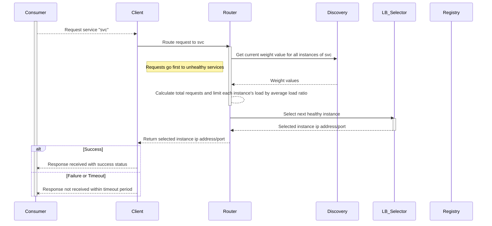

作者：禅与计算机程序设计艺术                    

# 1.简介
  

## 概述
在集成开发环境（IDE）中开发应用时，如何确保组件间通信、数据流向正确？服务导向集成框架（SOIF）提供了一个统一的编程模型，使得系统架构可以用服务的方式进行建模，从而解决分布式应用开发和运行过程中存在的一系列问题。
目前市面上有很多服务导向集成框架，如Apache Camel, Spring Cloud, Dubbo等，其优点如性能高、简单易用、灵活性强、支持多种协议、跨语言支持等，这些框架都是为了提升分布式系统开发效率和质量而生。但无论哪个框架都只是提供了一些基础的功能实现，实际情况复杂的分布式系统往往还需要一些特殊需求才能达到最佳效果，例如服务的动态发布、负载均衡、容错机制、服务调用超时控制、服务版本控制、流量控制、失败重试等等。所以，这就需要服务调度器这一组件来协调这些特殊需求之间的关系，最终确保整体系统的稳定运行。
本文将讨论服务调度器的作用及原理，并通过流程图、时序图、类图、状态图等各种形式将服务调度器的工作原理展示出来。最后对这些知识做些扩展和深入探讨，提出一些可能遇到的问题以及相应的解决办法，帮助读者进一步理解、掌握服务调度相关的知识。希望通过本文，能让读者更好地了解服务调度相关的知识，提升自己的技能水平。
## 目的
本文的目的是阐述服务调度器的作用及原理，包括它的主要功能模块、工作流程、输入、输出、接口等。为读者理解服务调度器的工作原理、掌握相关的原理性知识和实践能力，帮助读者更好地掌握服务导向集成框架中的服务调度知识，提升自己的能力水平。
# 2.基本概念术语说明
## 2.1 服务
服务指的是SOIF中最基本的模块单元，它代表着一个可独立部署和使用的功能或业务逻辑，可以被其他组件所调用。每个服务具有唯一的名称和接口，可以接收来自其它服务的请求并返回结果。服务通常是SOIF的核心模块，也是SOIF框架的核心组成部分。
## 2.2 服务集
服务集是由一组具有相同接口的服务构成的集合，它们共享相同的实现、配置信息和管理策略。服务集使得整个分布式系统中的服务能够按需动态部署、升级、迁移。通过服务集，可以实现服务的分组管理、版本控制、集群化、弹性伸缩等功能。服务集可以实现系统拓扑结构的优化和自动化，有效提升系统的可靠性和可用性。
## 2.3 服务注册中心
服务注册中心是一个独立的分布式系统，用于存储服务信息、维护服务的上下线信息、监控服务的健康状况。每当一个服务启动、停止、发生故障、上下线时，都会通知服务注册中心，这样服务消费者就可以根据服务注册中心的信息快速发现和连接到对应的服务端点。因此，服务注册中心能够提升服务调用的响应速度，降低网络延迟，并使系统具备良好的容错性和鲁棒性。
## 2.4 服务路由
服务路由是SOIF中最重要的模块之一，它的任务就是根据服务消费者的请求选择合适的服务端点来处理请求。服务路由的目标就是通过某种策略或规则，将请求发送给可用的服务实例，从而使服务消费者得到满足。服务路由有两种常用的方式，一种是轮询路由，另一种是负载均衡路由。轮询路由直接将请求轮流发送给不同的服务实例；负载均衡路由根据当前服务实例的负载情况，把请求均匀地分配给不同的服务实例，以提升系统的负载均衡能力。
## 2.5 服务配置管理
服务配置管理模块的任务是在SOIF框架中对服务的部署、运维、测试、以及版本管理等方面进行集成化管理。通过服务配置管理，可以实现服务的可配置化、可插拔化、可伸缩化，增强了服务的管理能力，实现服务的快速发布、更新、以及弹性伸缩。服务配置管理可以与服务路由结合起来，形成完整的SOIF系统。
## 2.6 服务发现与治理
服务发现与治理模块的主要任务是识别系统中出现的问题，诊断问题原因，并针对性的采取相应的治理手段，比如通过报警、降级、熔断等手段，保障系统的正常运行。服务发现与治理需要结合服务注册中心、服务路由、监控模块一起工作，可以为系统的运维提供便利。
## 2.7 SOIF框架
Service Oriented Integration Framework，即服务导向集成框架，是SOIF的官方命名，SOIF是一种服务化的分布式系统架构模式。它倾向于通过一系列服务的方式，构建一个功能完善、可扩展、可靠的分布式系统。通过服务化的架构模式，SOIF框架可以很好地实现分布式系统架构层面的解耦和隔离，使得各个模块之间能够高度复用、独立演进。
# 3.核心算法原理和具体操作步骤以及数学公式讲解
## 3.1 待调度队列
首先，SOIF会创建两个队列：
- Aging Queue：该队列保存那些最近变动较大的服务实例，或者长时间没有任何活动的服务实例。
- Pending Queue：该队列保存等待调度的服务实例。
其中，Aging Queue在配置文件中设置的时间长度内不会被删除，Pending Queue在配置文件中设置的时间长度内也不会过期。当一个服务实例从Pending Queue被移除后，它会被放入Aging Queue。
## 3.2 待调度服务实例
接下来，SOIF会判断是否有待调度的服务实例。如果存在，则会获取最新的权重值并通过特定算法确定选择的服务实例。否则，SOIF会放弃当前的调度请求，继续等待新的服务请求。
## 3.3 获取最新权重值
权重值是一个介于0到1之间的数字，它反映了服务实例的可用性、负载能力、综合性能等特征的一种度量。权重值的大小决定了服务实例的优先级。当SOIF获取到最新权重值后，它会遍历所有服务实例，按照权重值的大小排列它们。然后，SOIF会检查Aging Queue中的服务实例是否已经存在，如果不存在的话，SOIF就会将新加入的服务实例放入Aging Queue中。
## 3.4 执行调度算法
当SOIF确定了要调度的服务实例之后，它会执行调度算法。SOIF使用轮询算法作为默认调度算法，该算法每次都将请求分配给下一个服务实例，直到所有的服务实例都已被访问过一次。此外，SOIF还提供了多种调度算法，包括最小连接数、加权轮询、连接局部性、最小响应时间等。
## 3.5 返回结果
最后，SOIF会将调度的结果返回给服务消费者。
## 3.6 时序图描述
