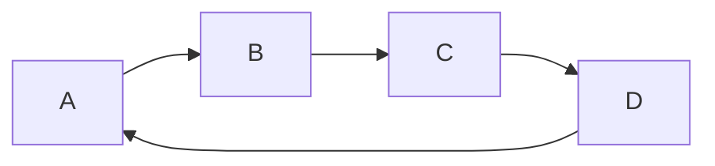

作者：禅与计算机程序设计艺术                    

# 1.简介
  

在很多现实世界的问题中，比如项目管理、依赖管理等等，都存在着任务之间存在着前后关系或者顺序关系的情况。即使是简单的排序问题，也很难解决。因此，对于这种具有依赖关系的任务有序进行调度，就成为一个重要的计算机科学领域的研究方向。


在许多依赖管理工具中，都提供了一种拓扑排序的功能，可以根据某种顺序规则对任务进行优先级排序。但是，通常情况下，拓扑排序算法只是基于某些假设条件的排序方法。另外，并非所有的依赖关系都是有向无环图（DAG）形式的，有的还存在环路或者循环依赖的问题。因此，如何准确有效地处理这些依赖关系并找到正确的执行序列是至关重要的。


本文将给出拓扑排序算法的介绍，包括一些基本概念和术语的定义。然后，将结合具体的算法原理和应用场景，详细介绍该算法。最后，将给出具体的代码实现，并讨论该算法的时间复杂度和空间复杂度，以及一些注意事项。最后还会介绍一些扩展话题，比如拓扑排序与有向无环图、最短路径算法、强连通子图等其他相关算法之间的联系及区别。


# 2.背景介绍

## 2.1 概念

拓扑排序是用来确定一个有向无环图（Directed Acyclic Graph, DAG）中所有顶点的线性次序。它是一个比较著名的排序算法，具有十分广泛的应用。比如，在编译器、路由协议、高性能计算平台和分布式系统设计中都用到过拓扑排序算法。


## 2.2 相关概念

### 2.2.1 有向无环图DAG(Directed Acyclic Graph)

在数学上，有向无环图是指一个由有向边连接的节点组成的图。如果图中任意两个顶点间存在一条路径相交的环，则这个图不是DAG。一般来说，一个DAG代表一个有向流程或是有序活动，其中每条活动只能发生在其前置活动结束之后。例如，下面的这种有向流程就是一个DAG：



而下面的这种则不是：

```mermaid
graph TD
    A-->B
    B-->C
    C-->D
    D-->E
    E-->F
    F-->A   // Cycle!
```


### 2.2.2 拓扑排序算法

在DAG中，对于每个节点，若不存在有向回路，则该节点的入度等于0；否则，该节点的入度不等于0。称这样的一组节点为有向无环图的一个拓扑序列。也就是说，对有向无环图中的所有顶点进行一次DFS遍历，遇到的每个节点都会减少其出度，直到某个顶点的出度变为零时才停止。从而得到的DFS序列即为拓扑序列。拓扑排序算法的工作过程如下：

1. 从DAG中的每个顶点出发进行DFS，记录各个顶点的颜色(灰色表示尚未访问，黑色表示已完成，白色表示正在处理)。

   - 如果发现有环，则回溯到出现了环的顶点。
   - 对每个顶点，按照DFS的次序将其输出。

2. 根据输出的结果进行调换、交换、组合等操作，最终得到一个可以正常运行的有序序列。

3. 拓扑排序是一个NP完全问题，所以实际上是不存在可用的全局最优解的。

### 2.2.3 强连通子图

在有向无环图(DAG)中，如果存在两个顶点间存在路径且相互通过其他顶点，那么我们称这两个顶点是强连通的。有向无环图的所有强连通子图构成了一个强连通组件。


# 3.基本概念术语说明

## 3.1 节点vertex (v)

图中顶点，通常表示为数字或字符。如图a所示，其中节点为{a,b,c,d}，则节点个数为n=4。


## 3.2 边edge

图中连接两个节点的线段。如图a所示，图中有四条边，分别连接节点a和节点b、节点a和节点c、节点b和节点d和节点c和节点d。图中边的数量记为m。


## 3.3 邻接节点Adj(Vertex)

对于节点v，其邻接节点表示的是直接与之相连接的节点。如图a所示，节点a的邻接节点只有节点b，节点b的邻接节点有节点c和节点d，节点c的邻接节点只有节点d，节点d的邻接节点没有邻接节点。


## 3.4 度degree

对于节点v，其度表示的是节点v与其他节点之间的连接个数。如图a所示，节点a的度为2，节点b的度为2，节点c的度为1，节点d的度为2。


## 3.5 入度In-Degree

对于节点v，其入度表示的是进入节点v的边的个数。如图a所示，节点a的入度为1，节点b的入度为2，节点c的入度为1，节点d的入度为1。


## 3.6 出度Out-Degree

对于节点v，其出度表示的是离开节点v的边的个数。如图a所示，节点a的出度为1，节点b的出度为1，节点c的出度为2，节点d的出度为1。


## 3.7 有向无环图DAG

图G=(V,E)是指一个有穷集合V与一个边集E组成，满足以下两个条件：

- 每条边均是有向的，即存在箭头方向。
- 不存在自环和循环，即不存在边形成回路的结构。

如图a所示，图G就是一个有向无环图。


## 3.8 顶点排序Topologically Sorted Vertexes

对于DAG G=(V,E)，当其不存在回路时，按次序对其顶点集合V中的元素进行排序，使得若存在一条有向边uv，则u排在v之前，则称这样的排序为顶点排序，记作$ts(G)$。如图a所示，图G的顶点排序$ts(G)=abcde$。


# 4.核心算法原理和具体操作步骤以及数学公式讲解

拓扑排序算法是对有向无环图的一种重要排序算法，其主要目的是将其顶点按一定的顺序排列，使得对于每条边uv，顶点u先于顶点v被排列。


## 4.1 DFS序DFS Traversal Order of a Directed Acyclic Graph

首先需要对DAG进行深度优先搜索（Depth First Search），由于存在回路，所以如果DFS过程中找到了一个回路，就可以认为该图不是DAG，无法进行拓扑排序。

我们把拓扑排序算法描述为：

给定一个DAG G=(V,E),找出它的拓扑排序。

为了求出其拓扑排序，我们对DAG进行DFS，遍历其顶点，对每个顶点进行DFS，将其深度赋给它，也就是说：每个节点的DFS深度决定了它何时可以加入拓扑排序的序列，其次序决定了拓扑排序的顺序。

DFS序的定义是DFS遍历树中各个结点的次序，按照其访问时间的先后顺序。注意：DFS序是唯一的，但存在冗余元素，如图b所示，则其拓扑排序有多个序列，可以选择任何一个。

## 4.2 拓扑排序算法Algorithm to perform Topological sorting on DAG

1. 初始化所有顶点的颜色为灰色。

2. 开始对图进行DFS。对图中的每个顶点做以下操作：

   * 设置顶点为黑色。
   * 将其出度减1。
   * 如果出度为0，则将它放入栈中。

3. 当所有顶点都被访问完时，栈为空，但仍然存在灰色顶点，则表明图中存在环。返回错误提示。

4. 如果栈为空，则说明图中没有环。反转所有边，得到拓扑排序序列。


## 4.3 Time Complexity Analysis and Space Complexity Analysis

#### **时间复杂度分析**

在最坏情况下，算法需要对每个顶点进行DFS一次，所以总时间复杂度为$O(|V|+|E|)$ 。

#### **空间复杂度分析**

算法的空间复杂度仅为栈的大小，栈中存储每个顶点的入栈顺序，所以空间复杂度为$O(|V|)$ 。


## 4.4 Algorithmic Pitfalls and Common Mistakes

1. Topological sort may not be unique if the graph has multiple cycles with different orders of nodes. For example, consider the following directed acyclic graph:

    ```mermaid
        graph TD
        	a --> b
        	b --> c
        	c --> d
        	e --> f
        	f --> e
    ```
    
    The first cycle is $acbde$, while the second cycle is $efdcb$. Any topological sort that includes either one will produce an incorrect result.
    
2. Some sources online suggest that topological sort can also work for undirected graphs, but this does not always hold true. Consider the following undirected graph:

    ```mermaid
        graph UD
            a --- b -- c
            |     \    /
            |      X---X
            d --- e -- f
    ```
    
    There are no cycles or feedback edges in this graph, so it should have a unique topological order such as $aedcfb$. However, some sources suggest that this is impossible since there could exist two edges connecting vertices $e$ and $f$, which would cause a cycle. Therefore, only directed acyclic graphs can have a unique topological ordering.