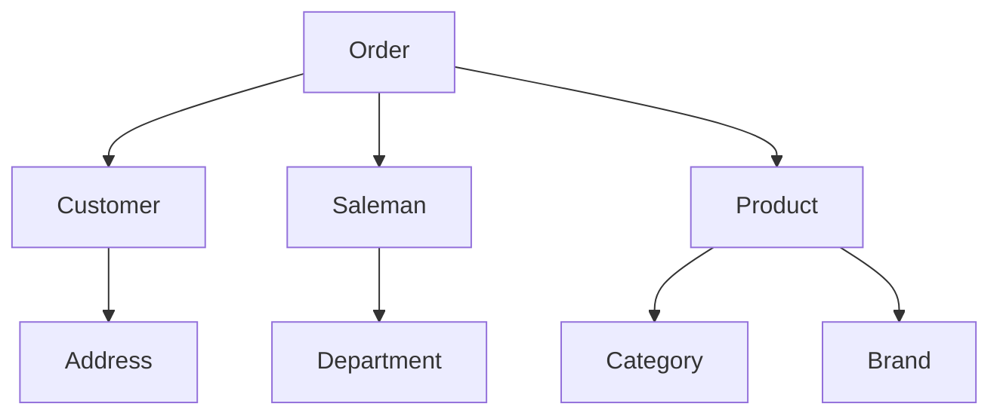

作者：禅与计算机程序设计艺术                    

# 1.背景介绍

## 数据质量管理
数据质量是指数据在一个时代的准确性、完整性和有效性等属性。数据质量管理是保障数据的重要手段之一。随着互联网的飞速发展，越来越多的数据被产生，而这些数据质量的管理显得尤为重要。数据质量管理分为两个阶段——**初期数据质量目标设定（Initial Data Quality Targets）** 和 **持续数据质量目标设定（Continual Data Quality Targets）**。前者是指对新产生数据的初步分析，目的是建立起一套规范化的评价标准和流程，用于衡量后期产生的数据质量；后者则是基于已有的经验或市场需求，不断调整目标并不断完善评估标准和流程，以提高数据的可靠性、完整性、可用性和稳定性。

数据质量管理主要解决以下三个方面：

1. 数据采集质量：收集的数据一定要准确无误，才能满足需求，能够得到更加有用的信息。
2. 数据存储质量：数据的生命周期长且繁琐，不同的数据源存在大量冗余。因此，需要对数据进行存储、备份及归档，确保其安全性、正确性和完整性。
3. 数据分析质量：数据的分析需要根据业务理解和实际情况制定相关质量指标，然后用计算方法验证结果是否符合要求。

数据质量管理除了包括上述三个方面的内容外，还涉及到数据沉淀、传输、清洗、集成、报告、审核、监控等环节，来实现数据的全生命周期管理。数据质量管理的意义重大，对数据的价值至关重要。但是，如何管理好数据质量是一个非常复杂的问题。

作为数据工程师的你，需要学习如何构建一套完善的数据质量管理体系，从而提升数据的质量水平。在数据科学和机器学习的驱动下，数据的产生已经变得十分迅速、频繁和复杂。如何快速获取、处理和分析海量数据，成为一件日益重要的工作。而数据质量管理正是基于这一重要工作，帮助数据科学家、产品经理和其他相关人员更好地掌握数据的质量，从而支撑公司业务发展、竞争力增强和品牌形象提升。

## 数据中台架构
数据中台（Data Management Platform，DMP）是一种分布式的数据技术架构，由多个数据系统和相关服务组成，提供统一的管理、数据开发、质量管理、数据交换、协作等功能，广泛应用于金融、零售、电信、公共事业、医疗等领域。它可以帮助企业打通各类数据孤岛，实现统一的管理和运营，从而提升企业的整体能力、降低企业运维成本，更好地实现业务发展和社会效益。

数据中台由四个层次构成：数据仓库层、数据湖层、数据引擎层、数据应用层。其中，数据仓库层负责组织、结构化、存储数据，支持复杂查询和分析，为数据决策提供支持。数据湖层通过数据整合、加工、汇聚和抽取，集成不同来源的数据，为各种用途提供数据服务。数据引擎层基于多种计算引擎技术，进行数据处理和分析，支持流畅的数据交互和查询。数据应用层通过用户界面和智能分析工具，为不同用例提供数据服务。

图1: 数据中台架构示意图

## 数据质量管理策略
数据质量管理策略是数据中台架构中的重要一环。它是指企业针对不同类型的数据，制订的一系列数据收集、存储、分析、运营和管理规则和机制，以保证数据质量的一致性、准确性、完整性、可用性和可维护性。数据质量管理策略分为“计划”、“过程”、“工具”、“方式”和“平台”五大块。

### 一、计划
数据质量管理的第一步是制定数据质量管理计划。计划应当明确数据质量管理的目的和范围。数据质量管理计划的主要内容包括：

1. 数据质量管理目标：围绕企业内部、外部和机构的特定目标和要求，设置数据质量管理目标，如减少损失、提高效率、改善客户满意度等。
2. 数据质量管理框架：制定数据质量管理框架，包括数据来源、保护原则、控制措施、响应机制、审核过程、记录管理、风险管控等。
3. 数据质ivalidation Strategy：明确数据质量检核策略，包括数据质量初始目标设置、数据质量检查点设计、数据质量管理手册制定、数据质量管理工具选择等。
4. 数据质量管理规划：制定数据质量管理规划，包括数据质量管理计划、预算、计划执行、跟踪记录和结果反馈等。

### 二、过程
数据质量管理的第二步是制定数据质量管理过程。过程是指数据质量管理的各项活动所依据的规范和流程。过程包含三大类活动：数据收集、存储、分析、运营和管理。过程的主要内容包括：

1. 数据采集：对源头数据进行收集和处理，提取必要的知识和信息，生成具有价值的结果。
2. 数据储存：将数据保存到数据库或文件系统，并通过安全的传输方式进行传输，并对数据进行加密和保护。
3. 数据分析：分析数据，从数据源头发现信息价值，进行数据建模、统计、分析，发现数据问题，提供行业洞察和业务参考。
4. 数据运营：确保数据的正确性、可靠性、可用性和完整性。数据可靠性包括数据的准确性、完整性和可用性。
5. 数据管理：确保数据的正确性、可靠性、可用性、完整性、安全性、合规性和隐私性。

### 三、工具
数据质量管理的第三步是选择数据质量管理工具。工具是指数据质量管理过程中使用的各类技术和产品。工具的主要内容包括：

1. 数据采集工具：对原始数据进行收集、处理、转换和校验。
2. 数据储存工具：对数据进行保存、检索、备份、加密、归档和恢复。
3. 数据分析工具：对数据进行数据建模、统计、分析、可视化和模型训练。
4. 数据运营工具：对数据进行配置、部署和管理。
5. 数据管理工具：对数据进行验证、审核、统计、管理、优化和保护。

### 四、方式
数据质量管理的第四步是采用数据质量管理方式。方式是指采用哪些手段、方式、模式去管理数据，使数据达到最佳的状态。方式的主要内容包括：

1. 数据分类：区别不同的数据，设置相应的数据质量标准。
2. 数据收集：采集数据并对数据进行去噪、准备、转换等处理，确保数据的准确性和完整性。
3. 数据存储：利用数据仓库、数据湖或者对象存储等技术将数据存储到硬盘、磁盘阵列、云端服务器等位置。
4. 数据分析：利用数据分析工具对数据进行清洗、转换、挖掘、过滤、合并、拆分、计算、排序等处理，获得有效的信息。
5. 数据运营：制定数据运营策略，确保数据始终处于良好的运行状态。
6. 数据管理：定期对数据进行检验、检测和维护，确保数据质量的一致性、准确性、完整性、可用性和可维护性。

### 五、平台
数据质量管理的最后一步是选择数据质量管理平台。平台是指数据质量管理方案的落地环境，是指数据质量管理的工具、产品、服务，以及运行过程中的一系列支持机制和标准。平台的主要内容包括：

1. 数据质量管理中心：提供数据质量管理工具、产品和服务，为数据管理团队和各级管理层提供数据质量管理支持。
2. 数据质量管理体系：构建数据质量管理体系，包括数据开发、质量管理、数据交换、协作和资源共享等环节。
3. 数据质量管理宣传：促进数据质量管理的宣传，推动部门、组织、个人对数据质量管理的关注和认同。
4. 数据质量管理培训：开展数据质量管理培训，让更多的人了解数据质量管理的意义和方法。
5. 数据质量管理监控：建立数据质量管理监控体系，实时跟踪数据质量管理情况。

# 2.核心概念与联系
## 2.1 数据资产
数据资产是企业所有数据中最重要也是最基础的一部分。数据资产可以简单理解为生产或销售任何商品或服务所需的物料、设备和人才等。在数据中台架构里，数据资产的概念被延伸，更准确的来说，数据资产就是企业生产、存储、分析和管理的数据的集合。

数据资产包括：

1. 内部数据：指企业内的数据，包括操作系统、应用程序、数据文档、数据库、财务信息等。
2. 外部数据：指企业外部（如合作伙伴数据）的数据。
3. 来自第三方的数据：指来自其他公司、机构或国家的数据，例如第三方支付服务提供商的数据。

数据资产包含不同级别的质量标准和数据约束条件。内部数据通常不受任何限制，而来自外部或第三方的数据则需要严格遵守相关法律、法规和政策。

## 2.2 数据治理
数据治理是指数据资产的管理，包括数据发现、数据质量保障、数据用量管理、数据价值管理、数据治理能力建设等。数据治理主要分为四个阶段：

1. 数据发现阶段：在这个阶段，企业需要识别并了解自己的数据以及外部数据，搜集、整理和分析数据资产。这包括数据调查、问卷调查、倾听用户声音、进行数据搜集、数据分析等。
2. 数据质量保障阶段：在这个阶段，企业需要保障数据质量，包括数据采集、数据处理、数据存储、数据分析、数据展示等。数据质量保障包括数据质量管理、数据备份、数据压缩、数据分析、数据安全等。
3. 数据用量管理阶段：在这个阶段，企业需要管理和控制数据用量。这包括数据分析、数据处理、数据缓存和数据过滤等。用量管理包括限制数据下载速度、优化搜索结果、限制数据查询频率等。
4. 数据价值管理阶段：在这个阶段，企业需要管理和控制数据的价值。这包括数据利用、数据价值分配、数据溯源、数据监测、数据分类等。价值管理包括了解数据的用户、数据垂直细分、数据价值评估、数据挖掘等。

数据治理的最终目的是，让数据资产有足够的价值。通过数据治理，企业可以让数据资产的价值最大化，从而实现真正的价值创造。

## 2.3 数据资产模型
数据资产模型又称为数据资产架构模型、数据资产管理模型、数据资产治理模型，是对企业数据资产的可视化描述。数据资产模型可分为四层：

1. 数据主题层：描述数据的主要内容，例如订单数据、营销数据、用户数据、产品数据、供应链数据、营销数据等。
2. 数据实体层：描述数据实体的元数据，例如订单号、创建时间、客户ID等。
3. 数据属性层：描述数据实体的属性，例如订单金额、订单数量、订单状态等。
4. 数据关系层：描述数据之间的关联关系，例如订单表和客户表之间的一对多关系等。

数据资产模型的作用是将不同类型的数据资产纳入到一起，为管理者提供全局的视图，方便他们快速定位和分析数据资产。

## 2.4 数据中台模型
数据中台模型是数据中台架构中最重要的组成部分。数据中台模型为企业提供了一种统一的视图，使其能够从整体上把控数据资产，提升数据治理能力。数据中台模型主要有六大层次：

1. 业务实体层：描述企业的核心业务实体，例如产品、订单、客户、销售人员、渠道等。
2. 数据实体层：描述企业的所有数据实体，例如商品数据、订单数据、顾客数据、商城数据等。
3. 数据资产层：描述数据实体的各种数据资产，例如数据连接信息、数据导入脚本、数据字典、数据质量标准、数据合规性证书等。
4. 数据架构层：描述数据架构的模式、结构和映射，例如数据库模型、数据仓库模型、数据湖模型等。
5. 数据治理层：描述数据资产的管理方式、规范和流程，例如数据质量管理、数据用量管理、数据价值管理、数据用流程等。
6. 系统治理层：描述系统的全生命周期管理，例如数据治理、系统性能管理、系统运维管理等。

数据中台模型可帮助企业看到整个数据资产，更容易发现和管理数据资产的价值和用处。

# 3.核心算法原理和具体操作步骤以及数学模型公式详细讲解
## 3.1 数据血缘图
数据血缘图是数据中台架构中最重要的工具。数据血缘图能够帮助用户快速了解自己的数据到底来自何处，并影响了哪些业务。数据血缘图的核心思想是根据数据流向来呈现数据资产的上下游关系。数据血缘图主要有两种呈现形式：

1. 节点关系型：表示数据资产之间的相互依赖关系，通常呈现在矩形的框图中。节点关系型数据血缘图能够清晰显示数据资产之间的依赖关系。
2. 流程图型：在流程图型数据血缘图中，数据资产呈现为圆圈，并显示数据流向。流程图型数据血缘图是节点关系型数据血缘图的补充，可以展示出复杂的数据流转情况。

## 3.2 数据映射技术
数据映射技术是数据中台架构中不可或缺的组成部分。数据映射技术是指根据相关业务规则、数据标准、数据模型、数据库设计等，将不同来源的数据映射到统一的格式、结构和模型。数据映射技术使得不同数据来源的数据能够按照相同的方式进行分析和交叉引用，从而提高数据质量。

数据映射技术可以分为两类：

1. 静态映射技术：即根据某一固定模板来建立数据模型，静态映射只适用于简单数据模型。
2. 动态映射技术：即根据业务规则和数据标准动态生成数据模型，动态映射可以实现更复杂、更丰富的业务场景。

## 3.3 数据主题建模技术
数据主题建模技术是指对数据资产进行主题建模。数据主题建模是基于业务需求和用例的角度，按照特定主题划分数据资产。数据主题建模的目的是为了将不同数据资产按照相关特性归类到不同的主题中，以便在后续的数据治理工作中更好的进行管理和处理。数据主题建模的核心思想是根据业务价值和理解难度将数据资产划分成多个主题。

数据主题建模技术可分为两类：

1. 概念主题建模：根据数据的本质属性、共性特征、模式等，将数据划分成多个基本的概念主题。
2. 观点主题建模：基于业务分析的观点，对数据的分析和总结，将数据划分成多个观点性主题。

## 3.4 数据监控
数据监控是数据质量管理的重要组成部分。数据监控是在系统运行时监控数据健康状况，发现异常行为并做出响应，以提高数据质量。数据监控可以分为三大类：

1. 数据质量：对数据的质量进行监控，包括数据的时效性、完整性、一致性、有效性等。
2. 数据可用性：对数据的可用性进行监控，包括数据服务的稳定性、易用性、响应时间等。
3. 数据准确性：对数据的准确性进行监控，包括数据匹配度、一致性、唯一性等。

## 3.5 数据质量检查
数据质量检查是数据质量管理的核心任务。数据质量检查是在不同环节对数据进行检查，验证数据是否满足指定质量标准。数据质量检查通常包括三个部分：

1. 数据发现：发现数据中的错误、漏洞和缺陷，进行故障诊断和修复。
2. 数据验证：对数据进行检查，验证数据是否满足指定的质量标准，进行问题追踪和解决。
3. 数据优化：优化数据质量，提高数据可靠性、完整性、有效性等。

数据质量检查有多种方式，常见的方式包括：

1. 规则式数据质量检查：使用预先定义的规则和标准，对数据进行检查。
2. 模板式数据质量检查：根据数据主题和属性模板，对数据进行检查。
3. 主动式数据质量检查：根据数据的实际使用情况，主动发现数据问题，进行实时跟踪。

# 4.具体代码实例和详细解释说明
## 4.1 创建数据主题模型
假设企业数据中包含订单数据、客户数据、销售数据和商品数据，并且这些数据属于不同的主题，那么可以使用以下的方法创建一个数据主题模型：

## 4.2 生成数据血缘图
假设我们有一个系统，其中包含订单数据、客户数据、商品数据和供应商数据，我们可以使用如下的数据血缘图来查看数据的依赖关系：

图2: 数据血缘图示例

## 4.3 实现数据映射技术
假设我们的订单数据来源于两条数据流：一个来自客户的数据流和另一个来自供应商的数据流。如果我们想将订单数据按照统一的格式、结构和模型进行处理，可以采用如下的方法：

1. 构造数据模型：首先需要构造数据模型，确定订单数据的字段、结构和模型。
2. 建立映射关系：通过比较两个来源的订单数据，发现差异化字段，建立映射关系。
3. 对接数据源：将订单数据导入到统一的数据源中。
4. 执行数据迁移：对订单数据进行复制、清洗和转换，并写入统一的数据源。

## 4.4 实现数据主题建模
假设我们有一个在线购物网站，网站中的产品数据包含商品名、价格、类别、品牌等信息，如果我们想要将产品数据划分成多个主题，比如商品信息、属性信息、描述信息等，可以通过如下的方法：

1. 根据业务需求划分主题：将产品信息、属性信息、描述信息等划分成不同的主题。
2. 建立主题联系：将不同主题之间的联系建立起来，形成主题间的上下级关系。
3. 映射主题属性：将每个主题的属性映射到数据源中。
4. 使用主题数据：使用各个主题的数据进行数据分析、挖掘、处理和展示。