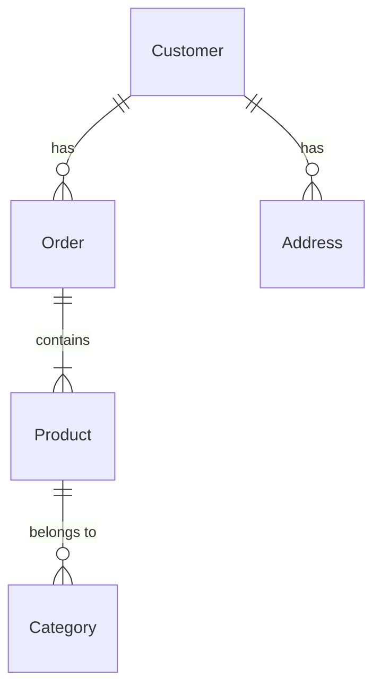

                 

# 1.背景介绍

数据建模和数据仓库设计是数据科学和工程领域中的两个关键概念。数据建模旨在帮助组织理解、挖掘和优化其数据资源，以满足业务需求。数据仓库设计则是构建一个集成、统一、安全、可靠的数据仓库系统的过程。这两个领域虽然有着不同的目标和方法，但在实际应用中，它们之间存在密切的关系和联系。

在本文中，我们将探讨数据建模与数据仓库设计之间的关系，以及如何将这两个领域结合起来，以实现更高效、更准确的数据分析和挖掘。我们将从以下几个方面进行讨论：

1. 背景介绍
2. 核心概念与联系
3. 核心算法原理和具体操作步骤以及数学模型公式详细讲解
4. 具体代码实例和详细解释说明
5. 未来发展趋势与挑战
6. 附录常见问题与解答

## 1.背景介绍

### 1.1 数据建模

数据建模是一种将业务需求映射到数据结构的过程，以实现数据库设计、数据集成、数据清洗、数据挖掘等目的。数据建模涉及到以下几个主要步骤：

1. 需求分析：了解业务需求，确定数据模型的目标和范围。
2. 实体关系建模：根据业务需求，识别实体、属性、关系、属性关系等元素，并构建实体关系图。
3. 数据字典建立：为实体关系建模提供详细的数据定义和约束。
4. 逻辑数据模型设计：根据实体关系建模，构建逻辑数据模型，如关系型数据模型、 Entity-Relationship (ER) 模型等。
5. 物理数据模型设计：根据逻辑数据模型，构建物理数据模型，包括数据库表结构、索引、分区等。
6. 数据质量管理：对数据进行清洗、校验、纠正等操作，确保数据质量。

### 1.2 数据仓库设计

数据仓库设计是构建一个用于存储、管理和分析大量历史数据的系统的过程。数据仓库设计涉及到以下几个主要步骤：

1. 需求分析：了解业务需求，确定数据仓库的目标和范围。
2. 数据源识别：识别并集成来自不同系统的数据源。
3. 数据清洗与集成：对来自不同数据源的数据进行清洗、转换和集成。
4. 数据仓库架构设计：根据业务需求和数据源，选择合适的数据仓库架构，如 Kimball 模型、 Inmon 模型等。
5. 数据模型设计：根据业务需求和数据仓库架构，构建数据模型，如 star 模型、 snowflake 模型等。
6. 数据仓库实现：根据数据模型，构建数据仓库系统，包括 ETL 工具、数据库管理系统、数据仓库查询和分析工具等。

## 2.核心概念与联系

### 2.1 数据建模与数据仓库设计的联系

数据建模和数据仓库设计在实际应用中存在以下几个联系：

1. 共享数据源：数据建模和数据仓库设计都涉及到数据源的识别、集成和清洗。
2. 共享目标：数据建模和数据仓库设计都旨在满足业务需求，提高数据的可用性和价值。
3. 共享方法：数据建模和数据仓库设计可以共享一些方法和技术，如需求分析、数据清洗、数据模型设计等。

### 2.2 数据建模与数据仓库设计的区别

尽管数据建模和数据仓库设计存在许多联系，但它们在目标、范围和方法上仍然有所不同。

1. 目标不同：数据建模旨在帮助组织理解、挖掘和优化其数据资源，以满足业务需求；数据仓库设计则是构建一个集成、统一、安全、可靠的数据仓库系统。
2. 范围不同：数据建模涉及到业务需求、数据模型、数据质量等方面；数据仓库设计则涉及到数据源识别、数据清洗与集成、数据仓库架构设计等方面。
3. 方法不同：数据建模主要使用实体关系图、数据字典、逻辑数据模型、物理数据模型等工具和方法；数据仓库设计则主要使用 Kimball 模型、 Inmon 模型、 star 模型、 snowflake 模型等工具和方法。

## 3.核心算法原理和具体操作步骤以及数学模型公式详细讲解

在这里，我们将详细讲解一些核心算法原理、具体操作步骤以及数学模型公式，以帮助读者更好地理解数据建模和数据仓库设计的实现过程。

### 3.1 数据建模

#### 3.1.1 实体关系建模

实体关系建模是数据建模的核心部分，涉及到以下几个步骤：

1. 识别实体：实体是数据模型中的基本元素，表示业务中的对象。例如，客户、订单、商品等。
2. 识别属性：属性是实体的特征，用于描述实体。例如，客户的名字、地址、电话等。
3. 识别关系：关系是实体之间的联系，用于描述实体之间的关系。例如，订单与商品之间的关系。
4. 识别属性关系：属性关系是属性之间的联系，用于描述属性之间的关系。例如，订单的总金额与商品价格和数量的关系。

#### 3.1.2 数据字典建立

数据字典是数据建模的一个重要组成部分，用于描述实体、属性、关系、约束等元素的详细定义。数据字典可以使用表格、图表、文本等形式表示。

### 3.2 数据仓库设计

#### 3.2.1 数据源识别

数据源识别是数据仓库设计的一个关键步骤，涉及到以下几个方面：

1. 识别来源：识别数据源的来源，例如企业内部系统、外部供应商、第三方数据提供商等。
2. 识别类型：识别数据源的类型，例如关系型数据库、非关系型数据库、文件、API 等。
3. 识别格式：识别数据源的格式，例如 CSV、JSON、XML、二进制等。

#### 3.2.2 数据清洗与集成

数据清洗与集成是数据仓库设计的一个关键步骤，涉及到以下几个方面：

1. 数据清洗：对来自不同数据源的数据进行清洗、校验、纠正等操作，以确保数据质量。
2. 数据集成：将来自不同数据源的数据进行集成、转换、映射等操作，以构建完整的数据仓库。

#### 3.2.3 数据模型设计

数据模型设计是数据仓库设计的一个关键步骤，涉及到以下几个方面：

1. 选择数据模型：根据业务需求和数据源，选择合适的数据模型，例如 star 模型、 snowflake 模型等。
2. 构建数据模型：根据选定的数据模型，构建数据模型，包括实体、属性、关系、约束等元素。
3. 实现数据模型：将数据模型实现为数据库表结构、索引、分区等，以支持数据仓库查询和分析。

## 4.具体代码实例和详细解释说明

在这里，我们将提供一些具体的代码实例，以帮助读者更好地理解数据建模和数据仓库设计的实现过程。

### 4.1 数据建模

#### 4.1.1 实体关系建模

假设我们需要建模一个在线购物平台，包括客户、订单、商品等实体。我们可以使用 UML 图来表示实体关系。



#### 4.1.2 数据字典建立

假设我们需要建立一个数据字典，描述订单表的结构。数据字典可以使用表格形式表示。

| 字段名称 | 字段类型 | 描述 | 约束 |
| --- | --- | --- | --- |
| order_id | int | 订单 ID | 主键，自增长 |
| customer_id | int | 客户 ID | 外键，不允许为空 |
| order_date | date | 订单日期 | 不允许为空 |
| total_amount | decimal | 订单总金额 | 不允许为空，精度为 2 |
| status | varchar | 订单状态 | 允许为空，长度不超过 20 |

### 4.2 数据仓库设计

#### 4.2.1 数据清洗与集成

假设我们需要将来自不同数据源的销售数据进行清洗和集成。我们可以使用 Python 编程语言实现这个功能。

```python
import pandas as pd

# 加载数据
sales_data_1 = pd.read_csv("sales_data_1.csv")
sales_data_2 = pd.read_csv("sales_data_2.csv")

# 清洗数据
sales_data_1 = sales_data_1.dropna()
sales_data_2 = sales_data_2.dropna()

# 集成数据
sales_data = pd.concat([sales_data_1, sales_data_2], ignore_index=True)

# 保存数据
sales_data.to_csv("sales_data.csv", index=False)
```

#### 4.2.2 数据模型设计

假设我们需要设计一个销售数据仓库，包括客户、订单、商品、销售数据等实体。我们可以使用 star 模型来表示数据模型。

```mermaid
starDiagram
    Customer {
        "customer_id"
        "customer_name"
        "customer_address"
    }
    Order {
        "order_id"
        "order_date"
        "total_amount"
        "status"
    }
    Product {
        "product_id"
        "product_name"
        "product_category"
        "product_price"
    }
    Sales {
        "sales_id"
        "order_id"
        "product_id"
        "quantity"
        "sales_date"
    }
    "Customer" --> "Order"
    "Order" --> "Sales"
    "Product" --> "Sales"
```

## 5.未来发展趋势与挑战

### 5.1 数据建模

未来发展趋势：

1. 人工智能与机器学习：数据建模将更加关注人工智能和机器学习技术，以提高业务决策能力和预测准确性。
2. 实时数据处理：数据建模将更加关注实时数据处理技术，以满足实时业务需求。
3. 多模态数据：数据建模将面临更多的多模态数据（如图像、音频、文本等）处理挑战，需要开发新的建模方法和技术。

挑战：

1. 数据量的增长：随着数据量的增长，数据建模需要面临更高的计算和存储要求。
2. 数据质量：数据建模需要关注数据质量问题，如数据缺失、噪声、重复等，以确保建模结果的准确性和可靠性。
3. 数据安全与隐私：数据建模需要关注数据安全和隐私问题，以保护企业和用户的法律利益和隐私权。

### 5.2 数据仓库设计

未来发展趋势：

1. 云计算与边缘计算：数据仓库设计将更加关注云计算和边缘计算技术，以提高系统性能和可扩展性。
2. 大数据处理：数据仓库设计将面临更多的大数据处理挑战，需要开发新的存储和处理技术。
3. 人工智能与机器学习：数据仓库设计将更加关注人工智能和机器学习技术，以提高数据挖掘和分析能力。

挑战：

1. 数据量的增长：随着数据量的增长，数据仓库设计需要面临更高的计算和存储要求。
2. 数据质量：数据仓库设计需要关注数据质量问题，如数据缺失、噪声、重复等，以确保数据仓库的可靠性和性能。
3. 数据安全与隐私：数据仓库设计需要关注数据安全和隐私问题，以保护企业和用户的法律利益和隐私权。

## 6.附录常见问题与解答

### 6.1 数据建模与数据仓库设计的区别

数据建模是一种将业务需求映射到数据结构的过程，旨在帮助组织理解、挖掘和优化其数据资源，以满足业务需求。数据仓库设计则是构建一个集成、统一、安全、可靠的数据仓库系统的过程。虽然数据建模和数据仓库设计在实际应用中存在许多联系，但它们在目标、范围和方法上仍然有所不同。

### 6.2 数据清洗与数据集成的区别

数据清洗与数据集成都是数据仓库设计的一部分，但它们在目标和方法上有所不同。数据清洗是对来自不同数据源的数据进行清洗、校验、纠正等操作，以确保数据质量。数据集成是将来自不同数据源的数据进行集成、转换、映射等操作，以构建完整的数据仓库。

### 6.3 数据建模与数据仓库设计的联系

数据建模和数据仓库设计在实际应用中存在以下几个联系：

1. 共享数据源：数据建模和数据仓库设计都涉及到数据源的识别、集成和清洗。
2. 共享目标：数据建模和数据仓库设计都旨在满足业务需求，提高数据的可用性和价值。
3. 共享方法：数据建模和数据仓库设计可以共享一些方法和技术，如需求分析、数据清洗、数据模型设计等。

### 6.4 数据模型设计的主要步骤

数据模型设计是数据仓库设计的一个关键步骤，涉及到以下几个主要步骤：

1. 选择数据模型：根据业务需求和数据源，选择合适的数据模型，例如 star 模型、 snowflake 模型等。
2. 构建数据模型：根据选定的数据模型，构建数据模型，包括实体、属性、关系、约束等元素。
3. 实现数据模型：将数据模型实现为数据库表结构、索引、分区等，以支持数据仓库查询和分析。

### 6.5 数据仓库设计的挑战

数据仓库设计面临许多挑战，包括但不限于：

1. 数据量的增长：随着数据量的增长，数据仓库设计需要面临更高的计算和存储要求。
2. 数据质量：数据仓库设计需要关注数据质量问题，如数据缺失、噪声、重复等，以确保数据仓库的可靠性和性能。
3. 数据安全与隐私：数据仓库设计需要关注数据安全和隐私问题，以保护企业和用户的法律利益和隐私权。

在这篇文章中，我们详细讲解了数据建模和数据仓库设计的概念、原理、步骤以及实例。我们希望这篇文章能帮助读者更好地理解这两个领域的内容，并为未来的学习和实践提供一个坚实的基础。同时，我们也希望读者能够分享他们的观点和经验，以便我们一起学习和进步。如果您对这篇文章有任何疑问或建议，请随时联系我们。我们非常欢迎您的反馈！