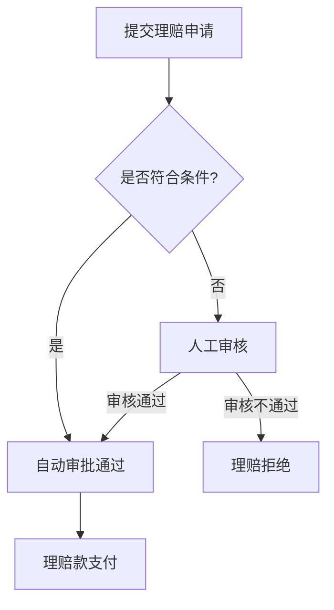

# 基于规则的AIAgent工作流设计模式

## 1. 背景介绍

在当今快速发展的人工智能时代,如何设计和开发高效可靠的AIAgent系统已经成为了众多企业和开发者关注的重点。作为人工智能领域的专家,我将在本文中分享基于规则的AIAgent工作流设计模式,希望能为广大开发者提供一种行之有效的解决方案。

## 2. 核心概念与联系

### 2.1 什么是AIAgent工作流

AIAgent工作流是一种基于人工智能技术的自动化工作流程,它能够根据预定义的规则和逻辑,自主地执行一系列任务,完成特定的业务目标。与传统的基于人工操作的工作流相比,AIAgent工作流具有自适应性强、执行效率高、可扩展性好等优势。

### 2.2 基于规则的AIAgent工作流设计模式

基于规则的AIAgent工作流设计模式是指通过定义一系列明确的业务规则和决策逻辑,来指导AIAgent系统的行为和决策过程。这种模式具有以下特点:

1. 规则清晰明确,易于理解和维护
2. 决策过程透明,可解释性强
3. 系统具有较强的自适应性和灵活性
4. 可以与复杂的业务场景很好地适配

## 3. 核心算法原理和具体操作步骤

### 3.1 规则引擎的核心原理

基于规则的AIAgent工作流的核心是规则引擎,它负责解释和执行预定义的业务规则。规则引擎的工作原理如下:

1. 输入:接收来自外部系统或用户的输入数据
2. 匹配:根据预定义的规则,匹配输入数据是否满足特定条件
3. 执行:当输入数据满足规则条件时,执行相应的动作或操作
4. 输出:将执行结果反馈给外部系统或用户

$$ \text{Rule Engine Algorithm} = \begin{cases}
  \text{Input} \rightarrow \text{Match} \rightarrow \text{Execute} \rightarrow \text{Output} \\
  \text{If } \text{Condition} \text{ Then } \text{Action}
\end{cases} $$

### 3.2 基于规则的AIAgent工作流设计步骤

1. **确定业务需求**: 深入了解业务场景,明确AIAgent工作流需要实现的目标和功能。
2. **定义业务规则**: 根据业务需求,制定一系列明确的业务规则,包括规则的触发条件和相应的执行动作。
3. **设计工作流程**: 将业务规则转化为AIAgent工作流程,包括任务节点、决策分支、数据传递等。
4. **实现规则引擎**: 基于规则引擎技术,开发能够解释和执行业务规则的核心模块。
5. **集成工作流**: 将规则引擎与其他系统组件(如任务执行引擎、数据处理模块等)集成,形成完整的AIAgent工作流系统。
6. **测试和优化**: 对AIAgent工作流系统进行全面测试,并根据反馈不断优化规则和工作流程。

## 4. 项目实践：代码实例和详细解释说明

下面我们来看一个基于规则的AIAgent工作流的实际实现案例。以一个保险理赔业务为例,我们设计了如下的工作流程:



我们可以定义如下的业务规则:

```
Rule 1: If 申请金额 <= 5000 AND 理赔原因 = "车祸" Then 自动审批通过
Rule 2: If 申请金额 > 5000 OR 理赔原因 != "车祸" Then 人工审核
Rule 3: If 人工审核 = 通过 Then 理赔款支付
Rule 4: If 人工审核 = 不通过 Then 理赔拒绝
```

在代码实现中,我们可以使用开源的规则引擎框架(如Drools、JBoss Rules等)来解释和执行这些业务规则。以Drools为例,规则定义如下:

```java
rule "Auto Approve Claim"
    when
        $claim : Claim(amount <= 5000, reason == "Car Accident")
    then
        $claim.setStatus(ClaimStatus.APPROVED);
        update($claim);
end

rule "Manual Review Claim"
    when
        $claim : Claim(amount > 5000 || reason != "Car Accident")
    then
        $claim.setStatus(ClaimStatus.MANUAL_REVIEW);
        update($claim);
end

rule "Approve Claim after Manual Review"
    when
        $claim : Claim(status == ClaimStatus.MANUAL_REVIEW, reviewResult == ReviewResult.APPROVED)
    then
        $claim.setStatus(ClaimStatus.APPROVED);
        update($claim);
end

rule "Reject Claim after Manual Review"
    when
        $claim : Claim(status == ClaimStatus.MANUAL_REVIEW, reviewResult == ReviewResult.REJECTED)
    then
        $claim.setStatus(ClaimStatus.REJECTED);
        update($claim);
end
```

在这个实现中,我们首先定义了Claim对象来表示理赔申请,并使用Drools规则引擎来解释和执行业务规则。当输入一个理赔申请时,规则引擎会根据申请金额和原因,自动做出审批决定,或者将申请标记为需要人工审核。人工审核结果会进一步决定是否批准理赔。整个过程都是由规则引擎根据预定义的规则自动完成的。

## 5. 实际应用场景

基于规则的AIAgent工作流设计模式广泛应用于各种业务场景,包括:

1. **保险理赔**: 如上文所示,自动处理常见的保险理赔申请,提高效率和一致性。
2. **信贷审批**: 根据客户信用、资产等信息,自动做出贷款审批决定。
3. **供应链管理**: 根据库存、订单、物流等信息,自动触发采购、生产、配送等操作。
4. **客户服务**: 根据客户画像和服务历史,自动为客户推荐产品或服务。
5. **HR管理**: 根据员工绩效、培训需求等,自动生成培训计划和晋升方案。

总的来说,只要业务场景存在一定的规则化和标准化,都可以应用基于规则的AIAgent工作流设计模式来提高效率和一致性。

## 6. 工具和资源推荐

在实现基于规则的AIAgent工作流时,可以使用以下工具和资源:

1. **规则引擎框架**: Drools、JBoss Rules、Apache Kafka Streams等
2. **工作流引擎**: Activiti、Flowable、Apache Airflow等
3. **业务规则管理平台**: Signavio、Camunda Optimize等
4. **参考文献**:
   - "[Building Intelligent Agents: A Tutorial on Intelligent Agents](https://www.cs.cmu.edu/afs/cs/project/jair/pub/volume4/russell96a-html/node1.html)"
   - "[Designing Effective Rule-Based Systems](https://www.amazon.com/Designing-Effective-Rule-Based-Systems-Williamson/dp/0750671890)"
   - "[Practical Guide to Designing Rule-Based Systems](https://www.amazon.com/Practical-Guide-Designing-Rule-Based-Systems/dp/0133067319)"

## 7. 总结:未来发展趋势与挑战

随着人工智能技术的不断进步,基于规则的AIAgent工作流设计模式将会得到越来越广泛的应用。未来的发展趋势包括:

1. **规则引擎的智能化**: 通过机器学习等技术,规则引擎能够自动学习和优化业务规则,提高决策的准确性和适应性。
2. **工作流的动态调整**: AIAgent工作流能够根据实时数据和环境变化,动态调整工作流程和决策逻辑,提高系统的灵活性。
3. **跨系统协作**: AIAgent工作流能够与企业内外的其他系统无缝集成,实现端到端的业务自动化。

但同时也面临一些挑战,包括:

1. **规则复杂性管理**: 随着业务规模和复杂度的增加,如何有效管理大量的业务规则将是一个挑战。
2. **可解释性和可审计性**: 基于规则的AIAgent系统需要具有较强的可解释性和可审计性,以满足监管和合规要求。
3. **安全性和稳定性**: 作为关键的业务系统,AIAgent工作流必须具备高度的安全性和稳定性,以确保业务的持续运行。

总的来说,基于规则的AIAgent工作流设计模式是人工智能技术在企业应用中的一个重要体现,未来必将在各行各业得到广泛应用。

## 8. 附录:常见问题与解答

1. **如何确定合适的业务规则?**
   - 深入了解业务场景,与相关领域专家进行充分沟通和讨论
   - 分析历史数据和案例,总结出通用的决策模式
   - 遵循"简单、明确、可执行"的原则进行规则设计

2. **如何确保规则引擎的可靠性和可维护性?**
   - 采用成熟的规则引擎框架,并进行充分的测试和验证
   - 建立完善的规则管理机制,包括版本控制、变更审批等
   - 制定详细的规则文档,确保规则的可读性和可理解性

3. **如何实现AIAgent工作流与其他系统的集成?**
   - 采用标准的系统接口和数据格式,确保系统间的互操作性
   - 利用企业服务总线(ESB)等技术,实现松耦合的系统集成
   - 制定明确的系统集成方案和测试计划,确保端到端的可靠性