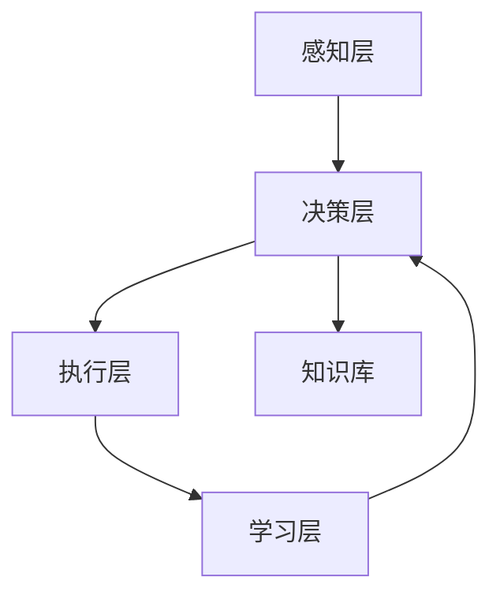

# AIAgentWorkFlow在安全防御中的应用

## 1. 背景介绍

在当今高度互联的数字世界中，网络安全已经成为一个备受关注的重要议题。随着信息技术的飞速发展，新兴的网络攻击手段也层出不穷,给个人、企业乃至整个社会的信息安全都带来了巨大的挑战。针对这些日益复杂的网络安全威胁,亟需一种新型的智能化安全防御体系来应对。

人工智能技术的蓬勃发展为解决这一问题带来了新的可能性。本文将介绍一种基于人工智能代理系统(AIAgentWorkFlow)的安全防御解决方案,阐述其核心概念、算法原理、实践应用以及未来发展趋势,希望能为网络安全防御工作提供新的思路和实践参考。

## 2. 核心概念与联系

### 2.1 人工智能代理系统(AIAgentWorkFlow)

人工智能代理系统(AIAgentWorkFlow)是一种基于强化学习的自主决策系统,它能够通过不断与环境交互、学习和优化,最终达成既定的目标。与传统的基于规则的系统不同,AIAgentWorkFlow具有自主感知、分析、决策和执行的能力,可以灵活应对复杂多变的环境。

在网络安全领域,AIAgentWorkFlow可以充当一名"智能安全守护者",实时监控网络状况,分析潜在威胁,自主做出防御决策并执行相应的措施,从而构建起一个动态自适应的智能安全防御体系。

### 2.2 与传统安全防御的对比

相比传统的基于规则的网络安全防御方案,AIAgentWorkFlow具有以下关键优势:

1. **自适应性强**：AIAgentWorkFlow可以持续学习和优化,能够应对不断变化的网络攻击手段,实现动态自适应的防御。
2. **反应速度快**：AIAgentWorkFlow可以快速感知、分析并做出防御决策,相比依赖人工干预的传统方案,能够大幅提升网络安全事件的响应速度。
3. **覆盖面广**：AIAgentWorkFlow可以对网络中的各类设备和系统进行全面监控和防护,弥补了传统安全设备的局限性。
4. **智能化水平高**：AIAgentWorkFlow融合了多种人工智能技术,如深度学习、强化学习、知识图谱等,实现了更加智能化的安全防御。

总之,AIAgentWorkFlow为构建新一代智能化网络安全防御体系提供了一种创新性的解决方案。

## 3. 核心算法原理和具体操作步骤

### 3.1 强化学习算法

AIAgentWorkFlow的核心是基于强化学习的自主决策算法。强化学习是一种通过与环境交互、获取反馈并不断优化决策策略的机器学习范式。在网络安全场景中,AIAgentWorkFlow Agent可以通过观察网络环境状态,采取相应的防御行动,并根据行动的效果获得奖励或惩罚,从而学习出最优的防御策略。

具体来说,AIAgentWorkFlow Agent的强化学习算法包括以下关键步骤:

1. **状态感知**：AIAgentWorkFlow Agent实时监控网络环境,感知各类安全相关的状态信息,如流量、设备状态、异常行为等。
2. **决策分析**：基于当前状态,AIAgentWorkFlow Agent利用深度强化学习模型,快速分析出最优的防御行动。
3. **行动执行**：AIAgentWorkFlow Agent自主执行相应的防御措施,如阻断恶意流量、隔离受感染主机等。
4. **奖惩反馈**：根据防御效果,AIAgentWorkFlow Agent获得相应的奖惩反馈,用于不断优化决策策略。

通过这一闭环的强化学习过程,AIAgentWorkFlow Agent可以持续提升自身的防御能力,实现智能化、自适应的网络安全防御。

### 3.2 知识图谱增强

为进一步提升AIAgentWorkFlow的智能化水平,我们还引入了知识图谱技术。知识图谱可以帮助AIAgentWorkFlow Agent建立对网络安全领域的深入理解,包括:

1. **安全威胁知识库**：收集并组织各类网络安全威胁的特征、行为模式等知识,为AIAgentWorkFlow Agent提供判断依据。
2. **防御策略知识库**：积累各类防御措施的适用场景、执行步骤、效果评估等知识,为AIAgentWorkFlow Agent的决策提供支撑。
3. **安全态势感知**：结合实时监测数据,AIAgentWorkFlow Agent可以利用知识图谱进行安全态势分析,识别潜在风险。

通过知识图谱的支持,AIAgentWorkFlow Agent可以做出更加智能、准确的防御决策,实现精准高效的网络安全防御。

## 4. 项目实践：代码实例和详细解释说明

下面我们通过一个具体的应用案例,详细演示AIAgentWorkFlow在网络安全防御中的实践应用。

### 4.1 系统架构

AIAgentWorkFlow安全防御系统主要由以下关键组件构成:

1. **感知层**：负责实时监测网络环境状态,收集各类安全相关数据。
2. **决策层**：基于强化学习和知识图谱,做出最优的防御决策。
3. **执行层**：自主执行相应的防御措施,如流量控制、主机隔离等。
4. **学习层**：根据防御效果进行奖惩反馈,不断优化决策策略。
5. **知识库**：包含安全威胁知识和防御策略知识,为决策提供支撑。



### 4.2 关键算法实现

下面我们重点介绍AIAgentWorkFlow中的关键算法实现:

#### 4.2.1 强化学习算法

AIAgentWorkFlow Agent采用基于深度Q网络(DQN)的强化学习算法。DQN可以利用深度神经网络高效地估计状态-动作价值函数Q(s,a)。
具体步骤如下:

1. 定义状态空间S和动作空间A
2. 构建深度Q网络模型,输入状态s,输出各动作a的Q值
3. 采用epsilon-greedy策略选择动作
4. 执行动作a,获得奖励r和下一状态s'
5. 将(s,a,r,s')存入经验池
6. 从经验池中采样mini-batch数据,训练Q网络模型
7. 不断迭代优化,直至收敛

```python
import numpy as np
import tensorflow as tf

class DQNAgent:
    def __init__(self, state_size, action_size):
        self.state_size = state_size
        self.action_size = action_size
        self.gamma = 0.95    # discount rate
        self.epsilon = 1.0   # exploration rate
        self.epsilon_min = 0.01
        self.epsilon_decay = 0.995
        self.learning_rate = 0.001
        self.model = self._build_model()
        self.target_model = self._build_model()
        self.update_target_model()

    def _build_model(self):
        model = tf.keras.models.Sequential()
        model.add(tf.keras.layers.Dense(24, input_dim=self.state_size, activation='relu'))
        model.add(tf.keras.layers.Dense(self.action_size, activation='linear'))
        model.compile(loss='mse', optimizer=tf.keras.optimizers.Adam(lr=self.learning_rate))
        return model

    def act(self, state):
        if np.random.rand() <= self.epsilon:
            return random.randrange(self.action_size)
        act_values = self.model.predict(state)
        return np.argmax(act_values[0])  # returns action

    # 省略其他方法实现...
```

#### 4.2.2 知识图谱构建

我们利用开源知识图谱构建工具,如Neo4j、Apache Jena等,构建了包含安全威胁知识和防御策略知识的知识图谱。
知识图谱中的主要实体及其关系包括:

- 安全威胁(Threat)
    - 类型(Type)
    - 特征(Feature)
    - 行为模式(Behavior)
- 防御策略(DefenseStrategy)
    - 类型(Type)
    - 适用场景(Scenario)
    - 执行步骤(Steps)
    - 效果评估(Evaluation)

通过构建这样的知识图谱,AIAgentWorkFlow Agent可以利用图数据库技术快速检索相关知识,为决策提供支撑。

### 4.3 应用场景示例

下面我们以一个网络病毒防御的场景为例,演示AIAgentWorkFlow的具体应用:

1. **感知网络状态**：AIAgentWorkFlow Agent实时监测网络流量、主机行为等,发现异常情况。
2. **查询知识图谱**：AIAgentWorkFlow Agent根据监测数据,查询知识图谱中关于该类网络病毒的特征、行为模式等知识。
3. **分析风险等级**：结合实时状态和知识图谱,AIAgentWorkFlow Agent评估当前网络安全风险等级。
4. **选择防御策略**：AIAgentWorkFlow Agent利用强化学习算法,根据风险等级选择最优的防御策略,如阻断恶意流量、隔离受感染主机等。
5. **执行防御行动**：AIAgentWorkFlow Agent自主执行选定的防御措施。
6. **学习优化决策**：根据防御效果,AIAgentWorkFlow Agent获得奖惩反馈,不断优化决策策略。

通过这一系列智能化的感知-决策-执行-学习闭环,AIAgentWorkFlow Agent可以高效、精准地应对网络病毒等安全威胁,维护网络环境的安全稳定。

## 5. 实际应用场景

除了网络病毒防御,AIAgentWorkFlow在其他网络安全场景也有广泛应用,如:

1. **DDoS攻击防御**：AIAgentWorkFlow Agent可以快速感知DDoS攻击,采取流量控制、源地址过滤等措施进行防御。
2. **APT攻击检测**：AIAgentWorkFlow Agent可以利用知识图谱深入分析APT攻击行为特征,及时发现并阻止攻击。
3. **IoT设备安全**：AIAgentWorkFlow Agent可以对IoT设备进行全面监控和智能防护,保障物联网环境的安全。
4. **云安全防御**：AIAgentWorkFlow Agent可以与云平台深度集成,实现云环境的智能安全管控。

总的来说,AIAgentWorkFlow凭借其自适应性、智能化和全面性的特点,为各类网络安全场景提供了创新性的解决方案。

## 6. 工具和资源推荐

在实践AIAgentWorkFlow安全防御系统时,可以利用以下工具和资源:

1. **强化学习框架**：TensorFlow、PyTorch、OpenAI Gym等
2. **知识图谱构建工具**：Neo4j、Apache Jena、Virtuoso等
3. **网络安全数据集**：CICIDS2017、DARPA 1998、NSL-KDD等
4. **安全知识库**：MITRE ATT&CK、CVE、CAPEC等

此外,也可以参考业界一些相关的研究成果和实践案例,以获得更多有益的灵感和指导。

## 7. 总结：未来发展趋势与挑战

AIAgentWorkFlow为构建新一代智能化网络安全防御体系提供了一种创新性的解决方案。通过融合强化学习和知识图谱技术,AIAgentWorkFlow Agent能够实现自主感知、分析、决策和执行,大幅提升网络安全防御的智能化水平和效率。

未来,我们预计AIAgentWorkFlow在网络安全领域的应用将进一步深化和拓展,主要体现在以下几个方面:

1. **跨域协同防御**：AIAgentWorkFlow Agent将实现跨网络、跨组织的协同防御,形成更加全面的安全态势感知和联动防御。
2. **自主学习优化**：AIAgentWorkFlow Agent的学习能力将不断增强,使其能够更加精准高效地应对新型网络攻击。
3. **与人机协作**：AIAgentWorkFlow Agent将与安全运维人员形成人机协作,发挥各自的优势,共同提升网络安全防御水平。
4. **安全仿真训练**：AIAgentWorkFlow Agent可以应用于网络安全仿真训练,帮助安全人员提升实战能力。

当然,实现这些发展目标也面临着一些技术和实践上的挑战,如数据隐私保护、算法可解释性、系统可靠性等,需要我们不断探索和创新。

## 8. 附录：