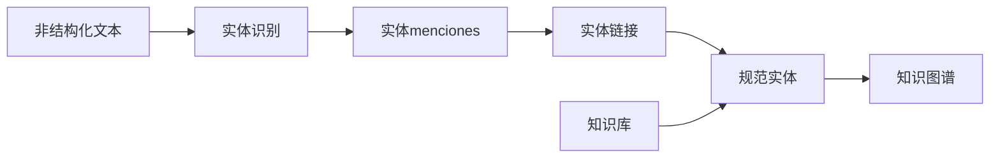

# 1. 背景介绍

## 1.1 知识图谱概述

在当今信息时代,海量的结构化和非结构化数据不断涌现,如何高效地管理和利用这些数据成为了一个巨大的挑战。知识图谱(Knowledge Graph)作为一种新兴的知识表示和管理范式,为解决这一挑战提供了有力的支持。

知识图谱是一种将现实世界中的实体(Entity)、概念(Concept)、事件(Event)等以及它们之间的语义关系(Relation)用图的形式表示和存储的知识库。它能够以结构化、互连和机器可解析的方式组织和表示知识,为智能应用提供了丰富的背景知识和推理能力。

## 1.2 医药领域知识图谱的重要性

医药领域是一个知识密集型领域,涉及大量的专业术语、疾病名称、药物名称、治疗方案等复杂知识。传统的结构化数据库很难有效地表示和管理这些复杂的语义关系。因此,构建医药领域的知识图谱对于提高医疗决策的准确性、促进医药研发、支持智能医疗助理等具有重要意义。

通过知识图谱,我们可以将医药领域的知识以一种统一、标准化和机器可理解的方式表示,并捕捉实体之间的复杂关系。这不仅有助于知识的共享和重用,还可以支持基于知识图谱的推理和决策,为智能医疗应用提供强大的知识支持。

## 1.3 知识图谱构建的挑战

构建高质量的知识图谱是一项艰巨的任务,需要解决诸多技术挑战,其中最关键的两个步骤是实体识别(Entity Recognition)和实体链接(Entity Linking)。

**实体识别**是从非结构化文本中识别出所有与领域相关的实体menciones(如疾病名称、症状描述、药物名称等),并对它们进行分类和标注。这是知识图谱构建的基础,直接影响后续步骤的质量。

**实体链接**则是将识别出的实体menciones与知识库中的规范实体(Canonical Entity)建立链接关系,从而消除实体menciones的歧义性,并丰富实体的语义信息。实体链接是知识图谱构建的关键环节,对于整合异构数据源、构建高质量知识图谱至关重要。

由于医药领域的专业性和复杂性,实体识别和链接面临诸多挑战,如同义词、缩略语、新实体的出现等,需要采用先进的技术手段来解决。本文将重点介绍医药领域知识图谱构建中的实体识别与链接技术,并探讨相关的最新研究进展和实践经验。

# 2. 核心概念与联系

## 2.1 实体(Entity)

实体指现实世界中的人物、地点、组织机构、事件、产品等具体事物。在医药领域,常见的实体包括:

- 疾病(Disease)：如糖尿病、肺癌等
- 症状(Symptom)：如头痛、发烧等 
- 药物(Drug)：如阿斯匹林、吗啉胍等
- 治疗(Treatment)：如手术、放疗等
- 基因(Gene)：如BRCA1、EGFR等
- 蛋白质(Protein)：如胰岛素、凝血酶等

实体可以由单个词汇token(如"糖尿病")或者短语(如"非小细胞肺癌")表示。

## 2.2 实体menciones(Entity Mention)

实体menciones是指在非结构化文本(如病历、论文等)中出现的、与某个实体相关的文本片段。由于同一个实体可能有多种表述方式(如同义词、缩略语等),因此一个实体可能对应多个实体menciones。例如:

- "糖尿病"和"Diabetes Mellitus"都是指代同一种疾病实体的不同menciones
- "BCG"是"Bacillus Calmette-Guérin"疫苗的缩写形式

实体识别的目标就是从文本中发现所有的实体menciones,并对它们进行分类标注。

## 2.3 规范实体(Canonical Entity) 

规范实体指知识库中规范化、唯一标识的实体表示。每个规范实体通常都有一个规范ID、标准名称、详细描述等元数据。

实体链接的目标是将文本中的实体menciones与知识库中的对应规范实体建立链接关系。通过这一步,我们可以消除menciones的歧义性,丰富实体的语义信息。

## 2.4 知识库(Knowledge Base)

知识库是存储规范实体及其关系的结构化数据库。医药领域的知识库通常包含了大量的疾病、症状、药物、基因等实体,以及它们之间的关系,如"糖尿病的症状包括多饮多尿"、"吗啉胍是一种治疗糖尿病的药物"等。

知名的医药知识库包括:

- 统一医学语言系统(Unified Medical Language System, UMLS)
- 系统化命名法本体(SNOMED CT) 
- 人体基因组参考数据库(Human Gene Database)
- 药物数据库(DrugBank)

构建高质量的知识图谱需要将文本数据与知识库进行有效的集成。

上述概念之间的关系如下图所示:

# 3. 核心算法原理和具体操作步骤

## 3.1 实体识别

实体识别的目标是从非结构化文本中准确地识别出所有与领域相关的实体menciones,并对它们进行分类标注。这是构建知识图谱的基础工作。

### 3.1.1 常用方法

常见的实体识别方法包括:

1. **基于规则的方法**

使用一系列的模式匹配规则来识别实体menciones。这种方法通常需要大量的人工制定规则,覆盖面较窄,但对已知模式有很高的精确度。

2. **基于统计学习的方法**

将实体识别问题建模为序列标注问题,使用监督学习算法(如条件随机场CRF、最大熵模型等)从大量标注数据中自动学习实体识别模型。这种方法需要大量的人工标注语料,但具有较好的泛化能力。

3. **基于深度学习的方法**

使用神经网络模型(如LSTM、BiLSTM、CNN等)自动从大规模未标注语料中学习实体识别模型,无需人工标注。这种方法目前是主流方法,在识别性能上优于前两种方法。

4. **基于词向量/预训练语言模型的方法**

利用Word2Vec、BERT等技术预先学习词向量或上下文表示,并将其作为输入特征,feeding到神经网络模型中进行实体识别。这种方法可以有效地利用大规模的未标注语料,提高实体识别的性能。

5. **基于生成式方法**

将实体识别建模为生成式任务,使用序列到序列(Seq2Seq)模型直接生成实体标注序列。这种方法具有很强的表示能力,但需要大量的并行数据。

6. **基于远程监督的方法**

利用现有的知识库作为远程监督信号,自动标注大规模语料,然后使用监督学习方法训练实体识别模型。这种方法可以大幅减少人工标注的工作量。

### 3.1.2 算法步骤

以基于BiLSTM-CRF的实体识别模型为例,算法步骤如下:

1. **输入层**:将输入序列的每个单词转换为词向量表示,作为神经网络的输入。

2. **BiLSTM编码层**:使用双向LSTM对输入序列进行编码,获得每个单词的上下文语义表示。

3. **CRF解码层**:在BiLSTM的输出上附加一个CRF解码层,对整个序列进行标注,确定每个单词的实体类型标签。

4. **损失计算**:使用对数似然损失函数,将模型预测的标签序列与真实标签序列进行比较,计算损失值。

5. **模型训练**:使用反向传播算法和优化器(如Adam),以最小化损失函数为目标,迭代地更新神经网络的参数。

6. **预测**:对新的输入序列,模型会输出最可能的实体标注序列。

该算法的数学模型如下:

输入是一个长度为n的单词序列$X = (x_1, x_2, ..., x_n)$,其中$x_i$是第i个单词的词向量。

BiLSTM编码层的计算公式为:

$$
\overrightarrow{h_i} = \overrightarrow{LSTM}(x_i, \overrightarrow{h_{i-1}}) \\
\overleftarrow{h_i} = \overleftarrow{LSTM}(x_i, \overleftarrow{h_{i+1}}) \\
h_i = [\overrightarrow{h_i}, \overleftarrow{h_i}]
$$

其中$\overrightarrow{h_i}$和$\overleftarrow{h_i}$分别是前向和后向LSTM在位置i的隐状态,它们的拼接$h_i$就是该位置的上下文语义表示。

CRF解码层的目标是最大化整个序列的条件概率:

$$
P(Y|X) = \frac{e^{s(X,Y)}}{\sum_{y'\in Y_X} e^{s(X,y')}}
$$

其中$Y_X$是所有可能的标签序列,$s(X,Y)$是分数函数,定义为:

$$
s(X,Y) = \sum_{i=0}^{n}A_{y_i,y_{i+1}} + \sum_{i=1}^{n}P_{i,y_i}
$$

$A$是转移分数矩阵,$P$是状态分数矩阵。通过反向传播算法,可以学习这两个矩阵的参数。

在预测时,我们使用维特比算法(Viterbi)求解:

$$
Y^* = \arg\max_{y'\in Y_X} P(y'|X)
$$

以获得最可能的标签序列$Y^*$作为输出。

### 3.1.3 改进方法

虽然基于深度学习的实体识别方法取得了不错的成绩,但在医药领域仍然面临一些挑战,如同义词、缩略语、新实体的识别等。研究人员提出了一些改进方法:

1. **引入领域知识**:将领域知识(如同义词词典、缩略语词典等)融入神经网络模型,以提高识别准确性。

2. **多任务学习**:同时学习实体识别、实体类型分类、实体链接等多个相关任务,以获得更加通用的语义表示。

3. **半监督学习**:结合少量标注数据和大量未标注数据进行训练,以降低人工标注成本。

4. **迁移学习**:利用在其他领域或任务上预训练的模型,通过微调的方式快速适应新领域。

5. **生成式方法**:使用序列到序列模型直接生成实体标注序列,避免人工设计特征。

6. **注意力机制**:引入注意力机制,自动学习输入序列中不同位置单词对实体识别的重要性。

7. **上下文建模**:利用上下文信息(如段落、文档等)对实体进行更精确的识别。

8. **规则与机器学习相结合**:将基于规则的方法与机器学习方法相结合,发挥各自的优势。

## 3.2 实体链接

实体链接的目标是将文本中的实体menciones与知识库中的规范实体建立准确的链接关系,从而消除歧义,丰富实体的语义信息。这是构建高质量知识图谱的关键步骤。

### 3.2.1 常用方法

常见的实体链接方法包括:

1. **基于字符串匹配的方法**

根据实体menciones与规范实体名称之间的字符串相似度进行匹配,如编辑距离、前缀匹配等。这种方法简单高效,但无法很好地处理同义词、缩略语等情况。

2. **基于语义相似度的方法**

利用语义相似度度量(如词向量余弦相似度、知识库描述相似度等)来计算实体menciones与规范实体之间的语义关联程度,选择最相似的作为链接目标。这种方法具有较好的泛化能力,但计算代价较