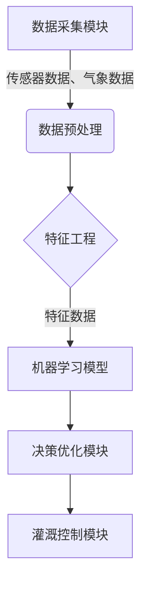

# 在农业中使用AI代理：增强生产力和水资源利用

## 1.背景介绍

### 1.1 农业面临的挑战

农业是人类赖以生存的基础产业,在全球范围内,农业面临着诸多挑战:

- 气候变化导致的极端天气事件增多,如干旱、洪水等,威胁到农作物产量
- 人口增长带来的粮食需求不断增加,需要提高农业生产效率
- 水资源短缺和水污染问题日益严重,需要更好地管理水资源
- 劳动力短缺和农村人口老龄化问题,需要提高农业自动化水平

### 1.2 人工智能(AI)在农业中的应用前景

人工智能技术在农业领域的应用可以为上述挑战提供有力的解决方案。AI代理系统通过整合多源异构数据、机器学习建模和智能决策,可以显著提高农业生产的效率和可持续性。

## 2.核心概念与联系

### 2.1 AI代理

AI代理是一种自主软件实体,能够感知环境、学习知识、制定计划并采取行动以实现既定目标。在农业领域,AI代理可以集成多种AI技术,如计算机视觉、自然语言处理、机器学习等,从而实现智能化决策和自动化操作。

### 2.2 多源异构数据融合

农业生产过程涉及气象、土壤、作物、设施等多个要素,需要整合来自不同来源的异构数据,如遥感影像、物联网传感器数据、气象数据等。数据融合技术可以将这些异构数据进行清洗、标准化和集成,为AI模型训练和决策提供数据支持。

### 2.3 机器学习建模

机器学习算法可以从海量农业数据中发现隐藏的模式和规律,构建作物生长模型、土壤模型、天气模型等,为精准决策提供依据。常用的机器学习方法包括监督学习(如决策树、支持向量机)、无监督学习(如聚类分析)和强化学习等。

### 2.4 智能决策与控制

基于机器学习模型和知识库,AI代理可以进行复杂的决策推理,制定最优的农业生产方案,并通过自动化系统(如智能灌溉系统、无人机、智能机器人等)执行相应的操作控制,实现农业生产的智能化管理。

## 3.核心算法原理具体操作步骤

AI代理在农业中的应用通常涉及以下几个核心步骤:

### 3.1 数据采集与预处理

第一步是从多源采集所需的农业数据,包括:

1. 遥感影像数据(如卫星影像、无人机航拍影像等)
2. 物联网传感器数据(如土壤湿度、温度、作物生长状态等)
3. 气象数据(如降雨量、温度、湿度、日照时长等)
4. 农艺操作数据(如施肥、灌溉、病虫害防治等)

对采集到的原始数据进行预处理,包括数据清洗、标准化、融合等,以构建统一的数据集,为后续的机器学习模型训练做好准备。

### 3.2 特征工程

根据具体的农业应用场景,从预处理后的数据集中提取有效的特征变量,如:

- 对于作物生长模型,特征可能包括气象条件、土壤条件、农艺操作等
- 对于土壤湿度模型,特征可能包括土壤类型、气象条件、地形等
- 对于病虫害检测模型,特征可能包括作物图像特征、气象条件等

特征工程对于机器学习模型的性能至关重要,需要充分结合领域知识和特征重要性分析进行特征选择。

### 3.3 机器学习模型训练

基于构建的特征数据集,利用监督学习、无监督学习或强化学习等机器学习算法,训练出适用于农业场景的各类预测模型,如:

- 作物生长模型:预测作物在不同条件下的生长状况
- 土壤湿度模型:预测土壤湿度的变化趋势 
- 病虫害检测模型:对作物图像进行病虫害检测和分类
- 降水预测模型:预测未来一段时间的降水情况
- 作物产量模型:预测作物的最终产量

模型训练过程需要反复调整超参数、特征选择和模型结构,以获得最优的模型性能。

### 3.4 决策与控制

将训练好的机器学习模型集成到AI代理决策系统中,结合知识库、约束条件和目标函数,通过优化算法(如启发式搜索、约束规划等)得到最优的农业生产决策方案,并执行相应的控制操作,如:

- 根据预测的作物生长状况、土壤湿度和天气情况,制定最佳的灌溉策略并控制智能灌溉系统
- 根据病虫害检测结果,确定防治措施并指导农户或控制无人机/智能机器人实施药剂喷洒
- 根据预测的降水情况,调整农艺操作时间安排
- 根据预测的作物产量,制定收获和销售计划

### 3.5 在线学习与模型更新

在实际应用过程中,AI代理需要持续采集新的数据,并根据实际效果对模型进行在线学习和更新,以适应农业生产的动态变化,不断提高决策的准确性和效率。

## 4.数学模型和公式详细讲解举例说明

在AI代理应用于农业生产的过程中,涉及多种数学模型和算法,下面对其中几种典型模型进行详细讲解。

### 4.1 作物生长模型

作物生长模型旨在描述作物在不同环境条件下的生长过程,是制定农业生产决策的重要依据。一种常用的作物生长模型是基于生长度日(GDD)的模型,用于预测作物达到特定生育阶段所需的时间。

GDD模型的基本公式为:

$$GDD = \sum_{i=1}^{n}(T_{avg,i} - T_{base})$$

其中:
- $GDD$表示生长度日的累积值
- $n$表示生育期的天数
- $T_{avg,i}$表示第$i$天的平均气温
- $T_{base}$表示作物生长的基础温度阈值

当$GDD$达到某一临界值时,作物即可进入下一生育阶段。不同作物和品种的$T_{base}$和临界$GDD$值不同,需要基于实验数据进行估计。

另一种常用的作物生长模型是基于生长率方程的模型,描述作物生物量随时间的变化规律,公式如下:

$$\frac{dW}{dt} = C \times W^m \times (W_{max} - W)^n$$

其中:
- $W$表示作物当前生物量
- $W_{max}$表示作物最大生物量
- $C$、$m$、$n$为经验参数,需要通过数据拟合获得

这些作物生长模型可以与其他模型(如土壤模型、天气模型等)相结合,构建更加复杂和精确的农业生产决策模型。

### 4.2 土壤湿度模型

精确预测土壤湿度对于制定合理的灌溉策略至关重要。一种常用的土壤湿度模型是基于水分平衡方程的模型:

$$\theta_t = \theta_{t-1} + P_t - ET_t - R_t - D_t$$

其中:
- $\theta_t$、$\theta_{t-1}$分别表示$t$时刻和$t-1$时刻的土壤体积含水率
- $P_t$表示$t$时段的降水量
- $ET_t$表示$t$时段的实际蒸散量
- $R_t$表示$t$时段的地表径流量
- $D_t$表示$t$时段的深层渗漏量

上式各项量值可以通过气象数据、土壤数据和作物数据计算获得。此外,还可以利用机器学习算法从历史数据中学习$\theta_t$与其他特征变量(如气温、降雨量、作物类型等)之间的非线性映射关系,进一步提高预测精度。

### 4.3 病虫害检测模型

对于病虫害的智能检测,常用的方法是基于深度学习的计算机视觉模型,将卷积神经网络(CNN)应用于作物图像分类任务。CNN模型可以自动从图像数据中学习特征,实现端到端的图像分类。

以VGG-16网络为例,其基本结构为:

$$
f^{l+1} = \max\left(0, W^l * f^l + b^l\right)
$$

其中:
- $f^l$、$f^{l+1}$分别表示第$l$层和第$l+1$层的特征图
- $W^l$、$b^l$分别表示第$l$层的卷积核权重和偏置
- $*$表示卷积操作
- $\max(0, \cdot)$为ReLU激活函数

通过多层卷积、池化和全连接操作,CNN可以逐层提取图像的高级语义特征,最终将图像映射到病虫害类别标签。在实际应用中,还需要对CNN进行迁移学习和微调,以提高在特定数据集上的分类性能。

上述仅为数学模型的一个简单示例,在实际应用中,AI代理系统会集成多种复杂的机器学习和优化模型,以满足不同的决策需求。

## 5.项目实践:代码实例和详细解释说明

为了更好地理解AI代理在农业中的应用,我们以一个智能灌溉决策系统为例,介绍其核心代码实现。

### 5.1 系统架构

智能灌溉决策系统的总体架构如下图所示:



其中:

- 数据采集模块负责从物联网传感器、气象站等获取所需数据
- 数据预处理模块对原始数据进行清洗、标准化和融合
- 特征工程模块从预处理后的数据中提取有效特征
- 机器学习模型包括作物生长模型、土壤湿度模型等,用于预测作物状态和土壤湿度
- 决策优化模块根据模型预测结果、约束条件和目标函数,确定最优灌溉策略
- 灌溉控制模块执行灌溉操作,控制智能灌溉设备

### 5.2 关键代码实现

以下是系统中几个关键模块的代码实现示例(使用Python伪代码):

#### 数据预处理模块

```python
import pandas as pd

def preprocess_data(sensor_data, weather_data):
    """
    对传感器数据和气象数据进行预处理
    """
    # 数据清洗和格式化
    sensor_data = sensor_data.dropna().reset_index(drop=True)
    weather_data = weather_data.dropna().reset_index(drop=True)
    
    # 数据标准化
    numeric_cols = sensor_data.select_dtypes(include=['float64', 'int64']).columns
    sensor_data[numeric_cols] = (sensor_data[numeric_cols] - sensor_data[numeric_cols].mean()) / sensor_data[numeric_cols].std()
    
    # 数据融合
    data = pd.merge(sensor_data, weather_data, on='timestamp')
    
    return data
```

#### 特征工程模块

```python
from sklearn.feature_selection import mutual_info_regression

def feature_engineering(data):
    """
    从预处理后的数据中提取特征
    """
    features = ['soil_moisture', 'temperature', 'humidity', 'rainfall', ...]
    target = 'crop_growth'
    
    # 使用互信息进行特征选择
    selector = mutual_info_regression(data[features], data[target])
    selected_features = [f for f, s in zip(features, selector) if s > 0.1]
    
    X = data[selected_features]
    y = data[target]
    
    return X, y
```

#### 机器学习模型(以作物生长模型为例)

```python
from sklearn.ensemble import RandomForestRegressor

def train_crop_model(X, y):
    """
    训练作物生长预测模型
    """
    model = RandomForestRegressor(n_estimators=100, random_state=42)
    model.fit(X, y)
    return model

def predict_crop_growth(model, X):
    """
    使用训练好的模型预测作物生长状况