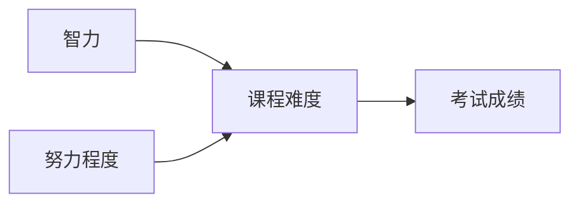
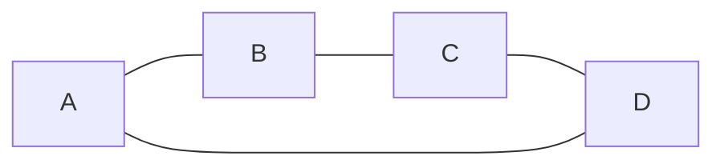

# 知识表示与推理:构建智能系统的基石

## 1.背景介绍

### 1.1 人工智能的崛起

人工智能(Artificial Intelligence, AI)是当代科技发展的前沿领域,近年来受到了前所未有的关注和投资。随着计算能力的不断提升和算法的创新,AI系统在语音识别、图像处理、自然语言处理等领域展现出了令人惊叹的能力,甚至在一些领域已经超越了人类水平。然而,要构建真正的"通用人工智能"(Artificial General Intelligence, AGI),仍然面临着巨大的挑战。

### 1.2 知识表示与推理的重要性

构建智能系统的关键在于赋予它们表示和推理知识的能力。知识表示(Knowledge Representation)是指在计算机系统中对现实世界知识的形式化描述,而推理(Reasoning)则是基于已有知识进行逻辑推导、解决问题的过程。只有将知识以合理的形式表示出来,智能系统才能够对其进行有效的推理和决策。因此,知识表示与推理是人工智能的基石,是实现真正智能的必由之路。

### 1.3 本文概述

本文将全面探讨知识表示与推理在人工智能中的作用和最新进展。我们将介绍经典和现代知识表示方法、推理技术,以及它们在不同应用领域的实践。通过深入分析,读者将对这一核心主题有更深刻的理解,为开发智能系统奠定坚实的理论基础。

## 2.核心概念与联系  

### 2.1 知识表示

知识表示是将现实世界的知识以计算机可理解的形式进行描述和建模的过程。一个好的知识表示方法应该具备以下特点:

1. **表达能力(Expressiveness)**: 能够准确、完整地描述所需表示的知识
2. **推理效率(Inferential Efficiency)**: 支持高效的推理过程
3. **可解释性(Interpretability)**: 表示形式对人类可解释
4. **可维护性(Maintainability)**: 易于更新和扩展知识库

常见的知识表示方法包括:

- **逻辑表示(Logic Representation)**:使用逻辑语言(如命题逻辑、一阶逻辑等)对知识进行形式化描述。
- **结构化表示(Structured Representation)**:利用框架(Frames)、语义网络(Semantic Networks)等数据结构对知识进行组织。
- **概率表示(Probabilistic Representation)**:使用贝叶斯网络(Bayesian Networks)、马尔可夫模型(Markov Models)等方法对不确定知识进行建模。

### 2.2 推理

推理是基于已有知识,通过规则或算法进行推导、解决问题的过程。根据所使用的知识表示形式,推理可分为以下几种主要类型:

- **逻辑推理(Logic Inference)**: 基于逻辑规则对逻辑表示的知识进行推导,包括命题逻辑推理、一阶逻辑推理等。
- **基于规则的推理(Rule-based Reasoning)**: 使用IF-THEN形式的规则对结构化知识进行推理。
- **案例推理(Case-based Reasoning)**: 通过检索相似案例并适当修改来解决新问题。
- **模型推理(Model-based Reasoning)**: 构建问题的内部模型,并对模型进行模拟推理。
- **概率推理(Probabilistic Reasoning)**: 基于概率理论对不确定知识进行推理,如贝叶斯推理。

### 2.3 知识表示与推理的关系

知识表示和推理密切相关,相辅相成。合理的知识表示方式为高效推理奠定了基础,而推理的需求又反过来驱动着知识表示方法的发展。在构建智能系统时,需要根据应用场景选择合适的知识表示和推理技术,并将二者有机结合,才能发挥最大效力。

## 3.核心算法原理具体操作步骤

### 3.1 逻辑推理算法

逻辑推理是基于逻辑规则对逻辑表示的知识进行推导的过程。以下是一些经典的逻辑推理算法:

#### 3.1.1 命题逻辑推理

命题逻辑推理算法包括:

1. **真值表(Truth Table)**
    - 构建命题逻辑表达式的真值表
    - 根据真值表判断命题的满足情况

2. **规则演算(Rule Inference)**
    - 使用推理规则(如模拟推理)从已知命题推导出新命题
    - 常用规则包括:摹仿规则(Modus Ponens)、简化规则(Simplification)等

#### 3.1.2 一阶逻辑推理

一阶逻辑推理算法包括:

1. **归结主义(Resolution)**
    - 将一阶逻辑句子转化为子句形式(Clauses)
    - 使用归结原理对子句进行推理,产生新子句
    - 若推导出空子句,则原句子无法满足;否则保留剩余子句

2. **逻辑程序设计(Logic Programming)**
    - 使用一阶逻辑编写程序,如Prolog语言
    - 程序由事实(Facts)和规则(Rules)组成
    - 通过回溯搜索(Backtracking)的方式进行推理求解

#### 3.1.3 模态逻辑推理

模态逻辑推理算法处理包含模态操作符(如"必然"、"可能"等)的逻辑表达式,主要算法有:

- 标记相关图(Labelled Tableau)
- 内部语义(Internal Semantics)

### 3.2 基于规则的推理算法

基于规则的推理算法使用IF-THEN形式的规则对结构化知识进行推理,主要算法包括:

1. **正向链接(Forward Chaining)**
    - 从已知事实出发,不断应用规则推导出新事实
    - 适用于数据驱动的推理问题

2. **反向链接(Backward Chaining)** 
    - 从目标假设出发,反向应用规则寻找支持证据
    - 适用于查询驱动的推理问题

3. **冲突集(Rete)**
    - 将规则存储为高效网络,避免重复计算
    - 广泛应用于现代规则引擎和专家系统

### 3.3 概率推理算法

概率推理算法用于对包含不确定性的知识进行推理,主要算法有:

1. **精确推理算法**
    - 变量消除(Variable Elimination)
    - 信念传播(Belief Propagation)
    - 蒙特卡罗采样(MCMC Sampling)

2. **近似推理算法**
    - 变分推理(Variational Inference)
    - 期望传播(Expectation Propagation)
    - 粒子滤波(Particle Filtering)

这些算法在贝叶斯网络、马尔可夫网络等概率模型中有广泛应用。

### 3.4 其他推理算法

除上述主要算法外,还有一些其他常用的推理算法,如:

- **案例推理(Case-based Reasoning)**
    - 检索相似案例,并通过修改适应新问题
    - 常用于缺乏完整领域理论的领域

- **模型推理(Model-based Reasoning)** 
    - 构建问题的内部模型
    - 通过模拟推理求解,如定性推理等

- **非单调推理(Non-monotonic Reasoning)**
    - 允许根据新证据撤销或修改先前的推理结果
    - 如缺省逻辑、CircumScription等

- **归纳推理(Inductive Reasoning)**
    - 从具体实例中总结出一般规律
    - 如决策树、贝叶斯学习等机器学习算法

## 4.数学模型和公式详细讲解举例说明

### 4.1 逻辑表示

#### 4.1.1 命题逻辑

命题逻辑是最基本的逻辑形式,用于表示和推理简单的事实陈述。命题逻辑中的基本元素是命题符号(如P、Q等),可以使用逻辑连接词(¬、∧、∨、→、↔)构建复杂命题。

例如,我们可以用命题逻辑表示如下知识:

$P$: 天气晴朗  
$Q$: 去野餐

$P \rightarrow Q$: 如果天气晴朗,那么就去野餐。

命题逻辑的语义是通过真值赋值来定义的。一个命题公式在给定的真值赋值下,要么为真,要么为假。

#### 4.1.2 一阶逻辑

一阶逻辑比命题逻辑更加表达能力强大,能够表示对象、关系和量化。一阶逻辑的基本元素包括:

- 常元(Constants): 表示对象,如约翰(John)
- 函数(Functions): 表示对象间的映射,如父亲(Father)
- 谓词(Predicates): 表示对象属性或关系,如人(Human)、兄弟(Brother)
- 逻辑连接词: 与命题逻辑中的相同
- 量词(Quantifiers): $\forall$(对所有)、$\exists$(存在)

例如,我们可以用一阶逻辑表示:

$$\forall x \text{Human}(x) \rightarrow \exists y \text{Father}(y, x)$$

意为"每个人都有一个父亲"。

一阶逻辑的语义是通过解释(Interpretation)来定义的,即对常元、函数和谓词进行赋值。

#### 4.1.3 其他逻辑形式

除了命题逻辑和一阶逻辑,还有其他一些常用的逻辑形式:

- **模态逻辑(Modal Logics)**: 引入模态操作符(如"必然"、"可能"等)来表示知识的模态特征。
- **描述逻辑(Description Logics)**: 基于一阶逻辑,用于表示和推理概念层次结构。
- **缺省逻辑(Default Logics)**: 用于表示和推理缺省知识(默认情况下成立的知识)。
- **模糊逻辑(Fuzzy Logics)**: 使用模糊度量来表示和推理不确定、模糊的知识。

不同形式的逻辑适用于不同类型的知识表示和推理问题。

### 4.2 概率图模型

概率图模型是一种紧凑而富有表现力的知识表示形式,能够自然地表示和推理不确定知识。常见的概率图模型包括:

#### 4.2.1 贝叶斯网络

贝叶斯网络(Bayesian Networks)是一种基于贝叶斯理论和图论的概率图模型。它由两部分组成:

- 有向无环图(Directed Acyclic Graph, DAG) $G$,节点表示随机变量
- 每个节点的条件概率分布(Conditional Probability Distribution, CPD)

在贝叶斯网络中,联合概率分布可以通过链式法则分解为有向边的条件概率的乘积:

$$P(X_1,\ldots,X_n) = \prod_{i=1}^n P(X_i|Pa(X_i))$$

其中$Pa(X_i)$表示$X_i$的父节点。

例如,下图是一个简单的学生成绩建模的贝叶斯网络:

可以写出联合分布:

$$P(A,B,C,D) = P(A)P(B)P(C|A,B)P(D|C)$$

通过概率推理,我们可以计算出各种条件概率,如$P(D|A,B)$等。

#### 4.2.2 马尔可夫网络

马尔可夫网络(Markov Networks)也称为马尔可夫随机场(Markov Random Fields),是一种基于无向图的概率图模型。它由两部分组成:

- 无向图$G$,节点表示随机变量
- 每个最大团(Maximum Clique)的势函数(Potential Function)

在马尔可夫网络中,联合概率分布可以通过势函数的归一化乘积表示:

$$P(X_1,\ldots,X_n) = \frac{1}{Z}\prod_{C} \phi_C(X_C)$$

其中$C$是最大团,$\phi_C$是该团的势函数,$Z$是配分函数(Partition Function)。

例如,下图是一个简单的图像去噪建模的马尔可夫网络:

每个节点表示一个像素,边缘表示相邻像素的相关性。我们可以