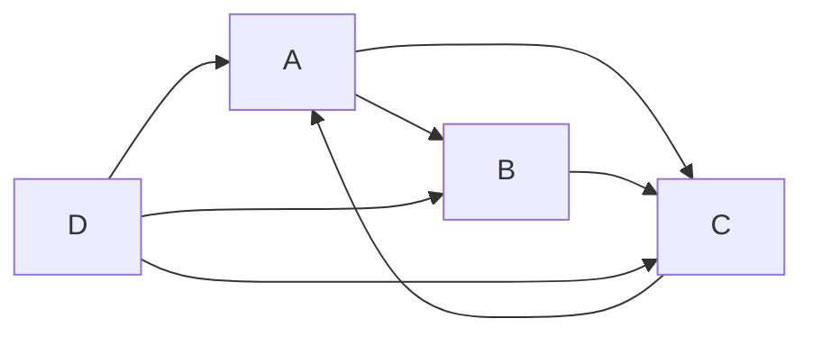

# 基于web的爬虫系统设计与实现

作者：禅与计算机程序设计艺术

## 1. 背景介绍

### 1.1 互联网数据爆炸式增长
随着互联网技术的飞速发展,网页数量呈指数级增长。据统计,目前全球网页数量已超过1500亿,且还在不断增加。如何从海量的网页中获取有价值的信息,成为了一个巨大的挑战。

### 1.2 搜索引擎技术的兴起
为了应对互联网数据的爆炸式增长,搜索引擎技术应运而生。搜索引擎通过爬虫程序自动抓取互联网上的网页,建立索引,方便用户快速查找信息。谷歌、百度等搜索引擎公司依靠强大的爬虫系统,为数亿用户提供了便捷的信息检索服务。

### 1.3 爬虫系统的广泛应用
爬虫系统不仅是搜索引擎的核心部件,在很多领域都有广泛应用:

- 电商平台:抓取竞争对手的商品和价格信息,进行市场分析
- 新闻聚合:抓取各大新闻网站的文章,实现新闻聚合展示
- 学术研究:抓取论文、专利等学术资源,方便科研人员查阅
- 社交媒体:抓取社交网络上的用户动态,进行社交网络分析
- 金融数据:抓取股票、基金等金融产品数据,提供量化交易依据

### 1.4 爬虫系统面临的挑战
构建一个高效、稳定、灵活的爬虫系统并非易事,主要面临以下挑战:

- 海量数据:需要抓取和处理海量的网页数据,对系统性能要求很高
- 反爬措施:很多网站设置了各种反爬虫措施,增加了爬虫的难度
- 数据质量:网页质量参差不齐,如何过滤噪音、提取干净的结构化数据是个难题
- 动态内容:很多网页采用Ajax动态加载技术,对传统爬虫构成挑战
- 分布式架构:为了提高爬取效率,需要设计分布式爬虫架构,协调好各节点工作

## 2. 核心概念与联系

### 2.1 爬虫 Crawler 
爬虫(又称网络蜘蛛、网络机器人)是一种按照一定规则,自动抓取网页的程序。爬虫从一些初始URL开始,获取网页内容后提取链接,再递归地访问这些链接。通过这种链接递归遍历的方式,爬虫可以自动访问到大量的网页。

### 2.2 网页解析 Page Parsing
爬虫抓取到网页内容后,需要从中提取出有用的信息,如网页标题、正文、链接等。网页大多是半结构化的HTML文本,可以用正则表达式、XPath、CSS选择器等方法进行解析。常用的解析库有BeautifulSoup、Jsoup等。

### 2.3 URL管理 URL Management
爬虫需要管理大量的待抓取URL和已抓取URL,通常用Bloom Filter、Hash表等数据结构来对URL进行去重。此外还需要一个高效的URL调度策略,控制爬虫抓取的频率和优先级,尽量避免对服务器造成过大压力。

### 2.4 数据存储 Data Storage
爬虫抓取的结果需要以某种形式存储起来,供后续的索引、分析、挖掘等使用。对于结构化数据,可以存储在关系型数据库如MySQL中。对于非结构化数据如网页快照,可以存储在Elasticsearch、HBase、HDFS等分布式存储系统上。

### 2.5 反爬虫与隐藏 Anti-Crawling and Cloaking
网站通常不欢迎爬虫,会专门设置一些反爬虫措施,如User-Agent检测、IP限制、验证码等。爬虫要想绕过这些限制,就需要做一些隐藏和伪装,如使用代理IP、控制爬取频率、模拟人的行为特征等。

### 2.6 分布式爬虫 Distributed Crawler
为了提高爬虫的性能和效率,往往需要采用分布式架构。即由多个爬虫节点协同工作,互相分担任务,最后汇总结果。分布式爬虫需要考虑任务分配、节点通信、数据同步等问题,设计实现更加复杂。

## 3. 核心算法原理具体操作步骤

### 3.1 基本爬虫算法
爬虫的基本工作流程可以用如下伪代码描述:

```
Initialize URL queue with seed URLs
While URL queue is not empty:
    url = URL queue.pop()
    If url not in Seen URLs:
        page = fetch(url)
        Seen URLs.add(url)
        Parse page, extract new URLs
        For each new url:
            Add url to URL queue
        Store extracted data
```

具体步骤如下:

1. 初始化一个URL队列,放入种子URL
2. 从URL队列中取出一个URL
3. 判断该URL是否已被抓取过,若已抓取则跳过,否则继续
4. 用HTTP客户端获取该URL指向的网页内容
5. 将该URL加入已抓取的URL集合
6. 解析网页,提取出新的URL,加入URL队列
7. 存储网页中的有用信息
8. 重复步骤2-7,直到URL队列为空

以上就是一个最简单的通用爬虫实现。但实际的爬虫系统要复杂得多,还需考虑URL去重、优先级调度、多线程、异常处理等问题。

### 3.2 Bloom Filter网址去重
爬虫会遇到大量重复的URL,为了避免重复抓取,需要将访问过的URL记录下来。但URL数量非常庞大,若全部存储在内存中,消耗太大。一种常用的解决方法是用Bloom Filter来对URL去重。

Bloom Filter是一种概率型数据结构,可以用来判断一个元素是否在集合中。其原理是利用多个哈希函数将元素映射到一个位数组中,并在对应的位置置1。检查元素是否存在时,将其哈希映射到位数组,看对应位置是否都为1。

Bloom Filter判断元素存在时,可能会有一定的误判率(False Positive)。但其优点是空间效率和查询时间都远远超过一般的算法,非常适合爬虫这种需要快速判断URL是否已抓取的场合。

Python中可以用`pybloom`库来实现Bloom Filter:

```python
from pybloom import BloomFilter

bf = BloomFilter(capacity=1000000, error_rate=0.001)
bf.add('http://www.example.com') 
print('http://www.example.com' in bf)  # True
print('http://www.example.net' in bf)  # False
```

上面的代码创建了一个容量为100万,误判率为0.1%的Bloom Filter。`add`方法将URL添加到过滤器中,`in`操作符可以检查URL是否存在。

### 3.3 网页解析算法
爬虫抓取到网页内容后,需要从HTML代码中提取出有用的信息,如网页标题、正文、链接等。常用的网页解析方法有:

- 正则表达式:编写一些正则规则,匹配出网页中的目标内容。适合结构比较规整的页面。
- XPath:用XPath语法定位HTML节点,适合有规律的结构化页面。
- CSS选择器:用CSS选择器语法定位节点,简洁实用。
- 自定义解析:针对一些异常复杂的页面,上述方法可能都不奏效,需要根据网页特点编写专门的解析代码。

下面是一个用Python的`requests`库抓取网页,并用`BeautifulSoup`解析库提取标题和链接的示例:

```python
import requests
from bs4 import BeautifulSoup

url = 'http://www.example.com'
html = requests.get(url).text
soup = BeautifulSoup(html, 'lxml')

print(soup.title.text)
print(soup.find('div', {'id': 'main'}).text)

for link in soup.find_all('a'):
    print(link.get('href'))
```

上面代码首先用`requests`的`get`方法获取网页内容,然后创建一个BeautifulSoup对象,指定`lxml`作为解析器。然后就可以用BeautifulSoup提供的各种方法如`find`、`find_all`等来定位和提取网页元素了。

## 4. 数学模型和公式详细讲解举例说明

### 4.1 网页重要性模型 PageRank
PageRank是Google创始人佩奇和布林提出的一种衡量网页重要性的经典算法。其基本思想是,一个网页的重要性取决于指向它的其他重要网页的数量和质量。PageRank根据网页的链接关系,用一个递归的数学模型计算所有网页的重要性得分。

我们可以将整个网络看作一个有向图$G=(V, E)$,其中网页是顶点,超链接是有向边。设$PR(i)$表示网页$i$的PageRank值,$B_i$表示指向$i$的网页集合,则PageRank的计算公式为:

$$PR(i) = \frac{1-d}{N} + d \sum_{j \in B_i} \frac{PR(j)}{L_j}$$

其中$N$是网页总数,$L_j$是网页$j$的出链数,$d$是阻尼系数,一般取0.85。这个公式可以用迭代的方法求解,直到所有网页的PR值收敛。

举个简单例子,假设有下图所示的4个网页A、B、C、D,箭头代表网页间的链接关系:



假设初始时A、B、C、D的PR值都为1,代入公式进行第一轮迭代:

$$
\begin{aligned}
PR(A) &= 0.15 + 0.85 \times (\frac{PR(C)}{1} + \frac{PR(D)}{3}) \\
      &= 0.15 + 0.85 \times (1 + \frac{1}{3}) = 1.43 \\
PR(B) &= 0.15 + 0.85 \times (\frac{PR(A)}{2} + \frac{PR(D)}{3}) \\
      &= 0.15 + 0.85 \times (\frac{1}{2} + \frac{1}{3}) = 0.87 \\
PR(C) &= 0.15 + 0.85 \times (\frac{PR(A)}{2} + \frac{PR(B)}{1} + \frac{PR(D)}{3}) \\
      &= 0.15 + 0.85 \times (\frac{1}{2} + 1 + \frac{1}{3}) = 1.71 \\
PR(D) &= 0.15 + 0.85 \times 0 = 0.15
\end{aligned}
$$

可以看出,C的PR值最高,其次是A,B和D较低。这是因为C有3个入链,且入链的质量较高。而D虽然没有入链,但由于阻尼系数的存在,也不会降为0。

以上只是一个简单的例子,实际的PageRank计算要经过多轮迭代,且网页数量巨大,需要用到大规模的矩阵计算。此外还有一些改进的PageRank变种算法,如Topic-Sensitive PageRank、TrustRank等。

### 4.2 HITS算法
HITS (Hyperlink-Induced Topic Search)是另一种经典的链接分析算法,由Kleinberg提出。它从链接的角度评价网页的重要性,认为网页具有Hub和Authority两种属性。

- Hub:指一个网页包含很多指向其他权威网页的链接
- Authority:指一个网页被很多Hub网页链接,说明它是权威网页

HITS通过链接关系,用一组迭代公式计算每个网页的Hub值和Authority值:

$$
\begin{aligned}
Auth(p) &= \sum_{q \in B_p} Hub(q) \\
Hub(p) &= \sum_{r \in F_p} Auth(r)
\end{aligned}
$$

其中$Auth(p)$和$Hub(p)$表示网页$p$的Authority值和Hub值,$B_p$表示指向$p$的网页集合,$F_p$表示$p$指向的网页集合。

举个例子,还是上面的4个网页,初始时它们的Auth和Hub值都为1。代入公式迭代一轮后:

$$
\begin{aligned}
Auth(A) &= Hub(C) + Hub(D) = 2 \\
Auth(B) &= Hub(A) + Hub(D) = 2 \\
Auth(C) &= Hub(A) + Hub(B) + Hub(D) = 3 \\
Auth(D