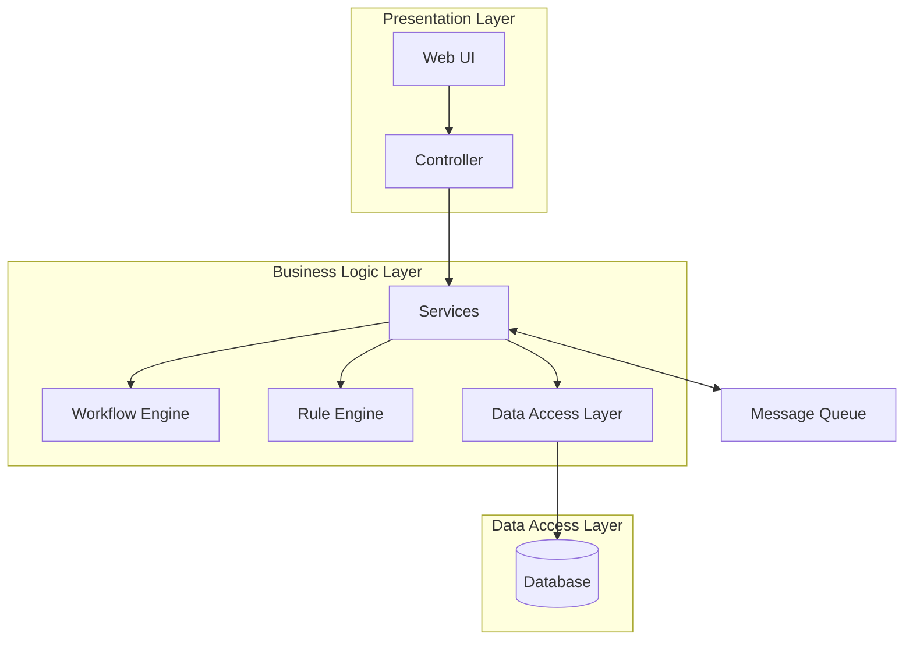

# 电子报销系统详细设计与具体代码实现

## 1.背景介绍

在现代企业中,员工报销是一个常见且重要的流程。传统的纸质报销方式不仅效率低下,而且容易出错,给企业带来额外的管理成本。因此,开发一个高效、安全的电子报销系统,可以极大地提高报销效率,降低人工成本,提升企业运营效率。

### 1.1 传统报销流程缺陷

传统的报销流程存在以下几个主要缺陷:

1. **低效率**: 纸质报销单需要多级审批,流转环节多,周期长。
2. **易出错**: 手工填写容易出现计算错误,审核也较为困难。
3. **数据难追踪**: 纸质单据易遗失,审计线索难以追查。
4. **成本高**: 需要大量人力进行审批、归档等重复性工作。

### 1.2 电子报销系统优势

相比之下,电子报销系统具有以下优势:

1. **高效审批**: 自动化流程,减少人工环节,加快审批速度。
2. **准确无误**: 数据电子化,避免手工填写错误。
3. **数据可追溯**: 所有数据电子化存储,便于审计追查。
4. **降低成本**: 自动化流程,减少大量人力成本。
5. **环保节约**: 无纸化操作,减少资源消耗。

## 2.核心概念与联系

在设计电子报销系统之前,我们需要理解以下几个核心概念:

### 2.1 报销单(Expense Claim)

报销单是整个系统的核心数据对象,包含以下主要信息:

- 报销人(Claimant)信息
- 报销项目明细(Expense Items)
- 相关附件(Attachments),如发票、收据等
- 审批流程状态(Approval Status)

### 2.2 报销类型(Expense Type) 

报销项目通常可分为不同类型,如:

- 差旅费用(Travel Expenses)
- 办公用品(Office Supplies)
- 招待费(Entertainment Expenses)
- ......

不同类型的报销项目可能有不同的审批流程和规则。

### 2.3 审批流程(Approval Workflow)

审批流程定义了报销单在获得最终审批前需要经过的步骤,包括:

- 审批人(Approvers)设置
- 审批顺序(Approval Sequence)
- 审批规则(Approval Rules)

审批流程的复杂程度取决于公司层级结构和管理制度。

### 2.4 费用核算(Expense Accounting)

在报销单审批通过后,相关费用需要记录到公司的财务系统中,用于后续的费用核算和报表生成。

### 2.5 系统集成(System Integration)

为了提高运营效率,电子报销系统通常需要与其他系统(如ERP、HR等)进行集成,实现数据交换和共享。

## 3.核心算法原理具体操作步骤  

电子报销系统的核心算法和操作步骤如下:

### 3.1 报销单提交

1. 用户登录系统,创建新的报销单。
2. 填写报销人基本信息。
3. 添加报销项目明细,包括项目名称、金额、类型等。
4. 上传相关附件,如发票、收据等。
5. 提交报销单,启动审批流程。

### 3.2 审批流程执行

1. 根据报销单金额、类型等,系统自动匹配审批流程模板。
2. 按审批顺序,将报销单分配给对应的审批人。
3. 审批人收到审批任务,查看报销单详情。
4. 审批人根据审批规则进行审批:
    - 如果符合规则,则审批通过,报销单进入下一级审批。
    - 如果不符合规则,则审批拒绝,并给出拒绝理由。
5. 重复步骤3、4,直至最后一级审批完成。

### 3.3 费用核算

1. 对于审批通过的报销单,系统将费用数据导出或接口调用的方式,发送到财务系统。
2. 财务系统根据相关会计准则和制度,完成费用分录和账务处理。
3. 相关费用报表生成和查询。

### 3.4 系统集成

1. 通过标准化接口,将员工人事数据从HR系统导入报销系统,用于身份验证和审批权限控制。
2. 将审批通过的费用数据导出到ERP系统,实现统一的费用核算。
3. 对接权限管理系统,确保只有授权用户能够访问相关功能和数据。

## 4.数学模型和公式详细讲解举例说明

在电子报销系统中,我们可能需要使用一些数学模型和公式来实现特定的业务需求,例如:

### 4.1 差旅费计算模型

对于出差报销,我们需要根据出差天数、交通工具、城市等因素计算差旅费用。我们可以使用以下公式:

$$
\text{TravelExpense} = \text{TransportationCost} + \text{AccommodationCost} + \text{OtherCosts}
$$

其中:

- $\text{TransportationCost}$ 可根据出行方式(飞机、火车等)、里程等因素计算得出。
- $\text{AccommodationCost}$ 可根据住宿天数、酒店星级等因素计算得出。
- $\text{OtherCosts}$ 包括餐费、签证费等其他相关费用。

例如,对于一次国内出差,假设:

- 往返交通费: ¥2000
- 住宿费: 5晚 x ¥800/晚 = ¥4000 
- 餐费: 5天 x ¥200/天 = ¥1000

则该次出差的差旅费为:

$$
\begin{aligned}
\text{TravelExpense} &= \text{TransportationCost} + \text{AccommodationCost} + \text{OtherCosts} \\
                     &= 2000 + 4000 + 1000 \\
                     &= \¥7000
\end{aligned}
$$

### 4.2 费用分摊模型

有时我们需要将一笔费用按照特定的比例或规则在多个部门或项目之间分摊,例如将一笔招待费按照参与人员所属部门的比例分摊到不同部门的费用科目。

设某次招待费用为$C$,参与的$n$个部门的人员数量分别为$p_1, p_2, \cdots, p_n$,则每个部门应分摊的费用为:

$$
c_i = C \times \frac{p_i}{\sum_{j=1}^n p_j}, \quad i = 1, 2, \cdots, n
$$

例如,某次招待费用为¥5000,参与的三个部门A、B、C的人员数量分别为2人、3人和5人,则各部门应分摊的费用为:

$$
\begin{aligned}
c_A &= 5000 \times \frac{2}{2+3+5} = \¥1000 \\
c_B &= 5000 \times \frac{3}{2+3+5} = \¥1500 \\
c_C &= 5000 \times \frac{5}{2+3+5} = \¥2500
\end{aligned}
$$

通过将数学模型和公式应用到实际的业务场景中,我们可以更精确地计算和分摊相关费用,提高系统的准确性和可靠性。

## 4.项目实践:代码实例和详细解释说明

为了更好地理解电子报销系统的实现,我们将通过一个简单的代码示例来演示其中的关键部分。这个示例使用Java语言和Spring框架实现,但是核心思路和架构可以应用于其他语言和框架。

### 4.1 系统架构

我们采用经典的三层架构设计,包括:

1. **表现层(Presentation Layer)**: 提供用户界面,接收用户输入并显示处理结果。
2. **业务逻辑层(Business Logic Layer)**: 实现核心业务逻辑,如报销单提交、审批流程执行等。
3. **数据访问层(Data Access Layer)**: 负责与数据库进行交互,执行数据持久化操作。

此外,我们还引入了以下支持组件:

- **工作流引擎(Workflow Engine)**: 管理和执行审批流程。
- **规则引擎(Rule Engine)**: 执行审批规则和计算规则。
- **消息队列(Message Queue)**: 用于异步处理和系统集成。



### 4.2 数据模型

我们从数据模型开始,定义核心的实体类:

```java
// 报销单
@Entity
public class ExpenseClaim {
    @Id
    private Long id;
    private String claimant; // 报销人
    @OneToMany
    private List<ExpenseItem> items; // 报销项目
    @OneToMany
    private List<Attachment> attachments; // 附件
    private ApprovalStatus status; // 审批状态
    
    // 构造函数、getter、setter等
}

// 报销项目
@Entity
public class ExpenseItem {
    @Id
    private Long id;
    private String description; // 项目描述
    private BigDecimal amount; // 金额
    @Enumerated
    private ExpenseType type; // 类型
    
    // 构造函数、getter、setter等
}

// 附件
@Entity
public class Attachment {
    @Id
    private Long id;
    private String filename; // 文件名
    private byte[] content; // 文件内容
    
    // 构造函数、getter、setter等
}
```

### 4.3 报销单提交

我们先看一下如何提交一个新的报销单:

```java
// 报销服务
@Service
public class ExpenseService {
    
    @Autowired
    private ExpenseRepository expenseRepo;
    
    @Autowired
    private WorkflowService workflowService;
    
    public ExpenseClaim submitClaim(ExpenseClaimRequest request) {
        // 1. 创建报销单
        ExpenseClaim claim = new ExpenseClaim();
        claim.setClaimant(request.getClaimant());
        
        // 2. 添加报销项目
        List<ExpenseItem> items = new ArrayList<>();
        for (ExpenseItemRequest itemReq : request.getItems()) {
            ExpenseItem item = new ExpenseItem();
            item.setDescription(itemReq.getDescription());
            item.setAmount(itemReq.getAmount());
            item.setType(itemReq.getType());
            items.add(item);
        }
        claim.setItems(items);
        
        // 3. 添加附件
        List<Attachment> attachments = new ArrayList<>();
        for (AttachmentRequest attachReq : request.getAttachments()) {
            Attachment attach = new Attachment();
            attach.setFilename(attachReq.getFilename());
            attach.setContent(attachReq.getContent());
            attachments.add(attach);
        }
        claim.setAttachments(attachments);
        
        // 4. 保存报销单
        claim = expenseRepo.save(claim);
        
        // 5. 启动审批流程
        workflowService.startApproval(claim);
        
        return claim;
    }
}
```

在这个示例中,我们首先从请求对象中获取报销人信息、报销项目和附件信息,创建相应的实体对象。然后,我们将报销单保存到数据库中,并调用工作流服务启动审批流程。

### 4.4 审批流程执行

接下来,我们看一下审批流程是如何执行的:

```java
// 工作流服务
@Service
public class WorkflowService {
    
    @Autowired
    private WorkflowEngine workflowEngine;
    
    @Autowired
    private RuleEngine ruleEngine;
    
    @Autowired
    private NotificationService notificationService;
    
    public void startApproval(ExpenseClaim claim) {
        // 1. 获取审批流程模板
        ApprovalProcess process = getApprovalProcess(claim);
        
        // 2. 执行审批流程
        workflowEngine.start(process, new ExpenseApprovalHandler());
    }
    
    private class ExpenseApprovalHandler implements ApprovalHandler {
        
        @Override
        public void handleApproval(Approval approval) {
            // 1. 执行审批规则
            ApprovalResult result = ruleEngine.evaluate(approval);
            
            // 2. 处理审批结果
            if (result.isApproved()) {
                // 审批通过,进入下一级审批
                workflowEngine.approveAndContinue(approval);
            } else {
                // 审批拒绝,终止流程
                workflowEngine.reject(approval, result.getReason());
                
                // 通知报销人
                notificationService.notifyClaimant(approval.getClaim(), result.getR