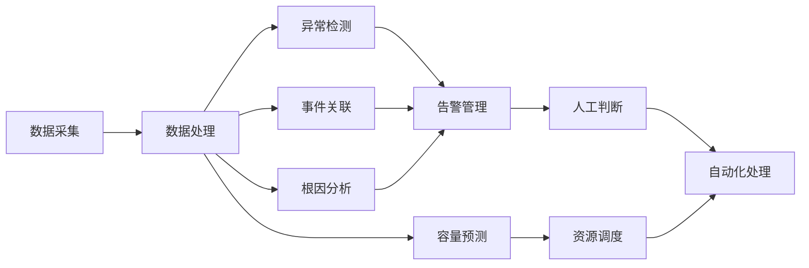

# AI系统AIOps原理与代码实战案例讲解

作者：禅与计算机程序设计艺术

## 1. 背景介绍

### 1.1 AIOps的兴起与发展历程
#### 1.1.1 传统运维模式的局限性
#### 1.1.2 AIOps的诞生与定义  
#### 1.1.3 AIOps的发展历程与里程碑

### 1.2 AIOps的核心价值与应用场景
#### 1.2.1 IT系统智能化运维的需求
#### 1.2.2 AIOps在故障诊断与预测中的价值
#### 1.2.3 AIOps在资源优化与容量管理中的应用

### 1.3 AIOps的技术生态与架构概览 
#### 1.3.1 AIOps的关键技术组件
#### 1.3.2 数据采集与处理流程
#### 1.3.3 算法模型与知识库体系

## 2. 核心概念与联系

### 2.1 可观测性与数据采集
#### 2.1.1 可观测性的内涵与维度
#### 2.1.2 监控数据的类型与来源
#### 2.1.3 数据采集的方式与工具选择

### 2.2 异常检测与根因分析
#### 2.2.1 异常检测的定义与分类  
#### 2.2.2 统计与机器学习方法在异常检测中的应用
#### 2.2.3 根因分析的流程与关键技术

### 2.3 事件关联与智能告警
#### 2.3.1 海量告警的困境与挑战
#### 2.3.2 事件关联分析的原理与方法  
#### 2.3.3 智能告警的生成与管理策略

### 2.4 预测性维护与容量规划
#### 2.4.1 预测性维护的价值与实现路径
#### 2.4.2 容量规划的必要性与关键指标
#### 2.4.3 时间序列预测模型的选择与优化

## 3. 核心算法原理具体操作步骤

### 3.1 异常检测算法详解
#### 3.1.1 统计过程控制
#### 3.1.2 K-Means聚类
#### 3.1.3 局部异常因子(LOF) 
#### 3.1.4 One-Class SVM
#### 3.1.5 孤立森林(Isolation Forest)

### 3.2 根因分析算法详解 
#### 3.2.1 相关分析
#### 3.2.2 贝叶斯网络
#### 3.2.3 因果推理图
#### 3.2.4 频繁模式挖掘

### 3.3 智能告警算法详解
#### 3.3.1 相似度聚类
#### 3.3.2 频繁项集挖掘
#### 3.3.3 关联规则学习
#### 3.3.4 因果推断

### 3.4 容量预测算法详解
#### 3.4.1 线性回归
#### 3.4.2 随机森林回归
#### 3.4.3 支持向量回归
#### 3.4.4 LSTM神经网络
#### 3.4.5 Prophet模型

## 4. 数学模型和公式详细讲解举例说明

### 4.1 统计过程控制的数学原理
#### 4.1.1 正态分布与3-sigma原则
#### 4.1.2 控制图的构建与解释
#### 4.1.3 Western Electric规则

### 4.2 K-Means聚类的数学推导
#### 4.2.1 距离度量与相似性计算
#### 4.2.2 目标函数与优化过程
#### 4.2.3 聚类中心的更新策略

### 4.3 局部异常因子(LOF)的数学定义
#### 4.3.1 k-距离与可达距离
#### 4.3.2 局部可达密度
#### 4.3.3 异常因子的计算公式

### 4.4 孤立森林的数学原理
#### 4.4.1 二叉搜索树与随机切分  
#### 4.4.2 路径长度与异常分数
#### 4.4.3 集成策略与异常判定

### 4.5 LSTM神经网络的前向传播与反向传播
#### 4.5.1 LSTM单元的数学结构
#### 4.5.2 门控机制与状态更新方程
#### 4.5.3 梯度计算与参数学习

## 5. 项目实践：代码实例和详细解释说明

### 5.1 使用Python实现异常检测
#### 5.1.1 数据预处理与特征工程
#### 5.1.2 孤立森林模型的训练与评估
#### 5.1.3 异常点的识别与可视化展示

### 5.2 使用Spark MLlib构建根因分析引擎
#### 5.2.1 数据集的加载与转换 
#### 5.2.2 频繁模式挖掘算法的应用
#### 5.2.3 关联规则的生成与筛选
#### 5.2.4 因果关系图的构建与推理

### 5.3 使用TensorFlow实现智能告警
#### 5.3.1 告警数据的预处理与向量化
#### 5.3.2 孪生神经网络的设计与训练
#### 5.3.3 相似告警的聚类与压缩
#### 5.3.4 告警通知策略的优化

### 5.4 使用Prophet进行容量预测
#### 5.4.1 时间序列数据的加载与探索性分析
#### 5.4.2 Prophet模型的构建与拟合
#### 5.4.3 趋势、周期、节假日效应的分解
#### 5.4.4 未来容量需求的预测与展示

## 6. 实际应用场景

### 6.1 互联网电商平台的AIOps实践
#### 6.1.1 业务系统架构与痛点分析
#### 6.1.2 异常检测在促销活动中的应用
#### 6.1.3 根因分析在故障诊断中的作用
#### 6.1.4 智能运维平台的搭建与运营

### 6.2 金融核心交易系统的AIOps探索
#### 6.2.1 交易系统的特点与监控重点
#### 6.2.2 实时风控场景下的异常识别 
#### 6.2.3 智能告警在应急响应中的价值
#### 6.2.4 容量管理在成本优化中的意义

### 6.3 电信运营商网络的AIOps转型
#### 6.3.1 海量网元的管理挑战
#### 6.3.2 网络拓扑的自动发现与建模
#### 6.3.3 网络故障的智能诊断与自愈
#### 6.3.4 基于AI的网络优化与分析

## 7. 工具和资源推荐

### 7.1 数据采集与处理
#### 7.1.1 Logstash：日志收集与解析
#### 7.1.2 Fluentd：统一日志层
#### 7.1.3 Kafka：高吞吐量的消息队列
#### 7.1.4 Flink：实时流处理框架

### 7.2 存储与计算
#### 7.2.1 Elasticsearch：分布式搜索与分析引擎
#### 7.2.2 InfluxDB：时序数据库 
#### 7.2.3 Hadoop：大数据存储与批处理
#### 7.2.4 Spark：内存计算引擎

### 7.3 可视化与告警
#### 7.3.1 Grafana：数据可视化平台
#### 7.3.2 Kibana：日志分析与可视化 
#### 7.3.3 Prometheus：监控系统与时间序列数据库
#### 7.3.4 AlertManager：告警管理工具

### 7.4 机器学习与自动化
#### 7.4.1 TensorFlow：端到端的机器学习平台
#### 7.4.2 PyTorch：灵活的深度学习框架
#### 7.4.3 Scikit-learn：Python机器学习工具包
#### 7.4.4 Ansible：配置管理与自动化工具

## 8. 总结：未来发展趋势与挑战

### 8.1 AIOps与云原生的融合发展
#### 8.1.1 云原生架构下的可观测性挑战
#### 8.1.2 基于Kubernetes的AIOps实践 
#### 8.1.3 Serverless场景下的AIOps思考

### 8.2 AIOps与安全运维的结合
#### 8.2.1 复杂安全威胁的智能检测
#### 8.2.2 安全事件的关联分析与追溯
#### 8.2.3 智能化的安全运维协同响应

### 8.3 AIOps技术的持续演进
#### 8.3.1 知识图谱与因果推理
#### 8.3.2 强化学习在运维决策中的应用
#### 8.3.3 人机协同与自适应学习

### 8.4 AIOps生态的发展与融合
#### 8.4.1 开源社区的持续贡献
#### 8.4.2 商业工具的成熟与创新
#### 8.4.3 标准规范的制定与推广

## 9. 附录：常见问题与解答

### 9.1 AIOps与传统运维的区别是什么？
### 9.2 AIOps需要哪些数据源，如何保证数据质量？ 
### 9.3 异常检测的常见方法有哪些，如何选择？
### 9.4 根因分析的本质是什么，存在哪些难点？
### 9.5 如何评估智能告警的效果，有哪些优化策略？
### 9.6 容量预测的关键影响因素有哪些，如何提高预测的准确性？
### 9.7 如何平衡AIOps平台的通用性和个性化需求？
### 9.8 AIOps团队应该如何组建，需要哪些关键角色？
### 9.9 实施AIOps的成本和回报如何度量，如何进行投资决策？
### 9.10 AIOps的应用是否存在局限性，如何克服？

以上是一个典型的AIOps平台的核心组件和工作流程，从海量的IT系统监控数据出发，通过数据采集与处理，利用异常检测、事件关联、根因分析等算法，实现智能化的告警管理，再结合容量预测的结果进行资源的动态调度，最终达到自动化的运维目标。当然，人工分析和判断仍然是必要的，AIOps的宗旨是用AI来增强人的能力，而非完全取代人。

总的来说，AIOps代表了运维领域向智能化、自动化的演进趋势，通过机器学习等AI技术的应用，大幅提升IT系统的可管理性、可靠性和安全性，实现从被动式的事后处理向主动式的预测预防的转变。AIOps平台涉及多种异构数据源、复杂算法模型、灵活可扩展的架构设计，对技术的全面性和融合性提出了很高的要求。同时，AIOps并非一蹴而就，而是一个循序渐进的过程，需要在不断的实践中积累经验，调整优化，最终实现人机协同、业务融合的智慧运维。

展望未来，AIOps将与云计算、大数据、微服务等新兴技术深度融合，不断突破智能化运维的边界。在5G、物联网、工业互联网等场景下，AIOps也将迎来更加广阔的应用空间。这需要产业界和学术界的共同努力，在技术创新、生态构建、人才培养等方面持续发力，推动AIOps的健康发展。

让我们拥抱AIOps的浪潮，用智能重塑运维的未来！