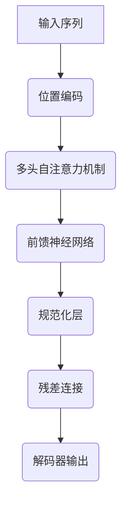
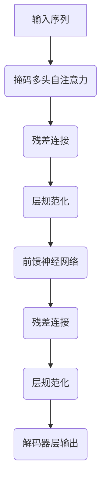

# GPT-2原理与代码实例讲解

## 1.背景介绍

### 1.1 自然语言处理的重要性

在当今的数字时代,自然语言处理(NLP)已成为人工智能领域的关键技术之一。它旨在使计算机能够理解、解释和生成人类语言,从而实现人机自然交互。随着大数据和计算能力的不断提高,NLP技术得到了长足发展,为各种应用场景带来了革命性的变化。

### 1.2 语言模型的作用

语言模型是NLP的核心组成部分,它通过学习大量文本数据,捕捉语言的统计规律和语义关联,从而能够生成连贯、流畅的文本。传统的语言模型基于n-gram等统计方法,但存在上下文捕捉能力有限等缺陷。而近年来,基于深度学习的神经网络语言模型取得了突破性进展,极大提升了语言理解和生成的质量。

### 1.3 GPT-2的重要意义

GPT-2(Generative Pre-trained Transformer 2)是一种创新的大型无监督神经网络语言模型,由OpenAI于2019年推出。它在海量文本数据上进行预训练,学习到了丰富的语言知识,可以生成高质量、多样化的文本内容。GPT-2不仅在自然语言生成任务上表现出色,而且可以通过微调(fine-tuning)应用于多种自然语言处理任务,展现出强大的迁移能力。

GPT-2的出现标志着大型语言模型进入了一个新的里程碑。它的卓越表现引发了学术界和工业界的广泛关注,成为语言人工智能研究的重要方向。深入理解GPT-2的原理和实现细节,对于推动NLP技术发展至关重要。

## 2.核心概念与联系  

### 2.1 Transformer架构

GPT-2的核心架构源于Transformer模型,这是一种全新的基于注意力机制(Attention Mechanism)的序列到序列(Seq2Seq)模型。与传统的循环神经网络(RNN)不同,Transformer完全放弃了循环结构,而是引入了自注意力(Self-Attention)机制来捕捉输入序列中任意两个位置之间的依赖关系。

Transformer架构主要包括两个子模块:编码器(Encoder)和解码器(Decoder)。在GPT-2中,只使用了解码器部分,因为它是一个单向语言模型,只需要生成文本序列而无需输入源序列。

上图展示了Transformer解码器的基本结构。首先,输入序列通过位置编码(Positional Encoding)注入位置信息。然后,该序列被送入多头自注意力(Multi-Head Self-Attention)机制,捕捉序列内元素之间的依赖关系。接下来,通过前馈神经网络(Feed-Forward Neural Network)对每个位置的表示进行转换。最后,使用残差连接(Residual Connection)和规范化层(Normalization Layer)来促进梯度传播和模型收敛。

### 2.2 自注意力机制

自注意力机制是Transformer的核心创新,它允许模型直接捕捉输入序列中任意两个位置之间的依赖关系,而不受距离或方向的限制。这种全局依赖建模能力使Transformer能够更好地学习长期依赖,从而提高了序列建模的性能。

在自注意力计算中,每个输入位置都被映射为一个查询(Query)向量、一个键(Key)向量和一个值(Value)向量。然后,通过查询向量与所有键向量的点积来计算注意力分数,并根据这些分数对值向量进行加权求和,得到该位置的注意力表示。

$$
\mathrm{Attention}(Q, K, V) = \mathrm{softmax}\left(\frac{QK^T}{\sqrt{d_k}}\right)V
$$

其中,$Q$是查询矩阵,$K$是键矩阵,$V$是值矩阵,$d_k$是缩放因子。softmax函数用于获取注意力权重。

多头注意力机制则是将注意力计算过程从不同的表示子空间进行捕捉,然后将不同子空间的注意力表示进行连接,以提高注意力机制的表达能力。

### 2.3 掩码自回归语言模型

GPT-2采用了掩码自回归(Masked Auto-regressive)语言模型的训练方式。在训练过程中,模型会基于已生成的文本序列,预测下一个可能出现的词。具体来说,给定一个长度为$n$的文本序列$\boldsymbol{x} = (x_1, x_2, \ldots, x_n)$,模型需要最大化下式中的条件概率:

$$
\begin{aligned}
\log P(\boldsymbol{x}) &= \sum_{t=1}^n \log P(x_t | x_{<t}) \\
&= \sum_{t=1}^n \log P(x_t | x_1, \ldots, x_{t-1})
\end{aligned}
$$

其中,$x_{<t}$表示长度为$t-1$的前缀序列。通过最大化上式,模型可以学习到生成连贯自然语言的能力。

在推理阶段,给定一个起始词或短语,GPT-2将自回归地生成下一个最可能的词,并将其附加到输入序列中,重复该过程直到达到终止条件(如生成的序列达到预设长度)。

## 3.核心算法原理具体操作步骤

### 3.1 Transformer解码器

Transformer解码器是GPT-2的核心部分,它由多个相同的解码器层组成。每个解码器层包含以下几个子层:

1. **掩码多头自注意力(Masked Multi-Head Self-Attention)**

   该子层对输入序列进行自注意力计算,但在计算注意力时,会掩码掉当前位置之后的所有位置,确保模型只能关注之前的上下文信息。这保证了模型的自回归性质。

2. **多头注意力(Multi-Head Attention)**

   这是一个可选的编码器-解码器注意力子层,用于将编码器的输出作为记忆引入解码器。但在GPT-2中,由于没有输入编码器序列,因此省略了这一子层。

3. **前馈神经网络(Feed-Forward Neural Network)**

   这是一个简单的前馈神经网络,对序列的每个位置的表示进行独立的非线性映射,以提供额外的表达能力。

4. **残差连接(Residual Connection)和层规范化(Layer Normalization)**

   残差连接和层规范化用于促进梯度传播和模型收敛。

上述子层按顺序堆叠构成一个解码器层,多个解码器层再组合成完整的Transformer解码器模型。

### 3.2 模型训练

GPT-2的训练过程可分为两个阶段:预训练(Pre-training)和微调(Fine-tuning)。

1. **预训练阶段**

   在预训练阶段,GPT-2在大量无监督文本数据(如网络爬取的书籍、文章等)上进行训练,目标是最大化语言模型的对数似然。具体来说,给定一个长度为$n$的文本序列$\boldsymbol{x} = (x_1, x_2, \ldots, x_n)$,模型需要最大化下式中的条件概率:

   $$
   \begin{aligned}
   \log P(\boldsymbol{x}) &= \sum_{t=1}^n \log P(x_t | x_{<t}) \\
                          &= \sum_{t=1}^n \log P(x_t | x_1, \ldots, x_{t-1})
   \end{aligned}
   $$

   其中,$x_{<t}$表示长度为$t-1$的前缀序列。通过最大化上式,模型可以学习到生成连贯自然语言的能力。

   预训练过程采用掩码自回归语言模型,即在每个位置预测下一个词时,会掩码掉当前位置之后的所有位置,确保模型只能关注之前的上下文信息。这保证了模型的自回归性质。

2. **微调阶段**

   预训练得到的GPT-2模型已经学习到了通用的语言知识,但还无法直接应用于特定的自然语言处理任务。因此,需要在特定任务的数据上进行进一步的微调(Fine-tuning),使模型适应该任务的特征。

   微调过程类似于预训练,但有两点不同:
   
   - 训练数据来自于特定任务的数据集,而非通用文本数据。
   - 除了最后的输出层,大部分模型参数都被冻结,只对一小部分参数进行微调。

   通过微调,GPT-2可以在保留通用语言知识的同时,专门学习特定任务的模式和规律,从而显著提高任务的性能表现。

### 3.3 生成策略

在推理阶段,GPT-2将自回归地生成文本序列。具体来说,给定一个起始词或短语,模型会预测下一个最可能出现的词,并将其附加到输入序列中。重复该过程,直到达到终止条件(如生成序列达到预设长度)。

生成过程中,GPT-2通常采用贪婪解码(Greedy Decoding)或前K个最高概率(Top-K Sampling)等策略。

- **贪婪解码**:在每个时间步,选择概率最大的词作为输出。这种策略简单高效,但可能导致生成单一乏味的结果。

- **前K个最高概率采样**:在每个时间步,从概率分布的前K个最高概率的词中随机采样一个作为输出。这种策略可以产生更多样化的结果,但可能包含一些不太合理的词。

- **Nucleus采样(Top-p Sampling)**:在每个时间步,从概率分布的最高概率部分(累积概率达到阈值p)中随机采样一个作为输出。这种策略可以在多样性和合理性之间达到更好的平衡。

- **Beam Search**:这是一种更高级的解码策略,它会并行跟踪多个候选序列,并在每个时间步保留概率最高的前K个序列作为输入,最终输出概率最高的序列。这种策略可以产生更高质量的结果,但计算开销较大。

不同的生成策略在多样性、合理性和计算效率之间存在权衡,需要根据具体应用场景进行选择。

## 4.数学模型和公式详细讲解举例说明

### 4.1 Transformer中的注意力机制

注意力机制是Transformer的核心创新,它允许模型直接捕捉输入序列中任意两个位置之间的依赖关系,而不受距离或方向的限制。这种全局依赖建模能力使Transformer能够更好地学习长期依赖,从而提高了序列建模的性能。

在自注意力计算中,每个输入位置都被映射为一个查询(Query)向量、一个键(Key)向量和一个值(Value)向量。然后,通过查询向量与所有键向量的点积来计算注意力分数,并根据这些分数对值向量进行加权求和,得到该位置的注意力表示。数学表达式如下:

$$
\mathrm{Attention}(Q, K, V) = \mathrm{softmax}\left(\frac{QK^T}{\sqrt{d_k}}\right)V
$$

其中,$Q$是查询矩阵,$K$是键矩阵,$V$是值矩阵,$d_k$是缩放因子。softmax函数用于获取注意力权重,它将注意力分数转换为概率分布,确保所有权重之和为1。

$$
\mathrm{softmax}(x_i) = \frac{\exp(x_i)}{\sum_j \exp(x_j)}
$$

多头注意力机制则是将注意力计算过程从不同的表示子空间进行捕捉,然后将不同子空间的注意力表示进行连接,以提高注意力机制的表达能力。具体来说,查询、键和值首先通过线性映射分别投影到$h$个子空间,在每个子空间中计算注意力,最后将所有子空间的注意力表示拼接起来,形成最终