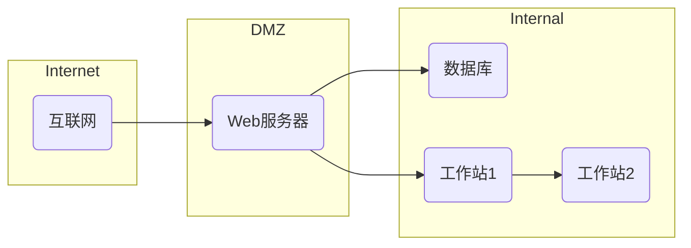

# LLM驱动的自动化安全加固和漏洞管理

## 1.背景介绍

### 1.1 软件安全的重要性

在当今数字时代,软件系统无处不在,从移动应用到云基础设施,再到物联网设备,软件已经成为现代生活和商业运营的核心组成部分。然而,随着软件复杂性的不断增加,确保其安全性也变得更加困难。软件漏洞可能会导致数据泄露、系统中断和财务损失等严重后果。因此,有效的软件安全加固和漏洞管理对于保护关键系统、数据和用户隐私至关重要。

### 1.2 传统方法的挑战

传统的软件安全实践通常依赖于人工代码审查、penetration测试和漏洞扫描等手动过程。然而,这些方法存在一些固有的局限性:

- **人工密集型**: 手动审查和测试过程耗时耗力,难以跟上软件开发的快速迭代周期。
- **覆盖率有限**: 人工审查无法100%覆盖所有代码路径和边缘案例。
- **技能依赖**: 需要高度专业的安全专家,供不应求且成本高昂。
- **可扩展性差**: 随着代码库的增长,人工过程难以保持高效和一致性。

### 1.3 LLM在软件安全中的机遇

近年来,大型语言模型(LLM)在自然语言处理领域取得了突破性进展,展现出惊人的理解和生成能力。将LLM应用于软件安全领域,有望克服传统方法的局限,提供自动化、可扩展和高效的解决方案。LLM驱动的安全加固和漏洞管理有潜力彻底改变这一领域的实践方式。

## 2.核心概念与联系  

### 2.1 大型语言模型(LLM)

大型语言模型(LLM)是一种基于深度学习的自然语言处理(NLP)模型,能够理解和生成人类语言。LLM通过在大量文本数据上训练,学习语言的模式和语义,从而获得广泛的知识和推理能力。

一些著名的LLM包括:

- **GPT(Generative Pre-trained Transformer)**: 由OpenAI开发,是第一个真正突破性的大型语言模型,展现了出色的自然语言生成能力。
- **BERT(Bidirectional Encoder Representations from Transformers)**: 由Google开发,在自然语言理解任务中表现出色。
- **XLNet**: 由Carnegie Mellon大学和Google Brain开发,在多项NLP基准测试中表现优异。
- **GPT-3**: 由OpenAI开发,规模高达1750亿个参数,在广泛的NLP任务中展现出人类水平的性能。

### 2.2 LLM在软件安全中的应用

LLM在软件安全领域有着广阔的应用前景,包括但不限于:

- **代码理解和分析**: LLM能够深入理解代码的语义,识别潜在的安全漏洞和风险。
- **漏洞检测和修复**: LLM可以自动扫描代码,发现常见的漏洞模式,并提供修复建议。
- **安全规则和策略生成**: LLM可以根据安全最佳实践和行业标准,生成定制的安全规则和策略。
- **安全文档和报告生成**: LLM可以自动生成安全文档、报告和解释,提高效率和一致性。
- **安全培训和教育**: LLM可以作为虚拟助手,为开发人员提供实时的安全指导和培训。

### 2.3 LLM与传统方法的比较

相比传统的人工密集型软件安全实践,LLM驱动的方法具有以下优势:

- **自动化和可扩展性**: LLM能够快速高效地处理大规模代码库,不受人力资源的限制。
- **广泛覆盖和一致性**: LLM可以全面扫描所有代码路径,确保安全检查的完整性和一致性。
- **持续学习和改进**: LLM可以通过持续训练来不断扩展知识库,适应新的威胁和漏洞模式。
- **降低技能门槛**: LLM可以democratize软件安全实践,降低对高度专业人才的依赖。

然而,LLM也面临一些挑战,如模型偏差、安全性和可解释性等,需要通过持续的研究和改进来解决。

## 3.核心算法原理具体操作步骤

LLM驱动的自动化安全加固和漏洞管理通常涉及以下几个关键步骤:

### 3.1 数据准备

高质量的训练数据是LLM模型性能的关键。对于软件安全任务,我们需要准备以下数据:

1. **源代码数据**: 包括各种编程语言的源代码样本,既有安全的代码,也有存在已知漏洞的代码。
2. **安全规则和策略**: 来自行业标准、最佳实践和安全专家的规则和策略文档。
3. **漏洞数据库**: 包含已知漏洞的详细描述、影响范围、修复方案等信息。
4. **安全报告和文档**: 用于训练LLM生成高质量的安全报告和文档。

这些数据需要经过适当的清理、标注和格式化,以供LLM模型训练使用。

### 3.2 LLM模型训练

基于准备好的数据,我们可以训练一个或多个LLM模型,专门用于软件安全任务。常见的训练方法包括:

1. **监督式微调(Supervised Fine-tuning)**: 在通用LLM模型(如GPT-3)的基础上,使用标注的数据进行进一步微调,使模型专门化于软件安全任务。
2. **半监督式训练(Semi-supervised Training)**: 结合少量标注数据和大量未标注数据,通过自监督学习和迭代训练提高模型性能。
3. **多任务学习(Multi-task Learning)**: 同时在多个相关任务上训练LLM,如代码理解、漏洞检测和修复建议生成等,以提高模型的泛化能力。

训练过程中,我们还需要注意模型大小、计算资源、训练策略等超参数的调优,以达到最佳性能。

### 3.3 模型评估和改进

在将LLM模型投入实际使用之前,我们需要进行全面的评估,包括:

1. **性能评估**: 在保留的测试集上评估模型在各项任务的精确度、召回率和F1分数等指标。
2. **安全性评估**: 测试模型对对抗性攻击(如针对性Prompts)的鲁棒性,确保其不会产生安全风险。
3. **可解释性评估**: 分析模型的决策过程和推理逻辑,确保其具有可解释性和可审计性。

根据评估结果,我们可以对模型进行进一步改进,如数据增强、架构调整、训练策略优化等。这是一个迭代的过程,直到模型达到满意的性能和安全性水平。

### 3.4 模型部署和集成

经过评估和改进后,我们可以将LLM模型部署到实际的软件开发生命周期中,与现有的工具和流程相集成。这可能涉及以下步骤:

1. **构建API和用户界面**: 为LLM模型构建友好的API和用户界面,方便开发人员和安全分析师使用。
2. **集成到CI/CD流水线**: 将LLM模型集成到持续集成和持续交付(CI/CD)流水线中,实现自动化的安全扫描和修复。
3. **与其他工具集成**: 与现有的代码编辑器、IDE、漏洞扫描器等工具集成,提供无缝的体验。
4. **监控和反馈**: 持续监控模型在生产环境中的表现,收集反馈并进行模型改进。

通过上述步骤,我们可以充分利用LLM的强大能力,实现软件安全实践的自动化和现代化。

## 4.数学模型和公式详细讲解举例说明

虽然LLM主要基于神经网络和深度学习技术,但在软件安全领域,我们也需要利用一些传统的数学模型和公式来量化和评估安全风险。

### 4.1 共同漏洞评分系统(CVSS)

共同漏洞评分系统(CVSS)是一种开放的标准,用于评估和评分软件漏洞的严重程度。CVSS分数范围从0到10,分数越高表示漏洞的风险越大。

CVSS分数由以下公式计算得出:

$$CVSS = round_{to}(((0.6*Impact)+(0.4*Exploitability)-1.5)*f(Impact), 1)$$

其中:

- Impact是漏洞的影响评分,范围0-10
- Exploitability是漏洞的利用评分,范围0-10
- $f(Impact)$是一个影响因子函数,用于调整最终分数

Impact和Exploitability分数由多个指标组成,包括攻击向量、攻击复杂性、特权要求、用户交互、范围和影响等。每个指标都有特定的计算方式和权重。

例如,对于一个远程执行代码(RCE)漏洞,其CVSS分数计算如下:

- 攻击向量(AV)=网络(N),权重0.85
- 攻击复杂性(AC)=低(L),权重0.77  
- 特权要求(PR)=无(N),权重0.85
- 用户交互(UI)=无(N),权重0.85
- 范围(S)=改变(C),权重0.6
- 机密性影响(C)=高(H),权重0.56
- 完整性影响(I)=高(H),权重0.56
- 可用性影响(A)=高(H),权重0.56

则:
- Exploitability = 8.22 * 0.85 * 0.77 * 0.85 * 0.85 = 4.93
- Impact = 10.41 * (1-(1-0.56*1)*(1-0.56*1)*(1-0.56*1)) = 8.2
- CVSS = round_to(((0.6*8.2)+(0.4*4.93)-1.5)*1.176, 1) = 9.8

因此,这个RCE漏洞的CVSS分数为9.8,属于严重级别。

通过CVSS分数,我们可以优先处理高风险漏洞,并根据分数对漏洞进行分类和排序。LLM模型可以自动计算CVSS分数,并将其整合到漏洞报告和修复建议中。

### 4.2 攻击图模型

攻击图是一种用于建模和分析网络系统安全状态的数学模型。它将系统组件、配置、漏洞和攻击路径表示为一个有向图,并使用图理论和概率模型来评估系统的总体风险。

在攻击图$G=(N,E)$中:

- $N$是节点集合,表示系统组件(主机、服务、用户等)和攻击条件
- $E$是边集合,表示利用关系(如果满足某些条件,则可以从一个节点到达另一个节点)

每个边$e_{ij}$都有一个利用概率$p_{ij}$,表示攻击者能够利用该边的概率。目标节点的风险可以用其被成功攻击的概率来量化,即到达该节点的所有路径概率之和。

对于一个简单的网络,其攻击图可以表示为:

在这个攻击图中,如果Web服务器存在漏洞,攻击者可以从互联网直接访问并控制它。一旦Web服务器被入侵,攻击者就可以进一步攻击内部数据库和工作站。我们可以计算每个节点被成功攻击的概率,并采取相应的防御措施降低风险。

LLM模型可以根据系统配置和已知漏洞自动构建攻击图,并对风险进行量化评估,从而帮助确定优先防护的关键节点和路径。

### 4.3 其他数学模型

除了CVSS和攻击图之外,软件安全领域还使用了其他一些数学模型和技术,例如:

- **马尔可夫决策过程(MDP)**: 用于建模和优化安全防御策略
- **博