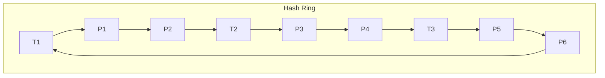

# Samza Task原理与代码实例讲解

作者：禅与计算机程序设计艺术

## 1. 背景介绍

### 1.1 大数据流处理的重要性
在当今大数据时代,海量数据以流的形式实时产生,传统的批处理模式已经无法满足实时性要求。因此,流式数据处理成为了大数据领域的重要分支。流式处理可以在数据产生的同时进行实时计算,从而大大降低了数据处理的延迟。

### 1.2 Samza的诞生
Samza是由LinkedIn公司开源的分布式流式数据处理框架。它建立在Kafka和YARN之上,充分利用了Kafka的高吞吐特性和YARN的资源管理能力,是一个可靠、高性能、可扩展的流处理平台。

### 1.3 Samza的应用场景
Samza广泛应用于日志处理、用户行为分析、实时推荐、欺诈检测等需要实时处理海量数据的场景。LinkedIn内部很多核心服务都是基于Samza构建的。

## 2. 核心概念与联系

### 2.1 Stream
Stream是Samza中的核心概念,代表一个无界的、持续到达的数据序列。在Samza中,每个Stream都由一个唯一的名称标识。Stream中的数据以Key-Value对的形式存在。

### 2.2 Job
Job定义了对输入Stream的处理逻辑,由一个或多个Task组成。每个Job从一个或多个输入Stream读取数据,经过处理后将结果写入一个或多个输出Stream。

### 2.3 Task 
Task是Job的基本执行单元。每个Task负责处理Stream的一个Partition。Task从指定的输入Stream Partition读取数据,执行计算逻辑,并将结果发送到下游Task或写入外部存储。

### 2.4 Partition
为了实现并行处理,每个Stream被划分为多个Partition。每个Partition只能被一个Task消费,保证了数据处理的顺序性。Partition的数量决定了最大并行度。

### 2.5 State
Samza支持有状态的流处理。每个Task可以访问一个Key-Value形式的本地State,用于存储中间计算结果。State支持快照和恢复,从而实现exactly-once语义。

### 2.6 Checkpoint
为了从失败中恢复,Samza会定期对每个Task的State做Checkpoint。Checkpoint将State的快照持久化到外部存储,当Task失败重启时,可以从最近的Checkpoint恢复State。

## 3. 核心算法原理与具体操作步骤

### 3.1 Dataflow模型
Samza采用Dataflow模型来描述流式计算。在Dataflow模型中,数据在一系列算子(Operator)之间流动。每个算子对输入数据进行转换,生成新的输出。常见的算子包括:

#### 3.1.1 Map
对每个输入元素应用一个函数,生成一个输出元素。
```java
messages.map(msg -> msg.toLowerCase()); 
```

#### 3.1.2 FlatMap
对每个输入元素应用一个函数,生成0到多个输出元素。
```java
sentences.flatMap(sentence -> Arrays.asList(sentence.split(" ")));
```

#### 3.1.3 Filter
对每个输入元素应用一个谓词,只保留满足谓词的元素。
```java
numbers.filter(n -> n % 2 == 0);
```

#### 3.1.4 KeyBy
根据指定的Key对元素进行分组。
```java
words.keyBy(word -> word);
```

#### 3.1.5 Reduce
对每个Key的元素序列进行归约,生成一个结果值。
```java
keyedWords.reduce((a, b) -> a + b);
```

#### 3.1.6 Window
在元素流上定义一个窗口,对窗口内的元素进行计算。窗口可以是时间窗口(如每5分钟)或数量窗口(如每100个元素)。
```java
keyedEvents.window(Windows.tumblingWindow(Time.seconds(10)));
```

### 3.2 任务调度
Samza将输入Stream的Partition均匀地分配给各个Task,以实现负载均衡。每个Task持续消费分配给它的Partition,直到Job完成。

#### 3.2.1 Partition分配算法
Samza使用一致性哈希算法将Partition分配给Task。一致性哈希可以尽量减少Partition的迁移,从而降低Rebalance的开销。

#### 3.2.2 Rebalance
当Job的并行度发生变化(如增加或减少Task数量)时,需要重新分配Partition,这个过程称为Rebalance。Rebalance会导致部分Task停止消费,因此Samza采用Standby Task来减少Rebalance的影响。

### 3.3 状态管理
Samza将State存储在本地的RocksDB中,RocksDB是一个高性能的Key-Value存储引擎。通过定期做Checkpoint,Samza可以保证State的持久性和一致性。

#### 3.3.1 State API
Samza提供了一套State API,用于读写本地State。常用的API包括:
```java
// 读取State
V value = state.get(key);

// 写入State 
state.put(key, value);

// 删除State
state.delete(key);
```

#### 3.3.2 Checkpoint机制
Samza定期对State做全量Checkpoint,将State快照写入到HDFS或S3等外部存储。同时,Samza还会定期对State做增量Checkpoint,只写入上次Checkpoint之后的变更。增量Checkpoint可以显著降低Checkpoint的开销。

## 4. 数学模型和公式详细讲解举例说明

### 4.1 一致性哈希
Samza使用一致性哈希来将Partition分配给Task。一致性哈希通过哈希环实现,每个Task和Partition都被哈希到环上的一个位置。每个Partition由顺时针方向第一个遇到的Task处理。

假设有3个Task(T1,T2,T3)和6个Partition(P1,P2,P3,P4,P5,P6),它们在哈希环上的位置如下:



根据一致性哈希,Partition的分配结果为:
- T1: P1, P6
- T2: P2, P3 
- T3: P4, P5

当增加或删除Task时,只需重新分配相邻的Partition,其他Partition不受影响。这种稳定性使得一致性哈希成为分布式系统中广泛使用的负载均衡算法。

### 4.2 水位线(Watermark)
在流处理中,数据可能会因为各种原因(如网络延迟)而乱序到达。为了处理乱序数据,Samza引入了Watermark机制。

Watermark是一种特殊的时间戳,代表数据进展到了某个时间点。Samza根据Watermark来判断一个窗口是否完成,可以对窗口进行计算和输出。

假设数据的时间戳如下:
```
[1], [4], [3], [2], [6], [5], [9], [7], [8]
```
其中[]内的数字代表数据的事件时间。

Watermark的计算公式为:
$$
Watermark = max(Event Time) - Delay
$$
其中Delay是一个固定的延迟时间,用于容忍一定程度的乱序。

假设Delay为2,则Watermark的变化过程如下:

| Event Time | Watermark |
|------------|-----------|
| 1          | -1        |
| 4          | 2         |
| 3          | 2         |
| 2          | 2         |
| 6          | 4         |
| 5          | 4         |
| 9          | 7         |
| 7          | 7         |
| 8          | 7         |

可以看到,Watermark是单调递增的,代表数据的进展。当Watermark越过窗口的结束时间时,窗口就可以被触发计算和输出了。

## 5. 项目实践：代码实例和详细解释说明

下面我们通过一个具体的代码实例来说明如何使用Samza进行流处理。该示例的需求是:统计每个用户在每个窗口内的登录次数。

### 5.1 输入数据
输入数据是一个用户登录事件流,每个事件包含用户ID和登录时间戳,格式如下:
```
[1001,1623050000]
[1002,1623050100]
[1001,1623050200]
[1003,1623050300]
```
其中第一个字段是用户ID,第二个字段是登录时间戳(Unix时间戳,单位为秒)。

### 5.2 Samza任务
我们定义一个Samza任务来处理该登录事件流,代码如下:

```java
public class LoginCountTask implements StreamTask, InitableTask, WindowableTask {

  private static final Logger LOG = LoggerFactory.getLogger(LoginCountTask.class);
  
  // 定义State存储
  private KeyValueStore<String, Integer> store;
  
  // 定义输出流
  private MessageStream<String> outputStream;

  @Override
  public void init(Config config, TaskContext context) {
    // 初始化State存储
    store = (KeyValueStore<String, Integer>) context.getStore("login-count-store");
    // 初始化输出流
    outputStream = context.getOutputStream("login-count-output");
  }

  @Override
  public void process(IncomingMessageEnvelope envelope, MessageCollector collector, TaskCoordinator coordinator) {
    // 解析输入数据
    String[] fields = ((String) envelope.getMessage()).split(",");
    String userId = fields[0];
    long timestamp = Long.parseLong(fields[1]);

    // 获取当前State值
    Integer count = store.get(userId);
    if (count == null) {
      count = 0;
    }
    
    // 更新State
    count += 1;
    store.put(userId, count);

    // 发送结果到下游
    String output = userId + "," + count;
    outputStream.send(new OutgoingMessageEnvelope(new SystemStream("kafka", "login-count-output"), output));
  }

  @Override
  public void window(MessageCollector collector, TaskCoordinator coordinator) {
    // 定期输出State的快照
    store.all().forEach(entry -> {
      String userId = entry.getKey();
      Integer count = entry.getValue();
      String output = userId + "," + count;
      outputStream.send(new OutgoingMessageEnvelope(new SystemStream("kafka", "login-count-output"), output));
    });
    
    // 清空State
    store.flush();
  }
}
```

### 5.3 代码解释

#### 5.3.1 初始化
在`init`方法中,我们初始化了State存储和输出流。State存储使用的是本地的KeyValueStore,输出流使用的是Kafka。

#### 5.3.2 处理数据
在`process`方法中,我们解析输入的登录事件,提取出用户ID和时间戳。然后从State存储中读取该用户的登录次数,将其加1后写回State存储。最后将更新后的登录次数发送到输出流。

#### 5.3.3 窗口计算
在`window`方法中,我们定期(如每分钟)对State存储做一次全量输出。这样可以将中间结果输出,避免State无限增长。输出完成后,我们清空State存储,重新开始下一个窗口的计算。

### 5.4 运行结果
假设我们将任务的并行度设置为2,输入事件如下:

```
[1001,1623050000]
[1002,1623050100]
[1001,1623050200]
[1003,1623050300]
[1001,1623050400]
[1002,1623050500]
[1003,1623050600]
[1001,1623050700]
```

则输出结果为:

```
[1001,1]
[1002,1]
[1001,2]
[1003,1]
[1001,3]
[1002,2] 
[1003,2]
[1001,4]

[1001,4]
[1002,2]
[1003,2]
```
可以看到,每个用户的登录次数被正确地统计输出了。在窗口结束时,State存储中的累计值也被输出并清零,开始下一轮的计算。

## 6. 实际应用场景

Samza在实际生产环境中有广泛的应用,下面列举几个典型的应用场景。

### 6.1 日志处理
Samza可以用于实时处理海量的日志数据,如Web服务器日志、应用程序日志等。通过Samza,我们可以在日志产生的同时进行分析和处理,实现实时的监控和报警。

### 6.2 用户行为分析
Samza非常适合处理用户行为数据,如页面访问、购买、点击等事件。通过对用户行为数据的实时分析,我们可以洞察用户的偏好和习惯,为个性化推荐和营销提供支持。

### 6.3 欺诈检测
在金融、电商等领域,