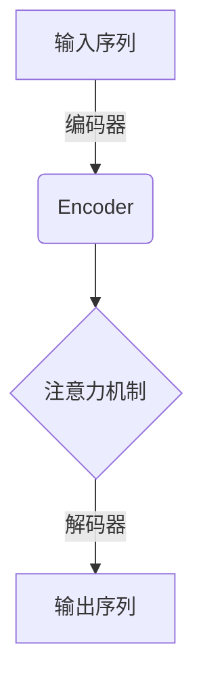

# Transformer在智能客服中的应用

## 1.背景介绍

### 1.1 智能客服的重要性

在当今时代,客户服务是企业与客户之间建立良好关系的关键环节。传统的客服方式往往效率低下,无法满足客户日益增长的需求。因此,智能客服系统应运而生,旨在提供更加高效、个性化和智能化的客户服务体验。

### 1.2 自然语言处理技术的发展

自然语言处理(NLP)技术的不断进步为智能客服系统的发展奠定了坚实的基础。从基于规则的系统,到基于统计的方法,再到当前深度学习的兴起,NLP技术日益强大,能够更好地理解和生成自然语言。

### 1.3 Transformer模型的崛起

2017年,Transformer模型在机器翻译任务中取得了突破性的成果,展现出了其强大的语言建模能力。作为一种全新的基于注意力机制的序列到序列模型,Transformer很快被广泛应用于各种NLP任务中,包括智能客服领域。

## 2.核心概念与联系

### 2.1 Transformer模型架构

Transformer模型由编码器(Encoder)和解码器(Decoder)两个主要部分组成。编码器负责处理输入序列,而解码器则生成相应的输出序列。两者之间通过注意力机制建立联系,实现序列到序列的转换。



### 2.2 多头注意力机制

Transformer模型中的核心创新是多头注意力机制(Multi-Head Attention),它允许模型同时关注输入序列的不同表示,捕捉更加丰富的依赖关系。每个注意力头都学习到输入序列的不同子空间表示,最终将这些表示合并以获得最终的注意力输出。

$$
\text{MultiHead}(Q, K, V) = \text{Concat}(head_1, \dots, head_h)W^O\\
\text{where } head_i = \text{Attention}(QW_i^Q, KW_i^K, VW_i^V)
$$

其中 $Q、K、V$ 分别表示查询(Query)、键(Key)和值(Value)。$W_i^Q、W_i^K、W_i^V$ 是可学习的投影矩阵,用于将 $Q、K、V$ 映射到注意力头的子空间。

### 2.3 位置编码

由于Transformer模型没有使用循环或卷积神经网络来捕获序列的顺序信息,因此引入了位置编码(Positional Encoding)的概念。位置编码将每个词元的位置信息编码到其embedding中,使模型能够根据位置关系建模序列。

### 2.4 层归一化和残差连接

为了加速训练过程并提高模型性能,Transformer采用了层归一化(Layer Normalization)和残差连接(Residual Connection)。层归一化有助于减少内部协变量偏移,而残差连接则允许梯度更好地反向传播,缓解了深度网络的梯度消失问题。

## 3.核心算法原理具体操作步骤  

### 3.1 输入表示

首先,我们需要将输入序列(如客户查询)转换为向量表示。通常使用词嵌入(Word Embeddings)将每个词元映射到一个固定长度的向量空间。然后,将这些词向量与位置编码相加,形成最终的输入表示。

### 3.2 编码器(Encoder)

1. 将输入表示输入到编码器的第一层。
2. 在每一层中,首先进行多头注意力计算,捕获输入序列中词元之间的依赖关系。
3. 将注意力输出与输入相加,得到残差连接。
4. 对残差连接的结果进行层归一化,得到该层的输出。
5. 输出传递到编码器的下一层,重复步骤2-4,直到到达最后一层。
6. 编码器的最后一层输出被视为输入序列的编码表示。

### 3.3 解码器(Decoder)

1. 将目标序列(如客服回复)的起始标记作为初始输入,并将其转换为向量表示。
2. 在每一层中,首先进行掩码多头自注意力,只允许每个位置关注之前的位置。这样可以保留自回归属性,防止编码器"窥视"将来的信息。
3. 将自注意力输出与编码器输出进行多头注意力计算,捕获输入与输出之间的依赖关系。
4. 将两种注意力的输出进行残差连接和层归一化,得到该层的输出。
5. 输出传递到解码器的下一层,重复步骤2-4,直到到达最后一层。
6. 在最后一层,对输出进行线性投影和softmax操作,得到下一个词元的概率分布。
7. 将概率最大的词元作为输出,并将其传递回步骤2,重复该过程,直到生成完整序列或达到最大长度。

## 4.数学模型和公式详细讲解举例说明

### 4.1 注意力计算

注意力机制的核心思想是允许模型动态地为不同的输入分配不同的权重,关注最相关的部分。具体来说,对于一个查询 $q$ 和一组键值对 $(k_i, v_i)$,注意力计算如下:

$$
\begin{aligned}
\text{Attention}(q, K, V) &= \text{softmax}(\frac{qK^T}{\sqrt{d_k}})V\\
&= \sum_{i=1}^n \alpha_i v_i\\
\text{where}\ \alpha_i &= \text{softmax}(\frac{qk_i^T}{\sqrt{d_k}})
\end{aligned}
$$

其中 $d_k$ 是缩放因子,用于防止点积过大导致的梯度饱和。$\alpha_i$ 表示查询 $q$ 对键 $k_i$ 的注意力权重,反映了 $q$ 与 $k_i$ 的相关性。注意力输出是值 $v_i$ 的加权和,其中权重由相应的 $\alpha_i$ 决定。

在多头注意力中,查询、键和值被线性投影到不同的子空间,然后在每个子空间中进行注意力计算。最终,所有头的输出被连接起来,形成最终的注意力输出。

### 4.2 位置编码

位置编码的作用是将序列的位置信息编码到词嵌入中。Transformer使用的是正弦和余弦函数来编码位置信息:

$$
\begin{aligned}
PE_{(pos, 2i)} &= \sin(pos / 10000^{2i / d_{model}})\\
PE_{(pos, 2i+1)} &= \cos(pos / 10000^{2i / d_{model}})
\end{aligned}
$$

其中 $pos$ 是词元的位置, $i$ 是维度的索引, $d_{model}$ 是词嵌入的维度。不同的频率对应于不同的位置,这种编码方式允许模型学习相对位置关系,而不仅仅是绝对位置。

### 4.3 层归一化

层归一化是一种常用的规范化技术,它对输入进行归一化处理,使其均值为0,方差为1。在Transformer中,层归一化被应用于每一层的输入,有助于加速训练收敛并提高模型性能。

$$
\text{LayerNorm}(x) = \gamma \frac{x - \mu}{\sigma} + \beta
$$

其中 $\mu$ 和 $\sigma$ 分别是输入 $x$ 在每个维度上的均值和标准差。$\gamma$ 和 $\beta$ 是可学习的缩放和偏移参数,用于保留模型的表达能力。

## 4.项目实践:代码实例和详细解释说明

以下是使用PyTorch实现Transformer模型进行智能客服的示例代码:

```python
import torch
import torch.nn as nn

class TransformerEncoder(nn.Module):
    def __init__(self, d_model, nhead, num_layers, dropout=0.1):
        super().__init__()
        self.pos_encoder = PositionalEncoding(d_model, dropout)
        encoder_layers = nn.TransformerEncoderLayer(d_model, nhead, dim_feedforward=2048, dropout=dropout)
        self.transformer_encoder = nn.TransformerEncoder(encoder_layers, num_layers)

    def forward(self, src):
        src = self.pos_encoder(src)
        output = self.transformer_encoder(src)
        return output

class TransformerDecoder(nn.Module):
    def __init__(self, d_model, nhead, num_layers, vocab_size, dropout=0.1):
        super().__init__()
        self.pos_decoder = PositionalEncoding(d_model, dropout)
        decoder_layers = nn.TransformerDecoderLayer(d_model, nhead, dim_feedforward=2048, dropout=dropout)
        self.transformer_decoder = nn.TransformerDecoder(decoder_layers, num_layers)
        self.output_layer = nn.Linear(d_model, vocab_size)

    def forward(self, tgt, memory):
        tgt = self.pos_decoder(tgt)
        output = self.transformer_decoder(tgt, memory)
        output = self.output_layer(output)
        return output

class Transformer(nn.Module):
    def __init__(self, src_vocab_size, tgt_vocab_size, d_model=512, nhead=8, num_encoder_layers=6, num_decoder_layers=6, dropout=0.1):
        super().__init__()
        self.encoder = TransformerEncoder(d_model, nhead, num_encoder_layers, dropout)
        self.decoder = TransformerDecoder(d_model, nhead, num_decoder_layers, tgt_vocab_size, dropout)
        self.src_embed = nn.Embedding(src_vocab_size, d_model)
        self.tgt_embed = nn.Embedding(tgt_vocab_size, d_model)

    def forward(self, src, tgt):
        src = self.src_embed(src)
        tgt = self.tgt_embed(tgt)
        memory = self.encoder(src)
        output = self.decoder(tgt, memory)
        return output
```

这个示例实现了Transformer模型的编码器、解码器和完整模型。

- `TransformerEncoder`模块实现了编码器部分,包括位置编码和多层编码器层。
- `TransformerDecoder`模块实现了解码器部分,包括位置编码、多层解码器层和输出线性层。
- `Transformer`模块将编码器和解码器组合在一起,并添加了词嵌入层。

在实际应用中,我们需要将输入序列(如客户查询)传递给编码器,将目标序列(如客服回复)传递给解码器。模型将学习映射输入序列到目标序列的转换关系。

训练过程中,我们可以使用掩码多头自注意力来保留自回归属性,并采用教师强制策略,将真实的目标序列作为解码器的输入。在推理阶段,我们将使用贪婪搜索或束搜索算法来生成回复序列。

## 5.实际应用场景

Transformer模型在智能客服领域有着广泛的应用前景,可以用于以下几个主要场景:

### 5.1 自动问答系统

通过训练大量的问答对,Transformer模型可以学习回答各种客户查询的能力。在实际应用中,客户的问题将被输入到模型中,模型会生成相应的回复,从而实现自动化的问答服务。

### 5.2 意图识别和分类

在许多情况下,客户的查询需要先被正确分类和识别意图,然后再给出相应的回复。Transformer模型可以被训练为意图分类器,根据查询的语义内容将其归类到预定义的意图类别中。

### 5.3 对话管理

智能客服系统通常需要管理整个对话流程,根据上下文状态决定下一步的行为。Transformer模型可以作为对话管理器,学习对话历史和当前状态,并选择合适的回复或执行相应的操作。

### 5.4 多轮对话

在复杂的客户查询中,往往需要进行多轮对话才能解决问题。Transformer模型具有强大的序列建模能力,可以很好地捕获对话历史和上下文信息,从而支持多轮对话交互。

### 5.5 多语种支持

由于Transformer模型的通用性,它可以被训练用于不同语言的客服场景。通过收集和训练多语种的数据集,Transformer模型可以实现跨语言的智能客服服务。

## 6.工具和资源推荐

在实现和部署Transformer模型进行智能客服时,以下工具和资源可能会有所帮助:

### 6.1 开源框架

- **PyTorch**和**TensorFlow**:两个流行的深度学习框架,提供了Transformer模型的实现和相关工具。
- **HuggingFace Transformers**:一个面向Transformer模型的开源库,提供