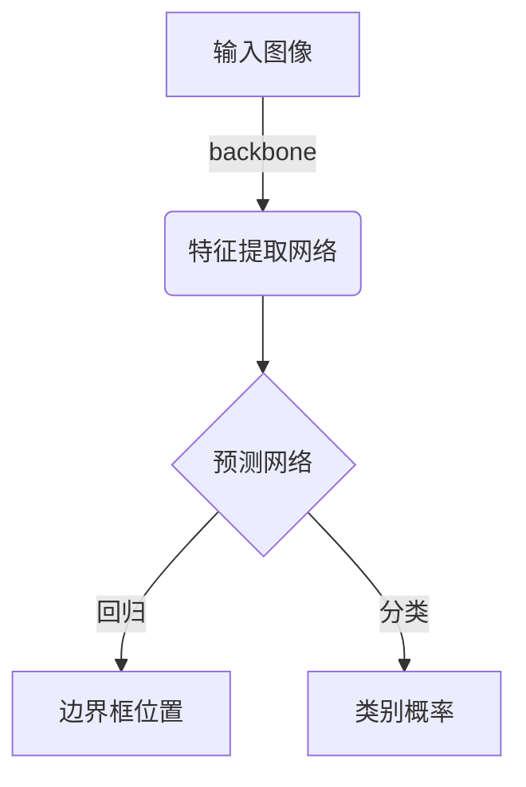

# YOLOv2原理与代码实例讲解

## 1. 背景介绍

### 1.1 目标检测任务概述

目标检测是计算机视觉领域的一个核心任务,旨在从给定的图像或视频中定位并识别出感兴趣的目标物体。它广泛应用于安防监控、自动驾驶、人脸识别等多个领域。目标检测算法需要同时解决目标的分类(识别物体类别)和定位(确定物体在图像中的位置)两个问题。

### 1.2 传统目标检测方法

传统的目标检测算法主要分为两大类:

1. **基于传统图像处理方法**:如基于滑动窗口+手工特征+分类器的方法。这类方法需要人工设计特征,计算复杂度高,难以获得理想的检测精度。

2. **基于深度学习的方法**:利用卷积神经网络自动学习图像特征,取得了很大的进展。根据模型结构不同,可分为两类:
   - **两阶段检测**:如R-CNN系列,先生成候选框,再对候选框进行分类和位置精修。精度较高但速度较慢。
   - **一阶段检测**:如YOLO系列和SSD,将候选框生成和分类回归合并为一个网络,端到端训练,速度较快但精度略低于两阶段方法。

### 1.3 YOLO系列算法概述  

YOLO(You Only Look Once)是一种开创性的一阶段目标检测算法,具有以下特点:

- 将目标检测任务看作一个回归问题,直接从图像像素回归出边界框位置和类别概率
- 使用整张图像作为网络的输入,通过全卷积网络进行端到端预测
- 预测速度极快,实时性能好,但精度略低于两阶段检测器

YOLOv2是在YOLOv1的基础上进行改进的版本,在保持快速的同时,极大提升了检测精度,是目标检测领域里程碑式的工作。

## 2. 核心概念与联系

### 2.1 网络架构

YOLOv2的网络架构借鉴了GoogleNet的Inception模块和ResNet的残差连接,整体分为backbone网络和预测网络两部分:



backbone网络用于从输入图像提取特征图,预测网络则在特征图上进行密集采样,对每个采样区域同时预测其中的目标边界框位置和类别概率。

### 2.2 锚框机制

YOLOv2采用了锚框(anchor box)机制,即预先设定一组先验边界框尺寸,在预测时对每个采样区域预测锚框相对于该区域的偏移量和置信度。这种方式简化了预测目标,提高了精度。

锚框尺寸的设计是关键,YOLOv2采用k-means聚类算法从训练集中自动学习得到合适的锚框尺寸。

### 2.3 预测张量

YOLOv2将整个输入图像均匀划分为S×S个网格,每个网格单元预测B个边界框,每个边界框对应以下信息:

- 边界框位置信息(tx,ty,tw,th)
- 边界框置信度得分(confidence score)  
- 条件类别概率(conditional class probabilities)

因此,YOLOv2的最终预测张量维度为S×S×(B×5+C),其中B是预设锚框数,C是类别数。

## 3. 核心算法原理具体操作步骤 

### 3.1 网格单元负责检测目标

YOLOv2将整个输入图像划分为S×S个网格单元,每个单元负责预测其区域内的目标物体。具体步骤如下:

1. 对每个ground truth边界框,将其分配给一个网格单元,使得该边界框的中心落在该单元内。
2. 每个单元只检测其区域内的目标,不关心其它单元的目标。
3. 如果一个单元内存在多个ground truth目标,则只让该单元预测一个目标。

通过这种划分,YOLOv2简化了目标检测任务,将其转化为每个单元预测目标位置和类别概率的回归问题。

### 3.2 锚框预测

每个网格单元会预测B个锚框(anchor box),锚框用于预测目标的边界框位置。具体步骤如下:

1. 预先设定一组锚框尺寸(宽高比),如{1,2,3,1/2,1/3}。
2. 对每个锚框,预测其相对于网格单元的x,y偏移量和宽高比tw,th。
3. 将预测的偏移量和锚框尺寸结合,即可得到最终预测的边界框坐标。

此外,对每个锚框还会预测一个置信度得分,用于衡量锚框内是否存在目标以及边界框的准确性。

### 3.3 分类预测

除了预测边界框位置和置信度,每个锚框还需要预测条件类别概率,即假设锚框内存在目标时,目标属于每个类别的概率值。

最终的类别概率由置信度和条件类别概率的乘积计算得到。

### 3.4 损失函数

YOLOv2的损失函数包括三部分:边界框坐标损失、置信度损失和分类损失,可表示为:

$$
\begin{aligned}
\lambda_{\text {coord}} \sum_{i=0}^{S^{2}} \sum_{j=0}^{B} \mathbb{1}_{i j}^{\text {obj}}\left[\left(x_{i}-\hat{x}_{i}\right)^{2}+\left(y_{i}-\hat{y}_{i}\right)^{2}\right] \\
+\lambda_{\text {coord}} \sum_{i=0}^{S^{2}} \sum_{j=0}^{B} \mathbb{1}_{i j}^{\text {obj}}\left[\left(\sqrt{w_{i}}-\sqrt{\hat{w}_{i}}\right)^{2}+\left(\sqrt{h_{i}}-\sqrt{\hat{h}_{i}}\right)^{2}\right] \\
+\sum_{i=0}^{S^{2}} \sum_{j=0}^{B} \mathbb{1}_{i j}^{\text {obj}}\left(C_{i}-\hat{C}_{i}\right)^{2} \\
+\lambda_{\text {noobj}} \sum_{i=0}^{S^{2}} \sum_{j=0}^{B} \mathbb{1}_{i j}^{\text {noobj}}\left(C_{i}-\hat{C}_{i}\right)^{2} \\
+\sum_{i=0}^{S^{2}} \mathbb{1}_{i}^{\text {obj}} \sum_{c \in \text {classes}}\left(p_{i}(c)-\hat{p}_{i}(c)\right)^{2}
\end{aligned}
$$

其中:
- $\lambda_{coord}$和$\lambda_{noobj}$是超参数,平衡不同损失项的权重
- $\mathbb{1}_{i}^{text{obj}}$表示第i个单元是否存在目标
- $x,y,w,h$表示预测的边界框坐标和宽高
- $C_i$表示预测的置信度得分
- $p_i(c)$表示第i个单元预测的类别c的概率

### 3.5 非极大值抑制

YOLOv2在预测时会对同一目标产生多个边界框,需要使用非极大值抑制(NMS)算法去除冗余框。步骤如下:

1. 设置一个阈值(如0.5),去除置信度低于该阈值的边界框。
2. 对剩余边界框按置信度从高到低排序。
3. 选取置信度最高的边界框,计算其与其它框的IoU。
4. 删除与当前框的IoU超过阈值(如0.5)的框。
5. 重复3-4步,直至所有框遍历完毕。

通过NMS,可以保留置信度最高的、不重叠的一组边界框作为最终预测结果。

## 4. 数学模型和公式详细讲解举例说明

### 4.1 锚框预测公式

每个锚框需要预测以下4个值,用于计算最终的边界框位置:

- $t_x$和$t_y$:边界框中心相对于网格单元左上角的x,y偏移量
- $t_w$和$t_h$:边界框宽高相对于锚框宽高的比例

具体公式为:

$$
\begin{aligned}
b_x &= \sigma(t_x) + c_x  \\
b_y &= \sigma(t_y) + c_y \\
b_w &= p_w e^{t_w} \\
b_h &= p_h e^{t_h}
\end{aligned}
$$

其中:
- $(c_x, c_y)$是当前网格单元的左上角坐标
- $(p_w, p_h)$是当前锚框的宽高
- $\sigma$是sigmoid函数,将$t_x$和$t_y$的值限制在[0,1]范围内

通过这种方式,模型只需要预测较小的值$t_x,t_y,t_w,t_h$,即可获得最终的精确边界框坐标$(b_x, b_y, b_w, b_h)$。

### 4.2 置信度得分计算

每个锚框需要预测一个置信度得分,表示锚框内存在目标的置信程度。它由两部分组成:

$$
\text{Confidence} = \text{Pr(Object)} \times \text{IOU}_{pred}^{truth}
$$

- $\text{Pr(Object)}$表示锚框内是否存在目标的概率,由模型直接预测。
- $\text{IOU}_{pred}^{truth}$表示预测框与最近的ground truth框之间的交并比(IoU)。

只有当锚框内确实存在目标,且预测框与实际框足够重叠时,置信度得分才会接近1。这种方式可以同时惩罚定位错误和分类错误。

### 4.3 条件类别概率

对于每个锚框,模型还需要预测条件类别概率,即假设锚框内存在目标时,目标属于每个类别的概率值:

$$
\text{Pr}(\text{Class}_i | \text{Object}) = p_i
$$

其中$p_i$是模型直接预测的输出,且$\sum_i p_i = 1$。

最终的类别概率由置信度和条件类别概率的乘积计算得到:

$$
\text{Pr}(\text{Class}_i) = \text{Pr}(\text{Object}) \times \text{Pr}(Class_i | Object) = \text{Confidence} \times p_i
$$

## 4. 项目实践:代码实例和详细解释说明

以下是使用PyTorch实现YOLOv2目标检测的简化代码示例,包含模型定义、损失函数计算和预测过程。

### 4.1 模型定义

```python
import torch
import torch.nn as nn

# 定义锚框
anchors = [(1.3221, 1.73145), (3.19275, 4.00944), (5.05587, 8.09892), (9.47112, 4.84053), (11.2364, 10.0071)]  

# YOLOv2模型
class YOLOv2(nn.Module):
    def __init__(self, num_classes=20, num_anchors=5):
        super(YOLOv2, self).__init__()
        ...  # 定义backbone和预测网络
        
    def forward(self, x):
        ...  # backbone提取特征
        output = self.pred_net(features)  # 预测网络输出
        
        # 解析预测张量
        batch_size = output.size(0)
        grid_size = output.size(2)
        
        # [batch, anchors, grid, grid, 6]
        prediction = (
            output.view(batch_size, self.num_anchors, self.num_classes + 5, grid_size, grid_size)
            .permute(0, 1, 3, 4, 2)
            .contiguous()
        )
        
        # 获取边界框位置、置信度和类别概率
        x = torch.sigmoid(prediction[..., 0])  # 中心x偏移
        y = torch.sigmoid(prediction[..., 1])  # 中心y偏移
        w = prediction[..., 2]  # 宽度
        h = prediction[..., 3]  # 高度
        conf = torch.sigmoid(prediction[..., 4])  # 置信度
        cls_pred = torch.sigmoid(prediction[..., 5:])  # 类别概率
        
        # 根据锚框计算边界框坐标
        pred_boxes = get_boxes(x, y, w, h, anchors, grid_size)
        
        output = torch.cat(
            (
                pred_boxes.view(batch_size, -1, 4),
                conf.view(batch_size, -1, 1),
                cls_pred.view(batch_size, -