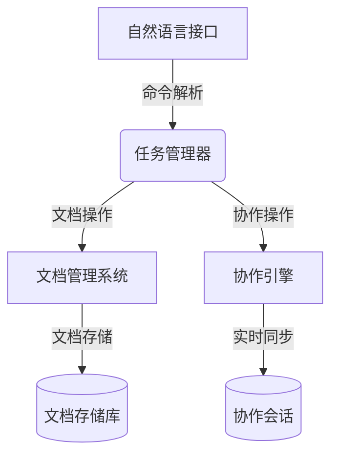
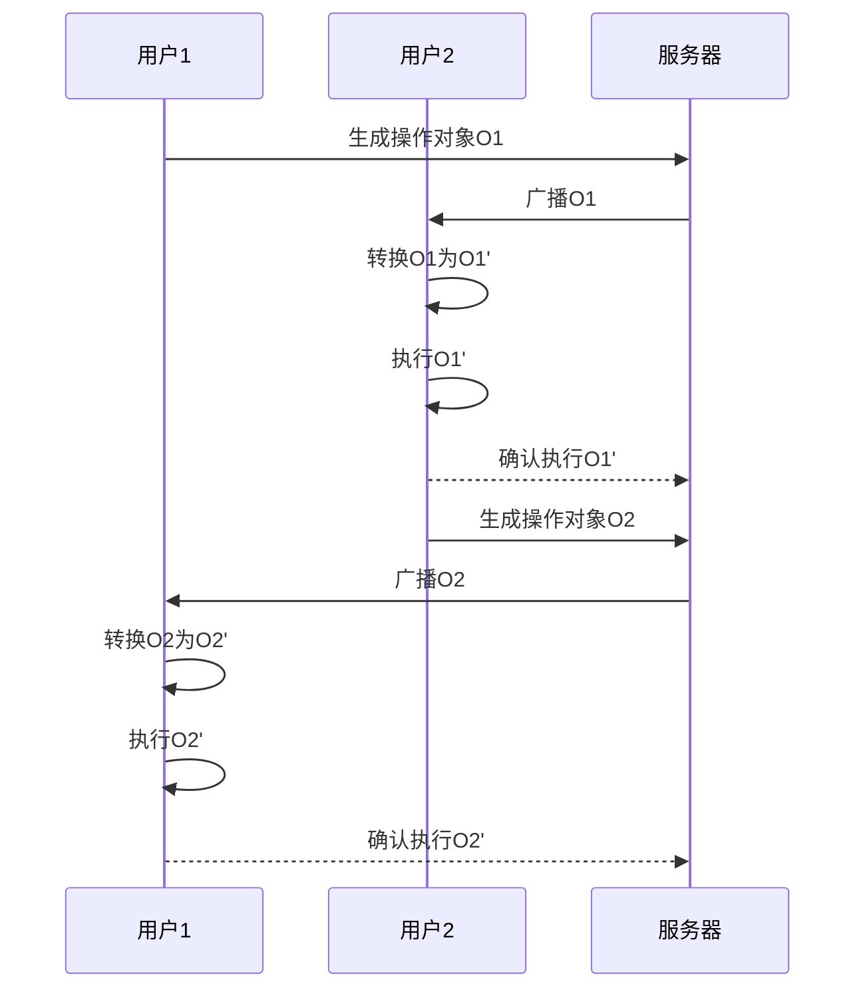

# 协作编辑:在LLM操作系统中实时共享和编辑API文档

## 1.背景介绍

### 1.1 API文档的重要性

在当今快节奏的软件开发环境中,API(应用程序编程接口)扮演着至关重要的角色。它们为不同的软件组件提供了一种标准化的通信方式,使得复杂系统能够无缝集成。然而,随着系统复杂性的增加,API文档的维护和管理也变得越来越具有挑战性。传统的静态文档不仅难以跟上快速迭代的步伐,而且在协作编辑方面也存在诸多限制。

### 1.2 实时协作编辑的需求

在大型软件项目中,API文档通常由多个开发人员共同维护。然而,在传统的工作流程中,开发人员需要在本地编辑文档,然后将更改推送到共享存储库。这种方式不仅效率低下,而且容易导致冲突和版本控制问题。实时协作编辑能够解决这些痛点,使得多个开发人员可以同时编辑相同的文档,实时查看彼此的更改,从而提高工作效率和协作质量。

### 1.3 LLM操作系统的优势

LLM(大型语言模型)操作系统是一种新兴的计算范式,它利用了强大的自然语言处理能力来简化人机交互。在这种环境下,开发人员可以使用自然语言命令来管理和操作系统资源,包括文件、进程和其他系统组件。LLM操作系统为实时协作编辑API文档提供了一个理想的平台,因为它能够无缝地集成自然语言交互和文档编辑功能。

## 2.核心概念与联系

### 2.1 LLM操作系统架构

LLM操作系统的核心架构包括以下几个关键组件:

1. **自然语言接口(NLI)**: 负责解析用户的自然语言命令,并将其转换为系统可执行的指令。
2. **任务管理器**: 根据NLI的输出,协调和调度不同的系统资源和服务。
3. **文档管理系统**: 专门负责管理和存储API文档,支持版本控制、协作编辑等功能。
4. **协作引擎**: 实现实时协作编辑的核心组件,负责同步多个用户的编辑操作,并实时反映文档的变化。

这些组件通过紧密集成,形成了一个高效的协作编辑环境。

### 2.2 实时协作编辑的关键技术

实现实时协作编辑API文档需要解决以下几个关键技术挑战:

1. **操作转换(OT)**: 用于同步多个用户的并发编辑操作,确保每个用户都能看到最新的文档状态。
2. **版本控制**: 跟踪文档的历史版本,支持回滚和比较功能。
3. **冲突解决**: 在多个用户同时编辑同一部分内容时,需要有效地解决潜在的冲突。
4. **权限管理**: 控制不同用户对文档的访问和编辑权限。
5. **实时通信**: 建立高效的实时通信机制,以确保编辑操作能够及时同步到所有协作者。

## 3.核心算法原理具体操作步骤

### 3.1 操作转换(OT)算法

操作转换(OT)算法是实现实时协作编辑的核心算法之一。它的主要目标是确保多个用户的并发编辑操作能够正确地合并,而不会导致数据丢失或不一致。

OT算法的基本思想是将每个编辑操作表示为一个操作对象,包含操作类型(插入、删除等)、位置和内容等信息。当多个用户同时进行编辑时,每个操作对象都会被广播到所有协作者,并根据一定的规则进行转换和合并。

以下是OT算法的具体步骤:

1. **生成操作对象**: 当用户进行编辑时,将编辑操作转换为一个操作对象,包含操作类型、位置、内容等信息。

2. **广播操作对象**: 将操作对象广播到所有协作者。

3. **操作转换**: 每个协作者根据已经执行的操作历史,对接收到的操作对象进行转换,以确保操作的正确性和一致性。

   - 插入操作: 如果接收到的操作对象与已执行的操作没有冲突,则直接执行该操作。如果有冲突,则需要调整插入位置。
   - 删除操作: 如果接收到的操作对象与已执行的操作没有冲突,则直接执行该操作。如果有冲突,则需要调整删除范围。

4. **合并操作**: 将转换后的操作对象合并到本地文档状态中。

5. **发送确认**: 向其他协作者发送操作执行确认,以便同步操作历史。

通过这种方式,OT算法能够保证多个用户的编辑操作都能够正确地合并,实现真正的实时协作编辑。

### 3.2 版本控制

在实时协作编辑API文档的过程中,版本控制是一个非常重要的功能。它允许开发人员跟踪文档的历史变更,回滚到之前的版本,或者比较不同版本之间的差异。

版本控制系统通常采用以下步骤来管理文档的版本:

1. **初始化版本库**: 创建一个新的版本库,用于存储文档的所有历史版本。

2. **提交新版本**: 每当文档发生变更时,都会创建一个新的版本快照,并将其提交到版本库中。每个版本都会记录提交时间、提交者以及变更内容的摘要。

3. **查看版本历史**: 开发人员可以查看文档的完整版本历史,包括每个版本的提交时间、提交者和变更摘要。

4. **切换版本**: 开发人员可以切换到任意一个历史版本,查看该版本下的文档内容。

5. **比较版本差异**: 开发人员可以比较任意两个版本之间的差异,方便跟踪变更内容。

6. **合并版本**: 如果多个开发人员同时编辑不同的版本,版本控制系统可以帮助自动或手动合并这些版本,解决潜在的冲突。

常见的版本控制系统包括Git、Subversion等。在LLM操作系统中,版本控制系统可以与协作引擎紧密集成,实现无缝的版本管理和协作编辑体验。

### 3.3 冲突解决

在多人实时协作编辑API文档的过程中,冲突是不可避免的。当两个或多个用户同时编辑同一部分内容时,就会产生冲突。有效地解决冲突对于保证文档的一致性和完整性至关重要。

LLM操作系统中的协作引擎通常采用以下策略来解决冲突:

1. **自动合并**: 对于一些简单的冲突,协作引擎可以自动合并不同用户的编辑操作,而不需要人工干预。例如,如果两个用户分别在不同位置插入了新内容,协作引擎可以将这两个操作合并到文档中。

2. **手动解决**: 对于复杂的冲突,协作引擎会提示用户手动解决。在这种情况下,协作引擎会显示出现冲突的位置,以及每个用户的编辑内容。用户需要手动选择保留哪一部分内容,或者进行其他必要的修改。

3. **版本分支**: 在某些情况下,协作引擎可能会创建一个新的版本分支,允许不同的用户在各自的分支上独立编辑,直到冲突得到解决。之后,这些分支可以合并回主干。

4. **权限管理**: 协作引擎可以根据用户的权限级别,限制某些用户对特定部分内容的编辑权限,从而减少潜在的冲突。

无论采用何种策略,协作引擎都应该提供清晰的冲突提示和解决界面,以确保用户能够高效地解决冲突,并最大程度地减少数据丢失或不一致的风险。

### 3.4 权限管理

在大型软件项目中,API文档通常由多个开发人员共同维护。为了确保文档的安全性和完整性,需要实现严格的权限管理机制。

LLM操作系统中的权限管理系统通常包括以下几个关键组件:

1. **用户认证**: 确保只有经过认证的用户才能访问和编辑API文档。常见的认证方式包括用户名/密码、双因素认证等。

2. **角色和权限模型**: 定义不同的用户角色,并为每个角色分配适当的权限。例如,管理员角色可能拥有完全的读写权限,而普通用户角色可能只有读取和编辑特定部分内容的权限。

3. **访问控制列表(ACL)**: 为每个文档或文档部分维护一个访问控制列表,列出具有相应权限的用户或用户组。

4. **权限继承**: 实现权限继承机制,使得子文档或子目录自动继承父级目录的权限设置。

5. **权限审计**: 记录所有与权限相关的操作,以便进行审计和追踪。

在实现权限管理系统时,需要权衡安全性和易用性之间的平衡。过于严格的权限控制可能会影响协作效率,而过于宽松的权限又可能带来安全风险。因此,权限管理系统应该提供灵活的配置选项,以满足不同项目的具体需求。

## 4.数学模型和公式详细讲解举例说明

在实现实时协作编辑API文档的过程中,有一些数学模型和公式可以帮助我们更好地理解和优化相关算法。

### 4.1 操作转换(OT)模型

操作转换(OT)算法是实现实时协作编辑的核心算法之一。它的主要目标是确保多个用户的并发编辑操作能够正确地合并,而不会导致数据丢失或不一致。

我们可以使用一个简单的数学模型来表示OT算法的工作原理。假设有两个用户A和B,他们同时对一个文档进行编辑。我们用$O_A$和$O_B$分别表示A和B的编辑操作,用$D$表示文档的初始状态。

当A和B的操作发生冲突时,我们需要将它们转换为$O_A'$和$O_B'$,以确保操作的正确性和一致性。转换函数可以表示为:

$$
O_A' = OT(O_A, O_B, D)\\
O_B' = OT(O_B, O_A, D)
$$

其中,OT是一个特殊的转换函数,它根据操作的类型(插入、删除等)和位置,对操作进行适当的调整。

转换后的操作$O_A'$和$O_B'$可以安全地应用到文档中,得到新的文档状态$D'$:

$$
D' = D \circ O_A' \circ O_B'
$$

其中,$\circ$表示操作的合并运算。

通过这种方式,OT算法能够保证多个用户的编辑操作都能够正确地合并,实现真正的实时协作编辑。

### 4.2 版本控制模型

在版本控制系统中,我们可以使用有向无环图(DAG)来表示文档的版本历史。每个节点代表一个版本,边表示版本之间的演化关系。

假设有一个初始版本$V_0$,经过多次提交后,产生