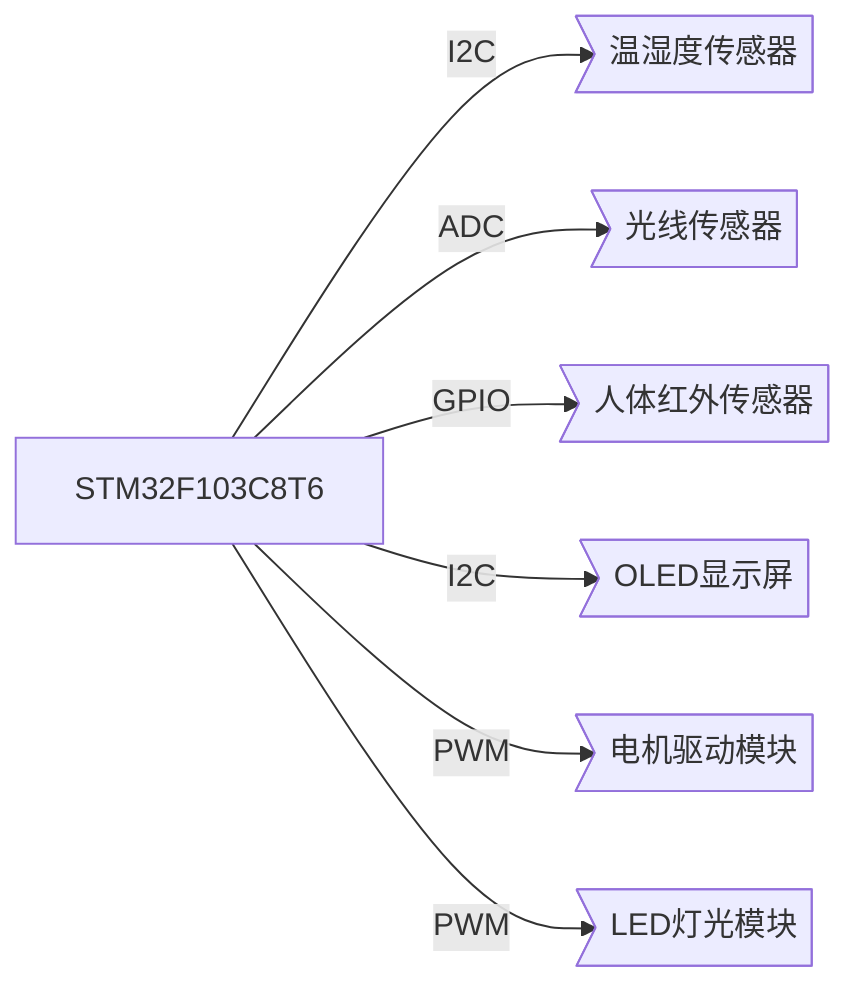
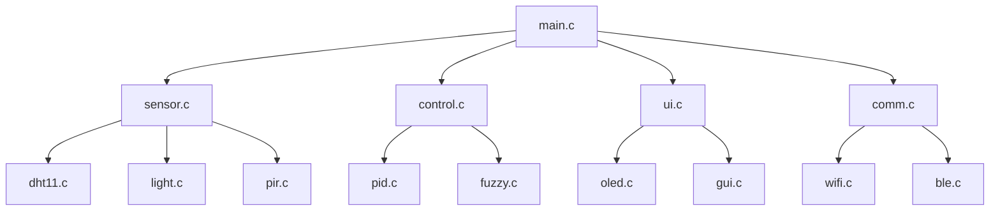

# 基于STM32智能书桌设计与实现

## 1. 背景介绍

### 1.1 智能书桌的概念

智能书桌是一种融合了计算机技术、电子技术和机械技术的创新产品,旨在为用户提供一个智能化、人性化的工作和学习环境。它不仅具备传统书桌的功能,还集成了各种智能化功能,如环境监测、自动调节、远程控制等,从而提高工作效率和舒适度。

### 1.2 智能书桌的发展历程

智能书桌的概念最早可追溯到20世纪90年代,当时一些科技公司和研究机构开始探索将计算机技术与办公桌相结合。随着物联网、人工智能等技术的不断发展,智能书桌也逐渐演进,功能日益丰富。

### 1.3 智能书桌的应用前景

智能书桌有望广泛应用于办公室、学校、家庭等场所,为用户带来更加舒适、高效的工作和学习体验。随着人们对智能化生活方式的需求不断增长,智能书桌市场前景广阔。

## 2. 核心概念与联系

### 2.1 嵌入式系统

嵌入式系统是一种专门为特定应用而设计的计算机系统,通常由微控制器或微处理器、存储器、外围设备等组成。智能书桌的核心控制单元就是一个嵌入式系统,负责执行各种智能化功能。

### 2.2 传感器技术

传感器是智能书桌实现环境监测和自动调节的关键。常见的传感器包括温湿度传感器、光线传感器、运动传感器等,用于采集环境数据。

### 2.3 actuator执行器技术

执行器是智能书桌实现自动调节的关键部件,如电机、伺服系统等,用于控制桌面高度、灯光亮度等。

### 2.4 人机交互技术

人机交互技术让用户能够方便地与智能书桌进行交互,如触摸屏、语音控制、手势控制等。

### 2.5 网络通信技术

网络通信技术使智能书桌能够与其他设备或云端服务器进行数据交换,实现远程控制、数据共享等功能。

## 3. 核心算法原理具体操作步骤

### 3.1 数据采集算法

智能书桌需要持续采集环境数据,如温湿度、光线强度等。常见的数据采集算法包括:

1. **周期采样算法**: 按固定的时间间隔采集数据,适用于对实时性要求不高的场景。
2. **中断驱动采样算法**: 利用硬件中断,在数据发生变化时立即采集,适用于对实时性要求较高的场景。
3. **滤波算法**: 对采集的原始数据进行滤波处理,去除噪声干扰,提高数据质量。

算法实现步骤:

1. 初始化传感器及相关硬件;
2. 设置采样周期或中断触发条件;
3. 循环执行:
   - 读取传感器数据
   - 对数据进行滤波处理
   - 存储或发送处理后的数据
4. 错误处理及异常检测

### 3.2 控制算法

根据采集的环境数据,智能书桌需要对执行器(如电机、灯光等)进行控制,以实现自动调节。常见的控制算法包括:

1. **PID控制算法**: 根据当前值与目标值的偏差,计算出控制量,广泛应用于温度、光线等连续控制场景。
2. **模糊控制算法**: 基于模糊逻辑理论,对非线性、不确定的控制对象进行控制,适用于难以建立精确数学模型的场景。
3. **开环控制算法**: 不考虑反馈,直接根据预设的控制规则输出控制量,适用于对控制精度要求不高的场景。

算法实现步骤:

1. 获取控制目标值(如理想温度、光线强度等);
2. 获取当前环境数据;
3. 根据控制算法计算控制量;
4. 控制执行器(如调节电机转速、改变灯光亮度等);
5. 错误处理及异常检测。

### 3.3 人机交互算法

为了提供良好的用户体验,智能书桌需要实现友好的人机交互界面和交互方式。常见的人机交互算法包括:

1. **图形用户界面(GUI)算法**: 渲染图形界面元素,响应用户输入事件。
2. **语音识别算法**: 将用户语音转换为文本命令,如识别"打开台灯"等指令。
3. **手势识别算法**: 通过图像处理,识别用户的手势动作,如"上下滑动"调节桌面高度。

算法实现步骤:

1. 初始化人机交互硬件(如触摸屏、麦克风、摄像头等);
2. 加载GUI资源,注册事件回调函数;
3. 循环执行:
   - 渲染GUI界面
   - 获取用户输入(触摸、语音、手势等)
   - 对用户输入进行识别和解析
   - 执行相应的控制命令
4. 错误处理及异常检测

## 4. 数学模型和公式详细讲解举例说明

### 4.1 PID控制算法

PID(Proportion-Integral-Derivative)控制算法是一种广泛应用的反馈控制算法,常用于温度、光线等连续控制场景。它的数学模型如下:

$$u(t) = K_p e(t) + K_i \int_0^t e(t)dt + K_d \frac{de(t)}{dt}$$

其中:
- $u(t)$是控制器的输出,即控制量
- $e(t)$是当前值与目标值的偏差
- $K_p$是比例系数
- $K_i$是积分系数
- $K_d$是微分系数

比例项$K_p e(t)$根据当前偏差调节输出,可以提高系统响应速度;积分项$K_i \int_0^t e(t)dt$累计历史偏差,可以消除静态误差;微分项$K_d \frac{de(t)}{dt}$根据偏差变化率调节输出,可以抑制超调。

通过调节$K_p$、$K_i$、$K_d$三个参数,可以获得较好的动态性能和稳态性能。参数整定方法有很多,如陡降曲线法、紧凑性原理法等。

以温度控制为例,假设目标温度为25℃,当前温度为20℃,则偏差$e(t)=25-20=5$。如果$K_p=2$、$K_i=0.1$、$K_d=0.5$,则控制量为:

$$u(t)=2\times5+0.1\times\int_0^t 5dt+0.5\times0=10+0.25t$$

即需要不断增大加热功率,直至温度达到25℃并保持稳定。

### 4.2 图像处理算法

手势识别常需要对摄像头采集的图像进行处理,以提取手部特征。一种常见的图像处理算法是皮肤颜色检测算法,用于分割出手部区域。

在RGB颜色空间中,人种皮肤颜色大致分布在一个特定范围内。设图像像素点的RGB值为$(R, G, B)$,则判断其是否为皮肤颜色的判据可以为:

$$\begin{aligned}
R > 95 \quad\& \quad G > 40 \quad\& \quad B > 20 \\
\max\{R, G, B\} - \min\{R, G, B\} > 15 \\  
|R - G| > 15 \quad\& \quad R > G \quad\& \quad R > B
\end{aligned}$$

满足上述条件的像素点即可判定为皮肤颜色。通过对图像中所有像素点执行该算法,可以获得二值化的皮肤区域图像,为后续的手势识别奠定基础。

该算法的优点是计算简单、速度快,但也存在一定局限性,如对特殊肤色的识别效果不佳。在实际应用中,还需要结合其他算法(如边缘检测等)来提高手势识别的准确性。

## 5. 项目实践:代码实例和详细解释说明

本节将给出一个基于STM32F103C8T6微控制器的智能书桌项目实例,并对关键代码进行解释说明。

### 5.1 硬件连接

智能书桌硬件连接示意图如下:



其中:

- 温湿度传感器(DHT11)通过I2C接口与MCU连接,用于采集温湿度数据。
- 光线传感器(光敏电阻)通过ADC接口与MCU连接,用于采集光线强度数据。
- 人体红外传感器(PIR)通过GPIO接口与MCU连接,用于检测是否有人在桌前。
- OLED显示屏通过I2C接口与MCU连接,用于显示环境数据和状态信息。
- 电机驱动模块通过PWM接口与MCU连接,用于控制桌面升降。
- LED灯光模块通过PWM接口与MCU连接,用于控制环境光线亮度。

### 5.2 软件框架

智能书桌软件采用模块化设计,主要包括以下模块:



- `main.c`: 主程序入口,初始化各模块,创建任务调度。
- `sensor.c`: 传感器驱动模块,包括温湿度、光线、人体检测等传感器的初始化和数据读取函数。
- `control.c`: 控制算法模块,包括PID控制、模糊控制等算法的实现。
- `ui.c`: 用户界面模块,包括OLED显示、GUI渲染、事件处理等功能。
- `comm.c`: 通信模块,包括WiFi和蓝牙的初始化和数据收发函数,用于远程控制和数据共享。

### 5.3 关键代码解释

#### 5.3.1 温湿度传感器读取

```c
// dht11.c
#include "dht11.h"

uint8_t DHT11_ReadData(uint8_t *temp, uint8_t *humi)
{
    // 启动DHT11传感器
    ...

    // 读取温湿度数据
    for(int i=0; i<40; i++)
    {
        // 读取每一位数据
        ...
    }

    // 校验读取的数据
    uint8_t sum = ...;
    if(sum != data[4])
        return DHT11_ERROR;

    // 解析温湿度数据
    *humi = data[0] + data[1] * 0.1;
    *temp = data[2] + data[3] * 0.1;

    return DHT11_OK;
}
```

该函数首先启动DHT11传感器,然后按照DHT11通信协议,逐位读取40位原始数据。读取完成后,进行校验和检查,防止读取错误。最后,解析出温度和湿度的实际值。

#### 5.3.2 PID控制算法

```c
// pid.c
#include "pid.h"

void PID_Init(PID_TypeDef *pid, float kp, float ki, float kd)
{
    pid->kp = kp;
    pid->ki = ki;
    pid->kd = kd;
    pid->err_sum = 0;
    pid->last_err = 0;
}

float PID_Calc(PID_TypeDef *pid, float target, float current)
{
    float err = target - current;
    float p_out = pid->kp * err;
    pid->err_sum += err;
    float i_out = pid->ki * pid->err_sum;
    float d_out = pid->kd * (err -