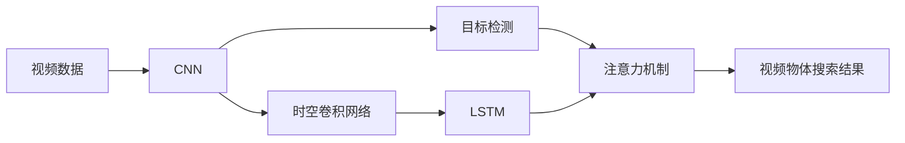

# 基于深度学习的视频中物体快速搜索算法

作者：禅与计算机程序设计艺术

## 1. 背景介绍

### 1.1 视频数据爆炸式增长带来的挑战

随着互联网技术的飞速发展,视频数据呈现爆炸式增长的趋势。据统计,全球每分钟就有数百小时的视频内容被上传到各大视频网站。面对如此海量的视频数据,如何高效地检索和分析视频中的目标物体,已经成为一个亟待解决的难题。

### 1.2 传统视频分析方法的局限性

传统的视频分析方法主要包括:

- 基于关键帧的分析:从视频中提取关键帧,然后对关键帧进行分析。这种方法忽略了视频的时序信息,无法准确定位目标物体。
- 基于运动特征的分析:通过提取视频中物体的运动轨迹进行分析。但是这种方法对背景复杂、遮挡严重的视频效果不佳。
- 基于人工标注的分析:由人工对视频进行标注,然后基于标注信息进行分析。显然,这种方法耗时耗力,无法应对海量视频数据。

### 1.3 深度学习在视频分析中的优势

近年来,深度学习技术取得了突破性进展,在图像分类、目标检测、语义分割等任务上达到甚至超越人类的水平。将深度学习应用到视频分析领域,有望克服传统方法的局限性,实现高效、准确的视频物体搜索。

深度学习具有以下优势:

- 强大的特征学习能力:通过端到端的训练,深度学习模型可以自动学习到视频中的高层语义特征,无需人工设计复杂的特征。
- 优秀的泛化性能:深度学习模型可以很好地适应不同场景、不同物体类别,具有很强的泛化能力。
- 高效的并行计算:深度学习充分利用GPU等硬件进行并行计算,速度远超传统机器学习方法。

## 2. 核心概念与联系

在基于深度学习的视频物体搜索算法中,有几个核心概念需要理解:

### 2.1 卷积神经网络(CNN)

卷积神经网络是一种高效的图像特征提取模型,通过逐层卷积和池化操作,可以自动学习到图像中的层次化特征。典型的CNN网络包括AlexNet、VGGNet、GoogLeNet、ResNet等。

### 2.2 目标检测

目标检测旨在从图像中定位并识别出感兴趣的目标物体。主流的目标检测算法有两阶段检测器(如R-CNN系列)和一阶段检测器(如YOLO、SSD)。前者先产生候选区域,再对候选区域进行分类;后者直接在整张图上进行预测。

### 2.3 时空卷积网络

传统CNN只能提取空间特征,忽略了视频的时序信息。时空卷积网络在CNN的基础上增加时间维度,通过3D卷积或(2+1)D卷积等方式,可以同时建模视频的空间和时间特征。代表性的时空卷积网络有C3D、I3D、P3D等。

### 2.4 长短时记忆网络(LSTM)

视频是一个时序数据,前后帧之间存在一定的关联。为了建模视频的长时依赖,可以使用LSTM等循环神经网络。LSTM通过门控机制,可以有选择地保留或遗忘之前的状态,从而更好地建模视频的时序特征。

### 2.5 注意力机制

并非视频的每一帧、每个区域都是同等重要的。注意力机制通过学习一个权重分布,可以自动关注视频中的关键帧或关键区域,抑制背景干扰,提升物体搜索的精度。常见的注意力机制有Soft Attention和Hard Attention。

下图展示了这些核心概念之间的联系:



## 3. 核心算法原理与具体操作步骤

本节介绍一种基于深度学习的视频物体快速搜索算法,该算法结合了时空卷积网络、LSTM和注意力机制,可以高效准确地从视频中检索目标物体。算法的整体流程如下:

### 3.1 视频预处理

- 步骤1:将输入视频划分为固定长度(如16帧)的视频片段
- 步骤2:从每个视频片段中间均匀采样N帧(如8帧)作为代表帧
- 步骤3:对每一帧图像进行归一化,调整为固定尺寸(如224x224)

### 3.2 特征提取

- 步骤1:将采样帧输入预训练的CNN(如ResNet-50)进行特征提取
- 步骤2:取CNN最后一层卷积特征图,形状为(N, C, H, W) 
- 步骤3:通过自适应池化将特征图缩放为固定大小(N, C, H', W'),这里H'和W'远小于H和W

### 3.3 时空建模

- 步骤1:将特征图重塑为(N, C, H'xW'),即将空间维度压缩为一维
- 步骤2:将变换后的特征序列输入LSTM,建模视频片段的时序特征
- 步骤3:取LSTM最后一个时间步的隐藏状态作为整个片段的特征表示,记为v

### 3.4 注意力权重计算

- 步骤1:将LSTM的隐藏状态v通过全连接层映射为查询向量q
- 步骤2:将每一帧的CNN特征gi通过全连接层映射为键向量ki
- 步骤3:计算查询q和每一帧键ki的注意力权重: $a_i=\frac{exp(q \cdot k_i)}{\sum_j exp(q \cdot k_j)}$

### 3.5 物体搜索

- 步骤1:利用注意力权重a对每一帧CNN特征gi进行加权求和,得到视频片段的聚合特征f
- 步骤2:将聚合特征f输入预训练的目标检测器(如Faster R-CNN),检测目标物体
- 步骤3:对每个视频片段的检测结果进行后处理(如NMS),得到最终的物体搜索结果

## 4. 数学模型与公式详解

### 4.1 卷积操作

对于输入张量 $X \in R^{C \times H \times W}$,卷积核 $W \in R^{D \times C \times k \times k}$,卷积操作定义为:

$$Y_{d,i,j} = \sum_{c=1}^C \sum_{m=1}^k \sum_{n=1}^k W_{d,c,m,n} \cdot X_{c,i+m-1,j+n-1}$$

其中,$Y \in R^{D \times H' \times W'}$为输出张量,$k$为卷积核大小,padding=0,stride=1。

### 4.2 LSTM更新公式

设$x_t$为t时刻LSTM的输入,$h_t$为t时刻LSTM的隐藏状态,$c_t$为t时刻LSTM的细胞状态,LSTM的更新公式为:

$$
\begin{aligned}
f_t &= \sigma(W_f \cdot [h_{t-1}, x_t] + b_f) \\
i_t &= \sigma(W_i \cdot [h_{t-1}, x_t] + b_i) \\ 
o_t &= \sigma(W_o \cdot [h_{t-1}, x_t] + b_o) \\
\tilde{C}_t &= tanh(W_C \cdot [h_{t-1}, x_t] + b_C) \\
C_t &= f_t * C_{t-1} + i_t * \tilde{C}_t \\
h_t &= o_t * tanh(C_t)
\end{aligned}
$$

其中,$\sigma$为sigmoid激活函数,$*$为Hadamard积。

### 4.3 注意力权重计算

注意力权重$a \in R^N$的计算公式为:

$$a_i = \frac{exp(q \cdot k_i)}{\sum_{j=1}^N exp(q \cdot k_j)}$$

其中,$q \in R^D$为查询向量,$k_i \in R^D$为第i帧的键向量,$\cdot$表示向量点积。

### 4.4 加权求和

视频片段的聚合特征$f \in R^{CxH'xW'}$的计算公式为:

$$f = \sum_{i=1}^N a_i * g_i$$

其中,$g_i \in R^{CxH'xW'}$为第i帧的CNN特征。

## 5. 项目实践:代码实例与详解

下面给出算法核心部分的PyTorch代码实现:

```python
import torch
import torch.nn as nn

class VideoObjectSearch(nn.Module):
    def __init__(self, feature_dim, hidden_dim, num_frames):
        super(VideoObjectSearch, self).__init__()
        self.feature_dim = feature_dim
        self.hidden_dim = hidden_dim 
        self.num_frames = num_frames
        
        self.lstm = nn.LSTM(feature_dim, hidden_dim, batch_first=True)
        self.query_fc = nn.Linear(hidden_dim, hidden_dim)
        self.key_fc = nn.Linear(feature_dim, hidden_dim)
    
    def forward(self, features):
        # features: (batch_size, num_frames, channels, height, width)
        batch_size = features.size(0)
        
        # 特征变换: (batch_size, num_frames, channels*height*width) 
        features = features.view(batch_size, self.num_frames, -1)
        
        # LSTM
        lstm_out, _ = self.lstm(features)
        # lstm_out: (batch_size, num_frames, hidden_dim)
        
        # 注意力权重
        query = self.query_fc(lstm_out[:, -1, :])  
        keys = self.key_fc(features)
        
        attn_weights = torch.softmax(torch.bmm(query.unsqueeze(1), keys.transpose(1, 2)), dim=-1)
        # attn_weights: (batch_size, 1, num_frames)
        
        # 加权求和
        context_vector = torch.bmm(attn_weights, features).squeeze(1)
        # context_vector: (batch_size, channels*height*width)
        
        return context_vector
```

代码说明:

- 模型的输入为视频片段的CNN特征features,形状为(batch_size, num_frames, channels, height, width)
- 首先将特征变换为(batch_size, num_frames, channels*height*width),方便后续处理
- 然后将变换后的特征送入LSTM,建模时序信息
- 取LSTM最后一个时间步的隐藏状态,通过全连接层得到查询向量query 
- 将每一帧的特征通过全连接层得到键向量keys
- 计算query和keys的注意力权重attn_weights
- 用attn_weights对features进行加权求和,得到视频片段的聚合特征context_vector
- 最后可将context_vector输入目标检测器进行物体检测

## 6. 实际应用场景

基于深度学习的视频物体搜索算法可应用于以下场景:

- 视频监控:在海量监控视频中快速检索感兴趣的人或车辆,实现智能安防
- 视频推荐:根据用户观看历史,从视频库中检索相似物体,提供个性化推荐
- 视频编辑:通过物体搜索,快速定位并剪辑视频中的特定片段,提高后期效率
- 无人驾驶:实时检测道路上的车辆、行人等关键物体,辅助决策与规划
- 医学影像:在医学视频(如超声、内窥镜)中标记病灶区域,辅助诊断

一个具体的应用实例是:在城市交通监控系统中,当发生交通事故时,可以输入肇事车辆的图像,利用视频物体搜索算法在海量监控视频中快速定位该车辆,自动分析事故发生的时间、地点、经过等,大大提升事故调查的效率。

## 7. 工具与资源推荐

- 深度学习框架:PyTorch、TensorFlow、Keras等
- 目标检测工具包:MMDetection、Detectron2等
- 视频数据集:HMDB51、UCF101、Kinetics等
- 预训练模型库:PyTorch Hub、TensorFlow Hub等
- 论文阅读:CVPR、ICCV、ECCV等顶会论文
- 开源代码:Github等代码托管平台

## 8. 总结与展望

本文介绍了一种基于深度学习的视频物体快速搜索算法,该算法