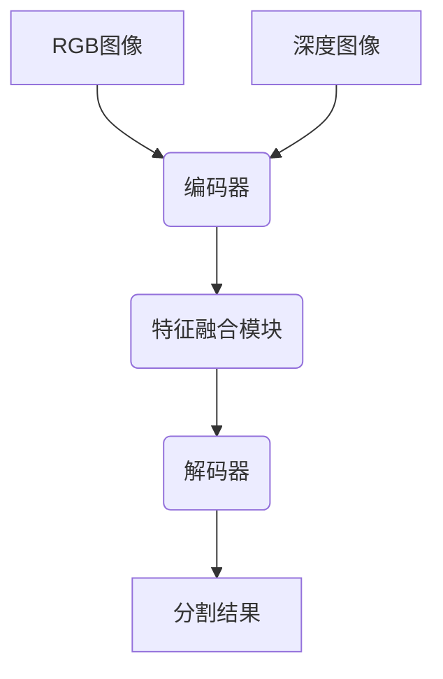

# 基于深度网络的RGBD图像分割算法研究

## 1. 背景介绍

### 1.1 图像分割的重要性

图像分割是计算机视觉和图像处理领域的一个核心任务,旨在将图像划分为多个独立的区域或对象。准确的图像分割对于许多高级视觉任务至关重要,如目标检测、场景理解、增强现实等。传统的基于手工特征的分割方法往往受到光照、遮挡和复杂背景等因素的影响,难以获得理想的分割效果。

### 1.2 RGB-D数据的优势

随着深度相机的普及,RGB-D数据(RGB图像和对应的深度图)为图像分割任务提供了新的机遇。与普通RGB图像相比,RGB-D数据包含了场景的三维结构信息,能够更好地区分前景和背景,处理遮挡问题,提高分割的准确性和鲁棒性。

### 1.3 深度学习在图像分割中的应用

近年来,深度学习技术在计算机视觉领域取得了巨大成功,尤其是基于卷积神经网络(CNN)的方法在图像分割任务上展现出优异的性能。受此启发,研究人员开始将深度学习方法应用于RGB-D图像分割,试图利用RGB和深度信息的融合,进一步提高分割精度。

## 2. 核心概念与联系

### 2.1 全卷积神经网络

全卷积神经网络(FCN)是一种流行的用于语义分割的深度网络架构。与传统的CNN不同,FCN将最后的全连接层替换为卷积层,从而可以对任意大小的输入图像进行端到端的像素级预测。FCN的核心思想是利用上采样操作来逐步恢复分割图的空间分辨率。

### 2.2 编码器-解码器架构

编码器-解码器架构是许多RGB-D图像分割网络的基础。编码器部分通常由预训练的骨干网络(如VGG、ResNet等)组成,用于从输入图像中提取特征。解码器部分则负责逐步恢复分割图的空间分辨率,并融合RGB和深度特征进行像素级预测。

### 2.3 特征融合策略

有效地融合RGB和深度特征是RGB-D图像分割的关键。常见的特征融合策略包括:

1) 早期融合:在网络的浅层将RGB和深度数据级联,作为输入进行联合训练。
2) 晚期融合:分别从RGB和深度数据中提取特征,在网络的深层进行特征融合。
3) 多尺度融合:在不同尺度级别上融合RGB和深度特征。

## 3. 核心算法原理具体操作步骤

### 3.1 RGB-D图像预处理

1) 数据对齐:由于RGB相机和深度相机的位置不同,需要进行数据对齐操作,使RGB图像和深度图像像素一一对应。
2) 数据增强:通过翻转、旋转、裁剪等方式对RGB-D数据进行增强,提高模型的泛化能力。

### 3.2 网络架构设计

大多数RGB-D图像分割网络采用编码器-解码器架构,如下所示:



1) 编码器:通常采用预训练的骨干网络(如VGG、ResNet等)提取RGB和深度特征。
2) 特征融合模块:根据所采用的融合策略,将RGB和深度特征进行融合。
3) 解码器:逐步恢复分割图的空间分辨率,并进行像素级预测。

### 3.3 损失函数设计

常见的损失函数包括交叉熵损失、Dice损失、Focal Loss等。为了获得更好的分割效果,一些工作还引入了辅助损失,如深度嵌入损失、对抗损失等。

### 3.4 网络训练

1) 数据准备:准备足够的RGB-D训练数据集,并进行适当的数据增强。
2) 超参数设置:设置合理的学习率、批大小、正则化系数等超参数。
3) 模型训练:采用随机梯度下降等优化算法,迭代训练网络模型。
4) 模型评估:在验证集上评估模型的分割性能,常用指标包括平均交并比(mIoU)、像素准确率(Pixel Acc)等。

## 4. 数学模型和公式详细讲解举例说明

### 4.1 交叉熵损失

交叉熵损失是分类任务中常用的损失函数,对于图像分割任务,可以表示为:

$$
L_{ce}(y, \hat{y}) = -\frac{1}{N}\sum_{i=1}^{N}\sum_{c=1}^{C}y_{i,c}\log\hat{y}_{i,c}
$$

其中,$N$是像素个数,$C$是类别数量,$y_{i,c}$是真实标签,$\hat{y}_{i,c}$是预测的概率值。

### 4.2 Dice损失

Dice损失常用于医学图像分割,可以有效缓解分割目标区域面积较小时的不平衡问题。Dice损失定义为:

$$
L_{dice}(y, \hat{y}) = 1 - \frac{2\sum_{i=1}^{N}y_i\hat{y}_i}{\sum_{i=1}^{N}y_i + \sum_{i=1}^{N}\hat{y}_i}
$$

其中,$y_i$和$\hat{y}_i$分别表示真实标签和预测结果的二值化掩码。

### 4.3 Focal Loss

Focal Loss旨在解决类别不平衡问题,对于容易分类的样本给予较小的损失权重,对于难以分类的样本给予较大的损失权重,从而使模型更加关注困难样本。Focal Loss定义为:

$$
L_{focal}(y, \hat{y}) = -\alpha_t(1 - \hat{y}_t)^\gamma \log(\hat{y}_t)
$$

其中,$\alpha_t$是平衡因子,$\gamma$是调节因子,用于控制难易样本的权重。

### 4.4 深度嵌入损失

深度嵌入损失旨在利用深度信息来约束分割结果,使得同一物体的不同部分具有相似的深度值。深度嵌入损失可以定义为:

$$
L_{depth}(y, d) = \frac{1}{N}\sum_{i=1}^{N}\sum_{j\in\mathcal{N}(i)}|d_i - d_j|(1 - \delta(y_i, y_j))
$$

其中,$d_i$和$d_j$分别表示像素$i$和$j$的深度值,$\mathcal{N}(i)$表示像素$i$的邻域,$\delta(y_i, y_j)$是一个指示函数,当$y_i$和$y_j$属于同一类别时为1,否则为0。

## 4. 项目实践:代码实例和详细解释说明

以下是一个基于PyTorch实现的RGB-D图像分割网络示例,采用了编码器-解码器架构和晚期融合策略。

```python
import torch
import torch.nn as nn
import torchvision.models as models

# 编码器模块
class Encoder(nn.Module):
    def __init__(self, backbone):
        super(Encoder, self).__init__()
        self.backbone = backbone
        
    def forward(self, x):
        features = self.backbone(x)
        return features

# 解码器模块
class Decoder(nn.Module):
    def __init__(self, in_channels, out_channels):
        super(Decoder, self).__init__()
        self.conv1 = nn.Conv2d(in_channels, 256, kernel_size=3, padding=1)
        self.bn1 = nn.BatchNorm2d(256)
        self.conv2 = nn.Conv2d(256, 256, kernel_size=3, padding=1)
        self.bn2 = nn.BatchNorm2d(256)
        self.conv3 = nn.Conv2d(256, out_channels, kernel_size=1)
        
    def forward(self, x):
        x = self.conv1(x)
        x = self.bn1(x)
        x = nn.ReLU()(x)
        x = self.conv2(x)
        x = self.bn2(x)
        x = nn.ReLU()(x)
        x = self.conv3(x)
        return x

# RGB-D图像分割网络
class RGBDSegmentation(nn.Module):
    def __init__(self, num_classes):
        super(RGBDSegmentation, self).__init__()
        self.rgb_encoder = Encoder(models.resnet50(pretrained=True))
        self.depth_encoder = Encoder(models.resnet50(pretrained=True))
        self.decoder = Decoder(1024, num_classes)
        
    def forward(self, rgb, depth):
        rgb_features = self.rgb_encoder(rgb)
        depth_features = self.depth_encoder(depth)
        features = torch.cat((rgb_features, depth_features), dim=1)
        output = self.decoder(features)
        return output
```

在上述示例中:

1. `Encoder`模块使用预训练的ResNet50作为骨干网络,用于从RGB图像和深度图像中分别提取特征。
2. `Decoder`模块采用一系列卷积层和批归一化层,用于融合RGB和深度特征,并进行像素级预测。
3. `RGBDSegmentation`模块将RGB编码器、深度编码器和解码器组合在一起,实现了晚期融合策略。

在训练过程中,可以使用交叉熵损失或其他损失函数,并采用随机梯度下降等优化算法进行模型训练。

## 5. 实际应用场景

RGB-D图像分割技术在以下领域有着广泛的应用:

1. **增强现实(AR)**:准确的图像分割可以帮助区分前景和背景,从而在真实场景中插入虚拟物体,实现增强现实效果。
2. **机器人导航**:通过对RGB-D数据进行分割,可以识别地面、障碍物等,为机器人提供导航信息。
3. **自动驾驶**:自动驾驶汽车需要对道路、行人、车辆等进行精确分割,以确保行车安全。
4. **人机交互**:基于RGB-D图像分割,可以实现手势识别、人体姿态估计等人机交互应用。
5. **增强现实游戏**:在游戏中,RGB-D图像分割可用于虚拟物体的插入和场景理解。

## 6. 工具和资源推荐

1. **开源框架**:PyTorch、TensorFlow等深度学习框架提供了便捷的工具和库,可用于快速构建和训练RGB-D图像分割模型。
2. **预训练模型**:一些知名的RGB-D图像分割模型(如RefineNet、RDFNet等)提供了预训练权重,可用于迁移学习或进一步微调。
3. **数据集**:NYUv2、SUN RGB-D、SceneNN等数据集提供了大量的RGB-D图像和标注数据,可用于模型训练和评估。
4. **在线资源**:arXiv、GitHub等平台上有许多相关的论文和开源项目,可供参考和学习。

## 7. 总结:未来发展趋势与挑战

### 7.1 发展趋势

1. **模型优化**:继续优化网络架构和损失函数,提高RGB-D图像分割的精度和效率。
2. **弱监督学习**:减少对大量标注数据的依赖,利用少量或无标注数据进行模型训练。
3. **多模态融合**:除RGB和深度数据外,融合其他模态信息(如语义、光流等),进一步提升分割性能。
4. **端到端学习**:设计能够端到端学习RGB-D图像分割的网络架构,简化模型训练过程。

### 7.2 挑战

1. **实时性**:在保证精度的同时,提高RGB-D图像分割的实时性,满足实际应用的需求。
2. **泛化能力**:提高模型在复杂场景和不同数据域之间的泛化能力。
3. **可解释性**:增强模型的可解释性,使分割结果更加可信和可解释。
4. **数据质量**:RGB-D数据的质量对模型性能有重要影响,需要改进数据采集和预处理方法。

## 8. 附录:常见问题与解答

1. **RGB-D图像分割与普通图像分割有何不同?**

   RGB-D图像分割利用了额外的深度信息,能够更好地处理遮挡和分离前景与背景,因此通常比普通RGB图像分割更加准确和鲁棒。

2. **为什么需要特征融合?**

   RGB和深度数据包含了互补的信息,有效地融合两者的特征有助于提高