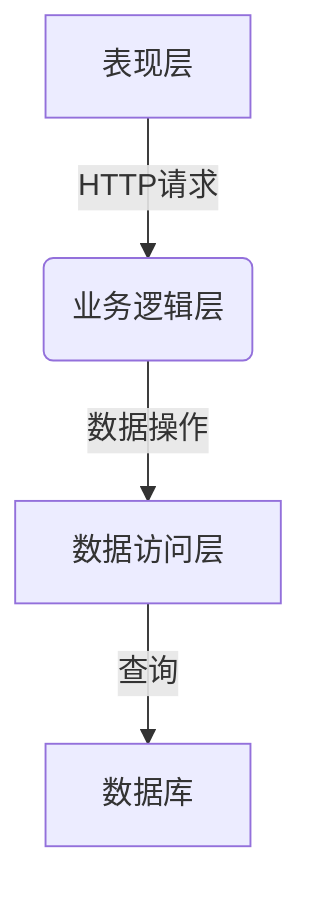

# 户籍管理系统详细设计与具体代码实现

## 1. 背景介绍

### 1.1 户籍管理的重要性

户籍管理是一个国家或地区对其公民身份、居住地点和人口结构进行有效管理和监控的重要手段。它不仅关系到公民的基本权利义务,也是政府制定相关政策、分配资源的重要依据。随着社会的快速发展和人口流动的日益频繁,传统的手工操作方式已经无法满足现代化户籍管理的需求,因此构建一个高效、安全、可靠的户籍管理信息系统就显得尤为重要。

### 1.2 现有系统存在的问题

目前,许多地区的户籍管理系统仍然存在一些问题,例如:

- 数据孤岛,信息不能实现共享
- 业务流程冗长,效率低下
- 系统安全性能有待加强
- 用户体验差,可用性不高

这些问题的存在直接影响了户籍管理工作的顺利开展,亟需通过新的技术手段予以解决。

### 1.3 新系统的设计目标

为了解决现有户籍管理系统中存在的种种问题,我们决定重新设计一套全新的户籍管理信息系统。该系统将有以下设计目标:

- 实现数据的统一存储和共享
- 优化审批流程,提高办理效率
- 加强系统安全性和可用性
- 提供人性化的用户界面和体验
- 具备良好的可扩展性和可维护性

## 2. 核心概念与联系

### 2.1 户籍管理的核心概念

在深入讨论系统设计之前,我们有必要先了解一下户籍管理所涉及的一些核心概念:

- 户口簿: 记录一个户的全部成员的户籍信息
- 户主: 户口簿的第一个当事人,代表整个户
- 常住人口: 在某地居住一年以上的人口
- 迁移人口: 从一个地区迁移到另一地区的人口
- 出生登记: 新生儿出生后办理的户籍登记手续
- 死亡注销: 户籍成员死亡后注销户籍的手续

这些概念彼此之间存在着密切的联系,它们共同构成了户籍管理的核心内容。

### 2.2 系统的核心实体

根据上述核心概念,我们可以抽象出该户籍管理系统的几个核心实体:

- 人员实体: 存储个人的基本信息
- 户口簿实体: 记录一个户的全部成员
- 事务实体: 描述各种户籍事务的类型和状态
- 操作员实体: 管理和操作系统的用户

这些实体之间也存在着各种关联关系,如人员与户口簿是一对多的关系、操作员可以处理多个事务等。这些实体及其关系将贯穿于整个系统的设计之中。

## 3. 核心算法原理具体操作步骤

### 3.1 系统架构设计

在设计户籍管理系统的具体架构时,我们决定采用经典的三层架构模式,即表现层(View)、业务逻辑层(BLL)和数据访问层(DAL)。



- 表现层: 负责与用户交互,接收用户请求并展示处理结果,通常采用 Web 形式。
- 业务逻辑层: 处理具体的业务逻辑,如事务流转、数据校验等,它不直接操作数据库。
- 数据访问层: 负责对数据库进行增删改查操作,为上层提供数据服务。

这种分层架构有利于系统的分工协作、高内聚低耦合,也更有利于后续的维护和扩展。

### 3.2 事务流转处理

事务流转是户籍管理系统中最为核心的业务流程。下面我们使用一个具体的例子来说明其处理原理和步骤。

假设有这样一个场景:张三要办理户口迁移手续,将户口从北京市迁移到上海市。该事务的处理流程如下:

1. 张三通过系统的用户界面提交迁移申请,并上传相关证明材料。
2. 该申请在系统中生成一个新的事务,状态为"已提交"。
3. 北京市的业务人员审核该事务,如果材料齐全且符合条件,则将事务状态改为"已审核"。
4. 上海市的业务人员再次审核该事务,如果没有问题,则将事务状态改为"已批准"。
5. 系统自动更新张三户口簿的地址信息,将其迁移至上海市,并将事务状态改为"已完成"。
6. 张三可以在系统中查看办理进度和结果。


这个流程中,每一步的状态变更都会对应着不同的业务逻辑处理,从而保证事务在系统中有条不紊地流转。同时,申请人也可以实时查看办理进度,提高了工作效率和用户体验。

### 3.3 数据校验和完整性

由于户籍信息直接关系到公民的权益,因此对数据的完整性和准确性有着很高的要求。在设计系统时,我们将引入严格的数据校验机制:

1. 对输入的数据格式进行校验,如身份证号码、手机号码等必须符合特定的规则。
2. 对关键数据进行合理性校验,如出生日期不能晚于当前时间、籍贯地址必须是有效的行政区划等。
3. 对引用数据进行完整性校验,如一个人员记录必须关联一个有效的户口簿等。
4. 对敏感数据进行访问控制,如只有特定角色才能修改核心数据。

此外,在底层数据库上,我们也将设置各种约束和触发器,来保证数据的准确性、完整性和一致性,防止出现数据污染或丢失的情况。

## 4. 数学模型和公式详细讲解举例说明

在户籍管理系统中,有一些场景需要使用数学模型和公式进行计算和处理。下面我们具体讲解一个典型的案例。

### 4.1 人口老龄化指数计算

随着社会的发展,人口老龄化已经成为一个不可忽视的问题。通过计算一个地区的人口老龄化指数,可以更好地评估该地区的人口结构状况。该指数的计算公式如下:

$$
老龄化指数 = \frac{65岁及以上人口数}{0-14岁人口数} \times 100\%
$$

其中,65岁及以上人口数和0-14岁人口数可以直接从户籍数据库中查询得到。指数的计算结果可以反映一个地区老年人口与少年儿童人口的相对数量关系。

一般来说,如果该指数超过30%,则表明该地区已经进入了老龄化社会;如果超过60%,则表明该地区已经是一个超老龄化社会。不同的指数范围对应着不同的人口政策和资源分配策略。

### 4.2 算法实现

下面我们给出一个基于 Python 语言的示例代码,用于计算某个区域的人口老龄化指数:

```python
import mysql.connector

# 连接数据库
conn = mysql.connector.connect(
    host="localhost",
    user="root",
    password="password",
    database="housekeeper"
)
cursor = conn.cursor()

# 查询65岁及以上人口数
query = "SELECT COUNT(*) FROM persons WHERE YEAR(CURDATE()) - YEAR(birthday) >= 65"
cursor.execute(query)
elderly_count = cursor.fetchone()[0]

# 查询0-14岁人口数
query = "SELECT COUNT(*) FROM persons WHERE YEAR(CURDATE()) - YEAR(birthday) < 15"
cursor.execute(query)
children_count = cursor.fetchone()[0]

# 计算老龄化指数
if children_count == 0:
    aging_index = float('inf')
else:
    aging_index = elderly_count / children_count * 100

print(f"65岁及以上人口数: {elderly_count}")
print(f"0-14岁人口数: {children_count}")
print(f"老龄化指数: {aging_index:.2f}%")

# 关闭数据库连接
cursor.close()
conn.close()
```

在这段代码中,我们首先连接到户籍数据库,然后分别查询65岁及以上人口数和0-14岁人口数。接着,根据公式计算出老龄化指数的值。最后,将结果打印出来,并关闭数据库连接。

通过这个示例,我们可以看到如何将数学模型应用于实际的编程场景中。这种数理统计分析有助于我们更好地了解人口结构的变化趋势,为相关决策提供依据。

## 5. 项目实践:代码实例和详细解释说明

为了更好地理解户籍管理系统的设计和实现,我们将给出一些核心模块的代码示例,并进行详细的解释说明。

### 5.1 用户模块

用户模块负责管理系统的操作员,包括用户注册、登录、权限控制等功能。下面是一个简化的 Python 代码示例:

```python
import hashlib

class User:
    def __init__(self, username, password, role):
        self.username = username
        self.password = hashlib.sha256(password.encode()).hexdigest()
        self.role = role

    def verify_password(self, password):
        return hashlib.sha256(password.encode()).hexdigest() == self.password

    def has_permission(self, permission):
        # 根据角色判断是否具有某项权限
        pass

# 用户注册
def register_user(username, password, role):
    # 检查用户名是否已存在
    if User.find_by_username(username):
        return False

    user = User(username, password, role)
    # 将用户信息存储到数据库
    user.save()
    return True

# 用户登录
def login(username, password):
    user = User.find_by_username(username)
    if user and user.verify_password(password):
        # 登录成功
        return user
    else:
        return None
```

在这个示例中,我们定义了一个 `User` 类,用于表示系统的操作员。每个用户都有一个用户名、密码(使用 SHA256 算法进行哈希加密)和角色。`verify_password` 方法用于验证输入的密码是否正确,`has_permission` 方法用于判断用户是否具有某项操作权限。

`register_user` 函数实现了用户注册功能,它首先检查用户名是否已经存在,如果不存在则创建一个新的 `User` 对象并将其存储到数据库中。`login` 函数则实现了用户登录功能,它根据用户名查找对应的 `User` 对象,并验证输入的密码是否正确。

通过这个模块,我们可以有效地管理系统的操作员,保证只有经过认证的用户才能访问相应的功能模块,从而提高系统的安全性。

### 5.2 事务处理模块

事务处理是户籍管理系统的核心功能之一,下面是一个使用 Python 语言实现的简化代码示例:

```python
from enum import Enum

class TransactionType(Enum):
    BIRTH_REGISTRATION = 1
    DEATH_DEREGISTRATION = 2
    HOUSEHOLD_TRANSFER = 3
    # 其他事务类型...

class Transaction:
    def __init__(self, type, applicant, data):
        self.type = type
        self.applicant = applicant
        self.data = data
        self.status = "SUBMITTED"

    def process(self):
        if self.type == TransactionType.BIRTH_REGISTRATION:
            # 处理出生登记事务
            pass
        elif self.type == TransactionType.DEATH_DEREGISTRATION:
            # 处理死亡注销事务
            pass
        elif self.type == TransactionType.HOUSEHOLD_TRANSFER:
            # 处理户口迁移事务
            pass

        # 更新事务状态
        self.status = "PROCESSED"

# 提交一个新的事务
def submit_transaction(type, applicant, data):
    transaction = Transaction(type, applicant, data)
    # 将事务存储到数据库
    transaction.save()
    return transaction

# 处理一个待办事务
def process_transaction(transaction_id):
    transaction = Transaction.find_by_id(transaction_id)
    if transaction:
        transaction.process()
        # 更新事务状态到数据库
        transaction.update()
```

在这个示例中,我们首先定义了一个 `TransactionType` 枚举类,用于表