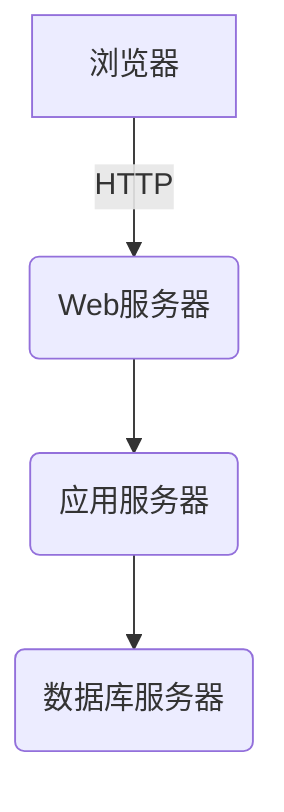

# 教学管理系统详细设计与具体代码实现

## 1. 背景介绍

### 1.1 教学管理系统概述

教学管理系统是一种综合性的信息管理系统,旨在提高教育教学管理工作的效率和质量。它涵盖了学生信息管理、课程管理、教学计划管理、教师管理、成绩管理等多个模块,为学校的教学活动提供全面的数据支持和管理工具。

### 1.2 系统的重要性

随着信息技术的不断发展,教育领域对现代化管理的需求日益增长。传统的手工操作方式已无法满足当今教学管理的复杂性和高效性要求。通过构建教学管理系统,可以实现以下目标:

1. 提高管理效率,减轻管理人员的工作负担
2. 实现教学资源的共享,优化资源配置
3. 加强教学过程的监控,保证教学质量
4. 为决策提供数据支持,促进科学化管理

### 1.3 系统开发的挑战

教学管理系统的开发需要解决以下几个主要挑战:

1. 需求复杂多变,涉及多个部门和角色
2. 数据量大,需要高效的存储和查询机制
3. 系统安全性要求高,涉及大量敏感数据
4. 用户群体庞大,需要良好的用户体验

## 2. 核心概念与联系

### 2.1 系统架构

教学管理系统通常采用B/S(Browser/Server)或C/S(Client/Server)架构,其中:

- 浏览器作为客户端,提供用户界面
- 应用服务器处理业务逻辑
- 数据库服务器存储系统数据



### 2.2 系统模块

教学管理系统一般包含以下核心模块:

1. **学生信息模块**: 维护学生的基本信息、联系方式、学习记录等
2. **教师信息模块**: 管理教师的个人资料、教学任务、科研工作等
3. **课程模块**: 设置课程基本信息、上课时间、教学大纲等
4. **教学计划模块**: 制定教学计划,安排教学活动
5. **成绩管理模块**: 录入、统计和分析学生的成绩数据
6. **系统管理模块**: 进行用户权限管理、系统参数配置等

### 2.3 数据模型

系统的核心数据实体包括:

- 学生(Student)
- 教师(Teacher) 
- 课程(Course)
- 教学班(Class)
- 成绩(Score)
- 用户(User)

这些实体之间存在多对多、一对多等复杂关系,如课程与学生是多对多关系。

```mermaid
erDiagram
    STUDENT ||--o{ SCORE : scores
    STUDENT }|--||COURSE : takes
    TEACHER }|--|| COURSE : teaches
    COURSE ||--|{ CLASS : classes
```

### 2.4 系统开发技术

教学管理系统可以基于多种开发技术和框架构建:

- **前端**: HTML, CSS, JavaScript, Vue.js/React
- **后端**: Java(Spring/SpringBoot), Python(Django), Node.js, .NET 
- **数据库**: MySQL, PostgreSQL, Oracle
- **中间件**: Nginx, RabbitMQ, Redis

不同技术栈的选择需要结合开发团队的实际情况。

## 3. 核心算法原理具体操作步骤 

### 3.1 学生选课算法

学生选课是教学管理系统的一个核心功能,需要合理分配教学资源,避免课程冲突。一种常见的选课算法如下:

1. 学生按照规定时间提交选课申请
2. 系统根据课程的容量限制,按选课时间先后顺序安排学生名单
3. 如果选课人数超出容量,根据设定的优先级规则排序,优先安排部分学生
4. 对于存在冲突的学生选课,发出提示,要求修改选课

该算法的时间复杂度为O(nlogn),其中n为学生人数。

### 3.2 自动排课算法

为了高效利用教学资源,需要合理安排上课时间和教室,这属于经典的图着色问题。一种常用的排课算法思路:

1. 构建课程冲突图,课程为节点,存在冲突的课程之间连有边
2. 基于冲突图进行节点着色,确保相邻节点颜色不同
3. 同一颜色的课程可以安排在同一时间和教室

该算法的时间复杂度为O(n^2),其中n为课程数量。

### 3.3 成绩分析算法

成绩分析可以帮助教师及时发现教学中的问题,并采取相应措施。一种常见的成绩分析算法如下:

1. 计算每门课程的平均分、最高分、最低分、标准差等统计量
2. 绘制成绩分布直方图,分析成绩分布情况
3. 对成绩偏差较大的课程,进一步分析影响因素
4. 基于分析结果,提出教学改进建议

该算法的时间复杂度为O(n),其中n为学生人数。

## 4. 数学模型和公式详细讲解举例说明

### 4.1 学生选课模型

假设有n个学生,m个课程,用二元变量$x_{ij}$表示第i个学生是否选择第j门课程,则学生选课问题可以描述为:

$$
\max \sum_{i=1}^{n}\sum_{j=1}^{m}c_{ij}x_{ij}
$$

$$
\text{s.t.} \quad \sum_{i=1}^{n}x_{ij}\leq q_j, \quad j=1,2,\ldots,m
$$

$$
\sum_{j=1}^{m}x_{ij}\leq p_i, \quad i=1,2,\ldots,n
$$

其中:
- $c_{ij}$表示第i个学生选择第j门课程的收益
- $q_j$表示第j门课程的容量限制
- $p_i$表示第i个学生可选课程的数量限制

该模型的目标是在满足课程容量和学生选课数量限制的前提下,最大化总收益。

### 4.2 教室分配模型

假设有n间教室,m节课需要排课,用二元变量$y_{ij}$表示第j节课是否安排在第i间教室,则教室分配问题可以描述为:

$$
\min \sum_{i=1}^{n}\sum_{j=1}^{m}d_{ij}y_{ij}
$$

$$
\text{s.t.} \quad \sum_{i=1}^{n}y_{ij}=1, \quad j=1,2,\ldots,m
$$

$$
y_{ij}+y_{i'j'}=1, \quad \text{if } c_j \cap c_{j'} \neq \emptyset
$$

其中:
- $d_{ij}$表示将第j节课安排在第i间教室的代价
- $c_j$表示第j节课的时间段

该模型的目标是最小化总代价,同时满足每节课只能安排在一间教室,并避免时间冲突的约束条件。

### 4.3 成绩分析模型

假设一门课程有n名学生,学生的成绩为$x_1, x_2, \ldots, x_n$,则该课程的平均分为:

$$
\bar{x} = \frac{1}{n}\sum_{i=1}^{n}x_i
$$

方差为:

$$
s^2 = \frac{1}{n}\sum_{i=1}^{n}(x_i - \bar{x})^2
$$

标准差为:

$$
s = \sqrt{\frac{1}{n}\sum_{i=1}^{n}(x_i - \bar{x})^2}
$$

基于这些统计量,我们可以分析成绩的集中趋势和离散程度,并与全校或全年级的平均水平进行比较,从而评估教学效果。

## 5. 项目实践:代码实例和详细解释说明

本节将给出一些核心模块的代码示例,并进行详细的解释说明。

### 5.1 学生选课模块

#### 5.1.1 数据模型

```python
from django.db import models

class Student(models.Model):
    name = models.CharField(max_length=50)
    grade = models.IntegerField()
    # 其他字段

class Course(models.Model):
    name = models.CharField(max_length=100)
    credit = models.IntegerField()
    capacity = models.IntegerField()
    # 其他字段

class Selection(models.Model):
    student = models.ForeignKey(Student, on_delete=models.CASCADE)
    course = models.ForeignKey(Course, on_delete=models.CASCADE)
    # 其他字段
```

上述代码定义了学生、课程和选课记录三个模型,其中Selection模型通过外键与Student和Course模型建立了多对多关系。

#### 5.1.2 选课逻辑

```python
from django.db import transaction
from .models import Student, Course, Selection

@transaction.atomic
def student_select_course(student_id, course_id):
    student = Student.objects.get(pk=student_id)
    course = Course.objects.get(pk=course_id)

    # 检查课程容量
    if course.selection_set.count() >= course.capacity:
        raise ValueError('Course is full')

    # 检查学生已选课程数量
    if student.selection_set.count() >= 6:
        raise ValueError('Student has selected too many courses')

    # 创建选课记录
    Selection.objects.create(student=student, course=course)
```

上述代码实现了学生选课的核心逻辑,包括检查课程容量、检查学生已选课程数量等约束条件。通过Django的事务机制,可以保证选课操作的原子性。

### 5.2 教室分配模块

#### 5.2.1 数据模型

```python
from django.db import models

class Room(models.Model):
    name = models.CharField(max_length=50)
    capacity = models.IntegerField()
    # 其他字段

class TimeSlot(models.Model):
    start_time = models.TimeField()
    end_time = models.TimeField()
    # 其他字段

class Course(models.Model):
    name = models.CharField(max_length=100)
    time_slot = models.ForeignKey(TimeSlot, on_delete=models.CASCADE)
    # 其他字段

class Arrangement(models.Model):
    course = models.ForeignKey(Course, on_delete=models.CASCADE)
    room = models.ForeignKey(Room, on_delete=models.CASCADE)
```

上述代码定义了教室、时间段、课程和排课安排四个模型,其中Arrangement模型通过外键与Course和Room模型建立了多对一关系。

#### 5.2.2 排课算法

```python
from .models import Course, Room, Arrangement

def schedule_courses():
    courses = Course.objects.all()
    rooms = Room.objects.all()

    for course in courses:
        # 找到所有可用的教室
        available_rooms = [room for room in rooms
                           if not room.arrangement_set.filter(course__time_slot=course.time_slot)]

        # 选择最小的可用教室
        if available_rooms:
            room = min(available_rooms, key=lambda r: r.capacity)
            Arrangement.objects.create(course=course, room=room)
        else:
            print(f'No available room for {course.name}')
```

上述代码实现了一种简单的排课算法,遍历所有课程,为每门课程选择一间可用且容量最小的教室。该算法的时间复杂度为O(nm),其中n为课程数量,m为教室数量。

### 5.3 成绩管理模块

#### 5.3.1 数据模型

```python
from django.db import models

class Student(models.Model):
    name = models.CharField(max_length=50)
    # 其他字段

class Course(models.Model):
    name = models.CharField(max_length=100)
    # 其他字段

class Score(models.Model):
    student = models.ForeignKey(Student, on_delete=models.CASCADE)
    course = models.ForeignKey(Course, on_delete=models.CASCADE)
    score = models.IntegerField()
```

上述代码定义了学生、课程和成绩三个模型,其中Score模型通过外键与Student和Course模型建立了多对一关系。

#### 5.3.2 成绩分析

```python
from django.db.models import Avg, Max, Min, StdDev
from .models import Score

def analyze_scores(course_id):
    scores = Score.objects.filter(course_id=course_id).values_list('score', flat=True)

    avg_score = Score.objects.filter(course_id=course_id).aggregate(Avg('score'))['score__avg']
    max_score = Score.objects.filter(course_id=course_id).aggregate(Max('score'))['score__max']
    min_score = Score.objects.filter(course_id=course_id).aggregate(Min('score'))['score__min']
    std_dev = Score.objects.filter(course_id=course_id).aggregate(StdDev('score'))['score__stddev']

    print(f'Average score: {avg_score}')
    print(f'Maximum score: {max_score}')