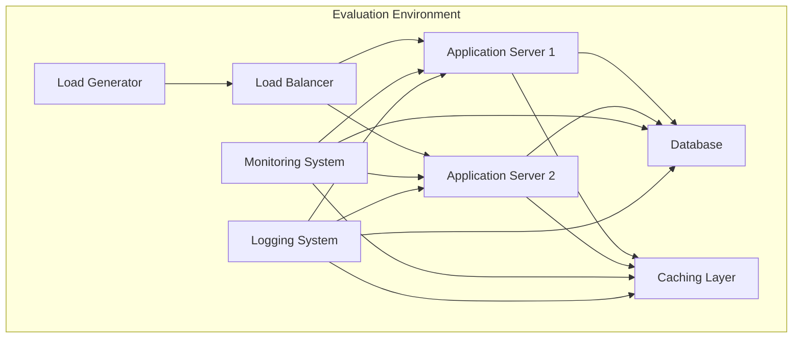

# *评测环境搭建：模拟真实电商场景

## 1.背景介绍

### 1.1 电商系统的重要性

在当今数字时代,电子商务(电商)已经成为一个不可或缺的商业模式。无论是大型企业还是中小型公司,都将电商作为一种关键的销售和营销渠道。电商系统需要能够处理大量的并发用户请求、处理复杂的订单和支付流程,并确保系统的可靠性、安全性和性能。

### 1.2 评测环境的重要性

为了确保电商系统能够在真实场景下稳定运行,评测环境的搭建至关重要。评测环境模拟真实的用户行为和流量模式,帮助开发人员发现并解决系统中潜在的性能瓶颈、并发问题和其他潜在缺陷。通过评测,可以提前发现并优化系统,从而在上线前确保系统的高可用性和稳定性。

## 2.核心概念与联系

### 2.1 负载测试(Load Testing)

负载测试是评估系统在特定负载条件下的性能表现的过程。它模拟大量并发用户访问系统,测试系统在高负载下的响应时间、吞吐量、资源利用率等指标。负载测试有助于发现系统的瓶颈,优化系统配置,并验证系统是否满足预期的性能要求。

### 2.2 压力测试(Stress Testing)

压力测试是在极端条件下对系统进行评估,目的是确定系统的稳定性和可靠性。它通过不断增加负载,直到系统达到临界点或发生故障,从而测试系统的极限承载能力。压力测试有助于发现系统在高压力下的潜在缺陷,并优化系统的容错能力。

### 2.3 并发测试(Concurrency Testing)

并发测试专注于评估系统在多个用户同时访问时的行为。它模拟大量并发请求,测试系统在高并发场景下的正确性、一致性和可靠性。并发测试有助于发现并解决死锁、竞争条件和其他并发相关问题。

### 2.4 容量测试(Capacity Testing)

容量测试旨在确定系统的最大容量,即系统在保持可接受性能的前提下可以支持的最大用户数或最大负载。它通过逐步增加负载,测试系统在不同负载级别下的性能表现,从而确定系统的容量极限。

### 2.5 可用性测试(Availability Testing)

可用性测试评估系统在各种故障情况下的可用性,包括硬件故障、软件故障、网络故障等。它模拟各种故障场景,测试系统的故障恢复能力、数据一致性和服务可用性。可用性测试有助于提高系统的容错能力和可靠性。

### 2.6 安全性测试(Security Testing)

安全性测试旨在评估系统的安全性,包括身份验证、授权、数据加密、漏洞扫描等方面。它模拟各种攻击场景,测试系统对于常见安全威胁的防御能力。安全性测试对于电商系统来说至关重要,因为它涉及敏感的用户数据和财务信息。

### 2.7 监控和日志记录

监控和日志记录是评测过程中的关键环节。它们提供了系统运行时的实时数据和历史记录,有助于分析系统行为、发现问题根源和优化系统性能。监控系统通常包括性能指标、异常检测和警报机制,而日志记录则记录了系统的详细操作过程。

## 3.核心算法原理具体操作步骤

### 3.1 评测环境架构

评测环境通常由以下几个核心组件组成:

1. **负载发生器(Load Generator)**: 负责模拟真实用户请求,生成并发流量。常用的负载发生器工具包括 Apache JMeter、Locust、Gatling 等。

2. **目标系统(System Under Test, SUT)**: 即被测试的电商系统。它可以是一个完整的生产环境,也可以是一个隔离的测试环境。

3. **监控系统(Monitoring System)**: 收集和分析目标系统的性能指标,如 CPU 利用率、内存使用情况、网络流量等。常用的监控工具包括 Prometheus、Grafana、ELK Stack 等。

4. **日志系统(Logging System)**: 记录目标系统的运行日志,用于问题排查和性能分析。常用的日志工具包括 ELK Stack、Graylog、Splunk 等。

5. **数据库(Database)**: 存储目标系统的数据,如用户信息、订单记录等。在评测过程中,数据库也需要进行压力测试,以确保其能够处理大量的并发读写操作。

6. **负载均衡器(Load Balancer)**: 在分布式环境中,负载均衡器用于将用户请求分发到多个应用程序实例,以实现高可用性和负载均衡。

7. **缓存层(Caching Layer)**: 缓存层用于缓存常用数据,减轻数据库的压力,提高系统的响应速度。在评测过程中,也需要测试缓存层的性能和一致性。

这些组件通过网络相互连接,构成了一个完整的评测环境。下面是一个典型的评测环境架构示意图:

### 3.2 评测流程

评测流程通常包括以下几个步骤:

1. **定义评测目标和场景**: 明确评测的目的,如测试系统的最大吞吐量、响应时间、资源利用率等。同时,确定需要模拟的用户场景,如浏览商品、加入购物车、下单支付等。

2. **设计评测计划**: 根据评测目标和场景,制定详细的评测计划,包括评测工具的选择、测试用例的设计、负载模型的确定、监控指标的选择等。

3. **搭建评测环境**: 根据评测计划,搭建完整的评测环境,包括负载发生器、目标系统、监控系统、日志系统等组件。

4. **执行评测**: 按照评测计划,执行负载测试、压力测试、并发测试等。在评测过程中,实时监控系统的性能指标和日志,以及时发现和诊断问题。

5. **分析评测结果**: 收集和分析评测过程中的性能数据、日志和监控信息,识别系统瓶颈和潜在问题。

6. **优化和重新评测**: 根据评测结果,优化系统配置、代码或架构,解决发现的问题。然后进行新一轮的评测,验证优化效果。

7. **持续评测和监控**: 在系统上线后,持续进行评测和监控,确保系统在生产环境中的稳定性和性能。

评测是一个迭代的过程,需要不断优化和重复评测,直到系统满足预期的性能和稳定性要求。

## 4.数学模型和公式详细讲解举例说明

在评测过程中,常用的数学模型和公式包括:

### 4.1 小型世界网络模型

小型世界网络模型(Small-World Network Model)是一种描述复杂网络结构的数学模型,常用于模拟真实的用户行为模式。在电商场景中,用户的浏览和购买行为通常呈现出小型世界网络的特征,即大多数用户只访问一小部分热门商品,而少数用户会访问更多的长尾商品。

小型世界网络模型可以用以下公式描述:

$$
C(G) = \frac{1}{n}\sum_{i\in G}\frac{2}{k_i(k_i-1)}\sum_{j,h\in G}[A_{ij}A_{ih}A_{jh}]
$$

其中:
- $C(G)$ 表示网络 $G$ 的聚集系数,衡量网络中节点之间的紧密程度。
- $n$ 是网络中节点的总数。
- $k_i$ 是节点 $i$ 的度数,即与节点 $i$ 相连的边的数量。
- $A_{ij}$ 是邻接矩阵,如果节点 $i$ 和节点 $j$ 相连,则 $A_{ij}=1$,否则为 $0$。

通过调整小型世界网络模型的参数,可以模拟不同的用户访问模式,从而生成更加真实的评测流量。

### 4.2 排队理论

排队理论(Queueing Theory)是一种研究等待线路(队列)行为的数学模型,常用于分析系统的响应时间和吞吐量。在电商场景中,用户请求可以看作是到达服务器的任务,服务器的处理能力就是服务率。

排队理论中的一个关键公式是小纳维尔公式(Little's Law),它描述了队列长度、到达率和响应时间之间的关系:

$$
L = \lambda W
$$

其中:
- $L$ 是系统中平均队列长度(包括正在服务的任务)。
- $\lambda$ 是任务到达率,即单位时间内到达系统的平均任务数。
- $W$ 是任务在系统中的平均响应时间。

通过监控系统的队列长度和任务到达率,可以使用小纳维尔公式估计系统的响应时间,从而评估系统的性能表现。

### 4.3 资源利用率模型

资源利用率模型(Resource Utilization Model)描述了系统资源(如 CPU、内存、网络等)的利用情况。在评测过程中,监控资源利用率是非常重要的,因为过高的资源利用率可能导致系统性能下降或发生故障。

资源利用率可以用以下公式计算:

$$
U = \frac{\lambda}{\mu}
$$

其中:
- $U$ 是资源的利用率。
- $\lambda$ 是任务到达率。
- $\mu$ 是服务率,即单位时间内可以处理的最大任务数。

当资源利用率接近 1 时,表示资源已经达到了饱和状态,任何小的波动都可能导致资源过载。因此,在评测过程中,需要密切监控资源利用率,并在资源利用率接近临界值时采取相应的优化措施。

### 4.4 阿姆达尔定律

阿姆达尔定律(Amdahl's Law)描述了在并行计算环境中,任务的加速比(Speedup)与可并行部分的比例之间的关系。在评测过程中,可以使用阿姆达尔定律来估计系统的最大吞吐量和可扩展性。

阿姆达尔定律可以用以下公式表示:

$$
S(N) = \frac{1}{(1-P) + \frac{P}{N}}
$$

其中:
- $S(N)$ 是加速比,即使用 $N$ 个处理器相比于单个处理器的加速倍数。
- $P$ 是任务中可并行部分的比例。
- $(1-P)$ 是任务中必须串行执行的部分。

根据阿姆达尔定律,即使增加处理器的数量,系统的加速比也是有上限的,这个上限取决于任务中可并行部分的比例。因此,在评测过程中,需要分析系统中的并行部分和串行部分,以确定系统的最大吞吐量和可扩展性。

以上是评测过程中常用的一些数学模型和公式。通过将这些模型和公式与实际的评测数据相结合,可以更好地分析和优化系统的性能表现。

## 5.项目实践:代码实例和详细解释说明

在本节中,我们将通过一个实际的项目实践,演示如何使用开源工具 Apache JMeter 搭建评测环境并执行评测。

### 5.1 Apache JMeter 简介

Apache JMeter 是一款纯 Java 应用程序,旨在负载测试功能行为和测量性能。它可以用于对静态和动态资源的 Web 应用程序进行不同类型的负载测试。JMeter 最初是为了测试 Web 应用程序而设计的,但后来已经扩展到其他测试领域。

JMeter 具有以下主要特点:

- 完全多线程框架,可以通过多个线程来模