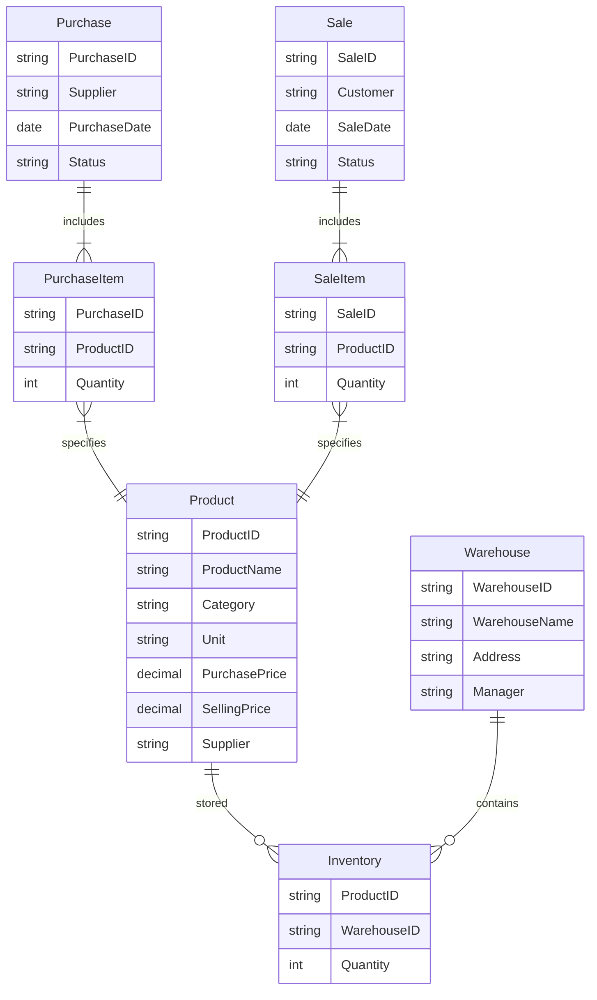

# 超市进销存管理系统详细设计与具体代码实现

作者：禅与计算机程序设计艺术

## 1. 背景介绍

### 1.1 超市进销存管理系统的重要性

在现代超市运营中,进销存管理系统扮演着至关重要的角色。它能够有效地管理商品的采购、销售和库存,提高超市的运营效率,降低成本,提升客户满意度。一个设计良好、功能完善的进销存管理系统是超市成功运营的关键因素之一。

### 1.2 系统开发的目标和意义

开发一个高质量的超市进销存管理系统,我们的目标是:

1. 实现商品信息、采购、销售、库存等业务的全面管理和追踪
2. 提供直观、易用的操作界面,降低员工的学习和使用成本
3. 支持多仓库、多门店的管理,满足连锁超市的需求
4. 提供丰富的数据统计和分析功能,为管理决策提供数据支持
5. 确保系统的安全性、稳定性和可扩展性,支撑超市业务的长期发展

通过开发这样一个系统,我们可以帮助超市优化业务流程,提高管理效率,为超市的可持续发展提供有力的支持。

## 2. 核心概念与关系

### 2.1 商品(Product)

商品是进销存系统的核心对象之一,包含以下主要属性:

- 商品编号(ProductID):唯一标识一个商品
- 商品名称(ProductName):商品的名称
- 商品分类(Category):商品所属的分类
- 计量单位(Unit):商品的计量单位,如个、箱、千克等
- 进价(PurchasePrice):商品的进货价格
- 售价(SellingPrice):商品的销售价格
- 供应商(Supplier):商品的供应商信息

### 2.2 仓库(Warehouse)

仓库代表存放商品的地点,主要属性包括:

- 仓库编号(WarehouseID):唯一标识一个仓库 
- 仓库名称(WarehouseName):仓库名称
- 仓库地址(Address):仓库的地理位置
- 仓库管理员(Manager):负责管理该仓库的人员

### 2.3 库存(Inventory)

库存表示特定商品在特定仓库的数量,主要属性包括:

- 商品编号(ProductID):库存商品的编号
- 仓库编号(WarehouseID):库存所在仓库的编号 
- 数量(Quantity):该商品在该仓库的数量

库存与商品和仓库是多对多的关系。一个商品可以存放在多个仓库,一个仓库可以存放多个商品。

### 2.4 采购(Purchase)

采购代表从供应商处进货的活动,主要属性包括:

- 采购编号(PurchaseID):唯一标识一次采购
- 供应商(Supplier):供应商信息
- 采购日期(PurchaseDate):采购发生的日期
- 采购明细(PurchaseItems):采购的商品及数量
- 采购状态(Status):采购单的状态,如已下单、已入库等

### 2.5 销售(Sale) 

销售代表向客户销售商品的活动,主要属性包括:

- 销售编号(SaleID):唯一标识一次销售
- 客户(Customer):客户信息
- 销售日期(SaleDate):销售发生的日期
- 销售明细(SaleItems):销售的商品及数量  
- 销售状态(Status):销售单的状态,如已下单、已出库等

### 2.6 实体关系图

下面是这些核心概念之间关系的 ER 图:

从 ER 图可以清晰地看出各实体之间的关系:

- 商品与库存是多对多的关系,通过库存实体连接
- 仓库与库存也是多对多的关系,通过库存实体连接
- 采购与采购明细是一对多的关系,一次采购包含多个采购明细
- 采购明细与商品是多对一的关系,一个采购明细对应一个商品
- 销售与销售明细是一对多的关系,一次销售包含多个销售明细
- 销售明细与商品是多对一的关系,一个销售明细对应一个商品

理解这些概念和关系,是设计和实现超市进销存管理系统的基础。

## 3. 核心业务流程与操作步骤

进销存系统涉及的核心业务流程主要有:采购、销售、库存管理等。下面我们详细讨论每个业务流程的操作步骤。

### 3.1 采购业务流程

#### 3.1.1 创建采购单

1. 选择供应商
2. 选择要采购的商品,并输入采购数量
3. 生成采购单,记录采购信息

#### 3.1.2 审核采购单

1. 采购管理员审核采购单的内容
2. 如有错误,退回修改;如无误,审核通过

#### 3.1.3 下达采购单

1. 将审核通过的采购单下达给供应商
2. 更新采购单状态为"已下达"

#### 3.1.4 采购入库

1. 供应商发货后,仓库管理员根据采购单验收商品
2. 如有问题,与供应商沟通解决;如无问题,办理入库
3. 更新商品库存数量
4. 更新采购单状态为"已入库"

### 3.2 销售业务流程

#### 3.2.1 创建销售单

1. 输入客户信息
2. 选择要销售的商品,并输入销售数量
3. 生成销售单,记录销售信息

#### 3.2.2 审核销售单

1. 销售管理员审核销售单的内容
2. 如有错误,退回修改;如无误,审核通过

#### 3.2.3 销售出库

1. 仓库管理员根据销售单安排出库
2. 更新商品库存数量
3. 更新销售单状态为"已出库"

#### 3.2.4 销售结算

1. 根据销售单与客户结算货款
2. 更新销售单状态为"已结算"

### 3.3 库存管理业务流程

#### 3.3.1 库存查询

1. 输入查询条件(如商品编号、仓库等)
2. 系统显示符合条件的库存信息

#### 3.3.2 库存调拨

1. 创建调拨单,选择调出仓库、调入仓库
2. 选择要调拨的商品,并输入调拨数量
3. 审核调拨单
4. 调出仓库安排出库,调入仓库办理入库
5. 更新两个仓库的商品库存数量

#### 3.3.3 库存盘点

1. 创建盘点单,选择要盘点的仓库
2. 对仓库商品进行实际盘点,记录盘点数量
3. 将盘点数量与系统库存数量进行比对
4. 如有差异,查明原因并进行库存调整

以上是超市进销存系统的主要业务流程和操作步骤。在实际系统中,还会涉及到其他一些辅助性的业务流程,如商品管理、客户管理、供应商管理等。理解和梳理这些业务流程,是开发出高质量进销存管理系统的关键。

## 4. 数据库设计

根据前面梳理的核心概念和业务流程,我们可以设计出系统的数据库表结构。以下是主要的数据库表:

### 4.1 商品表(Product)

| 字段名 | 数据类型 | 是否主键 | 说明 |
|-------|---------|----------|------|
| ProductID | varchar(20) | 是 | 商品编号 |
| ProductName | varchar(100) | 否 | 商品名称 |
| Category | varchar(50) | 否 | 商品分类 |
| Unit | varchar(10) | 否 | 计量单位 |
| PurchasePrice | decimal(10,2) | 否 | 进价 |
| SellingPrice | decimal(10,2) | 否 | 售价 |
| Supplier | varchar(50) | 否 | 供应商 |

### 4.2 仓库表(Warehouse)

| 字段名 | 数据类型 | 是否主键 | 说明 |
|-------|---------|----------|------|
| WarehouseID | varchar(20) | 是 | 仓库编号 |
| WarehouseName | varchar(100) | 否 | 仓库名称 |
| Address | varchar(200) | 否 | 仓库地址 |
| Manager | varchar(50) | 否 | 仓库管理员 |

### 4.3 库存表(Inventory)

| 字段名 | 数据类型 | 是否主键 | 说明 |
|-------|---------|----------|------|
| ProductID | varchar(20) | 是 | 商品编号 |
| WarehouseID | varchar(20) | 是 | 仓库编号 |
| Quantity | int | 否 | 库存数量 |

注:库存表的主键是 ProductID 和 WarehouseID 的组合。

### 4.4 采购表(Purchase)

| 字段名 | 数据类型 | 是否主键 | 说明 |
|-------|---------|----------|------|
| PurchaseID | varchar(20) | 是 | 采购编号 |
| Supplier | varchar(50) | 否 | 供应商 |
| PurchaseDate | date | 否 | 采购日期 |
| Status | varchar(20) | 否 | 采购状态 |

### 4.5 采购明细表(PurchaseItem)

| 字段名 | 数据类型 | 是否主键 | 说明 |
|-------|---------|----------|------|
| PurchaseID | varchar(20) | 是 | 采购编号 |
| ProductID | varchar(20) | 是 | 商品编号 |
| Quantity | int | 否 | 采购数量 |

注:采购明细表的主键是 PurchaseID 和 ProductID 的组合。

### 4.6 销售表(Sale)

| 字段名 | 数据类型 | 是否主键 | 说明 |
|-------|---------|----------|------|
| SaleID | varchar(20) | 是 | 销售编号 |
| Customer | varchar(50) | 否 | 客户 |
| SaleDate | date | 否 | 销售日期 |
| Status | varchar(20) | 否 | 销售状态 |

### 4.7 销售明细表(SaleItem)

| 字段名 | 数据类型 | 是否主键 | 说明 |
|-------|---------|----------|------|
| SaleID | varchar(20) | 是 | 销售编号 |
| ProductID | varchar(20) | 是 | 商品编号 |
| Quantity | int | 否 | 销售数量 |

注:销售明细表的主键是 SaleID 和 ProductID 的组合。

以上就是超市进销存管理系统的核心数据库表设计。在实际系统中,可能还需要一些辅助性的表,如供应商表、客户表等。根据这些表结构,我们就可以编写出系统的数据访问层代码。

## 5. 系统架构设计

超市进销存管理系统可以采用经典的三层架构设计:表示层、业务逻辑层、数据访问层。

### 5.1 表示层

表示层主要负责用户界面的显示和交互。在本系统中,我们可以使用 WPF(Windows Presentation Foundation)技术来开发表示层。WPF 提供了丰富的 UI 控件和布局机制,可以帮助我们快速构建出美观、易用的用户界面。

表示层的主要任务包括:

1. 显示各种业务数据,如商品列表、采购单、销售单等
2. 提供数据录入界面,如采购单创建、销售单创建等
3. 捕获用户的输入和操作,并将其传递给业