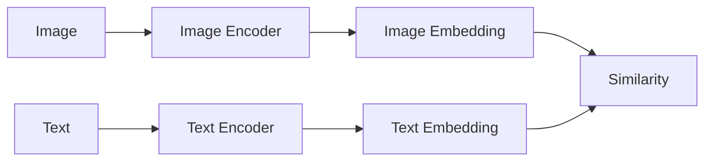

# 跨模态检索:打通视觉与文本的语义鸿沟

作者：禅与计算机程序设计艺术

## 1. 背景介绍
### 1.1 跨模态检索的兴起
随着多媒体数据的爆炸式增长,传统的单一模态检索已经无法满足人们日益增长的信息需求。图像、视频、音频、文本等不同模态的数据蕴含着丰富的语义信息,如何打通不同模态数据之间的语义鸿沟,实现高效、准确的跨模态检索,已成为学术界和工业界共同关注的热点问题。

### 1.2 跨模态检索面临的挑战
跨模态检索面临着诸多挑战:
1. 模态异构性:不同模态数据具有不同的特征表示,如何建立统一的语义空间是一大难题。
2. 语义鸿沟:视觉与文本信息存在巨大的语义鸿沟,如何对齐它们的语义表示至关重要。
3. 数据稀疏性:高质量的跨模态数据集匮乏,标注成本高昂,数据稀疏问题突出。
4. 查询灵活性:用户的查询方式多种多样,跨模态检索系统需要具备灵活的查询理解和匹配能力。

### 1.3 跨模态检索的应用前景
跨模态检索具有广阔的应用前景,主要体现在以下几个方面:
1. 多媒体搜索:支持以图搜图、以图搜文、以文搜图等多种方式,极大提升用户搜索体验。
2. 医疗辅助诊断:通过医学影像与电子病历的跨模态检索,辅助医生进行疾病诊断。  
3. 智能教育:构建多模态的教学资源库,实现课程内容的个性化推荐。
4. 无人驾驶:多传感器信息融合与跨模态场景理解,提升无人驾驶系统的感知和决策能力。

## 2. 核心概念与联系
### 2.1 多模态学习
多模态学习旨在利用不同模态数据的互补性,学习它们之间的内在联系,构建统一的语义表示空间。常见的多模态学习任务包括:
- 多模态融合:将不同模态的特征表示映射到一个共享的语义空间,捕捉它们的相关性。
- 跨模态检索:给定一个模态的查询,从另一模态的数据库中检索出相关的结果。
- 跨模态生成:根据一个模态的输入,生成另一个模态的对应输出,如图像描述、文本可视化等。

### 2.2 多模态表示学习
多模态表示学习的目标是学习不同模态数据的语义表示,缩小它们之间的语义鸿沟。主要方法包括:
- 基于相关性的表示学习:通过最大化不同模态表示之间的相关性,学习它们的语义对齐。代表性工作有[canonical correlation analysis (CCA)](https://en.wikipedia.org/wiki/Canonical_correlation)、[deep CCA](https://ttic.uchicago.edu/~wwang5/papers/andrew2013deep.pdf)等。
- 基于对抗学习的表示学习:引入对抗训练机制,通过生成器和判别器的博弈学习跨模态的语义表示。代表性工作有[cross-modal adversarial learning](https://arxiv.org/abs/1708.05509)等。
- 基于知识蒸馏的表示学习:将教师模态的知识迁移到学生模态,指导学生模态学习更加鲁棒和具有泛化能力的语义表示。

### 2.3 跨模态检索
跨模态检索是多模态学习的重要应用,其核心是学习不同模态数据的语义表示,实现它们在共享语义空间中的最近邻搜索。按照查询和检索对象的模态类型,可分为:
- 图文检索:以图搜文、以文搜图
- 视频文本检索:以视频搜文本、以文本搜视频
- 音频文本检索:以音频搜文本、以文本搜音频

跨模态检索的关键技术包括跨模态表示学习、相似度度量学习、索引优化等。近年来,深度学习和预训练语言模型的发展为跨模态检索注入了新的活力。一些代表性工作如[ViLBERT](https://arxiv.org/abs/1908.02265)、[CLIP](https://arxiv.org/abs/2103.00020)等,在图文检索任务上取得了显著的性能提升。

## 3. 核心算法原理具体操作步骤
本节我们以图文检索为例,介绍跨模态检索的核心算法原理和具体操作步骤。图文检索旨在学习图像和文本的语义表示,实现图像-文本、文本-图像的跨模态检索。

### 3.1 双塔式结构
双塔式结构是图文检索的经典范式,其结构如下图所示:

双塔式结构由图像编码器和文本编码器组成,分别将图像和文本映射到同一语义空间。训练时,通过对比学习最大化匹配图文对的相似度,最小化不匹配图文对的相似度,学习跨模态语义表示。推理时,使用学习到的编码器提取图像和文本的特征向量,通过最近邻搜索实现跨模态检索。

### 3.2 对比学习
对比学习是双塔式结构的核心,其目标是学习具有判别性的跨模态语义表示。给定一批匹配的图文对$(I_i, T_i)$,对比学习的损失函数定义为:

$$
\mathcal{L}=\sum_i -\log \frac{\exp \left(\operatorname{sim}\left(I_i, T_i\right) / \tau\right)}{\sum_j \exp \left(\operatorname{sim}\left(I_i, T_j\right) / \tau\right)}
$$

其中$\operatorname{sim}(\cdot,\cdot)$表示图像和文本特征向量的相似度函数,通常选择点积或余弦相似度。$\tau$是温度超参数,用于控制softmax分布的平滑度。直观地,对比学习通过softmax归一化,使得匹配图文对的相似度尽可能大于不匹配图文对的相似度。

### 3.3 硬负样本挖掘
对比学习中负样本的选择对模型性能至关重要。理想的负样本应该是与查询在语义上相近但又不完全匹配的样本,这样才能提供有效的监督信息。硬负样本挖掘技术通过动态选择难分辨的负样本,加速模型收敛和提升性能。常见的策略包括:
- 基于批次的硬负样本挖掘:在每个批次中选择与查询相似度最高的 Top-K 个负样本。
- 基于记忆库的硬负样本挖掘:维护一个记忆库存储历史的特征向量,从中选择与查询最相似的负样本。

### 3.4 知识蒸馏
知识蒸馏通过教师-学生网络的知识迁移,提升学生网络的性能。在图文检索中,可以利用预训练视觉模型(如ResNet)和预训练语言模型(如BERT)作为教师网络,指导学生网络学习更加鲁棒和具有泛化能力的跨模态表示。蒸馏过程通过最小化教师网络和学生网络的嵌入表示之间的距离实现,损失函数如下:

$$
\mathcal{L}_{distill}=\sum_i \left\|\frac{e_i^S}{\left\|e_i^S\right\|_2}-\frac{e_i^T}{\left\|e_i^T\right\|_2}\right\|_2^2
$$

其中$e_i^S$和$e_i^T$分别表示学生网络和教师网络提取的第$i$个样本的特征向量。通过蒸馏,学生网络可以学习到教师网络中有用的语义信息,加速训练收敛并提升性能。

## 4. 数学模型和公式详细讲解举例说明
本节我们详细讲解跨模态检索中涉及的几个关键数学模型和公式。

### 4.1 余弦相似度
余弦相似度是衡量两个向量夹角余弦值的度量,常用于度量嵌入向量之间的相似性。给定两个$d$维向量$\boldsymbol{x}$和$\boldsymbol{y}$,它们的余弦相似度定义为:

$$
\cos (\boldsymbol{x}, \boldsymbol{y})=\frac{\boldsymbol{x} \cdot \boldsymbol{y}}{\|\boldsymbol{x}\|_2\|\boldsymbol{y}\|_2}=\frac{\sum_{i=1}^d x_i y_i}{\sqrt{\sum_{i=1}^d x_i^2} \sqrt{\sum_{i=1}^d y_i^2}}
$$

余弦相似度的取值范围为$[-1, 1]$,值越大表示两个向量的方向越接近,即它们的语义相似度越高。在跨模态检索中,我们通常使用余弦相似度来度量图像和文本嵌入向量之间的相似性。

举例说明:假设图像编码器提取的特征向量为$\boldsymbol{x}=(0.1, 0.2, 0.3)$,文本编码器提取的特征向量为$\boldsymbol{y}=(0.4, 0.5, 0.6)$,则它们的余弦相似度为:

$$
\cos (\boldsymbol{x}, \boldsymbol{y})=\frac{0.1 \times 0.4+0.2 \times 0.5+0.3 \times 0.6}{\sqrt{0.1^2+0.2^2+0.3^2} \sqrt{0.4^2+0.5^2+0.6^2}} \approx 0.992
$$

可见这对图文的语义相似度非常高,它们很可能是匹配的图文对。

### 4.2 交叉熵损失
交叉熵损失常用于度量两个概率分布之间的差异性,在对比学习中用于度量匹配图文对与不匹配图文对的相似度差异。给定一批大小为$N$的图文对,对比学习的交叉熵损失定义为:

$$
\mathcal{L}=-\frac{1}{N} \sum_{i=1}^N \log \frac{\exp \left(\operatorname{sim}\left(\boldsymbol{x}_i, \boldsymbol{y}_i\right) / \tau\right)}{\sum_{j=1}^N \exp \left(\operatorname{sim}\left(\boldsymbol{x}_i, \boldsymbol{y}_j\right) / \tau\right)}
$$

其中$\boldsymbol{x}_i$和$\boldsymbol{y}_i$分别表示第$i$个图文对的图像和文本特征向量,$\tau$是温度超参数。直观地,交叉熵损失通过softmax归一化,使得匹配图文对的相似度尽可能大于所有其他图文对的相似度之和。

举例说明:假设一个批次中包含2对图文$(I_1, T_1)$和$(I_2, T_2)$,它们的相似度矩阵为:

$$
\begin{aligned}
&\operatorname{sim}(I_1, T_1)=0.9 \quad \operatorname{sim}(I_1, T_2)=0.2\\
&\operatorname{sim}(I_2, T_1)=0.3 \quad \operatorname{sim}(I_2, T_2)=0.8
\end{aligned}
$$

设温度$\tau=0.1$,则交叉熵损失为:

$$
\begin{aligned}
\mathcal{L} &=-\frac{1}{2}\left(\log \frac{\exp (0.9 / 0.1)}{\exp (0.9 / 0.1)+\exp (0.2 / 0.1)}+\log \frac{\exp (0.8 / 0.1)}{\exp (0.3 / 0.1)+\exp (0.8 / 0.1)}\right) \\
& \approx 0.726
\end{aligned}
$$

可见匹配图文对$(I_1,T_1)$和$(I_2,T_2)$的相似度显著高于不匹配图文对,模型可以很好地区分它们。随着训练的进行,交叉熵损失会逐渐减小,匹配图文对的相似度会越来越高。

## 5. 项目实践:代码实例和详细解释说明
下面我们通过PyTorch代码实例,演示如何实现一