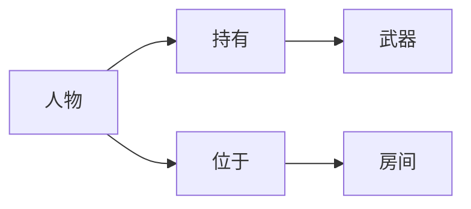
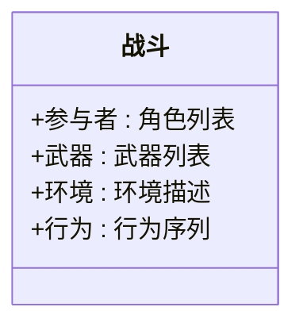
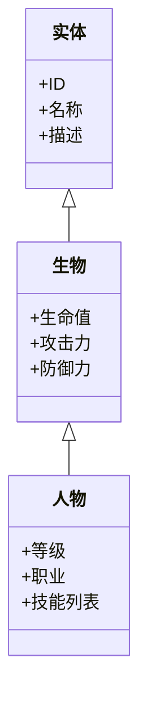

# AGI的游戏革命：沉浸式体验与智能游戏

## 1. 背景介绍

### 1.1 游戏行业的发展历程

游戏行业经历了从简单的文字冒险游戏到现代高度沉浸式的3D图形游戏的漫长发展历程。随着计算机硬件和图形处理能力的不断提高,游戏的视觉效果和交互体验也在不断改进。然而,传统游戏的人工智能(AI)系统仍然相对简单,主要依赖于预编码的规则和有限的决策树,无法提供真正的智能和适应性体验。

### 1.2 人工通用智能(AGI)的兴起

人工通用智能(Artificial General Intelligence, AGI)是指能够像人类一样拥有广泛的理解、学习、推理和解决问题能力的智能系统。AGI的出现有望彻底改变游戏行业,为玩家带来前所未有的沉浸式和智能化体验。

### 1.3 AGI游戏的机遇与挑战

AGI游戏具有巨大的潜力,可以创造出具有自主思维、情感和个性的虚拟角色,提供动态、适应性强的游戏世界和情节。然而,开发AGI游戏也面临着诸多挑战,如AGI系统的复杂性、计算能力需求、安全性和伦理问题等。

## 2. 核心概念与联系

### 2.1 人工智能与游戏

传统游戏中的人工智能主要包括以下几个方面:

- 路径规划和导航
- 决策制定
- 行为树
- 机器学习

这些技术为游戏提供了基本的智能行为,但仍然存在局限性,如缺乏真正的理解能力、适应性差等。

### 2.2 人工通用智能(AGI)

AGI旨在创造出具有人类般智能的系统,能够进行推理、学习、规划、解决问题等多种认知活动。AGI的核心概念包括:

- 知识表示
- 推理和学习算法
- 自我意识和元认知
- 情感和个性

### 2.3 AGI与游戏的融合

将AGI与游戏相结合,可以带来全新的游戏体验:

- 智能虚拟角色
- 动态适应的游戏世界
- 情节生成和故事讲述
- 个性化的玩家交互

同时,游戏也为AGI研究提供了一个理想的测试平台,可以模拟各种复杂的情境和任务。

## 3. 核心算法原理具体操作步骤  

### 3.1 知识表示

知识表示是AGI系统的基础,决定了系统能够理解和推理的范围。常用的知识表示方法包括:

- 语义网络
- 框架理论
- 描述逻辑
- 本体论

这些方法旨在以结构化的方式表示事物的概念、属性、关系等知识。

#### 3.1.1 语义网络

语义网络是一种基于图的知识表示方式,由节点(表示概念)和边(表示关系)组成。例如,我们可以用语义网络表示游戏中的角色、物品、位置等实体及其关系。



#### 3.1.2 框架理论

框架理论将知识组织为一系列的框架,每个框架代表一个概念或情景,包含了相关的属性和默认值。例如,我们可以定义一个"战斗"框架,包含参与者、武器、环境等槽位。



#### 3.1.3 描述逻辑

描述逻辑是一种基于符号的知识表示方法,使用一阶逻辑公理和规则来描述概念、属性和关系。例如,我们可以用描述逻辑定义游戏中的物品类别和继承关系。

```
物品 ⊆ 实体
武器 ⊆ 物品
剑 ⊆ 武器
∀x(剑(x) → ∃y(锋利(x,y) ∧ 金属(x,y)))
```

#### 3.1.4 本体论

本体论是一种形式化的知识表示方式,定义了领域中的概念、属性、关系及其约束条件。本体论常用于构建复杂的知识库,例如游戏世界的本体论可以包含地形、生物、魔法等多个模块。



### 3.2 推理和学习算法

AGI系统需要具备推理和学习的能力,以从已有知识中得出新的结论,并不断扩展和完善自身的知识库。常用的推理和学习算法包括:

- 逻辑推理
- 概率推理
- 机器学习算法
- 强化学习

#### 3.2.1 逻辑推理

逻辑推理是从一组前提出发,根据推理规则得出新的结论。常用的逻辑推理方法包括:

- 命题逻辑推理
- 一阶逻辑推理
- 非单调推理

例如,在游戏中,我们可以使用逻辑推理来判断某个角色是否可以打开一扇门:

$$
\begin{align}
&\text{前提1:} \quad \text{角色持有钥匙} \\
&\text{前提2:} \quad \forall x(\text{持有}(x, \text{钥匙}) \land \text{门锁}(y, \text{钥匙}) \rightarrow \text{可打开}(x, y)) \\
&\therefore \quad \text{角色可打开门}
\end{align}
$$

#### 3.2.2 概率推理

概率推理是基于不确定性知识进行推理,常用于处理噪声数据和不完整信息。主要方法包括:

- 贝叶斯网络
- 马尔可夫逻辑网络
- 粒子滤波

在游戏中,概率推理可以用于评估不同行为的风险和收益,或者估计敌人的位置和状态。

#### 3.2.3 机器学习算法

机器学习算法能够从数据中自动发现模式和规律,是AGI系统获取新知识的重要途径。常用的机器学习算法包括:

- 监督学习 (如决策树、支持向量机等)
- 非监督学习 (如聚类、降维等)
- 深度学习 (如卷积神经网络、递归神经网络等)

例如,我们可以使用深度强化学习训练一个智能体,让它学习如何在游戏中完成任务和获胜。

#### 3.2.4 强化学习

强化学习是一种基于反馈的学习方式,智能体通过与环境交互,获得奖励或惩罚,从而不断优化自身的策略。强化学习在游戏中有广泛应用,如训练AI玩家、自动解谜等。

常用的强化学习算法包括:

- Q-Learning
- Sarsa
- 策略梯度
- 深度Q网络 (DQN)

例如,我们可以使用DQN算法训练一个智能体玩超级马里奥游戏,根据游戏分数作为奖励,让智能体学习如何通过关卡。

### 3.3 自我意识和元认知

自我意识和元认知是AGI系统的高级能力,使其能够对自身的思维过程和知识状态进行监控和调节。

#### 3.3.1 自我意识

自我意识是指系统对自身存在的认知,包括自我模型、自我监控和自我调节等方面。具有自我意识的AGI系统能够:

- 区分自我与外部世界
- 评估自身的能力和局限性
- 根据情况调整自身的行为策略

在游戏中,自我意识可以让虚拟角色表现出更加真实的个性和情感,提高沉浸感。

#### 3.3.2 元认知

元认知是指对认知过程本身的思考和管理,包括:

- 监控自身的思维活动
- 评估思维策略的有效性
- 根据需要调整和重新规划

具备元认知能力的AGI系统能够:

- 发现和纠正自身的错误
- 制定解决复杂问题的策略
- 根据新信息动态调整知识库

在游戏中,元认知可以让AI更好地应对不确定情况,提高适应性和灵活性。

### 3.4 情感和个性

情感和个性是AGI系统的另一个重要方面,使其能够表现出人性化的行为,增强与用户的互动体验。

#### 3.4.1 情感模型

情感模型旨在模拟人类的情绪反应,包括:

- 基本情感 (如快乐、悲伤、愤怒等)
- 情感强度
- 情感持续时间
- 情感表达 (如面部表情、语音、姿态等)

常用的情感模型有:

- OCC模型 (Ortony、Clore和Collins模型)
- EMA模型 (EMotion and Adaptation模型)
- FLAME模型 (Fuzzy Logic Adaptive Model of Emotions)

在游戏中,情感模型可以让虚拟角色表现出更加丰富、真实的情感体验,增强玩家的代入感。

#### 3.4.2 个性模型

个性模型描述了智能体的行为倾向和特质,包括:

- 性格特征 (如外向、神经质、开放性等)
- 动机和价值观
- 习惯和偏好

常用的个性模型有:

- 五大人格特质模型
- BIS/BAS模型 (行为抑制/激活系统模型)
- MBTI模型 (Myers-Briggs类型指标模型)

在游戏中,个性模型可以让每个虚拟角色表现出独特的行为方式,增加游戏的多样性和可重复性。

## 4. 数学模型和公式详细讲解举例说明

### 4.1 马尔可夫决策过程 (MDP)

马尔可夫决策过程是强化学习中的一种数学框架,常用于建模智能体与环境的交互过程。MDP由以下要素组成:

- 状态集合 $\mathcal{S}$
- 动作集合 $\mathcal{A}$
- 转移概率 $\mathcal{P}_{ss'}^a = \mathcal{P}(s'|s,a)$
- 奖励函数 $\mathcal{R}_s^a$

其中,转移概率 $\mathcal{P}_{ss'}^a$ 表示在状态 $s$ 下执行动作 $a$ 后,转移到状态 $s'$ 的概率;奖励函数 $\mathcal{R}_s^a$ 表示在状态 $s$ 下执行动作 $a$ 所获得的即时奖励。

智能体的目标是找到一个策略 $\pi: \mathcal{S} \rightarrow \mathcal{A}$,使得从任意初始状态出发,按照该策略行动所获得的累积奖励的期望值最大化。

在游戏中,我们可以将游戏场景建模为MDP,其中:

- 状态 $s$ 表示游戏的当前状态 (如角色位置、生命值等)
- 动作 $a$ 表示可执行的操作 (如移动、攻击等)
- 转移概率 $\mathcal{P}_{ss'}^a$ 表示执行动作 $a$ 后,游戏状态转移到 $s'$ 的概率
- 奖励函数 $\mathcal{R}_s^a$ 表示执行动作 $a$ 所获得的分数或其他奖励

通过强化学习算法 (如Q-Learning、Deep Q-Network等),我们可以训练出一个最优策略 $\pi^*$,使智能体能够在游戏中获得最高分数。

### 4.2 蒙特卡罗树搜索 (MCTS)

蒙特卡罗树搜索是一种有效的决策制定算法,常用于具有大规模搜索空间的问题,如国际象棋、围棋等游戏。MCTS通过反复模拟和评估,逐步构建一棵搜索树,并根据