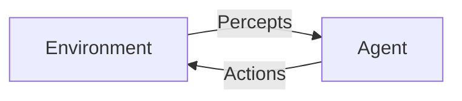

# AI Agent: AI的下一个风口 解决方案与研究方向

## 1. 背景介绍

### 1.1 人工智能发展历程

人工智能(Artificial Intelligence, AI)是当代科技发展的前沿领域,它的目标是创造出能够模仿人类智能行为的智能机器系统。自20世纪50年代AI概念被正式提出以来,经历了几个重要的发展阶段。

#### 1.1.1 AI的起步阶段

1956年,约翰·麦卡锡在达特茅斯学院举办的一个研讨会上首次使用了"人工智能"这个词语,这标志着AI的正式诞生。在这个阶段,研究人员主要关注于用符号系统来模拟人类的推理过程,如专家系统、博弈树搜索等。

#### 1.1.2 知识工程时期

60年代到80年代,AI进入了知识工程时期。研究人员开始尝试构建大型专家系统,试图将人类专家的知识形式化并编码到计算机程序中。这一时期取得了一些成就,但也暴露出符号主义AI的局限性。

#### 1.1.3 机器学习与神经网络兴起

80年代后期,机器学习和神经网络等新兴技术开始引起关注。这些技术能够从大量数据中自动提取模式和规律,而不需要人工编写规则。尤其是深度学习的兴起,使得AI在语音识别、图像识别、自然语言处理等领域取得了突破性进展。

#### 1.1.4 现代AI时代

进入21世纪以来,AI迎来了全新的发展机遇。大数据、云计算、GPU加速等技术为AI算法的训练和部署提供了强有力的支持。同时,AI也开始广泛应用于众多领域,如金融、医疗、交通、制造业等,成为推动社会进步的重要力量。

### 1.2 AI Agent的重要性

在现代AI系统中,AI Agent扮演着核心角色。AI Agent是指具有一定自主性、可以感知环境、做出决策并采取行动的智能体系。它是AI算法与现实世界交互的桥梁,决定着AI技术的实际应用效果。

发展高效、可靠的AI Agent,是实现通用人工智能(Artificial General Intelligence, AGI)的关键一步。只有让AI Agent能够像人一样灵活地处理复杂环境,掌握多种技能,并具备一定的自我意识和情感,我们才能真正走近AGI的目标。

因此,AI Agent已经成为AI领域的研究热点,吸引了众多科学家和工程师的关注。本文将重点探讨AI Agent的核心概念、关键技术,并对未来的发展方向进行前瞻性分析。

## 2. 核心概念与联系

### 2.1 智能体(Agent)

智能体是AI系统中的核心概念,指的是能够感知环境、做出决策并执行行为的实体。一个智能体通常包括以下几个关键组件:

- **感知器(Sensors)**: 用于获取环境信息的输入设备,如摄像头、麦克风、雷达等。
- **执行器(Actuators)**: 用于对环境产生影响的输出设备,如机械手臂、发声器等。
- **程序(Program)**: 根据感知信息做出决策,并发出指令控制执行器的核心算法。

智能体与环境之间是一个持续的交互过程,如下图所示:



智能体首先从环境中获取感知信息,然后根据程序对这些信息进行处理并做出决策,最后通过执行器对环境产生反作用。这种感知-决策-行动的循环不断重复,直到智能体完成既定目标。

### 2.2 有理性的智能体(Rational Agent)

一个理想的智能体应该做出"理性"的行为,即根据自身的感知信息,选择最优的行动序列来实现预期目标。形式化地,我们可以将有理性的智能体定义为:

$$
\text{有理性的智能体} = \underset{\text{Agent}}{\operatorname{argmax}} \sum_{t=0}^{\infty} \gamma^t R_t
$$

其中:
- $R_t$是智能体在时间t获得的奖励
- $\gamma \in [0, 1]$是折现因子,用于平衡当前和未来奖励的权重
- $\sum_{t=0}^{\infty} \gamma^t R_t$是智能体获得的累积奖励

有理性的智能体会选择一系列行动,使得预期的累积奖励最大化。这个形式化定义为AI Agent的设计提供了理论基础。

### 2.3 AI Agent类型

根据不同的任务特点和设计目标,AI Agent可以分为多种类型:

#### 2.3.1 反应型Agent

反应型Agent只根据当前的感知信息做出决策,不考虑过去的历史和未来的结果。这种Agent结构简单,适用于对实时性要求很高的场景,如机器人避障。

#### 2.3.2 基于模型的Agent

基于模型的Agent除了利用当前感知信息,还会根据内部状态转移模型预测未来可能的情况,从而做出更明智的决策。这种Agent通常需要更多的计算资源,但决策质量更高。

#### 2.3.3 基于目标的Agent

基于目标的Agent会根据给定的目标函数,选择能够最大程度实现目标的行为序列。这种Agent常见于游戏AI、机器人规划等领域。

#### 2.3.4 基于实用的Agent

基于实用的Agent会权衡当前行为所带来的即时奖励和长远影响,追求整体的最大效用。这是最接近"理性"的Agent类型,也是AGI所需要的关键能力。

#### 2.3.5 学习型Agent

学习型Agent不是基于预设的知识,而是通过与环境的持续互动,逐步优化自身的决策模型。这种Agent具有较强的适应性和发展潜力,是实现AGI的有力途径。

不同类型的Agent在设计复杂度、决策质量、适用场景等方面存在差异,研究人员需要根据具体需求选择合适的Agent架构。

## 3. 核心算法原理与具体操作步骤

### 3.1 马尔可夫决策过程

马尔可夫决策过程(Markov Decision Process, MDP)是研究有理性Agent行为的主要数学框架。一个MDP可以用一个五元组来表示:

$$
\langle S, A, P, R, \gamma \rangle
$$

其中:

- $S$是环境的状态集合
- $A$是智能体可执行的行动集合
- $P(s' \mid s, a)$是状态转移概率,表示在状态$s$执行行动$a$后,转移到状态$s'$的概率
- $R(s, a, s')$是奖励函数,表示在状态$s$执行行动$a$后,转移到状态$s'$所获得的即时奖励
- $\gamma \in [0, 1]$是折现因子,用于平衡当前和未来奖励的权重

在MDP框架下,智能体的目标是找到一个策略$\pi: S \rightarrow A$,使得预期的累积奖励最大化:

$$
\underset{\pi}{\operatorname{max}} \mathbb{E}\left[\sum_{t=0}^{\infty} \gamma^t R\left(s_t, a_t, s_{t+1}\right) \mid \pi\right]
$$

其中$s_t$和$a_t$分别表示在时间$t$的状态和行动。

#### 3.1.1 价值函数与贝尔曼方程

为了解决MDP问题,我们首先需要定义状态价值函数$V(s)$和行动价值函数$Q(s, a)$:

$$
\begin{aligned}
V^{\pi}(s) &=\mathbb{E}_{\pi}\left[\sum_{t=0}^{\infty} \gamma^t R\left(s_t, a_t, s_{t+1}\right) \mid s_0=s\right] \\
Q^{\pi}(s, a) &=\mathbb{E}_{\pi}\left[\sum_{t=0}^{\infty} \gamma^t R\left(s_t, a_t, s_{t+1}\right) \mid s_0=s, a_0=a\right]
\end{aligned}
$$

$V(s)$表示在状态$s$下,按照策略$\pi$执行所能获得的预期累积奖励。$Q(s, a)$则表示在状态$s$下执行行动$a$,之后按照策略$\pi$执行所能获得的预期累积奖励。

价值函数满足著名的贝尔曼方程:

$$
\begin{aligned}
V^{\pi}(s) &=\sum_{a \in A} \pi(a \mid s) Q^{\pi}(s, a) \\
Q^{\pi}(s, a) &=R(s, a)+\gamma \sum_{s^{\prime} \in S} P\left(s^{\prime} \mid s, a\right) V^{\pi}\left(s^{\prime}\right)
\end{aligned}
$$

贝尔曼方程为求解MDP提供了理论基础。如果我们知道了最优策略$\pi^*$对应的价值函数$V^*(s)$和$Q^*(s, a)$,那么就可以很容易地推导出最优策略:

$$
\pi^*(s)=\underset{a \in A}{\operatorname{argmax}} Q^*(s, a)
$$

#### 3.1.2 求解MDP的算法

基于贝尔曼方程,我们可以设计出多种算法来求解MDP问题,获得最优策略。常见的算法有:

1. **价值迭代(Value Iteration)**
2. **策略迭代(Policy Iteration)**
3. **Q-Learning**
4. **Sarsa**
5. **深度Q网络(Deep Q-Network, DQN)**

这些算法在计算复杂度、收敛速度、样本利用率等方面存在差异,需要根据具体问题的特点选择合适的算法。下面我们以Q-Learning为例,介绍其核心思想和操作步骤。

### 3.2 Q-Learning算法

Q-Learning是一种基于时间差分的强化学习算法,它可以在线更新行动价值函数$Q(s, a)$,而不需要提前知道环境的转移概率和奖励函数。算法的伪代码如下:

```python
初始化 Q(s, a) 
for each episode:
    初始化状态 s
    while s 不是终止状态:
        选择行动 a (基于 Q 值和探索策略)
        执行行动 a, 观察奖励 r 和新状态 s'
        Q(s, a) = Q(s, a) + α * (r + γ * max(Q(s', a')) - Q(s, a))
        s = s'
```

Q-Learning算法的核心步骤是:

1. 初始化$Q(s, a)$,通常将所有状态-行动对的值设为0或一个较小的常数。
2. 对于每个Episode(即一轮试验):
    - 从初始状态$s$开始
    - 对于当前状态$s$,根据某种策略(如$\epsilon$-贪婪策略)选择一个行动$a$
    - 执行选择的行动$a$,获得即时奖励$r$,并观察到新的状态$s'$
    - 根据贝尔曼方程更新$Q(s, a)$的估计值:
        
        $$
        Q(s, a) \leftarrow Q(s, a)+\alpha\left[r+\gamma \max _{a^{\prime}} Q\left(s^{\prime}, a^{\prime}\right)-Q(s, a)\right]
        $$
        
        其中$\alpha$是学习率,控制新知识的学习速度。
    - 将$s'$设为新的当前状态,重复上述过程直到达到终止状态。

3. 重复执行多个Episode,使$Q(s, a)$的估计值收敛到真实值。

通过不断与环境交互并更新$Q$值,Q-Learning算法可以逐步找到最优策略,而无需事先了解环境的精确模型。这种模型无关的特性使得Q-Learning在实际应用中非常有用。

需要注意的是,为了保证算法收敛,我们需要满足以下条件:

- 每个状态-行动对被探索无限次
- 学习率$\alpha$满足适当的衰减条件

Q-Learning算法的收敛性已经得到了理论证明,是解决MDP问题的有力工具。

## 4. 数学模型和公式详细讲解举例说明

在第3节中,我们介绍了马尔可夫决策过程(MDP)和Q-Learning算法的基本原理。现在让我们通过一个具体例子,深入探讨其中涉及的数学模型和公式。

### 4.1 示例:机器人导航问题

假设我们有一个机器人需要在一个$4