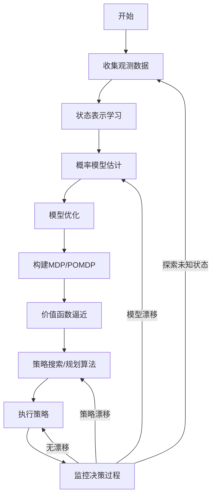

# AIAgent的决策框架:在不确定环境中做出明智选择

## 1.背景介绍

### 1.1 不确定性环境的挑战

在现实世界中,智能体(Agent)通常需要在复杂的不确定环境下做出决策和行动。这种不确定性可能来源于以下几个方面:

- **部分可观测性(Partial Observability)**: 智能体无法获取环境的全部信息,只能依赖有限的观测数据。
- **随机性(Stochasticity)**: 环境的转移具有随机性,相同的行动在不同状态下可能导致不同的结果。
- **动态变化(Dynamic)**: 环境状态会随时间动态变化,这使得决策需要及时响应。
- **多智能体交互(Multi-Agent Interaction)**: 存在其他智能体,它们的行为也会影响环境的变化。

在这种不确定环境下,智能体需要有效地感知环境、学习环境模型、制定决策策略,并根据反馈不断优化,这对传统的规则系统和算法带来了巨大挑战。

### 1.2 现有方法的局限性

目前,人工智能领域已经提出了一些处理不确定性的方法,但仍然存在局限性:

- **规则系统**: 编写规则来覆盖所有可能情况是困难的,缺乏灵活性和可扩展性。
- **经典规划算法**: 需要已知的确定性环境模型,无法处理随机性和部分可观测性。
- **强化学习**: 在复杂环境中收敛缓慢,存在样本效率低下和不稳定性等问题。
- **机器学习模型**: 大多基于监督学习,无法在线学习和决策,泛化能力有限。

因此,我们需要一种新的决策框架,能够在不确定环境中做出明智、高效和稳健的决策。

## 2.核心概念与联系

### 2.1 马尔可夫决策过程(MDP)

马尔可夫决策过程(Markov Decision Process, MDP)是研究不确定性环境中决策问题的基本框架。MDP由以下要素组成:

- **状态集合(State Space) S**: 环境可能的状态集合
- **行动集合(Action Space) A**: 智能体可执行的行动集合
- **转移概率(Transition Probability) P(s'|s,a)**: 在状态s执行行动a后,转移到状态s'的概率
- **奖励函数(Reward Function) R(s,a,s')**: 在状态s执行行动a并转移到s'时获得的即时奖励

MDP的目标是找到一个策略(Policy) π:S→A,使得期望的累积奖励最大化。

### 2.2 部分可观测马尔可夫决策过程(POMDP)

部分可观测马尔可夫决策过程(Partially Observable Markov Decision Process,POMDP)是MDP的推广,用于处理部分可观测性问题。POMDP在MDP的基础上增加了:

- **观测集合(Observation Space) Ω**: 智能体可获得的观测值集合
- **观测概率(Observation Probability) O(o|s',a)**: 在状态s'执行行动a后,获得观测o的概率

在POMDP中,智能体无法直接获取真实的环境状态,只能基于历史观测序列来估计状态并做出决策,这增加了问题的复杂度。

### 2.3 层次化机器学习决策框架

为了在不确定环境中做出明智决策,我们提出了一种层次化的机器学习决策框架,将问题分解为以下几个层次:

1. **环境建模层(Environment Modeling)**: 利用机器学习技术建立环境的概率模型,估计状态转移和观测概率分布。
2. **规划与控制层(Planning and Control)**: 基于环境模型,使用强化学习或其他规划算法,求解最优策略。
3. **元控制层(Meta-Control)**: 监控决策过程,根据反馈调整模型和策略,实现在线学习和自适应。

这种分层框架将复杂问题分解为相对简单的子问题,充分利用各种机器学习技术的优势,提高了决策的质量和效率。

## 3.核心算法原理具体操作步骤 

### 3.1 环境建模层

环境建模层的目标是从观测数据中学习环境的概率模型,即状态转移概率P(s'|s,a)和观测概率O(o|s',a)。主要采用以下技术:

1. **状态表示学习(State Representation Learning)**: 利用深度学习等技术从高维观测数据中提取状态特征,获得紧凑而信息丰富的状态表示。

2. **概率模型估计(Probabilistic Model Estimation)**: 基于状态表示,使用贝叶斯方法或生成模型(如变分自编码器)估计状态转移和观测的概率分布。

3. **模型优化(Model Optimization)**: 通过最大似然估计、对抗训练等方式优化概率模型的参数,提高模型的准确性和泛化能力。

4. **模型融合(Model Fusion)**: 将多个专家模型(如物理模型、数据驱动模型等)的预测结果融合,获得更加准确和鲁棒的环境模型。

具体操作步骤如下:

1. 收集观测数据,包括智能体执行的行动序列和对应的观测序列。
2. 使用无监督或自监督方法从观测数据中学习状态表示,例如自编码器、对比学习等。
3. 基于状态表示,使用生成模型(如变分自编码器)或贝叶斯方法估计状态转移概率P(s'|s,a)和观测概率O(o|s',a)。
4. 通过最大似然估计、对抗训练等方式优化概率模型的参数。
5. 可选地,将多个专家模型的预测结果融合,获得更加准确和鲁棒的环境模型。

### 3.2 规划与控制层

规划与控制层的目标是基于估计的环境模型,求解最优决策策略π(a|s)或π(a|o),使得期望的累积奖励最大化。主要采用以下技术:

1. **价值函数近似(Value Function Approximation)**: 使用深度神经网络等函数逼近器来表示状态价值函数V(s)或行动价值函数Q(s,a),从而处理大规模状态空间。

2. **策略搜索(Policy Search)**: 直接优化策略参数,使用策略梯度等方法在策略空间中搜索最优策略。

3. **规划算法(Planning Algorithms)**: 针对POMDP问题,使用蒙特卡罗树搜索、点基值迭代等算法求解最优策略。

4. **层次化控制(Hierarchical Control)**: 将复杂任务分解为子任务,使用选项框架(Option Framework)或层次强化学习(Hierarchical RL)等方法实现多层次控制。

5. **多智能体协调(Multi-Agent Coordination)**: 在多智能体环境中,使用协作或竞争的方法协调各智能体的行为。

具体操作步骤如下:

1. 基于估计的环境模型,构建马尔可夫决策过程(MDP)或部分可观测马尔可夫决策过程(POMDP)。
2. 使用深度神经网络等函数逼近器表示状态价值函数V(s)或行动价值函数Q(s,a)。
3. 使用策略梯度、Q-Learning等强化学习算法优化价值函数或直接搜索最优策略。
4. 对于POMDP问题,可使用蒙特卡罗树搜索、点基值迭代等专门算法求解。
5. 如果任务具有层次结构,可使用选项框架或层次强化学习进行分层控制。
6. 在多智能体环境中,使用协作或竞争的方法协调各智能体的行为。

### 3.3 元控制层

元控制层的目标是监控决策过程,根据反馈调整模型和策略参数,实现在线学习和自适应。主要采用以下技术:

1. **模型增量学习(Model Incremental Learning)**: 在新的观测数据到来时,增量式地更新环境模型,使其能够持续学习和适应环境变化。

2. **策略优化(Policy Optimization)**: 基于环境模型的变化和实际执行效果,不断优化和调整决策策略。

3. **自我监控(Self-Monitoring)**: 通过监控决策过程的各项指标(如奖励、不确定性等),检测模型或策略的漂移,触发模型和策略的更新。

4. **自主探索(Autonomous Exploration)**: 根据当前模型的不确定性和策略的熵,主动探索未知状态以获取更多信息。

5. **元学习(Meta Learning)**: 使用元学习等技术,学习如何快速适应新环境,提高泛化能力和样本效率。

具体操作步骤如下:

1. 在执行决策策略的同时,持续收集新的观测数据。
2. 使用增量式学习方法,根据新数据更新环境模型的参数。
3. 监控决策过程的各项指标,如奖励、不确定性、策略熵等。
4. 当检测到模型或策略的漂移时,触发模型和策略的优化更新。
5. 根据模型的不确定性和策略熵,主动探索未知状态以获取更多信息。
6. 可选地,使用元学习等技术提高快速适应新环境的能力。

### 3.4 算法流程图

以下是该层次化机器学习决策框架的总体算法流程:

该框架的核心思想是:

1. 从观测数据中学习环境的概率模型
2. 基于环境模型求解最优决策策略
3. 执行策略并监控决策过程
4. 根据反馈调整模型和策略,实现在线学习和自适应

通过分层设计和反馈控制,该框架能够在不确定环境中做出明智、高效和稳健的决策。

## 4.数学模型和公式详细讲解举例说明

### 4.1 马尔可夫决策过程(MDP)

马尔可夫决策过程(MDP)是研究不确定性环境中决策问题的基本框架,由一个五元组(S, A, P, R, γ)定义:

- S是状态集合(State Space)
- A是行动集合(Action Space) 
- P(s'|s,a)是状态转移概率(Transition Probability),表示在状态s执行行动a后,转移到状态s'的概率
- R(s,a,s')是奖励函数(Reward Function),表示在状态s执行行动a并转移到s'时获得的即时奖励
- γ∈[0,1)是折现因子(Discount Factor),用于权衡即时奖励和长期奖励

MDP的目标是找到一个策略(Policy)π:S→A,使得期望的累积折现奖励最大化:

$$J(\pi) = \mathbb{E}_\pi\left[\sum_{t=0}^\infty \gamma^t R(s_t, a_t, s_{t+1})\right]$$

其中,期望是关于状态序列{s_0,s_1,...}和行动序列{a_0,a_1,...}的联合概率分布计算的,该分布由初始状态概率P(s_0)、状态转移概率P(s'|s,a)和策略π(a|s)共同决定。

对于有限MDP,可以使用动态规划算法(如价值迭代、策略迭代等)求解最优策略。对于大规模MDP,通常使用函数逼近的方法(如深度Q网络)来近似价值函数或直接搜索策略空间。

### 4.2 部分可观测马尔可夫决策过程(POMDP)

部分可观测马尔可夫决策过程(POMDP)是MDP的推广,用于处理部分可观测性问题。POMDP由一个七元组(S, A, P, R, Ω, O, γ)定义:

- S, A, P, R, γ与MDP中的定义相同
- Ω是观测集合(Observation Space)
- O(o|s',a)是观测概率(Observation Probability),表示在状态s'