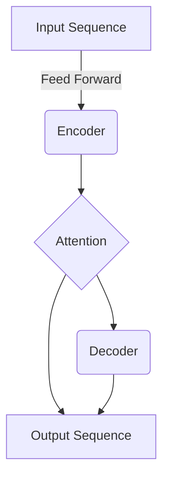

# AIGC从入门到实战：落霞与孤鹜齐飞：AIGC汹涌而来

## 1. 背景介绍

### 1.1 人工智能的崛起

人工智能(Artificial Intelligence, AI)作为一门富有前景的科学,已经渗透到我们生活的方方面面。从语音助手到自动驾驶汽车,从医疗诊断到金融风险评估,AI无处不在。随着算力的不断增长和算法的不断优化,AI的能力也在与日俱增。

### 1.2 生成式人工智能(Generative AI)的兴起

生成式人工智能(Generative AI, 简称AIGC)是AI的一个重要分支,它能够基于输入的数据或指令,生成新的、原创性的内容,如文本、图像、音频、视频等。AIGC的崛起源于深度学习算法的突破,特别是生成对抗网络(Generative Adversarial Networks, GANs)和变分自编码器(Variational Autoencoders, VAEs)等模型的出现。

### 1.3 AIGC的影响力

AIGC正在对各行各业产生深远影响。它可以帮助创作者生成原创内容,加速内容生产;可以为企业提供个性化的营销素材;可以在教育领域生成交互式学习资源;在科研领域,AIGC也可以加速科学发现的进程。AIGC的出现,正在重塑人类的工作和生活方式。

## 2. 核心概念与联系

### 2.1 生成式对抗网络(GANs)

#### 2.1.1 GAN的工作原理

GAN由两个神经网络组成:生成器(Generator)和判别器(Discriminator)。生成器从随机噪声中生成假数据,而判别器则试图区分生成的数据是真是假。两个网络相互对抗,生成器努力生成更逼真的数据以欺骗判别器,而判别器则努力提高区分真伪的能力。经过足够的训练后,生成器可以生成高质量的数据。

$$
\min_G \max_D V(D,G) = \mathbb{E}_{x\sim p_\text{data}(x)}\big[\log D(x)\big] + \mathbb{E}_{z\sim p_z(z)}\big[\log(1-D(G(z)))\big]
$$

上式是GAN的目标函数,其中$G$试图最小化这个值,而$D$试图最大化这个值。

#### 2.1.2 GAN的变体

除了原始GAN,还有许多变体被提出,如条件GAN(Conditional GANs)、循环GAN(Cycle GANs)、进化GAN(Evolutionary GANs)等,用于解决不同的任务。

### 2.2 变分自编码器(VAEs)

#### 2.2.1 VAE的工作原理

VAE是一种生成模型,它由编码器(Encoder)和解码器(Decoder)组成。编码器将输入数据压缩为潜在空间中的一个点,而解码器则从该点重建原始数据。通过最大化重建数据的概率,VAE可以学习数据的潜在表示。

$$
\mathcal{L}(\theta,\phi;x) = \mathbb{E}_{q_\phi(z|x)}\big[\log p_\theta(x|z)\big] - \beta D_{KL}\big(q_\phi(z|x) \| p(z)\big)
$$

上式是VAE的证据下界(Evidence Lower Bound),其中第一项是重建项,第二项是KL散度项,用于约束潜在空间的分布接近先验分布。

#### 2.2.2 VAE的应用

VAE广泛应用于图像、视频、语音等领域的生成任务。它还可以用于数据压缩、半监督学习等任务。

### 2.3 Transformer

#### 2.3.1 Transformer的结构

Transformer是一种基于注意力机制的序列到序列模型,由编码器(Encoder)和解码器(Decoder)组成。编码器将输入序列映射为上下文向量表示,解码器则根据上下文向量和输出序列生成目标序列。

#### 2.3.2 Transformer在AIGC中的应用

Transformer模型在自然语言处理、计算机视觉等领域取得了巨大成功,也是当前主流的AIGC模型的核心。GPT、DALL-E、PaLM等知名模型均基于Transformer架构。

### 2.4 扩散模型(Diffusion Models)

#### 2.4.1 扩散模型的工作原理

扩散模型是一种新兴的生成模型,它通过逆向扩散过程从纯噪声中生成数据。具体来说,模型先将数据逐步添加噪声,再学习从纯噪声中重建原始数据的过程。

$$
q(x_t|x_0) = \mathcal{N}(x_t;\sqrt{1-\beta_t}x_0,\beta_tI)\\
p_\theta(x_{t-1}|x_t) = \mathcal{N}(x_{t-1};\mu_\theta(x_t,t),\Sigma_\theta(x_t,t))
$$

上式描述了扩散过程$q$和逆扩散过程$p_\theta$,通过学习$\mu_\theta$和$\Sigma_\theta$,模型可以从噪声中生成数据。

#### 2.4.2 扩散模型在AIGC中的应用

扩散模型可以生成高质量的图像、音频和视频,在AIGC领域备受关注。Stable Diffusion、DALLE-2等知名模型均采用了扩散模型。

## 3. 核心算法原理具体操作步骤

### 3.1 生成对抗网络(GAN)训练步骤

1. **准备数据集**:收集并预处理训练数据,如图像、文本等。
2. **定义生成器和判别器**:设计神经网络结构,如卷积网络用于图像生成。
3. **训练模型**:交替训练生成器和判别器,生成器目标是最小化判别器的判别能力,判别器则最大化判别能力。
4. **评估模型**:使用评估指标(如FID、IS)检查生成数据的质量。
5. **微调模型**:根据评估结果,调整网络结构、超参数等,重复训练直至满意。

### 3.2 变分自编码器(VAE)训练步骤  

1. **准备数据集**:收集并预处理训练数据。
2. **定义VAE结构**:设计编码器和解码器网络,确定潜在空间维度。
3. **训练模型**:最大化证据下界,同时重建数据并将潜在分布拉近先验分布。
4. **评估模型**:检查重建质量、潜在空间特征等。
5. **微调模型**:根据评估结果调整网络结构、超参数等,重复训练。

### 3.3 Transformer模型训练步骤

1. **准备数据集**:收集并预处理序列数据,如文本语料。
2. **构建Transformer模型**:设计编码器、解码器和注意力层。
3. **训练模型**:最小化序列到序列的损失函数,如交叉熵损失。
4. **评估模型**:使用指标(如BLEU、ROUGE)评估模型性能。  
5. **微调模型**:根据评估结果调整模型结构、超参数等,重复训练。

### 3.4 扩散模型训练步骤

1. **准备数据集**:收集并预处理训练数据,如图像。
2. **定义扩散过程**:设计噪声schedule和扩散过程$q$。
3. **构建逆扩散模型**:设计神经网络$\mu_\theta$和$\Sigma_\theta$。
4. **训练模型**:最小化逆扩散过程与真实数据的差异。
5. **评估模型**:检查生成数据质量、计算评估指标。
6. **微调模型**:根据评估结果调整噪声schedule、网络结构等,重复训练。

## 4. 数学模型和公式详细讲解举例说明

### 4.1 生成对抗网络(GAN)

在2.1.1节中,我们介绍了GAN的目标函数:

$$
\min_G \max_D V(D,G) = \mathbb{E}_{x\sim p_\text{data}(x)}\big[\log D(x)\big] + \mathbb{E}_{z\sim p_z(z)}\big[\log(1-D(G(z)))\big]
$$

该目标函数由两部分组成:

1. $\mathbb{E}_{x\sim p_\text{data}(x)}\big[\log D(x)\big]$:这是判别器对真实数据的期望输出,判别器希望这一项最大化,即对真实数据的判别概率越大越好。

2. $\mathbb{E}_{z\sim p_z(z)}\big[\log(1-D(G(z)))\big]$:这是判别器对生成数据的期望输出,判别器希望这一项最小化,即对生成数据的判别概率越小越好。

生成器$G$的目标是最小化这个目标函数,即生成越逼真的数据来欺骗判别器;而判别器$D$的目标是最大化这个目标函数,即提高对真伪数据的判别能力。

通过这种对抗训练,生成器和判别器相互促进,最终达到一个纳什均衡,此时生成器可以生成高质量的数据。

让我们来看一个实例,假设我们要生成手写数字图像。我们可以定义如下GAN结构:

- 生成器$G$:一个上采样卷积网络,将随机噪声$z$映射为图像$G(z)$。
- 判别器$D$:一个下采样卷积网络,将图像$x$映射为真伪概率$D(x)$。

在训练过程中,我们交替优化生成器和判别器:

1. 固定生成器$G$,最大化$\mathbb{E}_{x\sim p_\text{data}(x)}\big[\log D(x)\big] + \mathbb{E}_{z\sim p_z(z)}\big[\log(1-D(G(z)))\big]$,更新判别器$D$的参数。

2. 固定判别器$D$,最小化$\mathbb{E}_{z\sim p_z(z)}\big[\log(1-D(G(z)))\big]$,更新生成器$G$的参数。

通过多轮训练,生成器最终可以生成逼真的手写数字图像。

### 4.2 变分自编码器(VAE)

在2.2.1节中,我们介绍了VAE的证据下界(Evidence Lower Bound):

$$
\mathcal{L}(\theta,\phi;x) = \mathbb{E}_{q_\phi(z|x)}\big[\log p_\theta(x|z)\big] - \beta D_{KL}\big(q_\phi(z|x) \| p(z)\big)
$$

该目标函数也由两部分组成:

1. $\mathbb{E}_{q_\phi(z|x)}\big[\log p_\theta(x|z)\big]$:这是重建项,即根据潜在码$z$重建数据$x$的期望对数似然。我们希望这一项最大化,即重建质量越高越好。

2. $D_{KL}\big(q_\phi(z|x) \| p(z)\big)$:这是KL散度项,用于约束潜在码$z$的分布$q_\phi(z|x)$接近先验分布$p(z)$,通常取标准正态分布。$\beta$是一个权重系数。

在训练VAE时,我们最大化证据下界$\mathcal{L}(\theta,\phi;x)$,即同时最大化重建项和最小化KL散度项。这样可以使VAE学习数据的紧凑潜在表示,并具有良好的生成能力。

让我们来看一个实例,假设我们要构建一个能生成手写数字图像的VAE模型。我们可以定义如下结构:

- 编码器$q_\phi(z|x)$:一个下采样卷积网络,将图像$x$编码为均值$\mu$和方差$\Sigma$,再通过重参数技巧得到潜在码$z$。
- 解码器$p_\theta(x|z)$:一个上采样卷积网络,将潜在码$z$解码为图像$\hat{x}$。

在训练过程中,我们最大化如下损失函数:

$$
\mathcal{L}(\theta,\phi;x) = \mathbb{E}_{q_\phi(z|x)}\big[\log p_\theta(x|z)\big] - \beta D_{KL}\big(q_\phi(z|x) \| \mathcal{N}(0,I)\big)
$$

其中第一项是重建项,我们使用像素wise的交叉熵损失;第二项是KL散度项,我们将$q_\phi(