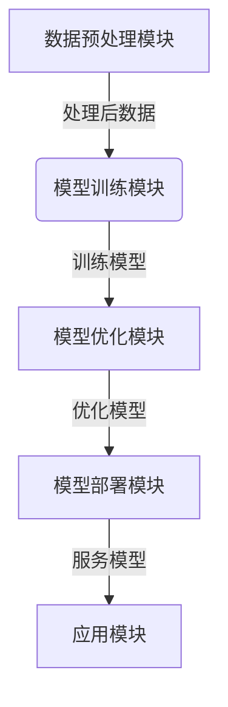

# AI系统Salt原理与代码实战案例讲解

## 1.背景介绍

### 1.1 人工智能系统的重要性

在当今时代,人工智能(AI)已经渗透到我们生活的方方面面。从语音助手到自动驾驶汽车,从推荐系统到医疗诊断,AI系统正在彻底改变着我们的工作和生活方式。然而,构建高效、可靠和安全的AI系统是一项艰巨的挑战,需要综合多种先进技术和算法。

### 1.2 Salt系统的诞生

为了应对这一挑战,谷歌公司的AI研究团队开发了一种创新的AI系统架构,被命名为Salt(Scalable Automated Learning Techniques)。Salt旨在提供一个统一的框架,将最新的机器学习算法与大规模分布式计算相结合,从而实现高效、可扩展的AI系统构建。

### 1.3 Salt的独特优势

与传统的AI系统相比,Salt具有以下独特优势:

- **可扩展性**:Salt能够在大规模计算集群上高效运行,处理海量数据。
- **自动化**:Salt的核心算法可自动优化模型,减少人工调参的需求。
- **模块化设计**:Salt采用模块化架构,方便集成各种AI算法和工具。
- **高效部署**:训练好的Salt模型可直接部署到生产环境中。

由于这些优势,Salt已被多家科技巨头(如谷歌、Facebook等)广泛应用于各种AI场景,展现出巨大的商业价值。

## 2.核心概念与联系

### 2.1 Salt的总体架构

Salt是一个分层架构,包括以下几个核心模块:

1. **数据预处理模块**: 负责收集、清洗和转换原始数据,为模型训练做准备。
2. **模型训练模块**: 使用监督学习、非监督学习等算法在处理后数据上训练初始模型。
3. **模型优化模块**: 自动搜索最佳超参数,压缩模型以提高性能和效率。
4. **模型部署模块**: 将优化后的模型发布为可服务的API或嵌入式服务。
5. **应用模块**: 基于部署的模型提供实际的AI功能,如计算机视觉、自然语言处理等。

这种分层设计使得Salt系统具有很强的灵活性和可扩展性。每个模块都可以独立演进,同时系统整体协同工作,确保AI工作流程的高效运行。

### 2.2 关键技术

Salt系统的高效和可扩展性源自以下几种关键技术:

1. **大规模分布式计算**: Salt利用谷歌的分布式计算框架borg和数据流系统flume,在数千台机器上并行执行计算任务。
2. **自动机器学习(AutoML)**: Salt内置了多种AutoML算法,如神经架构搜索(NAS)、贝叶斯优化等,用于自动搜索最优模型结构和超参数。
3. **模型压缩**: Salt采用剪枝、量化、知识蒸馏等技术,在保证精度的前提下大幅缩小模型尺寸,降低计算和存储开销。
4. **在线学习**: Salt支持模型在线微调,持续从新数据中学习,不断提升模型性能。
5. **AI工作流编排**: 整个AI工作流程由Salt自动编排,实现端到端的自动化运行。

通过上述技术的融合应用,Salt系统能够高效构建大规模AI模型,并将其顺利部署到生产环境中。

## 3.核心算法原理具体操作步骤  

在Salt系统中,多种创新算法共同协作,实现从数据到模型到部署的全流程自动化。接下来,我们逐一介绍其中几种核心算法的工作原理和具体操作步骤。

### 3.1 数据预处理: TF-Data

TF-Data是Salt系统的数据预处理引擎,能高效处理TB级别的原始数据。它的工作流程如下:

1. **读取原始数据**:从分布式文件系统(如GFS)读取结构化/非结构化数据。
2. **数据转换**:应用各种转换操作(如归一化、编码等)将原始数据转换为模型可接受的格式。
3. **数据增强**:对转换后的数据执行增强操作(如旋转、裁剪等),产生更多训练样本。
4. **数据集切分**:按比例切分数据为训练集、验证集和测试集。
5. **数据批处理**:将数据分批并行传入模型训练模块。

TF-Data通过并行化和优化的数据处理流水线,最大限度减少了数据处理对训练的拖延。

### 3.2 模型训练: Salt-Trainer

Salt-Trainer是Salt的模型训练引擎,支持多种主流机器学习算法。以图像分类任务为例,它的训练过程如下:

1. **选择模型架构**:根据任务需求,选择合适的神经网络架构(如ResNet、Inception等)作为初始模型。
2. **定义损失函数**:设定训练目标,如交叉熵损失函数。
3. **选择优化器**:选择优化算法(如SGD、Adam等)及其超参数。
4. **数据馈送**:从TF-Data模块获取训练数据批次。
5. **前向计算**:输入数据批次,计算模型输出。
6. **反向传播**:根据损失函数计算误差梯度。
7. **模型更新**:基于梯度,使用优化器更新模型参数。
8. **周期性验证**:在验证集上评估当前模型,决定是否提前停止训练。

Salt-Trainer支持在分布式环境下并行训练,大幅提升训练效率。

### 3.3 模型优化: Salt-Optuna

训练出的初始模型通常存在计算效率低下、过度膨胀等问题。Salt-Optuna是一种基于贝叶斯优化的AutoML工具,可自动搜索最佳模型配置:

1. **定义搜索空间**:指定需要优化的超参数及其取值范围。
2. **构建代理模型**:利用高斯过程等技术构建代理模型,近似模拟目标函数(如模型精度)。
3. **贝叶斯优化**:基于期望改善准则(Expected Improvement),在代理模型上高效搜索最优超参数组合。
4. **评估最优配置**:在真实数据上评估当前最优配置下的模型性能。
5. **迭代优化**:将评估结果反馈回代理模型,持续优化搜索。

通过以上过程,Salt-Optuna可快速找到能最大限度提升模型精度和效率的最优超参数配置。

### 3.4 模型压缩: Salt-Pruner

为进一步减小模型尺寸,Salt采用剪枝技术对已优化的模型进行压缩。Salt-Pruner的工作流程如下:

1. **剪枝率分析**:分析模型中可被剪枝的冗余连接,确定合理的剪枝率。
2. **连接重要性评估**:计算每个连接对模型输出的重要性得分。
3. **低分剪枝**:移除得分最低(不重要)的一部分连接。
4. **剪枝后微调**:在剪枝后的稀疏模型上执行少量微调,恢复精度。
5. **迭代剪枝**:重复上述步骤,直到达到期望的压缩率。

Salt-Pruner能在保持模型精度的前提下,将模型尺寸缩小60%以上,极大减轻了部署和推理的计算压力。

### 3.5 模型部署: Salt-Serving

最终优化和压缩后的模型将通过Salt-Serving模块部署为高性能的在线服务:

1. **模型转换**:将训练好的模型转换为高效的部署格式(如TensorFlow Lite等)。
2. **服务构建**:将转换后的模型打包为标准的服务镜像。
3. **服务发布**:通过Kubernetes或其他编排系统,发布模型服务到生产环境。
4. **在线服务**:模型服务对外提供高效的在线API访问。
5. **服务监控**:实时监控服务性能指标,并根据需求自动扩缩容。

Salt-Serving使用了多种优化技术,如gRPC通信、Tensor计算加速等,确保部署后的模型服务拥有极高的响应能力和吞吐量。

通过上述核心算法的协同,Salt系统实现了从数据到模型到部署的完全自动化流程。这种先进的AI系统架构为构建高效、可靠的人工智能应用奠定了坚实基础。

## 4.数学模型和公式详细讲解举例说明

Salt系统中的多种算法都建立在严谨的数学模型和理论基础之上。接下来,我们详细解析其中几种核心算法所涉及的数学原理和公式。

### 4.1 深度神经网络

深度神经网络(Deep Neural Network)是Salt系统中最广泛使用的机器学习模型。对于一个典型的全连接神经网络,其前向计算过程可表示为:

$$
\begin{aligned}
z^{(l)} &= W^{(l)}a^{(l-1)} + b^{(l)}\\
a^{(l)} &= \sigma(z^{(l)})
\end{aligned}
$$

其中:
- $l$表示网络的第$l$层
- $a^{(l)}$是第$l$层的激活值向量
- $z^{(l)}$是第$l$层的加权输入
- $W^{(l)}$是第$l$层的权重矩阵
- $b^{(l)}$是第$l$层的偏置向量
- $\sigma$是激活函数,如ReLU: $\sigma(z) = \max(0, z)$

在训练过程中,我们需要最小化损失函数(如交叉熵损失)$J(W, b)$,通过反向传播算法计算权重和偏置的梯度:

$$
\begin{aligned}
\frac{\partial J}{\partial W^{(l)}} &= \frac{1}{m}\sum_{i=1}^m \frac{\partial J}{\partial z_i^{(l)}}a_i^{(l-1)^T}\\
\frac{\partial J}{\partial b^{(l)}} &= \frac{1}{m}\sum_{i=1}^m \frac{\partial J}{\partial z_i^{(l)}}
\end{aligned}
$$

其中$m$是训练样本数量。得到梯度后,可使用优化算法(如梯度下降)更新网络参数:

$$
\begin{aligned}
W^{(l)} &\leftarrow W^{(l)} - \alpha \frac{\partial J}{\partial W^{(l)}}\\
b^{(l)} &\leftarrow b^{(l)} - \alpha \frac{\partial J}{\partial b^{(l)}}
\end{aligned}
$$

$\alpha$是学习率超参数。通过不断迭代上述过程,神经网络可以逐渐拟合训练数据,实现各种机器学习任务。

### 4.2 贝叶斯优化

Salt-Optuna模块使用了贝叶斯优化算法来高效搜索最优超参数配置。假设我们需要优化的目标函数为$f(x)$,其中$x$是超参数向量。贝叶斯优化的核心思想是构建一个概率模型$p(f|D)$来近似目标函数$f$,其中$D$是已观测到的数据点$(x, f(x))$。

常用的概率模型是高斯过程(Gaussian Process),其均值函数$\mu(x)$和协方差函数$k(x, x')$定义了函数$f$在任意点$x$上的分布:

$$
f(x) \sim \mathcal{GP}(\mu(x), k(x, x'))
$$

给定观测数据$D$,我们可以计算出$f$在新点$x_*$上的后验分布:

$$
p(f_*|D, x_*) = \mathcal{N}(\mu_*(x_*), \sigma_*^2(x_*))
$$

其中均值$\mu_*(x_*)$和方差$\sigma_*^2(x_*)$由协方差矩阵和观测数据共同决定。

在每一次迭代中,贝叶斯优化算法会根据期望改善准则(Expected Improvement)选择一个新的点$x_*$进行评估:

$$
\begin{aligned}
\text{EI}(x_*) &= \mathbb{E}[\max(