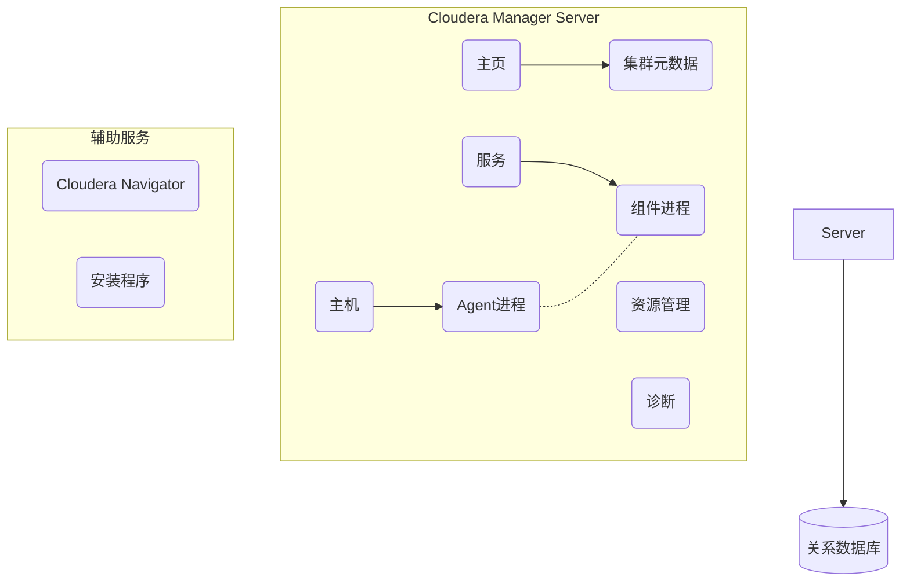

# Cloudera Manager原理与代码实例讲解

## 1.背景介绍

### 1.1 大数据时代的到来

随着互联网、移动互联网、物联网的迅猛发展,海量的结构化和非结构化数据如雪片般倾泻而来,传统的数据存储和处理方式已经无法满足现代企业对数据处理的需求。大数据时代的到来,给企业带来了巨大的机遇和挑战。

### 1.2 大数据生态系统

为了应对大数据带来的挑战,Apache开源社区孕育了一系列分布式大数据处理框架,如Hadoop、Spark、Kafka、HBase等,它们共同构成了大数据生态系统。这些框架各自侧重不同的领域,相互配合,为企业提供了从数据存储、计算到数据分析的一整套解决方案。

### 1.3 大数据平台管理的挑战

然而,大数据生态系统由众多组件组成,每个组件都有复杂的配置参数和依赖关系,给集群的部署、配置、监控和管理带来了巨大的挑战。手动管理大数据集群不仅效率低下,而且容易出错,迫切需要一款强大的集群管理工具。

## 2.核心概念与联系

### 2.1 Cloudera Manager概述

Cloudera Manager是Cloudera公司推出的一款用于管理Hadoop集群的综合性工具。它提供了集群部署、配置、监控、报警、诊断、服务管理等一站式功能,极大地简化了Hadoop集群的运维工作。

### 2.2 Cloudera Manager架构

Cloudera Manager采用了分布式的架构设计,主要由以下几个核心组件组成:

#### 2.2.1 Server

Server是Cloudera Manager的大脑和管理中心,负责维护集群的所有元数据,并通过代理与各个主机进行通信。它由几个重要的子模块组成:

- **主页(Home)**: 提供集群的整体视图和运行状态。
- **主机(Hosts)**: 显示集群中所有主机的状态和指标。
- **服务(Services)**: 用于管理集群中的各种大数据服务。
- **资源管理(Resource Management)**: 监控和管理集群资源的使用情况。
- **诊断(Diagnostics)**: 提供集群运行状况的诊断和建议。

#### 2.2.2 Agent

Agent是运行在每个集群节点上的代理程序,负责监控主机状态并执行Server下发的命令,是Server与主机之间的桥梁。

#### 2.2.3 数据库

Cloudera Manager使用关系型数据库(MySQL/Oracle)来存储集群的配置信息、监控数据和审计日志等元数据。

#### 2.2.4 Cloudera管理服务

Cloudera Manager还包括一些辅助服务,如Cloudera Navigator(数据管理)、Cloudera Manager安装程序等。

#### 2.2.5 架构示意图

下图展示了Cloudera Manager的整体架构:

### 2.3 Cloudera Manager与Hadoop生态圈的关系

Cloudera Manager是对Hadoop生态系统进行统一管理和监控的工具,它并不直接参与数据的存储和计算,而是管理和协调各个Hadoop组件的运行。常见的Hadoop组件包括:

- **HDFS**: 分布式文件系统,用于数据存储。
- **YARN**: 资源管理和任务调度框架。
- **MapReduce**: 用于并行处理大规模数据集的编程模型。
- **Spark**: 内存计算框架,提供批处理、交互式查询等功能。
- **Hive**: 基于SQL的数据仓库工具。
- **Impala**: 实时分析数据库,支持对存储在HDFS的数据进行低延迟的SQL查询。
- **HBase**: 分布式列存NoSQL数据库。
- **Kafka**: 分布式流式处理平台。
- **Solr/Kudu**: 提供搜索和分析功能。
- **Zookeeper**: 分布式协调服务。

Cloudera Manager负责安装、配置、启动和监控这些组件,并根据需要对它们进行扩缩容、滚动升级等操作,从而实现对整个Hadoop生态系统的统一管理。

## 3.核心算法原理具体操作步骤

### 3.1 角色分配算法

在集群启动时,Cloudera Manager需要根据主机的硬件配置和服务的部署拓扑,为每个服务组件分配最佳的主机。这是一个经典的资源分配问题,Cloudera Manager采用了基于约束的优化算法来解决。

#### 3.1.1 算法输入

- 主机池(Host Pool):集群中所有可用的主机资源。
- 组件列表(Component List):待部署的所有服务组件。
- 拓扑约束(Topology Constraints):每个组件的部署拓扑要求,如是否允许多实例共存一个主机。
- 硬件约束(Hardware Constraints):每个组件对主机硬件的要求,如CPU、内存、磁盘等。

#### 3.1.2 算法步骤

1. **构建主机组**:根据拓扑约束,将主机池划分为若干个不相交的主机组。
2. **评分**:对每个主机组中的主机,根据其硬件配置给出评分,评分高的主机优先考虑。
3. **贪婪分配**:遍历组件列表,对于每个组件:
    - 根据拓扑约束,确定其可以部署的主机组集合。
    - 在这些主机组中,选择评分最高的主机组。
    - 在该主机组内,选择评分最高的主机,将组件实例部署在其上。
    - 更新已分配主机的剩余资源,并对应调整评分。
4. **反馈调整**:如果有组件无法获得足够资源,则需要重新分配,直到所有组件都能部署成功。

该算法的时间复杂度为$O(n^2)$,其中$n$为主机数量。它能给出一个相对最优的部署方案,但无法保证是全局最优解。

### 3.2 监控数据处理流程

Cloudera Manager需要持续采集集群中所有组件的运行指标,并对采集到的海量监控数据进行处理、存储和展示。

#### 3.2.1 数据采集

每个Agent会周期性地调用主机查询语言(Host Query Language)从本机采集指标数据,并将其发送到Server端。

#### 3.2.2 数据处理

Server端的监控数据处理流程如下:

1. **数据接收**:Server端的监控数据接收器(Monitor Receiver)从各Agent接收指标数据流。
2. **数据分发**:接收器将数据分发给多个监控数据处理器(Monitor Processor)。
3. **数据缓存**:处理器将数据临时缓存在内存队列中。
4. **持久化存储**:处理器将缓存的数据批量写入关系数据库。
5. **内存交换**:为了避免内存不足,处理器会定期将内存中的数据写入磁盘交换文件。

该流程采用了生产者-消费者模型和内存缓存机制,能高效地处理大量的监控数据流。

#### 3.2.3 数据展示

展示层从数据库中查询指标数据,并通过图表和报表的形式呈现给用户,帮助用户实时监控集群的运行状态。

### 3.3 故障自动恢复

Cloudera Manager内置了一种基于策略的故障自动恢复机制,可以在发生故障时自动重启发生故障的进程。

#### 3.3.1 工作原理

1. **故障探测**:Agent会周期性地检查本机的所有进程,如果发现进程异常退出,则会向Server报告该故障事件。
2. **策略评估**:Server端的健康监控模块会评估该故障事件的严重程度,并根据预先配置的恢复策略决定是否需要自动重启该进程。
3. **故障恢复**:如果需要恢复,Server会下发命令让Agent在本机重启相应的进程。

#### 3.3.2 恢复策略

恢复策略由以下几个部分组成:

- **进程列表**:需要监控的进程名单。
- **恢复阈值**:进程重启的最大尝试次数。
- **恢复间隔**:两次重启尝试的最小间隔时间。
- **恢复窗口**:进程重启尝试的有效时间窗口。

用户可以根据实际需求自定义这些策略参数。

该机制可以减轻管理员的工作负担,提高集群的可用性和稳定性。但对于某些复杂的故障场景,仍需要管理员的人工介入和处理。

## 4.数学模型和公式详细讲解举例说明

### 4.1 集群资源模型

为了实现资源的精细化管理,Cloudera Manager构建了一个集群资源模型,用于描述集群中各类资源的使用情况。该模型的核心是资源量化(Resource Quantization),即将各种资源使用量量化为标量值。

#### 4.1.1 资源类型

Cloudera Manager中的资源主要包括以下几种类型:

- 物理资源:CPU、内存、磁盘、网络等。
- 虚拟资源:进程、文件描述符等。
- 配置资源:配置参数。

#### 4.1.2 资源量化公式

对于每种资源,Cloudera Manager都定义了相应的量化公式,用于将资源使用量映射为标量值。例如:

- CPU使用量:

$$
cpu\_usage = \frac{user\_time + sys\_time}{elapsed\_time}
$$

- 内存使用量:

$$
mem\_usage = resident\_size
$$

- 磁盘使用量:

$$
disk\_usage = used\_space
$$

这些公式考虑了资源的使用模式和上下文信息,可以较准确地反映资源的实际使用情况。

#### 4.1.3 资源池

将同类资源的使用量求和,即可得到该资源池的总使用量。资源池分为两个层级:

- 主机资源池:单个主机上的所有资源。
- 集群资源池:整个集群的所有资源。

通过资源池,管理员可以全面了解集群资源的使用状况,为进一步的优化和扩容决策提供依据。

### 4.2 负载均衡模型

负载均衡是分布式系统中一个重要的问题。Cloudera Manager在进行角色分配时,也需要考虑负载均衡,避免资源分配不均导致的热点问题。

#### 4.2.1 负载度量

首先需要定义负载(Load)的量化方式。在Cloudera Manager中,负载被建模为一个多维向量:

$$
\vec{L} = (l_1, l_2, \cdots, l_n)
$$

其中$l_i$表示第$i$种资源的使用量。资源种类很多,如CPU、内存、磁盘等,所以负载是一个高维向量。

#### 4.2.2 负载均衡度量

假设集群中有$m$个主机,每个主机$i$的负载为$\vec{L_i}$,则集群的平均负载为:

$$
\overline{\vec{L}} = \frac{1}{m}\sum_{i=1}^{m}\vec{L_i}
$$

我们可以定义主机$i$的负载偏差为:

$$
\vec{d_i} = \vec{L_i} - \overline{\vec{L}}
$$

则集群的总负载偏差为:

$$
\vec{D} = \sum_{i=1}^{m}\left\|\vec{d_i}\right\|
$$

$\vec{D}$的值越小,说明集群的负载越均衡。

#### 4.2.3 负载均衡算法

在进行角色分配时,Cloudera Manager会尽量minimizeize总负载偏差$\vec{D}$,以达到负载均衡的目的。具体的做法是:

1. 计算出当前的$\vec{D}$值。
2. 尝试不同的角色分配方案,计算每种方案下的$\vec{D}$值。
3. 选择$\vec{D}$值最小的方案作为最终的分配方案。

该算法的复杂度较高,需要遍历所有可能的分配方案。在角色数量较多时,可能需要耗费大量的计算资源。因此Cloudera