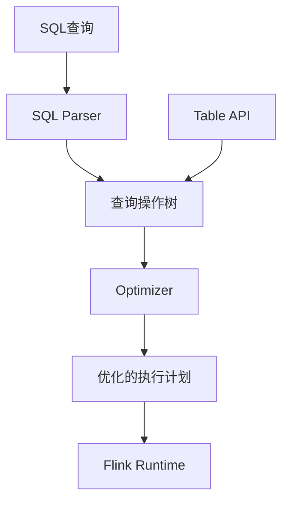
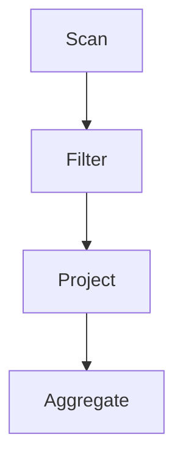

# Flink Table API和SQL原理与代码实例讲解

## 1.背景介绍

### 1.1 大数据处理的挑战

在当今数据爆炸式增长的时代，传统的数据处理系统已经无法满足海量数据的实时处理需求。大数据时代的到来给企业带来了新的机遇,但同时也带来了巨大的挑战。企业需要能够快速、高效地处理大规模的结构化和非结构化数据,从而获取有价值的洞见并做出及时的决策。

### 1.2 流式处理的兴起

为了解决这一挑战,流式处理(Stream Processing)应运而生。与传统的批处理不同,流式处理系统能够实时处理持续到来的数据流,并提供低延迟和高吞吐量的处理能力。Apache Flink作为一个开源的分布式流处理框架,凭借其强大的性能和丰富的功能,在大数据领域占据了重要地位。

### 1.3 Flink Table API和SQL的重要性

虽然Flink提供了强大的流处理能力,但直接使用底层API进行开发往往会增加复杂性和工作量。为了简化流处理的开发过程,Flink推出了Table API和SQL接口,允许用户使用类似关系数据库的方式来查询和处理流数据。这不仅提高了开发效率,还增强了代码的可读性和可维护性。

## 2.核心概念与联系

### 2.1 流处理与批处理

在讨论Flink Table API和SQL之前,我们需要先了解流处理(Stream Processing)和批处理(Batch Processing)的区别。

批处理是指一次性处理有限的静态数据集,例如Hadoop MapReduce处理HDFS上的数据文件。而流处理则是持续处理无限的数据流,例如处理实时日志或传感器数据。

尽管两者有所不同,但在Flink中,流处理和批处理是统一的。Flink将批处理视为流处理的一个特例,即有界的数据流。这种统一的处理模型使得Flink能够无缝地处理有界和无界数据,并提供一致的API和运行时。

### 2.2 Flink Table API和SQL概述

Flink Table API和SQL是Flink提供的两种高级API,用于以类SQL方式处理结构化的流数据或批数据。

**Table API**是一种嵌入式API,允许开发者使用Java或Scala代码构建表操作。它提供了一组丰富的操作符,如选择(select)、投影(project)、聚合(aggregate)等,使得开发者可以灵活地构建复杂的数据处理管道。

**SQL**则是一种声明式的查询语言,与传统关系数据库中的SQL语法类似。开发者可以使用SQL语句直接查询和转换数据流,而无需编写底层代码。Flink的SQL接口支持标准的ANSI SQL语法,并提供了一些扩展,如流特定的语句和函数。

无论使用Table API还是SQL,底层都是由Flink的优化器将其转换为相同的执行计划。这种统一的执行模型使得两种API可以无缝集成,并提供了一致的性能和语义。

### 2.3 Flink Table & SQL的架构

Flink Table & SQL的架构如下所示:



1. **SQL查询**或**Table API**作为输入,分别由SQL Parser和Table API编译器解析。
2. 解析后生成统一的**查询操作树(Query Operation Tree)**。
3. **查询操作树**由Flink的**优化器(Optimizer)**进行优化,生成**优化的执行计划**。
4. **优化的执行计划**由Flink Runtime执行。

通过这种架构,SQL查询和Table API代码最终会转换为相同的执行计划,从而获得一致的性能和语义。

## 3.核心算法原理具体操作步骤

### 3.1 查询操作树(Query Operation Tree)

查询操作树是Flink Table & SQL的核心数据结构,用于表示逻辑查询计划。它由一系列的关系代数操作符组成,如Scan(扫描)、Project(投影)、Filter(过滤)、Join(连接)、Aggregate(聚合)等。

下面是一个简单的查询操作树示例:



该查询操作树表示:从一个数据源(Scan)中扫描数据,然后过滤(Filter)部分记录,接着投影(Project)出所需的列,最后进行聚合(Aggregate)操作。

查询操作树的构建过程如下:

1. **SQL解析**: SQL查询字符串首先由SQL Parser解析为抽象语法树(Abstract Syntax Tree, AST)。
2. **AST转换**: AST经过一系列规则转换,生成初始的查询操作树。
3. **逻辑优化**: 初始的查询操作树经过一系列等价规则重写,生成优化后的逻辑查询操作树。

### 3.2 查询优化器(Query Optimizer)

Flink的查询优化器负责将逻辑查询操作树转换为高效的执行计划。优化器主要包括以下几个阶段:

1. **逻辑优化**: 对逻辑查询操作树进行一系列等价规则重写,以优化查询执行。
2. **逻辑-物理转换**: 将优化后的逻辑查询操作树转换为物理执行计划。
3. **代价模型**: 基于代价模型(如CPU、IO等)估算每个物理执行计划的代价。
4. **物理优化**: 对物理执行计划进行一系列优化规则重写,生成最终的优化执行计划。

优化器的目标是生成一个高效的执行计划,以最小化查询的执行时间和资源消耗。

### 3.3 执行引擎(Execution Engine)

Flink的执行引擎负责将优化后的执行计划转换为分布式数据流,并在集群上执行。执行引擎的主要步骤如下:

1. **翻译**: 将优化的执行计划翻译为可执行的数据流图(StreamGraph)。
2. **调度**: 根据数据流图,将任务调度到集群的TaskManager上执行。
3. **数据交换**: 在不同任务之间交换数据,通过网络或其他机制进行数据传输。
4. **故障恢复**: 在发生故障时,根据检查点(Checkpoint)和状态恢复(State Restore)机制,重新启动失败的任务。

执行引擎的设计目标是提供高吞吐量、低延迟和高容错性能,以满足流式处理的需求。

## 4.数学模型和公式详细讲解举例说明

在Flink Table & SQL中,有许多涉及到数学模型和公式的地方,例如聚合函数、窗口函数和Join操作等。下面我们将详细讲解其中的一些核心概念和公式。

### 4.1 聚合函数(Aggregate Functions)

聚合函数用于对一组值进行聚合计算,例如求和(SUM)、计数(COUNT)、平均值(AVG)等。在Flink中,聚合函数的计算过程可以表示为:

$$
agg(x_1, x_2, ..., x_n) = f(x_1, x_2, ..., x_n)
$$

其中:
- $x_1, x_2, ..., x_n$是输入的数据值
- $f$是聚合函数,如SUM、COUNT或AVG等
- $agg(x_1, x_2, ..., x_n)$是聚合函数的计算结果

例如,对于SUM聚合函数,其计算过程为:

$$
SUM(x_1, x_2, ..., x_n) = x_1 + x_2 + ... + x_n
$$

而对于COUNT聚合函数,其计算过程为:

$$
COUNT(x_1, x_2, ..., x_n) = n
$$

其中$n$是输入值的个数。

### 4.2 窗口函数(Window Functions)

窗口函数用于对滑动窗口内的数据进行聚合计算。Flink支持多种窗口类型,如滚动窗口(Tumbling Window)、滑动窗口(Sliding Window)和会话窗口(Session Window)等。

以滚动窗口为例,其计算过程可以表示为:

$$
agg_{win}(x_1, x_2, ..., x_n) = f(x_i, x_{i+1}, ..., x_{i+w-1})
$$

其中:
- $x_1, x_2, ..., x_n$是输入的数据流
- $w$是窗口大小(如10秒或1000条记录)
- $f$是聚合函数,如SUM、COUNT或AVG等
- $agg_{win}(x_1, x_2, ..., x_n)$是窗口聚合函数的计算结果

例如,对于SUM聚合函数和10秒的滚动窗口,其计算过程为:

$$
SUM_{win}(x_1, x_2, ..., x_n) = \sum_{i=1}^{n-w+1} \sum_{j=i}^{i+w-1} x_j
$$

其中$\sum_{j=i}^{i+w-1} x_j$表示对窗口内的值进行求和。

### 4.3 Join操作

Join操作用于将两个数据流或表进行连接。Flink支持多种Join类型,如内连接(Inner Join)、外连接(Outer Join)和时间窗口Join等。

以内连接为例,其计算过程可以表示为:

$$
R \bowtie S = \{(r, s) | r \in R, s \in S, r.k = s.k\}
$$

其中:
- $R$和$S$是两个输入的数据流或表
- $r.k$和$s.k$是连接键(Join Key)
- $R \bowtie S$是内连接的结果集,包含所有满足连接条件的记录对$(r, s)$

在实际执行时,Join操作通常会涉及到数据的重分区(Repartition)和构建哈希表等步骤,以提高Join效率。

## 4.项目实践:代码实例和详细解释说明

在本节中,我们将通过一个实际的项目示例,展示如何使用Flink Table API和SQL进行流式数据处理。

### 4.1 项目背景

假设我们有一个电商网站,需要实时统计每个商品类别的销售额和订单数量。我们将使用Flink来处理实时到来的订单事件流,并计算每个类别的销售指标。

### 4.2 数据源

我们将使用一个模拟的订单事件流作为数据源。每个订单事件包含以下字段:

- `order_id`: 订单ID
- `product_id`: 产品ID
- `category_id`: 产品类别ID
- `price`: 产品价格
- `timestamp`: 订单时间戳

### 4.3 Table API示例

下面是使用Flink Table API进行流式数据处理的代码示例:

```java
// 创建执行环境
StreamExecutionEnvironment env = StreamExecutionEnvironment.getExecutionEnvironment();
StreamTableEnvironment tableEnv = StreamTableEnvironment.create(env);

// 定义订单事件流
DataStream<Order> orderStream = env.addSource(new OrderSource());

// 将DataStream转换为Table
Table orderTable = tableEnv.fromDataStream(orderStream, $("order_id"), $("product_id"), $("category_id"), $("price"), $("timestamp"), $("rowtime").rowtime());

// 计算每个类别的销售额和订单数量
Table result = orderTable
    .window(Tumble.over(lit(1).hour()).on($("rowtime")).alias("w"))
    .groupBy($("w"), $("category_id"))
    .select(
        $("category_id"),
        $("w").start().as("window_start"),
        $("w").end().as("window_end"),
        $("price").sum().as("revenue"),
        $("order_id").count().as("order_count")
    );

// 将结果表转换为DataStream并打印
tableEnv.toDataStream(result).print();

// 执行作业
env.execute("Category Revenue Job");
```

代码解释:

1. 创建`StreamExecutionEnvironment`和`StreamTableEnvironment`。
2. 定义一个模拟的订单事件流`orderStream`。
3. 将`orderStream`转换为`Table`对象`orderTable`。
4. 在`orderTable`上应用窗口操作(`Tumble.over(lit(1).hour()).on($("rowtime"))`)和分组操作(`groupBy($("w"), $("category_id"))`)。
5. 在分组后的表上计算每个类别的销售额(`$("price").sum()`)和订单数量(`$("order_id").count()`)。
6. 将结果表`result`转换为`DataStream`并打印输出。
7. 执行Flink作业。

在这个示例中,我们使用了一个滚动窗口(