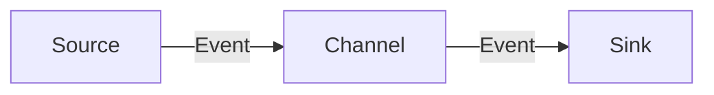

## 1.背景介绍

Flume是Apache的一个开源项目，它基于流式架构提供了高可用，高可靠，分布式的大规模日志聚合的功能。在大数据处理领域，Flume是一个非常重要的组件，它的主要作用是实现大规模日志数据的采集、聚合和传输。

Flume的核心组件之一就是Channel，它在Flume的架构中起到了承上启下的作用。简单来说，Channel就是一个临时存储区，用于存储Event（事件）。在Flume的数据流中，Event从Source（数据源）经过Channel传输到Sink（数据接收端）。Channel的作用就是确保数据在传输过程中的安全，即使在网络等问题导致数据传输失败时，Channel中的数据也不会丢失。

## 2.核心概念与联系

在深入了解Channel的原理和代码实例之前，我们需要先了解一下Flume的几个核心概念：

- Event：Event是Flume数据流中的基本单位，它包含了Header和Body两部分。Header是键值对形式的元数据，Body则是实际的数据内容。
- Source：Source是数据的输入端，它负责接收数据并将数据封装成Event传给Channel。
- Channel：Channel是临时存储区，它负责暂存从Source来的Event，并保证数据的安全传输。
- Sink：Sink是数据的输出端，它从Channel中取出Event并将数据发送到下游。

这几个核心概念之间的关系可以用下面的Mermaid流程图表示：



## 3.核心算法原理具体操作步骤

Channel的工作原理相对简单，主要包括以下几个步骤：

1. Source接收到数据后，将数据封装成Event，然后调用Channel的`put`方法将Event放入Channel。
2. Channel在接收到Event后，会将Event暂存到内部的数据结构中（具体的数据结构取决于Channel的实现方式，常见的有内存队列、文件队列等）。
3. Sink通过调用Channel的`take`方法从Channel中取出Event，然后将Event发送到下游。
4. 如果Sink成功发送了Event，那么Channel会删除对应的Event。如果Sink发送失败，那么Event会继续留在Channel中，等待下次取出并发送。

## 4.数学模型和公式详细讲解举例说明

在理解Flume的Channel时，我们可以借助队列理论（Queueing Theory）中的一些数学模型和公式来更深入地理解其工作原理和性能特性。

在队列理论中，一个基本的模型是M/M/1队列。在这个模型中，到达率（即Source向Channel发送Event的速率）和服务率（即Sink从Channel取出Event的速率）都服从泊松分布，服务台（即Channel）只有一个。

假设到达率为$\lambda$，服务率为$\mu$，那么系统的利用率（即Channel的利用率）可以用以下公式计算：

$$
\rho = \frac{\lambda}{\mu}
$$

系统的平均排队长度（即Channel中的Event平均数量）可以用以下公式计算：

$$
L = \frac{\rho^2}{1 - \rho}
$$

这些公式可以帮助我们理解Channel的性能特性，例如，如果我们希望减少Channel中的Event数量，我们可以通过增加服务率（即提高Sink的处理速度）或者减少到达率（即降低Source的发送速度）来实现。

## 4.项目实践：代码实例和详细解释说明

接下来，我们来看一个简单的代码实例，这个代码实例展示了如何在Flume中使用Channel。

首先，我们需要创建一个Flume的配置文件，这个配置文件定义了Source、Channel和Sink的类型和参数。例如，我们可以定义一个MemoryChannel，这是一个基于内存的Channel，它的大小（即可以存储的Event数量）可以通过`capacity`参数来设置。

```properties
# Define a source, channel and sink
agent.sources = source1
agent.channels = channel1
agent.sinks = sink1

# Configure the source
agent.sources.source1.type = netcat
agent.sources.source1.bind = localhost
agent.sources.source1.port = 44444

# Configure the channel
agent.channels.channel1.type = memory
agent.channels.channel1.capacity = 1000

# Configure the sink
agent.sinks.sink1.type = logger

# Bind the source and sink to the channel
agent.sources.source1.channels = channel1
agent.sinks.sink1.channel = channel1
```

然后，我们可以通过下面的命令启动Flume，并使用上面的配置文件：

```bash
flume-ng agent --conf /etc/flume/conf --conf-file /path/to/your/flume.conf --name agent -Dflume.root.logger=INFO,console
```

在Flume启动后，我们可以通过netcat向Source发送数据，这些数据会被封装成Event，然后通过Channel传输到Sink。在这个例子中，Sink的类型是logger，它会将接收到的Event打印到控制台。

## 5.实际应用场景

Flume的Channel在许多实际应用场景中都有着广泛的应用，例如：

- 日志收集：Flume可以用于收集分布式系统中的日志数据。在这种场景中，每个系统节点都可以运行一个Flume的agent，这个agent的Source负责收集节点上的日志数据，然后通过Channel传输到Sink，Sink再将数据发送到集中的日志存储系统。
- 数据流处理：Flume也可以用于实现实时的数据流处理。在这种场景中，Source可以接收来自各种数据源（如Kafka、RabbitMQ等）的数据，然后通过Channel传输到Sink，Sink再将数据发送到数据流处理系统（如Spark Streaming、Flink等）。

## 6.工具和资源推荐

- Apache Flume：Flume的官方网站提供了详细的文档和教程，是学习和使用Flume的最佳资源。
- Flume in Action：这是一本关于Flume的书籍，详细介绍了Flume的架构和使用方法，包括Channel的使用和优化。

## 7.总结：未来发展趋势与挑战

随着大数据和实时计算的发展，Flume和Channel的重要性将会进一步增强。然而，Flume和Channel也面临着一些挑战，例如如何提高Channel的吞吐量和可用性，如何处理大规模和高速的数据流等。这些挑战需要我们进行深入的研究和探索。

## 8.附录：常见问题与解答

**Q: Flume的Channel有哪些实现方式？**

A: Flume提供了多种Channel的实现方式，包括MemoryChannel（基于内存的Channel）、FileChannel（基于文件的Channel）、JDBCChannel（基于数据库的Channel）等。

**Q: 如何选择合适的Channel？**

A: 选择合适的Channel需要考虑多个因素，例如数据的吞吐量、数据的持久性需求、系统的内存和磁盘资源等。例如，如果数据的吞吐量非常大，那么可以选择MemoryChannel；如果需要保证数据的持久性，那么可以选择FileChannel或JDBCChannel。

**Q: 如何优化Channel的性能？**

A: 优化Channel的性能可以从多个方面进行，例如增加Channel的大小、提高Sink的处理速度、降低Source的发送速度等。具体的优化方法需要根据实际的应用场景和性能需求来确定。