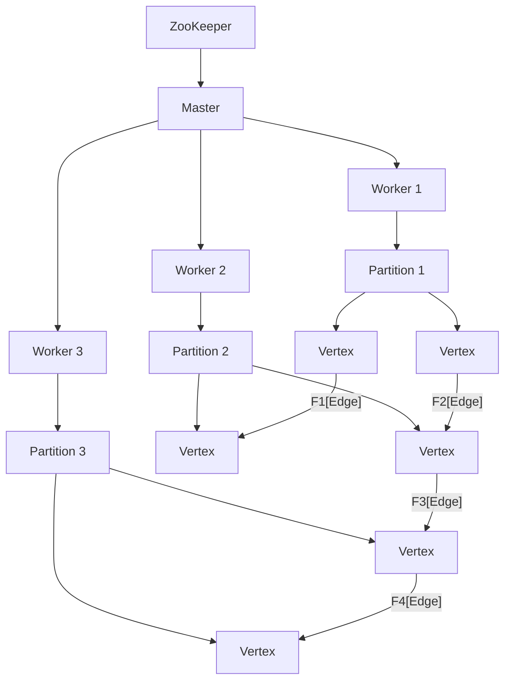
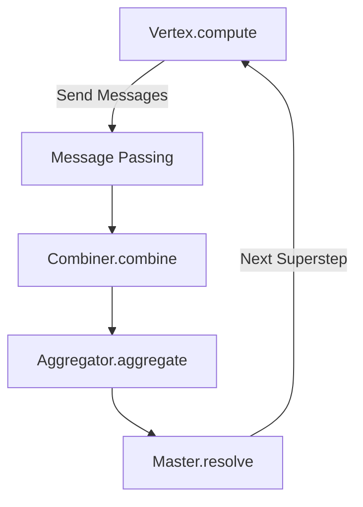

# Giraph原理与代码实例讲解

## 1.背景介绍

### 1.1 大数据时代的到来

随着互联网、物联网和移动互联网的快速发展,海量的数据正以前所未有的速度被生成和积累。这些数据不仅体现在网页、社交媒体、电子商务等传统领域,还包括物联网设备、移动应用程序等新兴领域产生的海量数据。处理和分析这些大数据,对于企业和组织来说是一个巨大的挑战,也是一个巨大的机遇。

### 1.2 大数据处理的需求

面对日益增长的数据量,传统的数据处理方式已经无法满足需求。单机系统的计算能力和存储容量有限,无法处理如此庞大的数据集。因此,分布式计算框架应运而生,以解决大数据处理的挑战。

### 1.3 MapReduce与Hadoop

Google提出的MapReduce编程模型为大数据处理提供了一种全新的思路。MapReduce将复杂的计算任务分解成多个简单的Map和Reduce任务,并行执行在大规模的计算集群上。Apache Hadoop是MapReduce编程模型的开源实现,它为处理大数据提供了一个可靠、可扩展和高效的分布式计算框架。

### 1.4 图计算的重要性

尽管MapReduce和Hadoop为大数据处理提供了强大的能力,但它们主要针对结构化数据和批处理工作负载。然而,在现实世界中,许多数据具有复杂的关系和链接,可以表示为图形结构。社交网络、Web链接、交通网络、基因组数据等都可以建模为图。图计算在这些领域扮演着重要的角色,成为大数据分析的关键组成部分。

## 2.核心概念与联系

### 2.1 图的基本概念

在讨论Giraph之前,我们先回顾一下图的基本概念。图是由顶点(Vertex)和边(Edge)组成的数据结构。顶点表示实体,边表示实体之间的关系或连接。

例如,在社交网络中,每个用户可以表示为一个顶点,而用户之间的关系(如朋友、关注等)可以表示为边。在Web链接中,每个网页可以表示为一个顶点,而网页之间的超链接可以表示为边。

### 2.2 图计算的挑战

虽然图计算在许多领域都有重要应用,但它也面临着一些挑战:

1. **大规模**: 现实世界中的图数据通常非常庞大,包含数十亿甚至数万亿的顶点和边。处理这些大规模图数据需要高效的分布式计算框架。

2. **迭代计算**: 许多图算法(如PageRank、shortest path等)需要进行迭代计算,直到收敛或达到指定的终止条件。这种迭代计算模式与MapReduce的批处理模式不同,需要特殊的处理方式。

3. **数据局部性**: 图计算通常具有较强的数据局部性,即一个顶点与其相邻顶点之间存在密切的关系。利用这种数据局部性可以提高计算效率。

4. **动态更新**: 许多图数据是动态变化的,需要支持实时更新和增量计算。

### 2.3 Giraph简介

Apache Giraph是一个用于进行图计算的开源分布式系统,它基于Hadoop和Apache ZooKeeper构建。Giraph旨在高效地执行图形处理任务,如页面排名、图形模式匹配、社交网络分析等。

Giraph采用了"思考像一个顶点"(Think Like a Vertex)的编程模型,这种模型与MapReduce不同。在Giraph中,每个顶点都是一个独立的计算单元,负责处理自身的数据和与邻居顶点的通信。这种编程模型更加自然地映射到图数据结构,并且可以更好地利用数据局部性。

Giraph还提供了容错、检查点、工作者重新平衡等功能,以确保计算的可靠性和高可用性。它还支持各种图形格式(如纯文本、SequenceFile等)的输入和输出。

## 3.核心算法原理具体操作步骤

### 3.1 Giraph的架构

Giraph的架构基于Hadoop的MapReduce框架,但进行了一些关键的扩展和优化。Giraph由以下几个主要组件组成:

1. **Master**: 负责协调整个计算过程,包括分发任务、收集结果、检查点等。

2. **Worker**: 执行实际的图计算任务。每个Worker负责处理一部分顶点和边。

3. **ZooKeeper**: 用于协调Master和Worker之间的通信,并提供分布式协调服务。

4. **Partition**: 图数据被划分为多个Partition,每个Partition包含一部分顶点和边。

5. **Vertex**: 表示图中的顶点,是实际执行计算的单元。

6. **Edge**: 表示图中的边,连接两个顶点。

7. **Combiner**: 用于合并来自不同Worker的消息,减少网络传输量。

8. **Aggregator**: 用于在全局范围内聚合值,例如计算全局统计信息。

下图展示了Giraph的基本架构:



### 3.2 Giraph的计算模型

Giraph采用"思考像一个顶点"的编程模型,每个顶点都是一个独立的计算单元。计算过程分为多个超步(Superstep),每个超步包含以下几个阶段:

1. **Vertex.compute()**: 每个顶点执行自身的计算逻辑,可以根据需要发送消息给其他顶点。

2. **Message传递**: 将发送的消息传递给目标顶点。

3. **Combiner.combine()**: (可选)合并来自不同Worker的消息,减少网络传输量。

4. **Aggregator.aggregate()**: (可选)计算全局聚合值。

5. **Master.resolve()**: Master收集并处理所有Worker的计算结果,判断是否需要进入下一个超步。

这个过程会重复执行,直到满足终止条件(如收敛或达到最大超步数)。下图展示了Giraph的计算模型:



### 3.3 Giraph的并行计算

Giraph通过将图数据划分为多个Partition,并将每个Partition分配给一个Worker来实现并行计算。每个Worker独立地处理自己的Partition,并与其他Worker通信以交换消息和聚合结果。

为了提高计算效率,Giraph采用了以下几种优化策略:

1. **数据局部性**: 通过将相邻的顶点和边分配到同一个Partition,可以最大化利用数据局部性,减少网络通信开销。

2. **消息合并**: 使用Combiner合并来自不同Worker的消息,减少网络传输量。

3. **工作者重新平衡**: 动态调整Partition的分配,以平衡不同Worker之间的工作负载。

4. **检查点和容错**: 定期保存计算状态的检查点,以便在发生故障时能够从上一个检查点恢复,而不必从头开始计算。

5. **内存优化**: 通过优化内存使用和垃圾回收,提高计算效率。

## 4.数学模型和公式详细讲解举例说明

在图计算中,常见的数学模型和公式包括:

### 4.1 PageRank算法

PageRank是一种用于评估网页重要性的算法,它被广泛应用于网页排名和搜索引擎排序。PageRank的基本思想是,一个网页的重要性不仅取决于它自身,还取决于链接到它的其他网页的重要性。

PageRank算法可以用以下公式表示:

$$PR(p) = \frac{1-d}{N} + d \sum_{q \in M(p)} \frac{PR(q)}{L(q)}$$

其中:

- $PR(p)$ 表示网页 $p$ 的PageRank值
- $N$ 是网络中所有网页的总数
- $M(p)$ 是链接到网页 $p$ 的所有网页集合
- $L(q)$ 是网页 $q$ 的出链接数
- $d$ 是一个阻尼系数,通常取值为 $0.85$

PageRank算法是一个迭代过程,每个网页的PageRank值会不断更新,直到收敛或达到最大迭代次数。

### 4.2 单源最短路径算法

在图计算中,常常需要计算两个顶点之间的最短路径。单源最短路径算法旨在找到从一个源顶点到所有其他顶点的最短路径。

一种常见的单源最短路径算法是Dijkstra算法,它适用于无负权边的图。Dijkstra算法的基本思想是从源顶点开始,逐步扩展到其他顶点,并维护一个距离数组,记录从源顶点到每个顶点的当前最短距离。

Dijkstra算法的伪代码如下:

```
function Dijkstra(Graph, source):
    dist[source] = 0
    for each vertex v in Graph:
        if v != source:
            dist[v] = INFINITY
    
    pq = PriorityQueue()
    pq.enqueue(source, 0)
    
    while not pq.isEmpty():
        u = pq.dequeue()
        for each neighbor v of u:
            alt = dist[u] + weight(u, v)
            if alt < dist[v]:
                dist[v] = alt
                pq.enqueue(v, alt)
    
    return dist
```

其中, `dist` 是一个数组,用于存储从源顶点到每个顶点的当前最短距离。`pq` 是一个优先级队列,用于按照距离从小到大的顺序遍历顶点。

### 4.3 图着色算法

图着色是一种将不同颜色分配给图中的顶点或边的过程,使得相邻的顶点或边具有不同的颜色。图着色在许多领域都有应用,如编译器寄存器分配、地图着色、时间表安排等。

图着色问题可以形式化为:给定一个图 $G=(V,E)$,找到一种着色方案,使用最少的颜色数,并且对于任意一条边 $(u,v) \in E$,顶点 $u$ 和 $v$ 都被着上不同的颜色。

一种常见的图着色算法是贪心着色算法,它的基本思想是:

1. 将顶点按照某种顺序排列
2. 对于每个顶点,尝试用最小的可用颜色着色
3. 如果所有相邻顶点都使用了不同的颜色,则着色成功,否则尝试下一个颜色

贪心着色算法的伪代码如下:

```
function GreedyColoring(Graph):
    colors = {}
    order = sortVertices(Graph)
    
    for each vertex v in order:
        available_colors = getAllColors()
        for each neighbor u of v:
            if colors[u] in available_colors:
                available_colors.remove(colors[u])
        colors[v] = min(available_colors)
    
    return colors
```

其中, `colors` 是一个字典,用于存储每个顶点的颜色。`order` 是一个顶点列表,按照某种顺序排列。`getAllColors()` 是一个函数,用于获取所有可用的颜色。

贪心着色算法的时间复杂度为 $O(|V|^2)$,其中 $|V|$ 是顶点数。尽管贪心着色算法不能保证找到最优解,但它通常可以得到较好的近似解,并且计算效率较高。

## 4.项目实践:代码实例和详细解释说明

在本节中,我们将通过一个实际的代码示例来展示如何使用Giraph进行图计算。我们将实现一个简单的PageRank算法,用于计算网页的重要性排名。

### 4.1 准备工作

首先,我们需要下载并安装Giraph