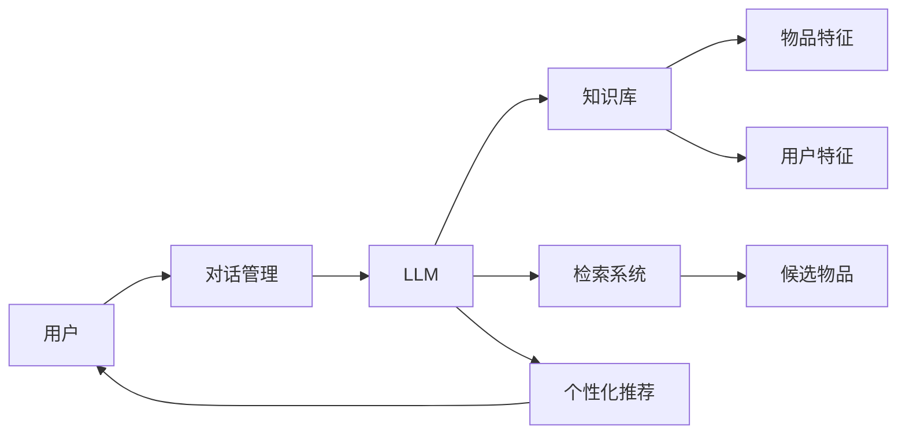

# LLMChain开发实战：打造个性化推荐系统

作者：禅与计算机程序设计艺术

## 1. 背景介绍
### 1.1 个性化推荐系统的重要性
在当今信息爆炸的时代,个性化推荐系统已成为各大互联网平台不可或缺的一部分。它能够根据用户的历史行为、偏好等信息,自动为用户推荐感兴趣的内容,大大提升用户体验和平台粘性。无论是电商、新闻、视频还是社交平台,个性化推荐都发挥着至关重要的作用。

### 1.2 传统推荐系统面临的挑战
传统的个性化推荐系统主要基于协同过滤、基于内容的推荐等方法。这些方法虽然取得了不错的效果,但仍面临着数据稀疏、冷启动、可解释性差等问题。此外,传统方法很难充分利用非结构化的文本、图像等丰富信息。

### 1.3 大语言模型(LLM)在推荐系统中的应用前景
近年来,以GPT、BERT等为代表的大语言模型(Large Language Model, LLM)在NLP领域取得了突破性进展。LLM能够学习海量文本数据中蕴含的语义信息,生成高质量的文本。将LLM应用到推荐系统,有望克服传统方法的局限性,实现更加智能、个性化的推荐。

## 2. 核心概念与联系
### 2.1 LLMChain的定义
LLMChain是一种将大语言模型(LLM)与其他组件组合形成pipeline的框架。通过将LLM与知识库、检索系统、对话管理等模块灵活组合,LLMChain能够针对不同场景构建个性化的应用。

### 2.2 LLMChain在个性化推荐中的作用
在个性化推荐场景下,LLMChain可以发挥如下作用:

1. 利用LLM从海量文本数据中提取物品和用户的隐式特征
2. 基于LLM生成个性化的推荐解释,提升推荐的可解释性
3. 通过知识库存储物品和用户的结构化信息,增强推荐的准确性
4. 引入检索系统,实现基于用户历史行为的候选物品快速筛选
5. 利用对话管理模块,实现多轮交互式推荐

下图展示了LLMChain在个性化推荐系统中的典型架构:



## 3. 核心算法原理与具体操作步骤
### 3.1 基于LLM的物品和用户特征提取
传统推荐系统通常基于ID、类别等结构化特征来表示物品和用户。而在LLMChain中,我们可以充分利用物品的文本描述、标题、评论等非结构化信息,通过LLM学习到更加丰富的语义特征表示。

具体步骤如下:
1. 对物品的文本信息进行预处理,如分词、去停用词等
2. 利用预训练的LLM对物品文本进行编码,得到词向量表示
3. 通过平均池化等方法将词向量聚合为物品向量
4. 对用户历史交互的物品向量进行聚合,得到用户向量

物品向量$i$的计算公式为:

$$i=\frac{1}{n}\sum_{j=1}^{n}emb(token_j)$$

其中$token_j$为物品文本中的第$j$个token,$emb$为LLM的词嵌入函数。

用户向量$u$的计算公式为:

$$u=\frac{1}{|I_u|}\sum_{i\in I_u}i$$

其中$I_u$为用户$u$交互过的物品集合。

### 3.2 个性化推荐解释生成
传统推荐系统作为黑盒模型,通常难以给出推荐结果背后的原因。而利用LLM强大的语言生成能力,LLMChain可以生成个性化的推荐解释,让用户知道为什么推荐这些物品。

具体步骤如下:
1. 将用户向量、物品向量、用户历史行为等信息输入到LLM中
2. 设计生成任务的prompt,引导LLM生成推荐解释
3. 利用LLM的文本生成能力,输出个性化的推荐解释

例如,prompt可以设计为:
"Based on your recent clicks on [物品1], [物品2], and your preference for [物品类别], we recommend [推荐物品] to you because [推荐理由]."

其中,方括号内的变量可以根据实际情况进行填充。LLM会根据这些信息,生成符合用户个人偏好的推荐解释。

### 3.3 检索系统构建
在推荐系统中,需要从海量的候选物品中快速筛选出与用户最相关的物品。传统的推荐系统通常使用近邻搜索等方法。在LLMChain中,我们可以引入基于向量相似度的检索系统,大幅提升检索效率。

具体步骤如下:
1. 利用LLM得到所有物品的向量表示
2. 使用Faiss、Annoy等向量检索库对物品向量进行索引
3. 给定用户向量,通过向量相似度检索出最相关的候选物品

物品$i$和用户$u$的相似度计算公式为:

$$sim(i,u)=\frac{i\cdot u}{||i||\times||u||}$$

其中$\cdot$表示向量点积,$||\cdot||$表示向量的L2范数。

### 3.4 多轮交互式推荐
传统的推荐系统通常只能进行一次性的推荐。而在实际场景中,用户的兴趣偏好可能是动态变化的。LLMChain通过引入对话管理模块,能够实现多轮交互式推荐,根据用户的即时反馈动态调整推荐结果。

具体步骤如下:
1. 初始时,根据用户向量检索出初始的推荐物品列表
2. 将推荐列表呈现给用户,收集用户的反馈(如点击、评分等)
3. 根据用户反馈更新用户向量,并生成下一轮推荐列表
4. 重复步骤2-3,直到用户满意或达到最大交互轮数

## 4. 数学模型和公式详细讲解举例说明
前面我们介绍了LLMChain在个性化推荐中的几个关键技术,下面将对涉及的数学模型和公式进行详细讲解和举例说明。

### 4.1 LLM生成物品和用户向量
LLM生成物品和用户向量的核心是将token序列映射为固定维度的实值向量。以GPT为例,其词嵌入层将每个token映射为一个$d$维的词向量。假设物品$i$的文本描述为$[t_1,t_2,...,t_n]$,则其对应的词向量序列为:

$$[emb(t_1),emb(t_2),...,emb(t_n)]$$

其中$emb(\cdot)$表示GPT的词嵌入函数,将token映射为$d$维词向量。

为了得到物品$i$的最终向量表示,我们可以对词向量序列进行平均池化:

$$i=\frac{1}{n}\sum_{j=1}^{n}emb(t_j)$$

例如,假设物品的文本描述为"This phone has a great camera and long battery life"。通过GPT的词嵌入层,可以得到每个token的词向量,如下表所示:

| Token    | Embedding                 |
|----------|---------------------------|
| This     | [0.1, -0.2, ..., 0.3]    |
| phone    | [0.2, 0.1, ..., -0.1]    |
| has      | [-0.1, 0.3, ..., 0.2]    |
| a        | [0.0, 0.1, ..., -0.2]    |
| great    | [0.3, -0.1, ..., 0.1]    |
| camera   | [0.2, 0.2, ..., 0.0]     |
| and      | [0.0, -0.1, ..., 0.1]    |
| long     | [0.1, 0.1, ..., 0.2]     |
| battery  | [-0.1, 0.0, ..., 0.3]    |
| life     | [0.2, 0.1, ..., -0.1]    |

对这些词向量取平均,即可得到物品的最终向量表示:

$$i=\frac{1}{10}([0.1,-0.2,...,0.3]+[0.2,0.1,...,-0.1]+...+[0.2,0.1,...,-0.1])$$

用户向量的计算方式与之类似,只不过是将用户历史交互过的所有物品向量取平均。

### 4.2 个性化推荐解释生成
LLM生成个性化推荐解释的关键是设计合适的prompt。prompt中需要包含影响生成结果的关键信息,如用户历史行为、推荐物品等。同时,prompt还需要指定生成的格式和风格。

以下是一个示例prompt:

```
User profile: 
- Frequently clicks on phones and laptops
- Prefers products with good camera and long battery life
- Recently viewed [物品1], [物品2], [物品3]

Recommended item: [推荐物品]

Explanation: Based on your recent clicks on [物品1], [物品2], and [物品3], as well as your preference for products with good camera and long battery life, we recommend [推荐物品] to you because [推荐理由].
```

其中,`User profile`部分包含了用户的历史行为和偏好信息,`Recommended item`指定了要推荐的物品,`Explanation`则是生成推荐解释的模板。LLM会根据这些信息,自动填充`[推荐理由]`部分,生成个性化的解释。

例如,假设用户经常点击手机和笔记本电脑,偏好具有良好拍照和续航的产品,最近浏览了iPhone 12、MacBook Air和小米11。我们想要给他推荐Galaxy S21,则生成的prompt为:

```
User profile:
- Frequently clicks on phones and laptops 
- Prefers products with good camera and long battery life
- Recently viewed iPhone 12, MacBook Air, Xiaomi 11

Recommended item: Galaxy S21

Explanation: Based on your recent clicks on iPhone 12, MacBook Air, and Xiaomi 11, as well as your preference for products with good camera and long battery life, we recommend Galaxy S21 to you because [推荐理由].
```

LLM可能会生成如下的推荐解释:

"Galaxy S21 features a powerful triple camera system with 8K video and enhanced low-light performance, ensuring high-quality photos and videos. It also comes with a large 4000mAh battery that supports fast charging and wireless charging, providing long-lasting usage. Given your interest in phones with advanced camera and battery, Galaxy S21 would be a great choice for you."

可以看到,生成的解释符合用户的偏好,并给出了推荐Galaxy S21的具体理由,体现了较好的个性化和可解释性。

### 4.3 检索系统中的向量相似度
在基于向量的检索系统中,我们通常使用余弦相似度来衡量两个向量之间的相似程度。余弦相似度计算公式为:

$$sim(i,u)=\frac{i\cdot u}{||i||\times||u||}$$

其中,$i$和$u$分别表示物品向量和用户向量,$\cdot$表示向量点积,$||\cdot||$表示向量的L2范数。

余弦相似度的取值范围为$[-1,1]$,值越大表示两个向量越相似。当两个向量方向完全一致时,余弦相似度为1;当两个向量方向完全相反时,余弦相似度为-1;当两个向量正交时,余弦相似度为0。

举例来说,假设我们有以下三个物品向量:

$$i_1=[1,2,3],i_2=[2,4,6],i_3=[-1,-2,-3]$$

以及一个用户向量:

$$u=[1,1,1]$$

则它们之间的余弦相似度为:

$$sim(i_1,u)=\frac{1\times1+2\times1+3\times1}{\sqrt{1^2+2^2+3^2}\times\sqrt{1^2+1^2+1^2}}=\frac{6}{\sqrt{14}\times\sqrt{3}}\approx0.90$$

$$sim(i_2,u)=\frac{2\times1+4\times1+6\times1}{\sqrt{2^2+4^2+6^2}\times\sqrt{1^2+1^2+1^2}}=\frac{12}{\sqrt{56}\times\sqrt{3}}\approx0.94$$

$$sim(i_3,u)=\frac{