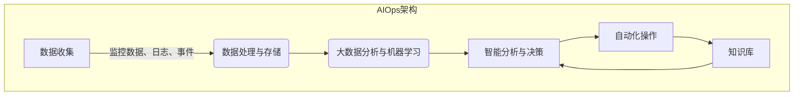
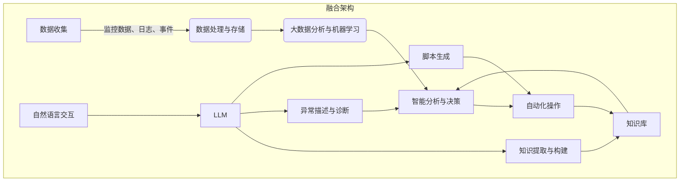

# LLM与人工智能运维(AIOps)的融合:智能运维的新高度

## 1.背景介绍

### 1.1 传统IT运维的挑战

在当今快节奏的数字化时代,IT基础设施和应用程序的复杂性与日俱增。传统的IT运维方式面临着诸多挑战:

- **大规模分布式系统**:现代IT系统通常是大规模分布式的,由成千上万个组件和服务组成,人工监控和管理变得异常困难。

- **海量运维数据**:来自服务器、网络、应用程序和用户的海量监控数据,很难被人类及时高效处理和分析。

- **故障复杂性**:由于系统复杂性,故障的根源往往隐藏在大量日志和指标数据中,难以快速定位和解决。

- **人力成本高昂**:需要大量的人力资源来持续监控、分析和维护这些复杂系统,运维成本日益高昂。

### 1.2 人工智能运维(AIOps)的兴起

为了应对上述挑战,人工智能运维(AIOps)应运而生。AIOps将人工智能和机器学习技术应用于IT运维领域,旨在提高IT运维的智能化、自动化和优化水平。

AIOps的主要目标包括:

- **自动化监控**:使用机器学习算法自动检测异常模式,提高故障检测的及时性和准确性。

- **智能分析与诊断**:通过分析海量运维数据,智能定位故障根源并提供修复建议。

- **自动化修复**:基于分析结果,自动执行修复操作,提高故障解决的效率。

- **容量规划与优化**:预测资源需求变化,优化资源分配,提高资源利用率。

- **知识累积与共享**:从历史数据中持续学习,形成知识库,支持更智能的运维决策。

AIOps将人工智能与传统IT运维实践相结合,有望显著提升运维效率,降低运维成本,并提高系统的可靠性和可用性。

### 1.3 LLM(大型语言模型)的崛起

近年来,自然语言处理(NLP)领域取得了突破性进展,尤其是大型语言模型(LLM)的出现,为AIOps带来了新的机遇。

LLM是一种基于深度学习的语言模型,能够从海量文本数据中学习语言知识和模式。经过大规模预训练,LLM可以在各种自然语言处理任务上表现出惊人的泛化能力,如文本生成、问答、总结、翻译等。

一些知名的LLM模型包括:

- GPT-3(OpenAI)
- PanGu-Alpha(百度)
- BLOOM(BIGSCIENCE)
- LaMDA(Google)
- ChatGPT(OpenAI)

LLM在AIOps中的潜在应用包括但不限于:

- **自然语言交互**:通过对话式交互,让运维人员以自然语言方式查询系统状态、诊断问题、请求操作等。

- **智能知识库构建**:从海量运维文档和日志中自动提取和构建结构化知识库,支持智能问答和决策。

- **异常检测与分析**:分析日志和事件数据,自动检测异常模式并生成可读的异常描述和诊断报告。

- **自动化运维脚本生成**:根据自然语言指令,自动生成可执行的运维脚本,实现自动化操作。

LLM与AIOps的融合,有望进一步提升运维智能化水平,提供更自然、高效的人机协作体验。

## 2.核心概念与联系

在探讨LLM与AIOps融合之前,我们需要先理解一些核心概念及其联系。

### 2.1 AIOps架构

典型的AIOps架构由以下几个核心组件组成:

1. **数据收集**:从IT基础设施(服务器、网络、应用程序等)收集各种监控数据、日志和事件数据。

2. **数据处理与存储**:对收集的海量数据进行清洗、标准化和存储,为后续分析做准备。

3. **大数据分析与机器学习**:应用大数据分析技术和机器学习算法,从海量数据中发现模式、异常和见解。

4. **智能分析与决策**:基于分析结果,进行智能故障诊断、容量规划、优化决策等。

5. **自动化操作**:根据决策,自动执行相应的运维操作,如自动修复、资源调配等。

6. **知识库**:从历史数据和操作中持续学习,构建结构化知识库,支持更智能的决策。

### 2.2 LLM在AIOps中的作用

LLM可以在AIOps架构的多个环节发挥作用:

1. **数据处理与存储**:利用LLM从非结构化文本数据(如日志、文档)中提取结构化知识,丰富知识库。

2. **智能分析与决策**:LLM可以帮助生成自然语言的异常描述、诊断报告和决策建议。

3. **自动化操作**:根据自然语言指令,LLM可以自动生成可执行的运维脚本,实现自动化操作。

4. **知识库构建**:LLM可以从海量非结构化数据中自动提取和构建结构化知识库。

5. **自然语言交互**:LLM支持自然语言交互,让运维人员用自然语言查询、诊断和操作系统。

### 2.3 LLM与AIOps的融合架构

将LLM融入AIOps架构后,我们可以构建一个更智能、更自然的运维系统:

LLM在架构中扮演着关键角色:

- 通过自然语言交互模块,运维人员可以用自然语言查询系统状态、诊断问题并请求操作。

- LLM从非结构化数据(日志、文档等)中提取结构化知识,持续丰富知识库。

- LLM生成自然语言的异常描述和诊断报告,支持智能分析与决策。

- LLM根据自然语言指令,自动生成可执行的运维脚本,实现自动化操作。

通过LLM与AIOps的融合,我们获得了一个更智能、更自然的运维系统,有望显著提升运维效率和体验。

## 3.核心算法原理具体操作步骤  

### 3.1 LLM的核心算法:Transformer

LLM的核心算法是Transformer,一种基于自注意力机制的序列到序列(Seq2Seq)模型。Transformer能够有效捕捉输入序列中的长程依赖关系,从而更好地建模和生成序列数据。

Transformer的主要组成部分包括:

1. **嵌入层(Embedding Layer)**: 将输入词元(token)映射为向量表示。

2. **编码器(Encoder)**: 由多个编码器层组成,每层包含多头自注意力(Multi-Head Attention)和前馈神经网络(Feed-Forward Neural Network)。编码器捕获输入序列的上下文信息。

3. **解码器(Decoder)**: 与编码器类似,由多个解码器层组成。解码器除了包含自注意力和前馈网络外,还有一个额外的多头注意力层,用于关注编码器的输出。

4. **线性层和softmax(Linear & Softmax)**: 将解码器的输出映射为目标词元的概率分布。

Transformer的核心在于自注意力机制,它允许每个位置的词元关注整个输入序列的表示,从而捕获长程依赖关系。

在训练过程中,Transformer以自监督的方式在大量文本数据上进行预训练,学习通用的语言表示。预训练后的LLM可以通过微调(fine-tuning)来适应特定的下游任务,如文本生成、问答等。

### 3.2 LLM在AIOps中的应用算法

#### 3.2.1 知识提取与构建

LLM可以从非结构化文本数据(如运维日志、文档)中自动提取结构化知识,并构建知识库。这个过程可以分为以下步骤:

1. **数据预处理**: 对非结构化文本进行清洗、分词、去重等预处理。

2. **命名实体识别(NER)**: 使用LLM对文本进行命名实体识别,提取出关键实体,如组件名称、错误代码等。

3. **关系提取**: 使用LLM识别实体之间的语义关系,如"导致"、"表现为"等。

4. **知识表示**: 将提取的实体和关系构建为结构化的知识表示,如知识图谱、本体论等。

5. **知识库构建**: 将结构化知识存储到知识库中,可采用图数据库等技术。

6. **持续学习**: 在新数据到来时,重复上述过程,不断丰富和更新知识库。

#### 3.2.2 异常描述与诊断

LLM可以分析运维数据(日志、指标等),生成自然语言的异常描述和诊断报告,为智能决策提供支持。算法步骤如下:

1. **数据预处理**: 对运维数据进行清洗、标准化等预处理。

2. **异常检测**: 使用统计学或机器学习模型检测异常模式。

3. **特征提取**: 从异常数据中提取关键特征,如时间戳、组件名称、错误代码等。

4. **语义理解**: 使用LLM对异常特征进行语义理解和建模。

5. **异常描述生成**: 根据语义理解结果,让LLM生成自然语言的异常描述。

6. **知识库查询**: 在知识库中查询与异常相关的信息,如可能原因、影响范围等。

7. **诊断报告生成**: 综合异常描述和知识库信息,由LLM生成诊断报告。

8. **持续学习**: 从生成的描述和报告中学习,不断优化LLM的语义理解和生成能力。

#### 3.2.3 自动化脚本生成

LLM可以根据自然语言指令,自动生成可执行的运维脚本,实现自动化操作。算法步骤如下:

1. **自然语言理解**: 使用LLM对自然语言指令进行语义理解,提取关键信息,如操作目标、参数等。

2. **任务规划**: 根据语义理解结果,规划需要执行的一系列操作步骤。

3. **脚本生成**: 将规划的操作步骤转换为特定语言(如Bash、Python等)的可执行脚本。

4. **脚本验证**: 对生成的脚本进行语法和语义验证,确保其正确性和安全性。

5. **脚本执行**: 在受控环境中执行生成的脚本,监控执行过程。

6. **结果反馈**: 将执行结果反馈给LLM,用于持续学习和改进。

7. **持续优化**: 根据反馈,不断优化LLM的语义理解、任务规划和脚本生成能力。

通过上述算法,LLM可以在AIOps的多个环节发挥作用,提升运维的智能化和自动化水平。

## 4.数学模型和公式详细讲解举例说明

在LLM和AIOps中,有几种核心的数学模型和公式值得深入探讨。

### 4.1 Transformer中的缩放点积注意力

Transformer的自注意力机制是基于缩放点积注意力(Scaled Dotted-Product Attention)实现的。给定一个查询向量$\boldsymbol{q}$、键向量$\boldsymbol{k}$和值向量$\boldsymbol{v}$,缩放点积注意力的计算公式如下:

$$\text{Attention}(\boldsymbol{q}, \boldsymbol{k}, \bol