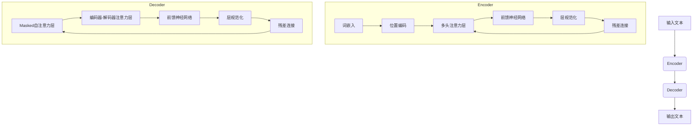

# T5原理与代码实例讲解

## 1.背景介绍

### 1.1 自然语言处理的重要性

在当今的数字时代,自然语言处理(NLP)已经成为人工智能领域中最重要和最具挑战性的研究方向之一。它旨在使计算机能够理解、解释和生成人类语言,从而实现人机之间自然、流畅的交互。NLP技术在多个领域得到广泛应用,包括机器翻译、问答系统、文本摘要、情感分析等。

### 1.2 Transformer模型的崛起

2017年,Transformer模型被提出,它使用了自注意力(Self-Attention)机制,大大提高了序列数据的建模能力。Transformer模型在机器翻译、语言模型等任务上取得了卓越的成绩,成为NLP领域的里程碑式模型。

### 1.3 T5模型的诞生

T5(Text-to-Text Transfer Transformer)是由谷歌AI团队于2019年提出的一种基于Transformer的统一的序列到序列(Seq2Seq)模型框架。它将所有NLP任务都统一转化为"文本到文本"的形式,使用相同的模型结构和损失函数来完成不同的任务,展现出了强大的泛化能力。

## 2.核心概念与联系

### 2.1 Seq2Seq模型

Seq2Seq(Sequence-to-Sequence)模型是一种将一个序列映射到另一个序列的通用框架,广泛应用于机器翻译、文本摘要等任务。它由两部分组成:编码器(Encoder)和解码器(Decoder)。编码器将输入序列编码为上下文向量表示,解码器根据上下文向量生成目标序列。

### 2.2 Transformer模型

Transformer是一种全新的基于注意力机制的Seq2Seq模型结构。它完全放弃了RNN和CNN,使用多头自注意力(Multi-Head Self-Attention)机制来捕捉序列中的长程依赖关系,大大提高了并行计算能力。Transformer模型在机器翻译等任务上取得了出色的表现。

### 2.3 T5模型

T5模型将所有NLP任务统一转化为"文本到文本"的形式,输入为一段带有任务描述的文本,输出为相应的目标文本。这种统一的框架使得T5可以在多个任务上进行无缝转移,避免了为每个任务设计特定的模型结构。T5在编码器和解码器中都采用了Transformer的结构。

T5的核心思想是通过文本提示(Prompts)来指导模型完成不同的任务。例如,对于文本分类任务,输入可以是"文本: xxx 任务: 情感分类"的形式;对于问答任务,输入可以是"问题: xxx 上下文: yyy"的形式。通过设计合适的提示,T5可以完成广泛的NLP任务。

## 3.核心算法原理具体操作步骤 

### 3.1 T5模型结构

T5模型的整体结构如下所示:



T5的编码器和解码器结构与原始Transformer模型类似,但有一些改进:

1. 编码器采用相对位置编码,而不是绝对位置编码,以更好地处理长序列。
2. 解码器使用修改后的因式分解注意力,以提高计算效率。
3. 在预训练阶段,T5使用了一种新的遮掩策略,即同时遮掩编码器和解码器的一部分token。

### 3.2 T5训练过程

T5的训练过程包括两个阶段:预训练(Pre-training)和微调(Fine-tuning)。

1. **预训练阶段**

   在预训练阶段,T5在大规模无标注语料库上进行自监督训练,目标是最大化遮掩token的条件概率。具体来说,对于每个输入序列,T5会随机遮掩掉部分token,然后尝试基于其余token来预测被遮掩的token。这种方式可以让模型学习到通用的语言理解和生成能力。

2. **微调阶段**

   在微调阶段,T5将在特定的有标注数据集上进行监督式微调。根据不同的任务,会设计不同的文本提示作为输入,目标输出则为该任务的标注数据。通过微调,T5可以将通用的语言理解能力转移到特定的NLP任务上。

### 3.3 T5推理过程

在推理阶段,T5将根据输入的文本提示生成相应的输出文本。具体步骤如下:

1. 将输入文本编码为token序列,并添加任务相关的提示。
2. 将编码后的序列输入到T5模型的编码器中,获得上下文向量表示。
3. 将上下文向量输入到解码器中,解码器会自回归地生成一个token序列作为输出。
4. 对生成的token序列进行后处理(如去除特殊token),得到最终的输出文本。

需要注意的是,在推理时,解码器的自注意力层会被修改为仅关注当前位置之前的token,以保证每个时刻生成的token只依赖于之前生成的内容。

## 4.数学模型和公式详细讲解举例说明

### 4.1 Transformer中的注意力机制

注意力机制是Transformer模型的核心,它能够捕捉序列数据中的长程依赖关系。给定一个查询向量$\boldsymbol{q}$和一组键值对$\{(\boldsymbol{k}_i, \boldsymbol{v}_i)\}_{i=1}^n$,注意力机制的计算过程如下:

$$\begin{aligned}
\text{Attention}(\boldsymbol{q}, \boldsymbol{K}, \boldsymbol{V}) &= \text{softmax}\left(\frac{\boldsymbol{q}\boldsymbol{K}^\top}{\sqrt{d_k}}\right)\boldsymbol{V} \\
&= \sum_{i=1}^n \alpha_i \boldsymbol{v}_i
\end{aligned}$$

其中,$\boldsymbol{K} = [\boldsymbol{k}_1, \boldsymbol{k}_2, \ldots, \boldsymbol{k}_n]$是键向量的集合,$\boldsymbol{V} = [\boldsymbol{v}_1, \boldsymbol{v}_2, \ldots, \boldsymbol{v}_n]$是值向量的集合,$d_k$是键向量的维度,注意力权重$\alpha_i$由查询向量$\boldsymbol{q}$和键向量$\boldsymbol{k}_i$的点积计算得到。

注意力机制可以看作是一种加权池化操作,它根据查询向量和键向量之间的相关性,动态地为每个值向量分配不同的权重。这种机制使得模型能够灵活地关注序列中的不同部分,从而更好地捕捉长程依赖关系。

### 4.2 T5中的多头注意力机制

T5模型中采用了多头注意力(Multi-Head Attention)机制,它可以从不同的子空间获取不同的注意力表示,并将它们concatenate在一起,从而提高模型的表示能力。具体计算过程如下:

$$\begin{aligned}
\text{MultiHead}(\boldsymbol{Q}, \boldsymbol{K}, \boldsymbol{V}) &= \text{Concat}(\text{head}_1, \ldots, \text{head}_h)\boldsymbol{W}^O \\
\text{where } \text{head}_i &= \text{Attention}(\boldsymbol{Q}\boldsymbol{W}_i^Q, \boldsymbol{K}\boldsymbol{W}_i^K, \boldsymbol{V}\boldsymbol{W}_i^V)
\end{aligned}$$

其中,$\boldsymbol{Q}$,$\boldsymbol{K}$,$\boldsymbol{V}$分别表示查询、键和值的输入向量序列,$\boldsymbol{W}_i^Q$,$\boldsymbol{W}_i^K$,$\boldsymbol{W}_i^V$是对应头的线性投影矩阵,$\boldsymbol{W}^O$是最终的线性变换矩阵。

多头注意力机制可以从不同的子空间获取不同的注意力表示,并将它们concatenate在一起,从而提高模型的表示能力和泛化性能。

### 4.3 T5中的位置编码

由于Transformer模型完全放弃了RNN和CNN结构,因此它无法像RNN那样自然地编码序列的位置信息。为了解决这个问题,T5采用了相对位置编码(Relative Position Encoding)的方式,它可以更好地处理长序列数据。

相对位置编码的基本思想是,对于每个注意力头,我们不仅需要考虑查询向量和键向量之间的相似性,还需要考虑它们在序列中的相对位置关系。具体来说,注意力分数的计算公式修改为:

$$\text{Attention}(\boldsymbol{q}_i, \boldsymbol{k}_j) = \boldsymbol{q}_i\boldsymbol{k}_j^\top + \boldsymbol{a}_{ij}^{qk}$$

其中,$\boldsymbol{a}_{ij}^{qk}$是一个仅依赖于$i$和$j$之间相对位置的标量,它编码了位置信息。这种相对位置编码的方式可以更好地捕捉长序列中的位置依赖关系,提高了模型的性能。

## 4.项目实践:代码实例和详细解释说明

在这一部分,我们将通过一个实际的代码示例,展示如何使用T5模型完成一个文本摘要任务。代码基于Hugging Face的Transformers库实现。

### 4.1 加载预训练模型和tokenizer

```python
from transformers import T5Tokenizer, T5ForConditionalGeneration

model_name = "t5-base"
tokenizer = T5Tokenizer.from_pretrained(model_name)
model = T5ForConditionalGeneration.from_pretrained(model_name)
```

我们首先加载T5的预训练模型和tokenizer。这里使用的是T5的基础版本(`t5-base`)。

### 4.2 准备输入数据

```python
article = """
Google was founded in 1998 by Larry Page and Sergey Brin, two PhD students at Stanford University. 
The company's mission is to organize the world's information and make it universally accessible and useful.
Google's flagship product is its search engine, which provides users with access to a vast amount of online information.
Over the years, Google has expanded its offerings to include a wide range of products and services, such as Gmail, Google Maps, YouTube, Android, and Google Cloud Platform.
Google has become one of the most influential and valuable companies in the world, with a market capitalization of over $1 trillion.
"""

input_text = "summarize: " + article
input_ids = tokenizer.encode(input_text, return_tensors="pt", max_length=512, truncation=True)
```

我们定义了一个文章`article`作为输入数据。为了将文本摘要任务转化为"文本到文本"的形式,我们在文章前面添加了提示`"summarize: "`。然后,我们使用tokenizer将输入文本编码为token id序列。

### 4.3 生成摘要

```python
output_ids = model.generate(input_ids, max_length=100, num_beams=4, early_stopping=True)
summary = tokenizer.decode(output_ids[0], skip_special_tokens=True)
print(summary)
```

我们调用T5模型的`generate`方法,将编码后的输入传入,并设置一些生成参数,如`max_length`(最大输出长度)、`num_beams`(beam search的beam数量)和`early_stopping`(是否提前停止生成)。

最后,我们使用tokenizer将生成的token id序列解码为文本,得到最终的摘要结果。

输出示例:

```
Google was founded in 1998 by Larry Page and Sergey Brin. The company's mission is to organize the world's information and make it accessible and useful. Google's flagship product is its search engine, providing access to online information. Over the years, Google has expanded to include products like Gmail, Maps, YouTube, Android, and Cloud Platform. Google has become one of the most valuable companies in the world.
```

### 4.4 代码解释

在这个示例中,我们展示了如何使用T5模型完成文本摘要任务。主要步骤包括:

1. 加载预训练的T5模型和tokenizer。
2. 准备输入数据,