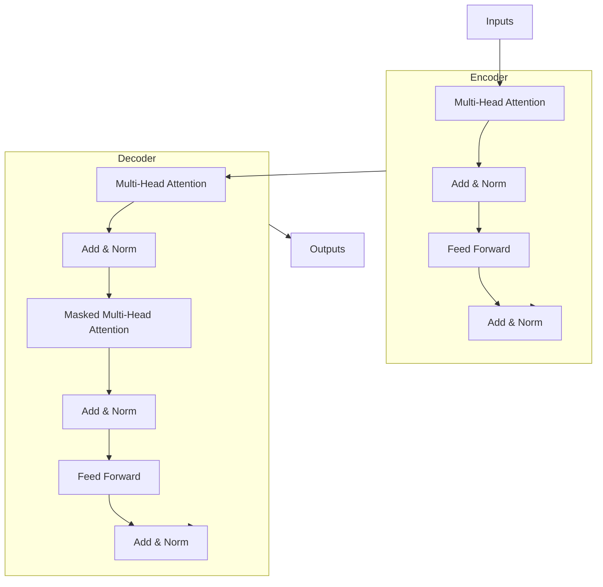

# Transformer的模型微调：定制化应用

## 1.背景介绍

### 1.1 Transformer模型概述

Transformer是一种革命性的神经网络架构,由Vaswani等人在2017年提出,主要用于自然语言处理(NLP)任务。它完全基于注意力机制,摒弃了传统序列模型中的循环神经网络和卷积神经网络结构,显著提高了并行计算能力。自从提出以来,Transformer模型在机器翻译、文本生成、问答系统等NLP任务中表现出色,成为主流模型架构。

### 1.2 Transformer模型微调的重要性

尽管预训练的Transformer模型(如BERT、GPT等)在通用NLP任务上表现卓越,但在特定领域和场景下,它们的性能往往不尽如人意。这就需要对通用模型进行微调(fine-tuning),使其适应特定任务和数据分布。微调是迁移学习的一种形式,可以利用预训练模型中学习到的通用知识,并在目标任务数据上进行进一步训练,从而获得更好的性能。

### 1.3 定制化应用的需求

随着人工智能技术的不断发展,Transformer模型的应用场景也在不断扩展。不同的应用领域和任务对模型有着不同的需求,如金融领域对隐私和合规性要求更高、医疗领域对模型的可解释性和鲁棒性要求更高等。因此,对通用Transformer模型进行定制化微调以满足特定需求就显得尤为重要。

## 2.核心概念与联系

### 2.1 微调的基本思想

微调(Fine-tuning)是指在大规模预训练模型的基础上,利用特定任务的数据进行进一步训练,以使模型适应该任务的数据分布和需求。微调的核心思想是:

1. 利用预训练模型作为初始化权重,避免从头开始训练。
2. 在目标任务数据上进行有监督的微调训练。
3. 通过反向传播算法更新模型参数,使其适应目标任务。

### 2.2 微调与预训练的区别

预训练(Pre-training)和微调(Fine-tuning)是两个密切相关但不同的概念:

- 预训练是在大规模无标注数据上进行自监督学习,目的是获得通用的语言表示能力。
- 微调是在预训练模型的基础上,利用有标注的目标任务数据进行进一步训练,以提高模型在该任务上的性能。

预训练和微调的结合使得Transformer模型能够在通用NLP任务和特定领域任务上都取得优异表现。

### 2.3 微调策略

根据微调的粒度,可以分为以下几种主要策略:

1. **全模型微调(Full Model Fine-tuning)**: 对整个预训练模型(包括编码器和解码器)的所有参数进行微调。
2. **编码器微调(Encoder Fine-tuning)**: 只微调编码器部分的参数,解码器部分保持不变。
3. **解码器微调(Decoder Fine-tuning)**: 只微调解码器部分的参数,编码器部分保持不变。
4. **层级微调(Layer-wise Fine-tuning)**: 对模型的不同层进行分层微调,例如只微调高层参数。

不同的微调策略适用于不同的场景,需要根据具体任务和资源约束进行选择。

### 2.4 微调超参数

在微调过程中,需要合理设置一些超参数,如学习率、批量大小、训练轮数等,以确保模型能够有效收敛并取得最佳性能。常见的微调超参数包括:

- 学习率(Learning Rate)
- 批量大小(Batch Size)
- 训练轮数(Training Epochs)
- 正则化系数(Regularization Coefficients)
- 优化器(Optimizer)

合理设置这些超参数对于微调的效果至关重要。

## 3.核心算法原理具体操作步骤

### 3.1 微调流程概述

Transformer模型微调的基本流程如下:

1. **数据准备**: 收集和预处理目标任务的训练数据,包括文本数据、标注等。
2. **模型选择**: 选择合适的预训练Transformer模型作为初始化模型。
3. **微调配置**: 设置微调超参数,如学习率、批量大小等。
4. **模型微调**: 在目标任务数据上进行有监督微调训练。
5. **模型评估**: 在保留的测试集上评估微调后模型的性能。
6. **模型部署**: 将微调好的模型部署到实际应用系统中。

### 3.2 数据准备

数据准备是模型微调的基础,包括以下几个步骤:

1. **数据收集**: 根据目标任务,收集相关的文本数据,如新闻文章、对话记录等。
2. **数据标注**: 对收集的数据进行人工标注或自动标注,生成训练样本。
3. **数据清洗**: 去除数据中的噪声、错误等,保证数据质量。
4. **数据分割**: 将数据分割为训练集、验证集和测试集。
5. **数据预处理**: 对文本数据进行分词、编码等预处理,以适配Transformer模型的输入格式。

### 3.3 模型选择

选择合适的预训练Transformer模型作为初始化模型是微调的关键。常见的预训练模型包括:

- **BERT**: 双向编码器表示,适用于文本分类、序列标注等任务。
- **GPT**: 生成式预训练Transformer,适用于文本生成、问答等任务。
- **T5**: 统一的文本到文本的Transformer模型,适用于多种NLP任务。
- **ALBERT**: 更小更快的BERT模型,在保持性能的同时降低了计算和存储开销。

选择模型时需要考虑任务类型、模型大小、计算资源等因素。

### 3.4 微调配置

在进行微调训练之前,需要设置一些超参数,如学习率、批量大小等。合理的超参数设置对模型收敛和性能至关重要。常见的微调超参数包括:

- **学习率(Learning Rate)**: 控制模型参数更新的步长,通常采用较小的学习率。
- **批量大小(Batch Size)**: 每次更新参数所使用的样本数量,需要根据GPU内存大小进行调整。
- **训练轮数(Training Epochs)**: 模型在整个训练集上迭代的次数,过多或过少都会影响模型性能。
- **优化器(Optimizer)**: 常用的优化器有AdamW、SGD等,用于更新模型参数。
- **正则化(Regularization)**: 防止过拟合,常用的方法有L2正则化、Dropout等。

可以通过网格搜索、贝叶斯优化等方法来自动搜索最优超参数组合。

### 3.5 模型微调训练

在数据准备和超参数配置完成后,即可开始进行模型微调训练。微调训练的核心步骤如下:

1. **加载预训练模型**: 将选定的预训练Transformer模型加载到内存中。
2. **构建微调模型**: 根据任务需求,在预训练模型的基础上构建微调模型,如添加分类头等。
3. **设置优化器和损失函数**: 选择合适的优化器(如AdamW)和损失函数(如交叉熵损失)。
4. **训练循环**: 遍历训练数据,计算损失,通过反向传播更新模型参数。
5. **模型评估**: 在验证集上评估模型性能,如准确率、F1分数等指标。
6. **模型保存**: 保存微调后的模型权重,以备后续使用或部署。

训练过程中还可以采用一些技巧,如学习率warmup、梯度裁剪等,以提高模型收敛性能。

### 3.6 模型评估和部署

在完成模型微调训练后,需要在保留的测试集上评估模型的泛化性能。评估指标根据任务类型而有所不同,如分类任务常用准确率、F1分数,序列标注任务常用精确率、召回率等。

评估结果满意后,即可将微调后的模型部署到实际的应用系统中,为用户提供服务。部署环节需要考虑模型大小、推理速度、硬件资源等因素,以确保系统的高效运行。

## 4.数学模型和公式详细讲解举例说明

### 4.1 Transformer模型架构

Transformer模型的核心架构由编码器(Encoder)和解码器(Decoder)两部分组成,如下图所示:

编码器的主要作用是映射输入序列到一个连续的表示空间中,而解码器则根据编码器的输出生成目标序列。两者都由多个相同的层组成,每一层包含以下几个子层:

- **Multi-Head Attention**: 计算序列中每个元素与其他元素的注意力权重。
- **Feed Forward**: 对每个元素的表示进行非线性变换,增强表示能力。
- **Add & Norm**: 残差连接和层归一化,提高模型收敛性和泛化性能。

### 4.2 注意力机制(Attention Mechanism)

注意力机制是Transformer模型的核心,用于捕获输入序列中元素之间的依赖关系。具体来说,对于序列中的每个元素,注意力机制会计算它与其他元素的相关性权重,然后根据这些权重对其他元素的表示进行加权求和,作为该元素的注意力表示。

给定查询向量 $\boldsymbol{q}$、键向量 $\boldsymbol{K}$ 和值向量 $\boldsymbol{V}$,注意力计算公式如下:

$$\operatorname{Attention}(\boldsymbol{Q}, \boldsymbol{K}, \boldsymbol{V})=\operatorname{softmax}\left(\frac{\boldsymbol{Q} \boldsymbol{K}^{\top}}{\sqrt{d_{k}}}\right) \boldsymbol{V}$$

其中 $d_k$ 是缩放因子,用于防止内积过大导致梯度消失或爆炸。

### 4.3 Multi-Head Attention

Multi-Head Attention是对单头注意力机制的扩展,它将查询、键和值分别线性映射到不同的子空间,并在每个子空间中计算注意力,最后将所有子空间的注意力结果进行拼接。具体计算过程如下:

1. 将查询 $\boldsymbol{Q}$、键 $\boldsymbol{K}$ 和值 $\boldsymbol{V}$ 分别线性映射到 $h$ 个子空间:

$$
\begin{aligned}
\boldsymbol{Q}_{i} &=\boldsymbol{Q} \boldsymbol{W}_{i}^{Q} \\
\boldsymbol{K}_{i} &=\boldsymbol{K} \boldsymbol{W}_{i}^{K} \\
\boldsymbol{V}_{i} &=\boldsymbol{V} \boldsymbol{W}_{i}^{V}
\end{aligned}
$$

2. 在每个子空间中计算注意力:

$$\operatorname{head}_{i}=\operatorname{Attention}\left(\boldsymbol{Q}_{i}, \boldsymbol{K}_{i}, \boldsymbol{V}_{i}\right)$$

3. 将所有子空间的注意力结果拼接:

$$\operatorname{MultiHead}(\boldsymbol{Q}, \boldsymbol{K}, \boldsymbol{V})=\operatorname{Concat}\left(\operatorname{head}_{1}, \ldots, \operatorname{head}_{h}\right) \boldsymbol{W}^{O}$$

其中 $\boldsymbol{W}_{i}^{Q}$、$\boldsymbol{W}_{i}^{K}$、$\boldsymbol{W}_{i}^{V}$ 和 $\boldsym