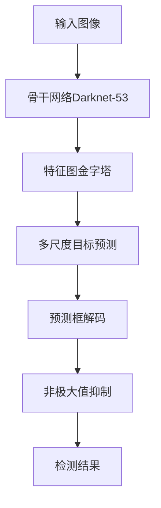
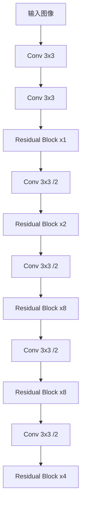

# YOLOv3原理与代码实例讲解

作者：禅与计算机程序设计艺术

## 1. 背景介绍

### 1.1 目标检测的发展历程

目标检测是计算机视觉领域的一个重要任务,旨在从图像或视频中识别和定位感兴趣的目标对象。传统的目标检测方法主要基于手工设计的特征和分类器,如 Haar特征+AdaBoost分类器、HOG特征+SVM分类器等。这些方法在特定场景下取得了不错的效果,但泛化能力较差,难以适应复杂多变的现实场景。

近年来,随着深度学习的兴起,卷积神经网络(CNN)在图像分类任务上取得了突破性进展。研究者们开始尝试将CNN应用到目标检测任务中,并取得了显著的性能提升。代表性的工作包括R-CNN、Fast R-CNN、Faster R-CNN等。这些方法采用两阶段检测策略,即先通过区域建议网络(RPN)产生候选区域,再对候选区域进行分类和回归。虽然两阶段检测器在精度上优于传统方法,但其检测速度较慢,难以满足实时性要求。

为了兼顾检测精度和速度,一些研究者提出了单阶段检测器,代表工作包括YOLO、SSD等。单阶段检测器不需要候选区域生成步骤,直接在整张图像上进行密集预测,因此检测速度更快。其中YOLO(You Only Look Once)因其简洁高效而备受关注,并经过数次改进,形成了YOLOv1~v5等多个版本。本文将重点介绍其中的YOLOv3算法。

### 1.2 YOLOv3的特点与优势

YOLOv3是YOLO系列算法的第三个版本,在保持速度优势的同时,检测精度得到大幅提升,达到甚至超过了许多两阶段检测器。相比之前的v1和v2版本,YOLOv3主要有以下改进:

1. 骨干网络升级为Darknet-53,特征提取能力增强；
2. 使用多尺度预测,融合不同感受野的特征信息；  
3. 改进的损失函数设计,更好地平衡不同尺度目标的损失；
4. 引入了残差结构和上采样操作,增强了特征传递和融合；
5. 采用多标签分类,一个目标可属于多个类别,提高了灵活性。

凭借以上改进,YOLOv3在当时取得了COCO数据集29.4 mAP的精度,同时在Titan X GPU上达到35 FPS的检测速度,实现了精度和速度的较好平衡,是一种实用性很强的目标检测算法。

## 2. 核心概念与联系

### 2.1 整体检测流程

YOLOv3的整体检测流程可分为以下几个关键步骤:

1. 骨干网络提取特征:输入图像通过Darknet-53骨干网络,提取多尺度特征图；

2. 特征图金字塔:在骨干网络的不同阶段引出特征图,并通过上采样和拼接构建特征图金字塔；

3. 多尺度目标预测:在特征图金字塔的每个尺度上,通过卷积层预测目标的类别概率和边界框坐标；

4. 预测框解码:根据预测值和先验框(anchor),解码出目标边界框的实际位置和类别；

5. 非极大值抑制:对预测框进行置信度阈值过滤和非极大值抑制,得到最终的检测结果。

其流程图如下所示:

### 2.2 骨干网络Darknet-53

Darknet-53是YOLOv3使用的骨干网络,用于提取图像特征。它借鉴了残差网络(ResNet)的思想,大量使用了残差块结构。相比v2版本使用的Darknet-19,Darknet-53更深更宽,特征提取能力更强。

Darknet-53共包含53个卷积层,主要由1x1和3x3的卷积层组成。网络中的每个卷积层后面都接了BN层和Leaky ReLU激活函数。此外,网络中还嵌入了多个残差块,每个残差块包含一个shortcut连接和两个卷积层。残差块能够缓解深层网络的梯度消失问题,使网络可以向更深发展。

Darknet-53的结构如下图所示:

### 2.3 特征图金字塔

YOLOv3在Darknet-53的不同阶段引出特征图,并构建特征图金字塔,以融合不同尺度的特征信息。具体而言,YOLOv3选取了三个尺度的特征图:

1. 第一个尺度:在Darknet-53的最后一个卷积层引出,尺寸为13x13,感受野最大,适合检测大目标；

2. 第二个尺度:在倒数第二个残差块引出特征图,并通过一系列卷积层和上采样操作,得到26x26的特征图；

3. 第三个尺度:在倒数第三个残差块引出特征图,并与上采样的第二尺度特征图拼接,再通过卷积和上采样得到52x52的特征图。

通过特征图金字塔,YOLOv3能够在不同尺度上提取目标的特征信息,提高对不同大小目标的检测能力。

### 2.4 多尺度目标预测

YOLOv3在特征图金字塔的每个尺度上,通过卷积层预测目标的类别概率和边界框坐标。具体而言,对于每个尺度的特征图,YOLOv3使用了3个先验框(anchor),因此预测层的通道数为 `(类别数+5)*3` 。其中类别数是数据集的类别总数,5表示每个边界框的5个预测值(4个坐标+1个置信度),3表示每个尺度使用3个先验框。

预测层的输出张量形状为 `(B, H, W, (C+5)*3)` ,其中B为批量大小,H和W为特征图的高和宽,C为类别数。将输出张量reshape为 `(B, H, W, 3, C+5)` 的形式,即可得到每个位置的3个预测框。

### 2.5 预测框解码

YOLOv3预测层的输出是相对值,需要根据特征图尺寸和先验框进行解码,才能得到目标边界框的实际位置。解码过程如下:

1. 将预测的tx、ty通过sigmoid函数归一化到0~1范围,再加上网格单元的偏移,得到边界框中心相对于特征图的坐标；

2. 将预测的tw、th通过指数函数缩放先验框的宽高,得到边界框的宽高；

3. 将边界框中心和宽高相对于特征图的坐标,乘以特征图的步长,得到相对于原图的真实坐标；

4. 根据预测的置信度和类别概率,剔除置信度低于阈值的预测框,得到初步的检测结果。

### 2.6 非极大值抑制

由于YOLOv3在每个位置预测多个边界框,且不同尺度之间也有重叠,因此初步的检测结果中会有大量重叠的预测框。为了去除冗余,需要对预测框进行非极大值抑制(NMS)。

NMS的基本思想是,对于每个类别,根据置信度降序排列所有预测框,然后从最高置信度的预测框开始,计算其与其他预测框的交并比(IoU),剔除IoU大于阈值的预测框,直到所有预测框都被处理。这样可以保留置信度最高的预测框,去除重叠的预测框,得到最终的检测结果。

## 3. 核心算法原理具体操作步骤

YOLOv3的核心算法可以分为以下几个具体步骤:

### 3.1 图像预处理

1. 将输入图像缩放到指定尺寸(如416x416),并进行归一化；
2. 将归一化后的图像数据转换为网络输入所需的张量形式。

### 3.2 骨干网络提取特征

1. 将预处理后的图像输入Darknet-53骨干网络；
2. 骨干网络通过一系列卷积层和残差块,提取图像的多尺度特征图。

### 3.3 构建特征图金字塔

1. 在Darknet-53的三个阶段引出不同尺度的特征图；
2. 对低层的特征图进行一系列卷积和上采样操作,与高层特征图进行拼接,构建特征图金字塔。

### 3.4 多尺度目标预测

1. 在特征图金字塔的每个尺度上,通过卷积层预测目标的类别概率和边界框坐标；
2. 预测层输出的张量形状为(B, H, W, (C+5)*3),表示每个位置有3个先验框,每个先验框预测C个类别概率、4个边界框坐标和1个置信度。

### 3.5 预测框解码

1. 将预测层输出的张量reshape为(B, H, W, 3, C+5)的形式；
2. 对预测的tx、ty进行sigmoid归一化,加上网格单元偏移,得到边界框中心相对于特征图的坐标；
3. 对预测的tw、th进行指数缩放,得到边界框相对于先验框的宽高；
4. 将边界框中心和宽高相对于特征图的坐标乘以特征图步长,得到相对于原图的真实坐标；
5. 根据置信度阈值,剔除低置信度的预测框。

### 3.6 非极大值抑制

1. 对每个类别的预测框,根据置信度降序排列；
2. 从置信度最高的预测框开始,计算其与其他预测框的交并比(IoU)；
3. 剔除IoU大于阈值的预测框,保留置信度最高的预测框；
4. 重复步骤2-3,直到所有预测框都被处理。

### 3.7 后处理

1. 对NMS后的检测结果,根据置信度和类别概率,输出最终的目标边界框和类别标签；
2. 可视化检测结果,在原图上绘制目标边界框和类别标签。

## 4. 数学模型和公式详细讲解举例说明

### 4.1 边界框预测

YOLOv3在每个网格单元预测B个边界框(默认B=3)。对于每个边界框,模型预测4个值:中心坐标 $t_x$、$t_y$ 和宽高 $t_w$、$t_h$。预测值是相对于网格单元左上角的偏移和先验框宽高的缩放比例。

假设特征图大小为 $S \times S$,先验框宽高为 $p_w$、$p_h$,网格单元的左上角坐标为 $(c_x, c_y)$,则边界框的实际中心坐标 $(b_x, b_y)$ 和宽高 $(b_w, b_h)$ 计算如下:

$$
\begin{aligned}
b_x &= \sigma(t_x) + c_x \\
b_y &= \sigma(t_y) + c_y \\
b_w &= p_w e^{t_w} \\
b_h &= p_h e^{t_h}
\end{aligned}
$$

其中 $\sigma$ 表示sigmoid函数,用于将 $t_x$、$t_y$ 归一化到0~1范围内。$e$ 为自然常数,用于缩放先验框的宽高。

举例说明:假设特征图大小为13x13,先验框宽高为(30, 60),某个网格单元的左上角坐标为(2, 2),预测值为:

$$
t_x=0.2, t_y=0.3, t_