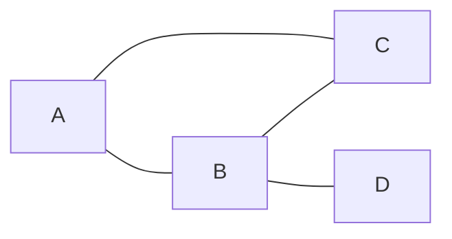

# 【AI大数据计算原理与代码实例讲解】图算法

作者：禅与计算机程序设计艺术

## 1. 背景介绍

### 1.1 图算法在AI和大数据领域的重要性

在人工智能和大数据时代,图算法扮演着至关重要的角色。图是一种非常强大和灵活的数据结构,可以用来表示各种复杂系统中对象之间的关系,如社交网络、知识图谱、推荐系统等。图算法是一类专门处理图数据结构的算法,可以高效地分析和挖掘图中蕴藏的信息和规律。

### 1.2 图算法的研究现状

近年来,随着图数据规模的急剧增长,传统的图算法在性能和扩展性方面遇到了瓶颈。为了应对大规模图数据带来的挑战,学术界和工业界都在积极探索高性能图算法。一方面,研究人员提出了许多新颖的并行图算法,利用多核CPU、GPU等并行硬件加速图计算;另一方面,一些大数据计算框架如Spark、Flink也集成了图计算库,使得图算法能够无缝运行在分布式集群环境中。

### 1.3 本文的主要内容

本文将全面深入地探讨图算法在AI和大数据领域的应用。内容涵盖了图算法的基本概念、经典算法、并行优化技术以及在实际系统中的案例。通过本文的学习,读者可以系统地掌握图算法的原理和实现,了解其在不同应用场景下的优势和挑战,为进一步研究和应用图算法打下坚实基础。

## 2. 核心概念与联系

### 2.1 图的基本概念

- 顶点(Vertex):图中的基本元素,表示一个对象或实体。
- 边(Edge):连接两个顶点,表示它们之间的关系。边可以是有向的或无向的,带权重或不带权重。
- 度(Degree):一个顶点连接的边的数量。有入度(指向该顶点的边)和出度(从该顶点出发的边)之分。
- 路径(Path):由一系列顶点和边首尾连接形成的序列。
- 连通图(Connected Graph):图中任意两个顶点之间都存在路径。
- 强连通图(Strongly Connected Graph):有向图中任意两个顶点之间存在双向路径。

### 2.2 常见的图类型

- 无向图(Undirected Graph):边没有方向,顶点之间的关系是对称的。
- 有向图(Directed Graph):边有方向,用有向边〈u,v〉表示从u到v的单向关系。
- 加权图(Weighted Graph):每条边赋予一个权值,表示顶点之间的距离、成本等属性。
- 二分图(Bipartite Graph):顶点可分为两个互斥子集,使得所有边都跨越两个子集。

### 2.3 图的存储方式

- 邻接矩阵(Adjacency Matrix):用一个二维矩阵表示图,矩阵元素a[i][j]表示顶点i到j是否有边。
- 邻接表(Adjacency List):每个顶点关联一个列表,存储与之相连的顶点。
- 边集数组(Edge List):用一个数组存储图的所有边。

### 2.4 图算法的分类

- 遍历算法:BFS、DFS等,用于系统地访问图的所有顶点和边。
- 最短路径算法:Dijkstra、Floyd等,计算图中顶点之间的最短距离。
- 连通性算法:Union-Find、Tarjan等,用于解决图的连通性问题。
- 图匹配算法:匈牙利算法等,在二分图中寻找最大匹配。
- 网络流算法:最大流、最小割等,求解图上的流量最优化问题。
- 社区发现算法:PageRank、标签传播等,用于在图中发现紧密联系的社区结构。

## 3. 核心算法原理具体操作步骤

### 3.1 图的遍历算法

#### 3.1.1 BFS(广度优先搜索)

BFS从一个源顶点出发,先访问其所有邻居,再访问邻居的邻居,直到所有顶点都被访问到。其基本步骤如下:

1. 选择一个源顶点s,置s为已访问,将s入队列Q。
2. 若Q非空,取出队首顶点v,访问v未访问过的邻居w,置w为已访问,将w入队。
3. 重复步骤2,直到Q为空。

#### 3.1.2 DFS(深度优先搜索)

DFS从一个源顶点出发,沿着一条路径不断前进,直到无法继续为止,然后回溯到最近的岔路口,再次前进。其基本步骤如下:

1. 选择一个源顶点s,置s为已访问,访问s。
2. 若s有未访问过的邻居w,则置w为已访问,递归访问w。
3. 重复步骤2,直到所有与s连通的顶点都被访问到。

### 3.2 最短路径算法

#### 3.2.1 Dijkstra算法

Dijkstra算法用于计算单源最短路径,即从一个源顶点到其他所有顶点的最短距离。其基本步骤如下:

1. 初始化距离数组d,d[s]=0,其他d[v]=∞。初始化访问集合S为空。
2. 从未访问的顶点中选择d最小的v,访问v,将v加入S。
3. 对v的每个邻居w,若d[v]+w(v,w)<d[w],则更新d[w]=d[v]+w(v,w)。
4. 重复步骤2-3,直到所有顶点都被访问。

#### 3.2.2 Floyd算法

Floyd算法用于计算图中所有顶点对之间的最短路径。其基本步骤如下:

1. 初始化距离矩阵d,d[i][j]为i到j的边权重,不相邻则d[i][j]=∞。
2. 三重循环,以顶点k为中介,尝试更新所有顶点对i,j的最短距离:
   
   若d[i][k]+d[k][j]<d[i][j],则d[i][j]=d[i][k]+d[k][j]
3. 最终d[i][j]即为i到j的最短距离。

### 3.3 连通性算法

#### 3.3.1 Union-Find算法

Union-Find算法用于解决动态连通性问题,支持高效地合并集合和查询元素所属集合。其基本步骤如下:

1. 初始化parent数组,parent[i]=i,表示每个元素各自为一个集合。
2. 合并(Union)操作:将两个元素所在集合合并为一个。
   
   递归找到两个元素的根节点root1和root2,将其中一个根节点的parent设为另一个。
3. 查找(Find)操作:查询一个元素所属的集合。
   
   从该元素出发,沿着parent链递归查找,直到找到根节点,即为所属集合。

#### 3.3.2 Tarjan算法

Tarjan算法用于寻找有向图的强连通分量(SCC)。其基本步骤如下:

1. 初始化时间戳time=0,栈S为空。对每个顶点v,设置v.visited=false。
2. 从一个未访问的顶点v开始,进行DFS。
3. 访问v,将v入栈S,设置v.visited=true,v.low=v.disc=++time。
4. 遍历v的每个邻居w。若w未访问,递归访问w,并更新v.low=min(v.low,w.low)。
   
   若w已访问且在栈S中,更新v.low=min(v.low,w.disc)。
5. 若v是某个SCC的根,即满足v.low==v.disc,则将栈S中v及其以上的顶点弹出,构成一个SCC。
6. 重复步骤2-5,直到所有顶点都被访问。

### 3.4 图匹配算法

#### 3.4.1 匈牙利算法

匈牙利算法用于在二分图中寻找最大匹配,即最多的互不相交的边的集合。其基本步骤如下:

1. 初始化匹配M为空。对每个左部顶点u,设置u.visited=false。
2. 对每个未匹配的左部顶点u,进行增广路径搜索。
3. 设置u.visited=true。对u的每个邻居v,若v未被匹配,则找到增广路径,更新匹配M。
   
   若v已被匹配,则递归搜索v的匹配对象,尝试找到增广路径。
4. 若找到增广路径,则沿路径取反匹配边,扩大匹配M的大小。
5. 重复步骤2-4,直到所有左部顶点都被尝试匹配。

### 3.5 网络流算法

#### 3.5.1 Ford-Fulkerson算法

Ford-Fulkerson算法用于求解网络流图的最大流问题。其基本步骤如下:

1. 初始化流量flow=0。
2. 在残留网络中用BFS或DFS寻找一条从源点到汇点的增广路径。
3. 若找到增广路径,则计算路径上的最小残留容量min_cap,flow+=min_cap。
   
   沿增广路径更新边的流量和残留容量。
4. 重复步骤2-3,直到无法找到增广路径。
5. 最终flow即为网络的最大流。

### 3.6 社区发现算法

#### 3.6.1 PageRank算法

PageRank算法最初用于网页排名,通过随机游走模型计算网页的重要性。其基本步骤如下:

1. 初始化PageRank值PR,对每个顶点v,设置PR[v]=1/N,N为顶点总数。
2. 多轮迭代,直到PR值收敛。在每一轮:
   
   对每个顶点v,更新PR[v]=0.15/N+0.85*∑(PR[u]/out_degree[u]),u为指向v的顶点。
3. 最终PR值即为顶点的重要性得分,PR值越大,顶点越重要。

#### 3.6.2 标签传播算法(LPA)

LPA通过迭代传播顶点的标签,自动发现图中的社区结构。其基本步骤如下:

1. 初始化标签,对每个顶点v,设置其标签label[v]=v。
2. 多轮迭代,直到标签不再变化。在每一轮:
   
   对每个顶点v,统计其邻居的标签分布,将出现频率最高的标签更新为v的新标签。
3. 具有相同标签的顶点被划分到同一个社区。

## 4. 数学模型和公式详细讲解举例说明

### 4.1 图的数学表示

#### 4.1.1 邻接矩阵

对于一个有n个顶点的图G,其邻接矩阵A是一个n×n的方阵,定义为:

$$
A[i][j]=
\begin{cases}
1 & \text{if (i,j)∈E} \\
0 & \text{otherwise}
\end{cases}
$$

其中E表示图的边集。邻接矩阵的空间复杂度为O(n^2),适合表示稠密图。

例如,对于下面这个无向图:



其邻接矩阵为:

$$
A=
\begin{bmatrix}
0 & 1 & 1 & 0 \\
1 & 0 & 1 & 1 \\
1 & 1 & 0 & 0 \\
0 & 1 & 0 & 0
\end{bmatrix}
$$

#### 4.1.2 邻接表

邻接表用一个数组Adj存储图,数组的每个元素Adj[v]是一个链表,存储顶点v的所有邻居。

例如,对于上面的无向图,其邻接表表示为:

```
Adj[A] = {B,C}
Adj[B] = {A,C,D}
Adj[C] = {A,B}
Adj[D] = {B}
```

邻接表的空间复杂度为O(V+E),适合表示稀疏图。

### 4.2 最短路径算法的数学原理

#### 4.2.1 Dijkstra算法

Dijkstra算法基于贪心思想,每次选择距离源点最近的未访问顶点,更新其邻居的距离。

设d[v]表示源点s到顶点v的最短距离,w(u,v)表示边(u,v)的权重。则Dijkstra算法可以用以下数学递推公式表示:

$$
d[