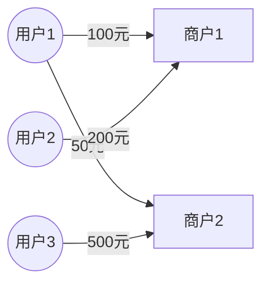

# 一切皆是映射：神经网络在金融欺诈检测中的应用

作者：禅与计算机程序设计艺术

## 1. 背景介绍

### 1.1 金融欺诈检测的重要性
在当今数字化时代,随着电子商务、移动支付等新兴金融服务的蓬勃发展,金融欺诈活动也呈现出多样化、隐蔽化的特点,给金融机构和用户带来了巨大的经济损失。据统计,2021年全球金融欺诈造成的损失高达5.8万亿美元[1]。因此,如何有效地检测和防范金融欺诈,已经成为金融行业亟需解决的关键问题。

### 1.2 传统欺诈检测方法的局限性
传统的金融欺诈检测主要依赖于专家经验和规则引擎,通过人工定义一系列规则来判断交易的可疑程度。然而,面对日益复杂的欺诈手段,这种方法往往难以应对。它存在以下几个局限性:

1. 规则的制定依赖专家经验,覆盖面有限,无法应对新型欺诈手法
2. 规则更新滞后,难以实时响应欺诈模式的变化  
3. 规则引擎的判断往往是非黑即白,缺乏灵活性
4. 无法挖掘交易数据中隐含的关联信息

### 1.3 机器学习在欺诈检测中的优势
近年来,以机器学习为代表的人工智能技术在欺诈检测领域展现出巨大的应用潜力。相比传统方法,机器学习具有以下优势:

1. 自动从海量历史数据中学习欺诈模式,无需人工定义规则
2. 能够挖掘交易数据中的隐含关联,发现人眼难以察觉的欺诈特征  
3. 模型可以持续学习,自适应欺诈模式的演变
4. 可以给出交易的欺诈概率,而非简单的二元判断

在众多机器学习模型中,神经网络以其强大的非线性拟合能力和自动特征提取能力,成为欺诈检测的利器。本文将重点探讨神经网络在金融欺诈检测中的应用。

## 2. 核心概念与联系

### 2.1 神经网络的本质:一切皆是映射

神经网络的本质,是学习从输入到输出的映射关系。所谓映射,就是一种对应法则,即某个输入对应着特定的输出。在欺诈检测场景下,输入是交易的各类特征,如交易金额、时间、地点、信用评分等;输出则是该笔交易为欺诈的概率。神经网络通过调整内部参数,不断拟合输入输出间的复杂映射,最终建立起一个强大的分类器。

### 2.2 前馈神经网络:信息的层层传递

前馈神经网络是最基础的神经网络结构,由输入层、隐藏层和输出层组成。每层由多个神经元构成,层与层之间通过权重矩阵连接。信息从输入层开始,逐层向前传递,直至输出层给出预测结果。这一过程可以用数学公式表示为:

$$
\begin{aligned}
h_1 &= f(W_1x + b_1) \\
h_2 &= f(W_2h_1 + b_2) \\ 
&... \\
\hat{y} &= \sigma(W_nh_{n-1} + b_n)
\end{aligned}
$$

其中,$x$为输入特征向量,$h_i$为第$i$层隐藏层的输出,$W_i$和$b_i$分别为第$i$层的权重矩阵和偏置项,$f$为激活函数(如ReLU、tanh等),$\sigma$为输出层的激活函数(如Sigmoid),$\hat{y}$为预测的欺诈概率。

通过梯度下降等优化算法,网络不断调整权重和偏置,最小化预测值与真实标签间的损失,从而学习到最优的欺诈判别模型。

### 2.3 卷积神经网络:提取局部特征

卷积神经网络(CNN)是一种特殊的前馈网络,常用于图像、语音等具有局部相关性的数据。它的核心是卷积层和池化层,前者用于提取局部特征,后者用于降维和特征不变性。在欺诈检测中,CNN可以用于提取交易序列的时空特征。例如,将一个用户的历史交易记录看作一张二维图像,横轴为时间,纵轴为交易金额,则CNN能自动提取其中的欺诈模式。

### 2.4 循环神经网络:捕捉时序依赖

循环神经网络(RNN)是一种擅长处理序列数据的网络,它引入了隐藏状态来记忆之前的信息。在每个时间步,RNN接收当前输入和上一步的隐藏状态,并输出新的隐藏状态,形成了一个循环的信息传递过程。常见的RNN变体有LSTM和GRU,它们通过门控机制缓解了梯度消失问题。在欺诈检测中,RNN可以用于建模用户行为序列,捕捉其中的时间依赖关系,如异常的交易频率变化等。

### 2.5 图神经网络:挖掘拓扑关系

图神经网络(GNN)是专门用于处理图结构数据的神经网络。它通过聚合节点的邻居信息来更新节点的隐藏状态,从而学习节点的表示向量。在欺诈检测场景下,交易数据可以建模为一个异构图,其中节点可以是用户、商户、设备等,边则表示它们之间的交互关系。GNN能挖掘这种复杂的拓扑结构,识别出欺诈团伙等异常模式。

## 3. 核心算法原理与具体操作步骤

本节我们以图神经网络为例,详细介绍其在异构图欺诈检测中的算法原理和操作步骤。

### 3.1 异构图的构建

首先,我们需要将原始的交易数据转化为异构图。具体步骤如下:

1. 确定节点类型。常见的节点类型有用户、商户、设备、IP地址等。不同类型的节点用不同的符号表示,如用户用圆形表示,商户用方形表示。

2. 确定边的类型。常见的边有交易关系、登录关系、设备共享关系等。不同类型的边用不同的符号表示,如实线表示交易,虚线表示登录。

3. 根据原始数据,生成节点和边。每一条交易记录对应生成一条交易边,连接相应的用户节点和商户节点。

4. 为节点和边添加属性。节点的属性可以是用户的个人信息、信用评分等,边的属性可以是交易金额、时间等。属性用向量表示,附加到相应的节点和边上。

经过上述步骤,我们就得到了一个包含丰富信息的异构图。

### 3.2 图神经网络的前向传播

图神经网络的核心是通过聚合邻居信息来更新节点的隐藏状态。以下是一个简单的图神经网络层的前向传播过程:

1. 初始化每个节点的隐藏状态。可以简单地使用节点的属性向量作为初始状态。

2. 对每个节点,聚合其邻居的隐藏状态。聚合函数可以是求和、求平均等。以求和为例,节点$i$的邻居聚合信息为:

$$
h_i^{(l)} = \sum_{j \in N(i)} h_j^{(l-1)}
$$

其中,$N(i)$表示节点$i$的邻居集合,$h_i^{(l)}$表示第$l$层中节点$i$的隐藏状态。

3. 将节点的原始隐藏状态与邻居聚合信息相结合,并通过一个非线性变换,得到节点的新隐藏状态:

$$
h_i^{(l)} = \sigma(W_1 h_i^{(l-1)} + W_2 \sum_{j \in N(i)} h_j^{(l-1)})
$$

其中,$W_1$和$W_2$是可学习的参数矩阵,$\sigma$是激活函数。

4. 重复步骤2和3,多次更新节点的隐藏状态,直至达到预设的层数。

5. 将最后一层的节点隐藏状态输入到一个分类器中,如MLP,得到每个节点的欺诈概率。

通过这种方式,GNN能够充分挖掘图结构中蕴含的信息,学习到鲁棒的节点表示,从而实现对欺诈交易的精准判别。

### 3.3 模型训练与优化

图神经网络的训练采用端到端的监督学习范式。首先,我们需要准备训练数据,包括构建异构图以及每个节点的欺诈标签。然后,使用如下的损失函数来优化模型参数:

$$
L = -\sum_{i=1}^{N} [y_i \log \hat{y}_i + (1-y_i) \log (1-\hat{y}_i)] + \lambda \sum_{W} \lVert W \rVert_2^2
$$

其中,第一项是交叉熵损失,用于衡量预测概率与真实标签的差异;第二项是L2正则化项,用于防止过拟合;$\lambda$是正则化系数。

在训练过程中,我们通过minibatch梯度下降等优化算法,不断更新模型参数,最小化损失函数。同时,我们还可以使用一些技巧来加速训练和提升性能,如:

- 使用邻居采样,随机选取一部分邻居参与聚合,减少计算复杂度
- 使用层级化的聚合策略,先在局部聚合,再逐层扩大聚合范围  
- 引入注意力机制,给不同邻居分配不同的权重,提升聚合质量
- 使用图数据增强,随机添加或删除一些边,提高模型的鲁棒性

经过充分训练后,我们就得到了一个性能优异的图神经网络模型,可以用于实际的欺诈检测任务。

## 4. 数学模型与公式详解

本节我们对图神经网络中用到的一些关键数学模型和公式进行详细讲解,并给出直观的示例。

### 4.1 图的数学表示

图是一种由节点和边组成的数据结构,可以用如下的数学符号来表示:

$$
G = (V, E)
$$

其中,$V$表示节点的集合,$E$表示边的集合。每个节点$v_i \in V$,每条边$e_{ij} \in E$连接节点$v_i$和$v_j$。

在欺诈检测场景下,我们通常使用属性图,即每个节点和边都附加了属性向量。属性图可以表示为:

$$
G = (V, E, X^v, X^e)
$$

其中,$X^v \in \mathbb{R}^{N \times D_v}$表示节点属性矩阵,$N$为节点数,$D_v$为节点属性的维度;$X^e \in \mathbb{R}^{M \times D_e}$表示边属性矩阵,$M$为边数,$D_e$为边属性的维度。

例如,下图展示了一个简单的用户-商户交易图:

该图包含3个用户节点和2个商户节点,以及4条交易边。节点的属性可以是用户的年龄、性别等,边的属性就是交易金额。

### 4.2 节点邻居聚合

图神经网络的核心操作是聚合节点的邻居信息。常见的聚合函数有:

1. 求和聚合:

$$
h_i^{(l)} = \sum_{j \in N(i)} h_j^{(l-1)}
$$

2. 求平均聚合:

$$
h_i^{(l)} = \frac{1}{|N(i)|} \sum_{j \in N(i)} h_j^{(l-1)}
$$

3. 最大池化聚合:

$$
h_i^{(l)} = \max_{j \in N(i)} h_j^{(l-1)}
$$

其中,$h_i^{(l)}$表示第$l$层中节点$i$的隐藏状态,$N(i)$表示节点$i$的邻居集合。

不同的聚合函数有不同的