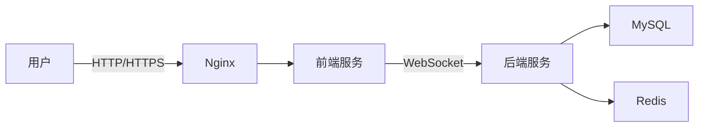
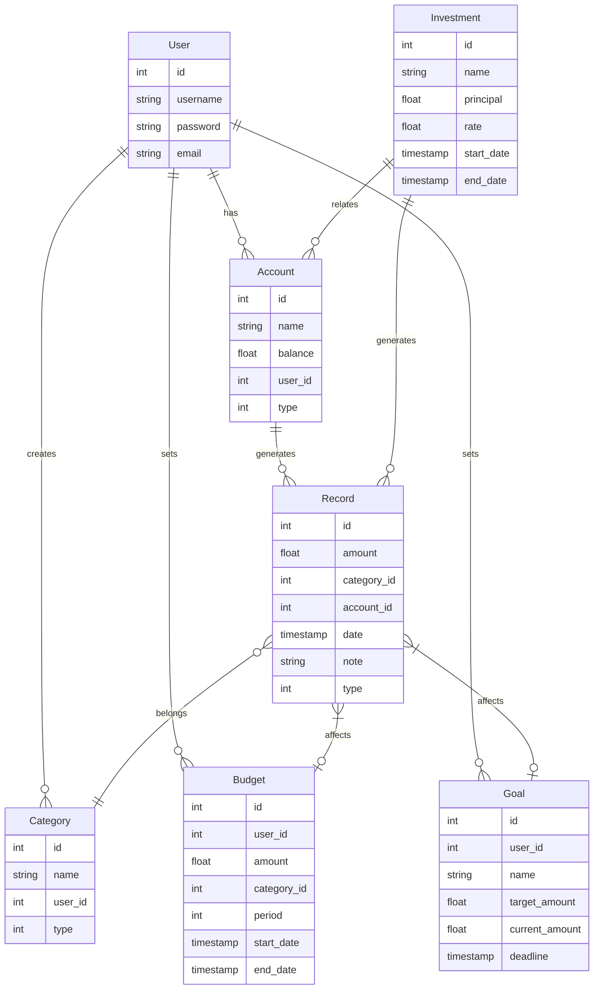

# 个人财务管理系统详细设计与具体代码实现

作者：禅与计算机程序设计艺术

## 1.背景介绍

### 1.1 个人财务管理的重要性

在当今社会,个人财务管理已经成为每个人都需要掌握的重要技能。合理规划和管理个人财务,不仅可以帮助我们实现财务自由,更能为我们的生活质量提供有力保障。然而,由于缺乏系统性的财务知识和有效的管理工具,很多人在个人财务管理方面仍然存在诸多困惑和问题。

### 1.2 财务管理系统的必要性

为了帮助人们更好地管理个人财务,开发一套功能完善、易于操作的个人财务管理系统势在必行。这样的系统不仅能够帮助用户全面掌握自己的收支情况,还能够提供个性化的理财建议,为用户的财务决策提供有力支持。

### 1.3 本文的主要内容

本文将详细介绍一个个人财务管理系统的设计与实现过程。我们将从需求分析入手,明确系统的功能需求和非功能需求;然后进行系统架构设计,确定系统的整体架构和关键组件;接着进行数据库设计,定义系统所需的数据模型和表结构;最后,我们将使用Java语言实现系统的核心功能,并给出关键代码示例。

## 2.核心概念与联系

### 2.1 个人财务管理的核心概念

个人财务管理涉及到以下几个核心概念:

- 资产:个人拥有的现金、银行存款、房产、车辆等各种形式的财产。
- 负债:个人需要偿还的各种贷款,如房贷、车贷、信用卡账单等。  
- 收入:个人通过工资、投资收益等渠道获得的资金。
- 支出:个人在生活、工作、娱乐等方面产生的各项开销。
- 预算:根据收入和支出情况,对未来一段时间的财务活动做出的计划。
- 投资:将闲置资金投入到股票、基金、理财产品等领域,以获取收益的行为。

### 2.2 个人财务管理的关键环节

个人财务管理通常包括以下几个关键环节:

1. 记账:详细记录每笔收入和支出,了解资金的流向。
2. 分类:将收支划分为不同的类别,如食品、交通、医疗等,便于分析。
3. 分析:根据记账数据生成报表和图表,分析收支结构和变化趋势。  
4. 预算:根据收支情况制定未来一段时间的财务计划,合理控制开支。
5. 投资:根据风险偏好和财务目标,将部分资金投入理财产品,实现资产增值。
6. 审视:定期回顾财务状况,评估财务计划执行情况,必要时进行调整。

只有建立起一套涵盖记账、分析、预算、投资等环节的完整财务管理流程,才能真正实现财务的有效管控。

### 2.3 个人财务管理系统的作用

个人财务管理系统是帮助个人实现财务管理的重要工具。一个优秀的个人财务管理系统应该具备以下功能:

1. 提供便捷的记账功能,用户可以轻松记录每笔收支。
2. 支持多维度的收支分类,如时间、类别、项目等。
3. 提供丰富的统计分析功能,自动生成收支报表和趋势图。
4. 内置智能化的预算功能,根据用户的收支情况自动生成预算建议。
5. 集成常见的投资理财工具,提供个性化的投资组合推荐。
6. 数据安全性高,隐私保护措施完善。

下面,我们将从需求分析、架构设计、数据库设计、代码实现等方面,详细介绍一个个人财务管理系统的设计与开发过程。

## 3.核心算法原理具体操作步骤

### 3.1 系统需求分析

#### 3.1.1 功能需求

1. 用户管理
   - 用户注册与登录
   - 用户信息管理
2. 账户管理
   - 账户设置(如现金、信用卡、储蓄卡等)
   - 账户之间的转账
3. 收支记录
   - 手动添加收支记录
   - 自动导入银行账单
   - 收支记录的编辑与删除
4. 收支分类
   - 自定义分类(如餐饮、交通、教育等) 
   - 为每笔收支设置分类  
5. 统计报表
   - 收支统计(日/周/月/年)
   - 收支构成分析(各分类占比)
   - 收支趋势分析(变化曲线)
6. 预算管理
   - 设置预算(月度/年度)
   - 预算执行情况跟踪
   - 预算提醒  
7. 投资管理
   - 投资账户设置
   - 投资记录管理
   - 投资收益统计
8. 财务目标
   - 设置财务目标(如购房、旅游等)
   - 目标完成情况跟踪

#### 3.1.2 非功能需求

1. 安全性
   - 用户密码加密存储
   - 敏感数据加密传输
   - 操作日志记录
2. 性能
   - 页面响应时间不超过2秒
   - 并发用户数不低于500
3. 易用性
   - 界面简洁美观
   - 操作流程清晰
   - 提供操作提示和帮助信息
4. 兼容性
   - 支持主流浏览器(Chrome、Firefox、Safari等)
   - 支持主流移动端(Android、iOS)
5. 可扩展性
   - 系统架构可灵活扩展
   - 代码模块化设计
   - 数据库表结构可扩展

### 3.2 系统架构设计

#### 3.2.1 技术选型

- 前端:Vue.js
- 后端:Spring Boot
- 数据库:MySQL
- 缓存:Redis
- 安全框架:Spring Security
- 持久层框架:MyBatis-Plus
- 前后端分离部署

#### 3.2.2 系统架构图



- 用户通过浏览器访问前端页面
- 前端通过HTTP/HTTPS协议与Nginx通信
- Nginx负责请求的转发和负载均衡
- 前端通过WebSocket与后端服务通信
- 后端服务调用MySQL进行数据持久化
- 后端服务使用Redis进行数据缓存

#### 3.2.3 包结构设计

```
├─config
├─controller
├─service
│ ├─impl
├─mapper
├─entity
├─dto
├─vo
├─exception
├─utils
└─resources
  ├─mapper
  ├─static
  └─templates
```

- config:存放系统配置类
- controller:存放控制器类
- service:存放服务接口
  - impl:存放服务实现类
- mapper:存放数据访问层接口
- entity:存放数据库实体类
- dto:存放数据传输对象
- vo:存放视图对象
- exception:存放异常处理类
- utils:存放工具类
- resources
  - mapper:存放MyBatis XML映射文件
  - static:存放静态资源
  - templates:存放模板文件

### 3.3 数据库设计

#### 3.3.1 E-R图设计



#### 3.3.2 数据表设计

- 用户表(user)

| 字段     | 类型         | 主键 | 非空 | 默认值 | 描述   |
| -------- | ------------ | ---- | ---- | ------ | ------ |
| id       | int(11)      | 是   | 是   |        | 主键ID |
| username | varchar(50)  |      | 是   |        | 用户名 |
| password | varchar(100) |      | 是   |        | 密码   |
| email    | varchar(100) |      | 是   |        | 邮箱   |

- 账户表(account)

| 字段     | 类型        | 主键 | 非空 | 默认值 | 描述     |
| -------- | ----------- | ---- | ---- | ------ | -------- |
| id       | int(11)     | 是   | 是   |        | 主键ID   |
| name     | varchar(50) |      | 是   |        | 账户名称 |
| balance  | float       |      | 是   | 0      | 账户余额 |
| user_id  | int(11)     |      | 是   |        | 用户ID   |
| type     | int(11)     |      | 是   | 0      | 账户类型 |

- 分类表(category)

| 字段    | 类型        | 主键 | 非空 | 默认值 | 描述     |
| ------- | ----------- | ---- | ---- | ------ | -------- |
| id      | int(11)     | 是   | 是   |        | 主键ID   |
| name    | varchar(50) |      | 是   |        | 分类名称 |
| user_id | int(11)     |      | 是   |        | 用户ID   |
| type    | int(11)     |      | 是   | 0      | 分类类型 |

- 记录表(record)

| 字段        | 类型         | 主键 | 非空 | 默认值 | 描述       |
| ----------- | ------------ | ---- | ---- | ------ | ---------- |
| id          | int(11)      | 是   | 是   |        | 主键ID     |
| amount      | float        |      | 是   |        | 金额       |
| category_id | int(11)      |      | 是   |        | 分类ID     |
| account_id  | int(11)      |      | 是   |        | 账户ID     |
| date        | timestamp    |      | 是   |        | 记录日期   |
| note        | varchar(200) |      |      |        | 备注       |
| type        | int(11)      |      | 是   | 0      | 记录类型   |

- 预算表(budget)

| 字段        | 类型      | 主键 | 非空 | 默认值 | 描述     |
| ----------- | --------- | ---- | ---- | ------ | -------- |
| id          | int(11)   | 是   | 是   |        | 主键ID   |
| user_id     | int(11)   |      | 是   |        | 用户ID   |
| amount      | float     |      | 是   |        | 预算金额 |
| category_id | int(11)   |      | 是   |        | 分类ID   |
| period      | int(11)   |      | 是   | 0      | 预算周期 |
| start_date  | timestamp |      | 是   |        | 开始日期 |
| end_date    | timestamp |      | 是   |        | 结束日期 |

- 目标表(goal)

| 字段          | 类型         | 主键 | 非空 | 默认值 | 描述       |
| ------------- | ------------ | ---- | ---- | ------ | ---------- |
| id            | int(11)      | 是   | 是   |        | 主键ID     |
| user_id       | int(11)      |      | 是   |        | 用户ID     |
| name          | varchar(50)  |      | 是   |        | 目标名称   |
| target_amount | float        |      | 是   |        | 目标金额   |
| current_amount| float        |      | 是   | 0      | 当前金额   |
| deadline      | timestamp    |      | 是   |        | 截止日期   |

- 投资表(investment)

| 字段        | 类型      | 主键 | 非空 | 默认值 | 描述     |
| -----------