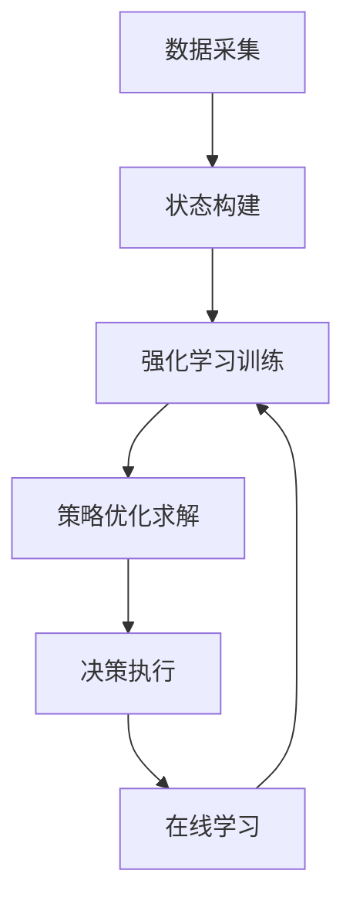

# 交通管理中AI代理的工作流程与应用

## 1.背景介绍

### 1.1 交通拥堵问题

随着城市化进程的加快和汽车保有量的不断增加,交通拥堵已经成为许多城市面临的一个严重问题。交通拥堵不仅会导致时间和燃料的浪费,也会产生噪音污染和尾气排放,对城市环境和居民生活质量造成负面影响。因此,有效的交通管理对于缓解城市交通压力,提高道路利用率,减少环境污染具有重要意义。

### 1.2 传统交通管理方法的局限性

传统的交通管理方法主要依赖人工经验和简单的控制策略,例如固定的信号周期和相位设置。然而,这种方法难以适应复杂多变的实际交通状况,无法实现动态优化和实时调整。随着交通流量的增长和路网复杂度的提高,传统方法越来越显示出其局限性和低效率。

### 1.3 AI代理在交通管理中的应用前景

人工智能(AI)技术的发展为交通管理带来了新的机遇。AI代理可以通过感知交通环境,学习交通模式,并基于优化算法做出智能决策,从而实现交通信号的动态调整和路网流量的实时优化。相比传统方法,AI代理具有自适应性强、决策智能化等优势,有望显著提高交通管理的效率和质量。

## 2.核心概念与联系

### 2.1 AI代理

AI代理是指能够感知环境、学习知识、做出决策并执行行动的智能体系统。在交通管理领域,AI代理通常由以下几个核心组件组成:

1. **感知模块**: 收集交通数据,如车流量、车速、占有率等,构建交通环境的状态表示。
2. **学习模块**: 基于历史数据和当前状态,学习交通模式和规律,形成决策知识库。
3. **决策模块**: 根据学习到的知识和优化目标,选择最优的控制策略,如信号时间调整。
4. **执行模块**: 将决策转化为具体的控制指令,并将其应用于实际的交通设施。

### 2.2 智能交通系统(ITS)

智能交通系统(Intelligent Transportation System, ITS)是一种利用先进的信息、通信、传感器等技术来优化现有交通基础设施和服务运营管理的综合策略。AI代理作为ITS的核心技术之一,可以与其他子系统(如交通信号控制系统、车辆检测系统等)相互配合,形成一个完整的智能化交通管理解决方案。

### 2.3 多智能体系统

在复杂的城市交通网络中,单一的AI代理难以处理所有交通设施的控制。因此,需要构建一个多智能体系统(Multi-Agent System, MAS),其中包含多个相互协作的AI代理,每个代理负责管理特定区域或路段的交通。这些代理之间需要进行协调和信息交互,以实现全局最优的交通管理目标。

### 2.4 机器学习在交通管理中的应用

机器学习是AI代理实现智能决策的关键技术。常用的机器学习方法包括:

- **监督学习**: 利用历史数据训练交通模型,预测未来交通状态。
- **强化学习**: AI代理通过不断试错和奖惩,学习到最优的控制策略。
- **深度学习**: 使用神经网络等深度模型来表示复杂的交通模式。

## 3.核心算法原理具体操作步骤

交通管理中AI代理的核心算法通常包括以下几个步骤:

1. **数据采集**: 利用各种传感器(如感应线圈、视频监控等)收集实时交通数据,包括车流量、车速、占有率等。

2. **状态构建**: 将采集到的交通数据融合并转换为代理可识别的环境状态表示,作为决策的输入。

3. **模型训练**: 利用监督学习、强化学习或深度学习等机器学习算法,基于历史数据训练交通模型,捕获交通模式和规律。

4. **优化求解**: 将交通管理问题形式化为一个优化问题,目标可能是minimizing延误时间、maximizing吞吐量等。利用各种优化算法(如动态规划、遗传算法等)求解最优控制策略。

5. **决策执行**: 将求解得到的最优控制策略转化为具体的控制指令,并通过执行模块应用于实际的交通设施(如调整信号时间)。

6. **在线学习**: 在执行过程中,持续收集新的交通数据,并用于不断优化和调整交通模型,实现自适应性和robustness性。

下面以一种基于强化学习的交通信号控制算法为例,具体说明其工作流程:



1. **数据采集**: 利用感应线圈、视频监控等设备采集实时交通数据,如车流量、车速、占有率等。

2. **状态构建**: 将采集到的交通数据融合并转换为代理可识别的环境状态表示,作为强化学习的输入。状态通常包括车辆排队长度、行程时间等指标。

3. **强化学习训练**: 构建一个强化学习模型,其中代理(智能体)是交通信号控制器,环境是实际的交通系统。代理根据当前状态选择一个信号时间方案(动作),然后观察到新的交通状态和奖惩信号(如延误时间的增减)。通过不断试错和学习,代理逐步优化其策略,以maximizing长期累积奖励。

4. **策略优化求解**: 利用强化学习算法(如Q-Learning、策略梯度等)求解最优的信号控制策略,使得在遵循该策略时,可以获得最小的平均延误时间或最大的吞吐量。

5. **决策执行**: 将求解得到的最优策略应用于实际的交通信号控制系统,动态调整每个路口的信号时间和相位。

6. **在线学习**: 在实际执行过程中,持续收集新的交通数据,并用于不断优化和调整强化学习模型,使其能够适应交通模式的变化,保持策略的有效性。

通过以上流程,AI代理可以实现自适应的智能交通信号控制,显著提高路网的通行效率。

## 4.数学模型和公式详细讲解举例说明

在交通管理中,数学模型和公式扮演着重要的角色,用于描述交通系统的行为、构建优化目标并求解最优控制策略。下面我们介绍一些常用的数学模型和公式。

### 4.1 交通流模型

交通流模型描述了车辆在路段上的运动规律,是交通管理和预测的基础。著名的交通流模型有:

1. **LWR模型(Lighthill-Whitham-Richards Model)**: 

$$
\frac{\partial \rho(x,t)}{\partial t} + \frac{\partial q(x,t)}{\partial x} = 0
$$

其中$\rho(x,t)$表示在时间$t$、位置$x$处的交通密度,$q(x,t)$表示交通流量,二者之间存在如下关系:

$$
q(x,t) = \rho(x,t)v(\rho(x,t))
$$

其中$v(\rho)$是密度-速度关系函数,常用的有Greenshields模型:

$$
v(\rho) = v_f \left( 1 - \frac{\rho}{\rho_j} \right)
$$

2. **细胞传播模型(Cellular Automata Model)**: 将路段离散化为若干个细胞,每个细胞的状态(是否被车辆占据)由一组规则更新。这种模型简单高效,易于模拟复杂交通情况。

### 4.2 交通网络模型

对于复杂的城市交通网络,我们需要构建网络级别的模型来描述整个系统。常用的网络模型包括:

1. **交通赋值模型(Traffic Assignment Model)**: 基于用户均衡原理,将origin-destination(OD)流量分配到路网中的不同路径上,使得每条路径的行程时间相等。数学表达式为:

$$
\begin{aligned}
\text{minimize} \quad & Z = \sum_{a \in A} \int_{0}^{x_a} t_a(w) \mathrm{d}w \\
\text{subject to} \quad & \sum_{p \in P_{rs}} f_p = q_{rs}, \quad \forall r, s \\
& x_a = \sum_{p \in P} f_p \delta_{ap}, \quad \forall a \\
& f_p \geq 0, \quad \forall p
\end{aligned}
$$

其中$t_a(w)$是路段$a$上的行程时间函数,$x_a$是路段$a$的流量,$f_p$是路径$p$的流量,$\delta_{ap}$是路径-链路矩阵。

2. **动态交通赋值模型(Dynamic Traffic Assignment Model)**: 考虑了时间因素,将OD流量动态分配到时空网络中的最短路径上。

### 4.3 交通信号控制模型

交通信号控制是AI代理在交通管理中的一个重要应用场景。常用的数学模型包括:

1. **车辆行驶模型**: 描述车辆在路口通过的运动规律,如

$$
\begin{aligned}
x_{n+1} &= x_n + v_n \Delta t + \frac{1}{2}a_n \Delta t^2 \\
v_{n+1} &= v_n + a_n \Delta t
\end{aligned}
$$

其中$x_n$、$v_n$、$a_n$分别表示第$n$个时间步的位置、速度和加速度。

2. **排队模型**: 描述车辆在路口的排队过程,如

$$
q_j(k+1) = q_j(k) + y_j(k) - \mu_j(k)
$$

其中$q_j(k)$是第$k$个周期的第$j$相位的排队长度,$y_j(k)$是到达车辆数,$\mu_j(k)$是通过车辆数。

3. **延误模型**: 计算车辆在路口的延误时间,常用的指标包括平均延误时间、总延误时间等。

4. **优化模型**: 将交通信号控制问题形式化为一个约束优化问题,目标函数可以是minimizing延误时间、maximizing吞吐量等。

$$
\begin{aligned}
\text{minimize} \quad & f(c_1, c_2, \ldots, c_n) \\
\text{subject to} \quad & g_i(c_1, c_2, \ldots, c_n) \leq 0, \quad i = 1, 2, \ldots, m \\
& c_j^L \leq c_j \leq c_j^U, \quad j = 1, 2, \ldots, n
\end{aligned}
$$

其中$c_1, c_2, \ldots, c_n$是控制变量(如绿信比、周期等),$f$是目标函数,$g_i$是约束条件。

以上数学模型为AI代理在交通管理中提供了理论基础,使其能够准确描述和优化复杂的交通系统。在实际应用中,这些模型往往需要与机器学习、优化算法等技术相结合,以提高决策的智能性和有效性。

## 4.项目实践:代码实例和详细解释说明

为了更好地理解AI代理在交通管理中的应用,我们提供了一个基于强化学习的交通信号控制项目的代码实例。该项目使用Python语言和OpenAI Gym环境,通过Q-Learning算法训练一个智能体(代理)来控制单个路口的信号时间,目标是minimizing车辆的平均延误时间。

### 4.1 环境构建

我们首先定义了一个`TrafficSignalEnv`类,继承自`gym.Env`基类,用于模拟交通信号控制的环境。

```python
import numpy as np
from gym import Env, spaces

class TrafficSignalEnv(Env):
    def __init__(self):
        # 定义状态空间和动作空间
        self.observation_space = spaces.Box(low=0, high=1, shape=(6,), dtype=np.float32)
        self.action_space = spaces.Discrete(4)
        
        # 初始化环境参数
        self.max_queue_length = 20
        self.arrival_rates = [0.3, 0.4]  # 两个路口的到达率
        self.state = np.zeros(6)  # 初始状态为空队列
        
    def step(self, action