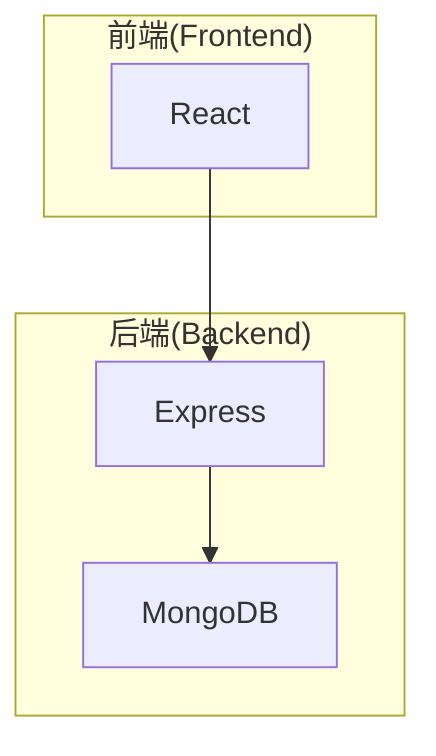

# 信息学院网上办公系统详细设计与具体代码实现

## 1. 背景介绍

### 1.1 网上办公系统的重要性

在当今快节奏的工作环境中,网上办公系统已经成为提高工作效率、促进协作和简化流程的关键工具。随着信息技术的不断发展,越来越多的组织和企业开始采用网上办公系统来优化工作流程、提高生产力。

网上办公系统不仅可以帮助员工远程工作,还能够实现无纸化办公,减少资源浪费。同时,它还可以促进团队协作,提高沟通效率,从而提高整体工作效率。

### 1.2 信息学院的需求

作为一所现代化的高等院校,信息学院需要一个高效、安全、易用的网上办公系统,以满足以下需求:

- 教职工远程办公
- 无纸化文件流转
- 提高行政效率
- 促进师生沟通与协作
- 集中管理和存储重要数据

因此,开发一个满足信息学院特定需求的网上办公系统就显得尤为重要。

## 2. 核心概念与联系

### 2.1 系统架构

网上办公系统通常采用客户端-服务器(Client-Server)或浏览器-服务器(Browser-Server)架构。前者需要在客户端安装专用软件,而后者只需要一个网页浏览器即可访问系统。

本文将介绍一种基于浏览器-服务器架构的网上办公系统,其核心概念包括:

- **前端(Frontend)**: 基于HTML、CSS和JavaScript开发的用户界面。
- **后端(Backend)**: 使用服务器端语言(如Java、Python或Node.js)开发的应用程序逻辑和数据处理。
- **数据库(Database)**: 用于存储系统数据,如用户信息、文件等。
- **身份验证(Authentication)**: 确保只有授权用户可以访问系统。
- **授权(Authorization)**: 控制用户对特定资源和功能的访问权限。

### 2.2 关键技术

实现网上办公系统需要整合多种技术,包括但不限于:

- **Web开发技术**: HTML、CSS、JavaScript、框架(如React、Angular或Vue.js)。
- **服务器端编程语言**: Java、Python、Node.js等。
- **数据库技术**: 关系型数据库(如MySQL或PostgreSQL)或NoSQL数据库(如MongoDB)。
- **安全技术**: HTTPS、加密、防火墙等。
- **版本控制**: Git等。

## 3. 核心算法原理具体操作步骤

### 3.1 用户认证

用户认证是网上办公系统的基础,确保只有合法用户可以访问系统。常见的用户认证方式包括:

1. **用户名和密码认证**:
   - 用户输入用户名和密码
   - 服务器验证用户名和密码是否正确
   - 如果正确,则生成会话令牌(session token)
   - 后续请求需携带会话令牌进行身份验证

2. **双因素认证**:
   - 除用户名和密码外,还需要另一种验证方式(如手机验证码或生物识别)
   - 提高了系统安全性,但也增加了使用复杂度

3. **单点登录(Single Sign-On, SSO)**:
   - 用户只需登录一次,就可以访问多个相关系统
   - 常用于企业内部系统,提高用户体验
   - 可以使用标准协议(如SAML或OAuth)实现

### 3.2 文件管理

文件管理是网上办公系统的核心功能之一,包括以下操作:

1. **上传文件**:
   - 用户选择本地文件
   - 将文件数据发送到服务器
   - 服务器存储文件,并返回唯一标识符(如文件ID)

2. **下载文件**:
   - 用户请求特定文件
   - 服务器读取文件数据
   - 将文件数据发送给用户

3. **预览文件**:
   - 用户请求预览特定文件
   - 服务器根据文件类型生成预览数据(如PDF或图像)
   - 将预览数据发送给用户

4. **版本控制**:
   - 每次修改文件时,服务器保存一个新版本
   - 用户可查看和恢复到之前的版本

5. **权限管理**:
   - 设置每个文件的读写权限
   - 只有具有相应权限的用户才能访问文件

### 3.3 工作流程管理

工作流程管理可以自动化和优化办公流程,提高效率。常见的工作流程包括:

1. **审批流程**:
   - 发起审批请求
   - 根据预定义的规则路由到下一个审批人
   - 每个审批人审核并决定是否通过
   - 最终结果反馈给发起人

2. **任务分配**:
   - 创建新任务
   - 分配给一个或多个执行人
   - 执行人完成任务并提交
   - 任务发起人验收

3. **会议管理**:
   - 创建新会议
   - 邀请与会人员
   - 与会人员确认出席
   - 自动分配会议室和资源

这些流程可以通过图形化设计工具定义,并由工作流引擎执行。

## 4. 数学模型和公式详细讲解举例说明

在网上办公系统中,数学模型和公式通常用于以下几个方面:

### 4.1 文件压缩

为了加快文件传输速度和节省存储空间,通常需要对文件进行压缩。常用的无损压缩算法包括:

1. **霍夫曼编码(Huffman Coding)**

   霍夫曼编码根据数据出现的频率,将较高频率的数据编码为较短的编码,较低频率的数据编码为较长的编码,从而达到压缩的目的。

   设有一个字符集 $C = \{c_1, c_2, \ldots, c_n\}$,其中每个字符出现的概率分别为 $p_1, p_2, \ldots, p_n$,则字符 $c_i$ 的霍夫曼编码长度 $l_i$ 可以表示为:

   $$l_i = -\log_2 p_i$$

   总的编码长度为:

   $$L = \sum_{i=1}^{n} p_i l_i = -\sum_{i=1}^{n} p_i \log_2 p_i$$

   霍夫曼编码可以保证无任何冗余编码,是最优的无损压缩方式。

2. **LZW 压缩算法**

   LZW 算法是一种无损数据压缩算法,它通过维护一个字典来存储重复出现的字符串,并用字典中的索引代替原始数据,从而达到压缩的目的。

   设输入数据为 $S = s_1 s_2 \ldots s_n$,初始字典为 $D = \{0, 1, \ldots, 255\}$,表示所有可能的字节值。压缩过程如下:

   - 从 $S$ 中取一个字符 $c$
   - 在字典 $D$ 中查找 $pc$,其中 $p$ 为之前的字符串
   - 如果 $pc$ 存在于 $D$ 中,则继续查找
   - 如果 $pc$ 不存在于 $D$ 中,则输出 $p$ 的索引,并将 $pc$ 加入 $D$
   - 重复上述过程,直到 $S$ 被完全压缩

   LZW 算法的压缩效率取决于输入数据的重复程度,对于高度重复的数据,压缩率非常高。

### 4.2 内容推荐系统

内容推荐系统可以根据用户的历史行为和偏好,推荐感兴趣的内容(如文件、新闻或活动)。常用的推荐算法包括:

1. **协同过滤(Collaborative Filtering)**

   协同过滤算法根据用户之间的相似性,推荐其他相似用户喜欢的内容。假设有 $m$ 个用户和 $n$ 个项目,可以构建一个 $m \times n$ 的用户-项目评分矩阵 $R$。

   基于用户的协同过滤算法计算用户 $u$ 和 $v$ 之间的相似度 $\text{sim}(u, v)$,常用的相似度计算方法有:

   - 余弦相似度: $\text{sim}(u, v) = \cos(\vec{r_u}, \vec{r_v}) = \frac{\vec{r_u} \cdot \vec{r_v}}{|\vec{r_u}||\vec{r_v}|}$
   - 修正余弦相似度: $\text{sim}(u, v) = \frac{\sum_{i \in I}(r_{ui} - \overline{r_u})(r_{vi} - \overline{r_v})}{\sqrt{\sum_{i \in I}(r_{ui} - \overline{r_u})^2}\sqrt{\sum_{i \in I}(r_{vi} - \overline{r_v})^2}}$
   - 皮尔逊相关系数: $\text{sim}(u, v) = \frac{\sum_{i \in I}(r_{ui} - \overline{r_u})(r_{vi} - \overline{r_v})}{\sqrt{\sum_{i \in I}(r_{ui} - \overline{r_u})^2}\sqrt{\sum_{i \in I}(r_{vi} - \overline{r_v})^2}}$

   对于用户 $u$,可以根据其他用户 $v$ 的相似度和评分,预测 $u$ 对项目 $i$ 的评分:

   $$r_{ui} = \overline{r_u} + \frac{\sum_{v \in U(i)}{\text{sim}(u, v)(r_{vi} - \overline{r_v})}}{\sum_{v \in U(i)}|\text{sim}(u, v)|}$$

   其中 $U(i)$ 表示对项目 $i$ 有评分的用户集合。

2. **基于内容的推荐**

   基于内容的推荐算法根据项目的内容特征(如文本、图像或音频),推荐与用户历史兴趣相似的项目。假设用户 $u$ 对项目 $i$ 的兴趣程度为 $r_{ui}$,项目 $i$ 的特征向量为 $\vec{x_i}$,用户 $u$ 的兴趣向量为 $\vec{\theta_u}$,则可以使用以下模型预测 $u$ 对 $i$ 的兴趣程度:

   $$r_{ui} = \vec{\theta_u} \cdot \vec{x_i}$$

   模型参数 $\vec{\theta_u}$ 可以通过机器学习算法(如回归或分类)从用户的历史数据中学习得到。对于新项目,可以根据其特征向量 $\vec{x_i}$ 和用户兴趣向量 $\vec{\theta_u}$ 计算兴趣程度 $r_{ui}$,并推荐兴趣程度较高的项目。

以上是网上办公系统中常用的数学模型和公式,在实际应用中还可能涉及其他模型和算法。

## 5. 项目实践:代码实例和详细解释说明

在这一部分,我们将通过一个简单的网上办公系统示例,展示如何将前面介绍的概念和算法应用到实际项目中。

### 5.1 系统架构

我们将采用典型的三层架构:

- **表现层(Presentation Layer)**: 基于 React 开发的用户界面
- **业务逻辑层(Business Logic Layer)**: 使用 Node.js 和 Express 框架开发的 API 服务器
- **数据访问层(Data Access Layer)**: 使用 MongoDB 作为数据库



### 5.2 用户认证

我们将使用 JSON Web Token (JWT) 实现用户认证。JWT 是一种开放标准,它将用户信息加密到一个 Token 中,服务器只需验证 Token 的合法性,而不需要存储会话信息。

**服务器端(Node.js + Express)**

```javascript
const jwt = require('jsonwebtoken');

// 生成 JWT Token
const generateToken = (user) => {
  const payload = {
    userId: user._id,
    username: user.username,
    // 其他用户信息
  };
  const token = jwt.sign(payload, process.env.JWT_SECRET, { expiresIn: '1h' });
  return token;
};

// 验证 JWT Token
const authenticateToken = (req, res, next) => {
  const authHeader = req.headers['authorization'];
  const token = authHeader && authHeader.split(' ')[1];

  if (!token) {
    return res.status(401).json({ error: 'Missing token' });
  }

  jwt.verify(token, process.env.JWT_SECRET, (err, user) =>