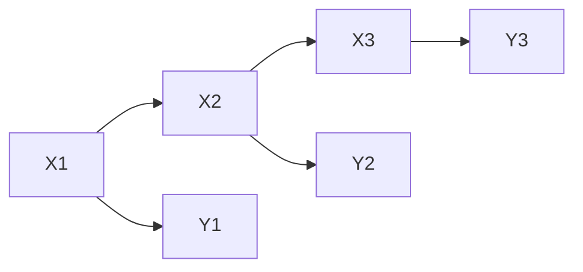
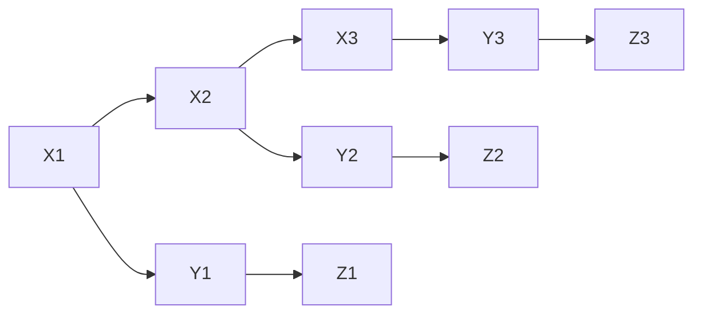

# 动态贝叶斯网络(DBN)原理与代码实战案例讲解

## 1.背景介绍

### 1.1 什么是动态贝叶斯网络?

动态贝叶斯网络(Dynamic Bayesian Network, DBN)是一种用于建模时序数据的概率图形模型。它是静态贝叶斯网络的扩展,能够捕捉随时间演化的过程。DBN在许多领域都有广泛的应用,如语音识别、机器人控制、生物信息学等。

### 1.2 动态贝叶斯网络的应用场景

动态贝叶斯网络可以用于解决以下问题:

- 预测问题:给定过去的观测值,预测未来的状态。如天气预报、股票价格预测等。
- 诊断问题:根据观测到的证据,推断出隐藏状态的分布。如机器故障诊断、疾病诊断等。
- 序列分析:对时序数据进行分割和标注。如基因序列分析、行为识别等。
- 决策支持:在不确定环境下作出最优决策。如机器人路径规划、投资决策等。

### 1.3 动态贝叶斯网络的优势

相比其他时序模型,动态贝叶斯网络具有以下优势:

- 直观的图形表示,易于构建和理解
- 能够处理隐藏和缺失数据
- 可以同时对过去和未来进行推理
- 支持因果推理和诊断推理
- 具有良好的可解释性和模块化

## 2.核心概念与联系

### 2.1 静态贝叶斯网络

贝叶斯网络(Bayesian Network)是一种用有向无环图(DAG)表示概率分布的图形模型。每个节点表示一个随机变量,有向边表示变量之间的条件依赖关系。

在贝叶斯网络中,联合概率分布可以通过链式法则分解为条件概率的乘积:

$$
P(X_1,X_2,\dots,X_n) = \prod_{i=1}^n P(X_i|Pa(X_i))
$$

其中 $Pa(X_i)$ 表示 $X_i$ 的父节点集合。

虽然静态贝叶斯网络能够有效地表示复杂的概率分布,但它无法直接处理时序数据。

### 2.2 动态贝叶斯网络的基本思想

为了处理时序数据,我们需要引入时间切片的概念。动态贝叶斯网络由一系列静态贝叶斯网络组成,每个时间片代表一个静态网络。相邻时间片之间通过时间转移概率相连。

具体来说,动态贝叶斯网络由以下两个部分组成:

1. 初始状态分布 $P(X_1)$
2. 时间转移概率 $P(X_t|X_{t-1})$ 和观测概率 $P(Y_t|X_t)$

其中 $X_t$ 表示时刻 $t$ 的隐藏状态, $Y_t$ 表示对应的观测值。

通过对时间转移概率和观测概率进行参数化,我们可以学习动态贝叶斯网络的参数,并对时序数据进行预测和推理。

### 2.3 动态贝叶斯网络的表示

动态贝叶斯网络可以用以下形式表示:

- 初始状态分布: $P(X_1)$
- 时间转移概率: $P(X_t|X_{t-1})$
- 观测概率: $P(Y_t|X_t)$

其中,时间转移概率和观测概率通常被参数化为某种函数形式,如高斯分布、多项分布等。

我们可以使用有向图来直观地表示动态贝叶斯网络,如下所示:

在上图中,圆圈节点 $X_t$ 表示隐藏状态,方形节点 $Y_t$ 表示观测值。箭头表示条件依赖关系。

## 3.核心算法原理具体操作步骤 

### 3.1 前向算法:滤波和预测

给定观测序列 $Y_{1:t} = \{Y_1, Y_2, \dots, Y_t\}$,我们希望计算隐藏状态 $X_t$ 的后验概率分布 $P(X_t|Y_{1:t})$。这个过程称为滤波(filtering)。

前向算法是一种有效的滤波算法,它利用动态规划的思想递推计算 $P(X_t|Y_{1:t})$。算法步骤如下:

1. 初始化: $P(X_1|Y_1) = \frac{P(X_1)P(Y_1|X_1)}{P(Y_1)}$
2. 递推:
   $$
   P(X_t|Y_{1:t}) = \alpha P(Y_t|X_t) \sum_{X_{t-1}} P(X_t|X_{t-1})P(X_{t-1}|Y_{1:t-1})
   $$
   其中 $\alpha$ 是归一化常数。

如果我们希望预测未来的隐藏状态 $X_{t+k}$,可以进一步递推计算 $P(X_{t+k}|Y_{1:t})$。

前向算法的时间复杂度为 $O(TN^2)$,其中 $T$ 是时间步长, $N$ 是隐藏状态的数量。

### 3.2 后向算法:平滑

有时我们不仅需要滤波,还需要利用未来的观测值对当前状态进行修正,这个过程称为平滑(smoothing)。我们希望计算 $P(X_t|Y_{1:T})$,其中 $T>t$。

后向算法是一种有效的平滑算法,它从后向前递推计算 $P(X_t|Y_{1:T})$。算法步骤如下:

1. 初始化: $P(X_T|Y_{1:T}) = \frac{P(X_T)P(Y_T|X_T)}{P(Y_{1:T})}$
2. 递推:
   $$
   P(X_t|Y_{1:T}) = \alpha P(X_t|Y_{1:t}) \sum_{X_{t+1}} P(X_{t+1}|X_t)P(X_{t+1}|Y_{1:T})
   $$
   其中 $\alpha$ 是归一化常数。

后向算法的时间复杂度也是 $O(TN^2)$。

### 3.3 前向-后向算法:参数学习

在已知观测序列 $Y_{1:T}$ 的情况下,我们希望学习动态贝叶斯网络的参数,使得观测序列的概率 $P(Y_{1:T})$ 最大化。这个过程称为参数学习。

前向-后向算法是一种常用的参数学习算法,它结合了前向和后向算法,使用期望最大化(EM)算法迭代地优化参数。算法步骤如下:

1. 初始化参数
2. E步骤:使用前向-后向算法计算隐藏状态的期望
3. M步骤:使用期望最大化,更新参数
4. 重复步骤2-3,直到收敛

前向-后向算法的时间复杂度为 $O(TN^2)$,与前向和后向算法相同。但是,由于需要迭代优化,实际运行时间可能较长。

### 3.4 近似推理算法

当隐藏状态的数量 $N$ 较大时,精确推理算法的计算复杂度会急剧增加。这时,我们可以使用近似推理算法,如粒子滤波(Particle Filtering)、期望传播(Expectation Propagation)等。

这些算法通过采样或者变分推断的方式,以较低的计算复杂度获得近似的结果。具体算法细节超出了本文的范围,有兴趣的读者可以参考相关文献。

## 4.数学模型和公式详细讲解举例说明

在这一部分,我们将详细介绍动态贝叶斯网络的数学模型,并给出具体的例子进行说明。

### 4.1 隐马尔可夫模型

隐马尔可夫模型(Hidden Markov Model, HMM)是动态贝叶斯网络的一个特例,它假设:

1. 隐藏状态 $X_t$ 服从马尔可夫性质:
   $$
   P(X_t|X_1,\dots,X_{t-1}) = P(X_t|X_{t-1})
   $$
2. 观测值 $Y_t$ 只依赖于当前的隐藏状态 $X_t$:
   $$
   P(Y_t|X_1,\dots,X_t) = P(Y_t|X_t)
   $$

在隐马尔可夫模型中,我们需要学习以下参数:

- 初始状态分布 $\pi = P(X_1)$
- 时间转移概率 $A = P(X_t|X_{t-1})$
- 观测概率 $B = P(Y_t|X_t)$

隐马尔可夫模型可以用一个简单的动态贝叶斯网络表示:

#### 例子:天气预报

假设我们希望预测未来几天的天气情况(晴天或雨天)。我们可以将天气状态建模为一个隐马尔可夫模型:

- 隐藏状态 $X_t$:天气状态(晴天或雨天)
- 观测值 $Y_t$:气象观测数据(温度、湿度等)

已知历史观测数据 $Y_{1:t}$,我们可以使用前向算法计算 $P(X_{t+1}|Y_{1:t})$,从而预测未来天气。

### 4.2 高斯混合模型

高斯混合模型(Gaussian Mixture Model, GMM)是另一个动态贝叶斯网络的特例,它假设:

1. 隐藏状态 $X_t$ 服从马尔可夫性质
2. 观测值 $Y_t$ 服从高斯混合分布:
   $$
   P(Y_t|X_t=k) = \mathcal{N}(Y_t|\mu_k, \Sigma_k)
   $$

在高斯混合模型中,我们需要学习以下参数:

- 初始状态分布 $\pi = P(X_1)$
- 时间转移概率 $A = P(X_t|X_{t-1})$
- 混合权重 $\alpha_k$
- 均值向量 $\mu_k$
- 协方差矩阵 $\Sigma_k$

高斯混合模型可以用一个稍微复杂的动态贝叶斯网络表示:

在上图中,额外引入了一个观测值的混合成分 $Z_t$,用于表示观测值服从的高斯分布。

#### 例子:运动目标跟踪

假设我们希望跟踪一个运动目标的位置和速度。我们可以将目标的状态建模为一个高斯混合模型:

- 隐藏状态 $X_t$:目标的位置和速度
- 观测值 $Y_t$:雷达或视觉传感器的观测数据

已知历史观测数据 $Y_{1:t}$,我们可以使用前向算法计算 $P(X_{t+1}|Y_{1:t})$,从而预测目标的未来位置和速度。

### 4.3 线性动态系统

线性动态系统(Linear Dynamical System, LDS)是一种特殊的高斯混合模型,它假设:

1. 隐藏状态 $X_t$ 服从线性马尔可夫过程:
   $$
   X_t = A X_{t-1} + B u_t + \epsilon_t, \quad \epsilon_t \sim \mathcal{N}(0, Q)
   $$
2. 观测值 $Y_t$ 是隐藏状态的线性组合:
   $$
   Y_t = C X_t + \delta_t, \quad \delta_t \sim \mathcal{N}(0, R)
   $$

在线性动态系统中,我们需要学习以下参数:

- 初始状态均值 $\mu_0$ 