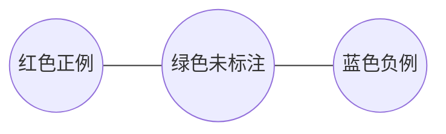
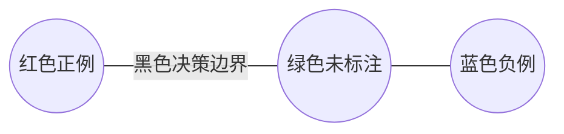
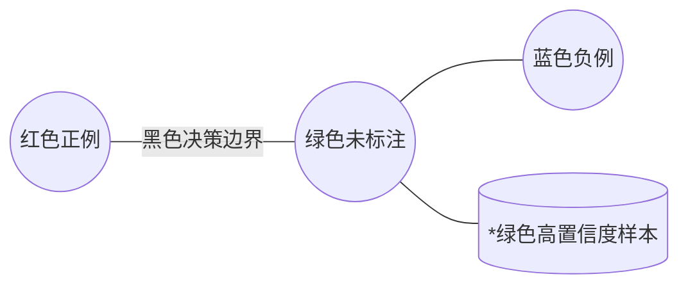
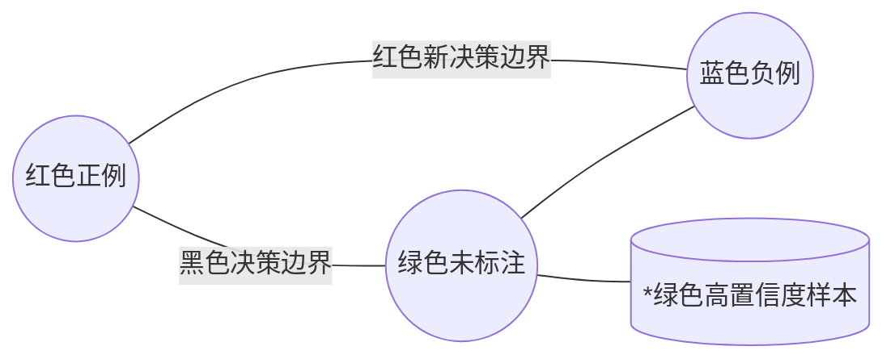

# 半监督学习原理与代码实战案例讲解

作者：禅与计算机程序设计艺术

## 1. 背景介绍

### 1.1 监督学习与无监督学习的局限性
在机器学习领域,监督学习和无监督学习是两大主要分支。监督学习需要大量的标注数据,而无监督学习虽然不需要标注数据,但学习效果往往不如监督学习。在实际应用中,我们常常面临标注数据不足,而未标注数据大量存在的情况。如何利用少量标注数据和大量未标注数据,成为机器学习研究的一个重要课题。

### 1.2 半监督学习的优势
半监督学习正是为解决上述问题而提出的一种学习范式。它综合利用少量的标注数据和大量的未标注数据进行模型训练,在标注数据不足的情况下,依然能取得较好的学习效果。半监督学习在图像分类、自然语言处理、语音识别等领域都有广泛的应用。

### 1.3 本文的主要内容
本文将全面介绍半监督学习的基本原理、主要算法、数学模型以及代码实战。通过本文的学习,读者将掌握半监督学习的核心思想,了解主流的半监督学习算法,并能够动手实现相关代码。

## 2. 核心概念与联系

### 2.1 半监督学习的定义
半监督学习是指利用少量的标注数据(Labeled Data)和大量的未标注数据(Unlabeled Data)来训练模型,从而提高模型的泛化能力。形式化地,假设有标注数据集 $D_l=\{(x_1,y_1),...,(x_l,y_l)\}$,未标注数据集 $D_u=\{x_{l+1},...,x_{l+u}\}$,其中 $l \ll u$,半监督学习的目标是利用 $D_l \cup D_u$ 来学习一个分类器 $f$。

### 2.2 半监督学习的基本假设
半监督学习的可行性基于两个基本假设:

1. 平滑性假设(Smoothness Assumption):相近的样本点具有相同或相近的输出。即如果两个样本 $x_1,x_2$ 在特征空间中距离很近,那么它们的输出 $y_1,y_2$ 也应该相近。

2. 聚类假设(Cluster Assumption):数据空间中的样本点会形成簇,同一个簇的样本点属于同一个类别。这意味着,如果把两个样本点用一条曲线连接,并且该曲线穿过了低密度区域,那么这两个样本点很可能属于不同的类别。

### 2.3 半监督学习与其他学习范式的关系
半监督学习与监督学习、无监督学习、主动学习等机器学习范式密切相关。

- 与监督学习相比,半监督学习利用了未标注数据,因此在标注数据不足时性能更优。  
- 与无监督学习相比,半监督学习利用了部分标注信息,因此学习效果更好。
- 与主动学习相比,半监督学习是被动接受标注数据,而主动学习会主动询问标注信息。在某些情况下,两者可以结合,主动选择最有价值的数据进行标注,再用半监督学习训练模型。

## 3. 核心算法原理具体操作步骤

半监督学习有多种经典算法,下面重点介绍自训练(Self-Training)、协同训练(Co-Training)和图半监督学习(Graph-based SSL)这三大类算法。

### 3.1 自训练算法
自训练是最简单直观的半监督学习算法,其基本思路是用标注数据训练一个初始模型,然后用该模型对未标注数据进行预测,将置信度高的预测结果加入到训练集中,再重新训练模型。这个过程不断迭代,直到满足停止条件。

自训练算法的具体步骤如下:
1. 用标注数据 $D_l$ 训练一个初始模型 $f$。
2. 用 $f$ 对未标注数据 $D_u$ 进行预测。
3. 选择置信度最高的 $k$ 个预测结果,将其加入到 $D_l$ 中。
4. 用新的 $D_l$ 重新训练模型 $f$。 
5. 重复步骤2-4,直到满足停止条件(如达到最大迭代次数或未标注数据为空)。

自训练算法简单易实现,但可能会受到初始模型性能的影响,如果初始模型效果不好,可能会导致错误的预测结果被加入到训练集中,从而使模型越训练越差。因此,自训练算法需要谨慎使用。

### 3.2 协同训练算法
协同训练算法适用于数据有两个或多个视图(View)的情况。所谓视图,是指数据的不同特征子集或不同的特征表示。例如,一个网页可以用文本内容和超链接两个视图来表示。

协同训练算法的基本思路是,在每个视图上训练一个分类器,然后用每个分类器来预测未标注数据,并将置信度高的预测结果作为另一个视图分类器的新增训练数据。通过两个视图分类器的互相"教学",不断提升模型性能。

协同训练算法的具体步骤如下:
1. 将数据的特征划分为两个视图 $X_1$ 和 $X_2$。
2. 用标注数据 $D_l$ 在每个视图上训练一个初始模型 $f_1$ 和 $f_2$。
3. 用 $f_1$ 对 $X_2$ 上的未标注数据进行预测,选择置信度最高的 $k$ 个结果作为 $f_2$ 的新增训练数据。
4. 用 $f_2$ 对 $X_1$ 上的未标注数据进行预测,选择置信度最高的 $k$ 个结果作为 $f_1$ 的新增训练数据。
5. 用新的训练数据重新训练 $f_1$ 和 $f_2$。
6. 重复步骤3-5,直到满足停止条件。

协同训练的关键在于不同视图要有互补性,即每个视图都要包含一些独立的信息。如果不同视图高度相关,协同训练就失去了意义。

### 3.3 图半监督学习算法
图半监督学习利用数据的图结构来传播标签信息。其基本思路是,将所有的数据点(包括标注和未标注)看作图中的节点,然后根据数据点之间的相似性构建边,最后通过在图上传播标签来对未标注数据进行预测。

常见的图半监督学习算法包括标签传播(Label Propagation)和标签推断(Label Spreading)等。以标签传播算法为例,其具体步骤如下:
1. 构建一个图 $G=(V,E)$,其中节点 $V$ 为所有的数据点,边 $E$ 根据数据点之间的相似性来建立。常见的相似性度量有欧氏距离、余弦相似度等。
2. 初始化一个标签矩阵 $Y$,对于标注数据,$Y_{ij}=1$ 如果第 $i$ 个样本的标签为 $j$,否则为0。对于未标注数据,$Y_{ij}=0$。
3. 计算转移矩阵 $T$,其中 $T_{ij}$ 表示标签从节点 $i$ 转移到节点 $j$ 的概率。$T$ 可以通过图的邻接矩阵和度矩阵来计算。
4. 迭代更新标签矩阵 $Y \leftarrow TY$,直到收敛。
5. 对于未标注数据 $x_i$,其预测标签为 $\arg\max_j Y_{ij}$。

图半监督学习能够充分利用数据的内在结构,对高维数据和非欧空间的数据都有很好的适应性。但构建合适的图结构并不容易,计算开销也比较大。

## 4. 数学模型和公式详细讲解举例说明

这里以最常用的自训练算法为例,详细推导其数学模型。

假设有标注数据集 $D_l=\{(x_1,y_1),...,(x_l,y_l)\}$ 和未标注数据集 $D_u=\{x_{l+1},...,x_{l+u}\}$,其中 $y_i \in \{1,-1\}$。自训练的目标是找到一个分类器 $f: \mathcal{X} \rightarrow \{1,-1\}$,使得经验风险最小化:

$$\min_{f \in \mathcal{F}} \frac{1}{l}\sum_{i=1}^l L(f(x_i),y_i) + \lambda \Omega(f)$$

其中 $L$ 是损失函数,$\Omega$ 是正则化项。

自训练算法流程可以表示为:

$$
\begin{aligned}
&\text{初始化分类器} f_0 \text{使得} \\
&f_0 = \arg\min_{f \in \mathcal{F}} \frac{1}{l}\sum_{i=1}^l L(f(x_i),y_i) + \lambda \Omega(f) \\
&\text{for } t=1,2,... \text{ until 收敛}: \\  
&\qquad \text{用 } f_{t-1} \text{ 对 } D_u \text{ 进行预测,得到 } \hat{y}_i = f_{t-1}(x_i), i=l+1,...,l+u \\
&\qquad \text{选择置信度最高的 } k \text{ 个预测结果 } \{(\hat{x}_1,\hat{y}_1),...,(\hat{x}_k,\hat{y}_k)\} \\
&\qquad D_l = D_l \cup \{(\hat{x}_1,\hat{y}_1),...,(\hat{x}_k,\hat{y}_k)\} \\
&\qquad D_u = D_u \setminus \{\hat{x}_1,...,\hat{x}_k\} \\
&\qquad f_t = \arg\min_{f \in \mathcal{F}} \frac{1}{l+k}\sum_{i=1}^{l+k} L(f(x_i),y_i) + \lambda \Omega(f) \\
&\text{输出 } f_t
\end{aligned}
$$

其中置信度的度量可以是分类器输出的概率值或距离超平面的距离等。

举一个简单的例子,假设我们要对一个二维数据集进行二分类,其中正例用红色表示,负例用蓝色表示,未标注数据用绿色表示,如下图所示:



我们先用标注数据训练一个初始的SVM分类器,得到一个决策边界(黑色直线),如下图所示:



然后用该分类器对未标注数据进行预测,选择置信度最高的一些点(图中标为星号),将其加入到训练集中,如下图所示:



最后用新的训练集重新训练分类器,得到一个新的决策边界(红色虚线),如下图所示:



可以看到,通过自训练,我们利用未标注数据优化了分类边界,提高了分类器的性能。当然,实际问题要复杂得多,这里只是一个简单的示意图。

## 5. 项目实践:代码实例和详细解释说明

下面我们通过一个实际的Python代码案例来演示半监督学习的实现。这里使用scikit-learn库中的Semi-Supervised Classification模块。

我们以著名的Iris数据集为例。Iris数据集包含150个样本,每个样本有4个特征(花萼长度、花萼宽度、花瓣长度、花瓣宽度),属于3个类别(Setosa、Versicolour、Virginica)。我们将其中的30%数据作为标注数据,其余作为未标注数据,然后用半监督学习算法来训练分类器。

```python
from sklearn import datasets
from sklearn.semi_supervised import SelfTrainingClassifier
from sklearn.svm import SVC
import