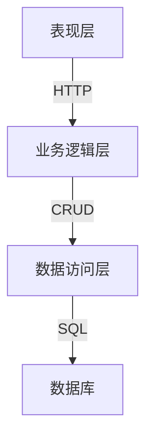

# 图书管理系统的设计与实现

## 1. 背景介绍

### 1.1 图书管理系统的重要性

图书管理系统是现代图书馆、书店和出版社等机构的核心应用系统。随着数字时代的到来,图书管理系统不仅需要管理实体书籍,还需要处理电子书、音频书和其他数字媒体资源。一个高效、可扩展的图书管理系统对于确保图书资源的有序管理、提高工作效率和改善用户体验至关重要。

### 1.2 系统需求和挑战

设计和实现一个图书管理系统需要考虑多方面的需求和挑战:

- 大量图书资源的高效存储和检索
- 支持多种媒体格式和元数据标准
- 实现图书借阅、预订和续借等功能
- 用户和权限管理
- 库存管理和订单处理
- 报表和统计分析
- 系统的可扩展性和可维护性

## 2. 核心概念与联系

### 2.1 系统架构概览

图书管理系统通常采用三层或多层架构,包括:

- **表现层**(Presentation Layer): 提供用户界面,处理用户交互
- **业务逻辑层**(Business Logic Layer): 实现系统的核心功能和业务规则
- **数据访问层**(Data Access Layer): 负责与数据库进行交互,执行数据持久化操作



### 2.2 关键概念和模块

- **图书**(Book): 核心实体,包括书名、作者、出版社、ISBN等属性
- **用户**(User): 管理员、读者等不同角色和权限
- **借阅**(Borrowing): 管理图书借阅、预订和续借
- **库存**(Inventory): 跟踪图书库存,处理订单和补货
- **目录**(Catalog): 提供图书搜索和浏览功能
- **报表**(Reporting): 生成各种统计报表,如借阅情况、库存水平等

## 3. 核心算法原理具体操作步骤

### 3.1 图书检索算法

高效的图书检索是图书管理系统的核心功能之一。常用的检索算法包括:

#### 3.1.1 全文搜索

利用倒排索引和词条查询,可以快速定位包含特定词条的文档。具体步骤如下:

1. **建立倒排索引**: 遍历所有文档,提取出现的词条及其位置信息,构建`<词条, [文档ID, 位置...]>`的倒排索引。
2. **分析查询**: 将查询字符串分词,得到查询词条列表。
3. **查询倒排索引**: 对每个查询词条,查找倒排索引中对应的文档列表。
4. **合并结果**: 利用合适的策略(如布尔模型或向量空间模型)合并多个词条的文档列表,得到最终结果。

#### 3.1.2 相似度搜索

在全文搜索的基础上,相似度搜索可以根据文档与查询的相似程度给出排序结果。常用的相似度计算方法包括:

- **余弦相似度**: 将文档和查询表示为向量,计算它们的夹角余弦值作为相似度分数。
- **BM25**: 一种基于概率模型的相似度计算公式,考虑了词条频率、文档长度等因素。

$$
\text{sim}_\text{BM25}(D, Q) = \sum_{q \in Q} \text{IDF}(q) \cdot \frac{f(q, D) \cdot (k_1 + 1)}{f(q, D) + k_1 \cdot (1 - b + b \cdot \frac{|D|}{\text{avgdl}})}
$$

其中:
- $f(q, D)$ 是词条 $q$ 在文档 $D$ 中出现的次数
- $|D|$ 是文档 $D$ 的长度
- $\text{avgdl}$ 是文档集合的平均长度
- $k_1$ 和 $b$ 是调节因子,控制词条频率和文档长度的影响

#### 3.1.3 前缀树和通配符搜索

对于需要支持前缀和通配符查询的场景,可以使用前缀树(Trie)这种数据结构。前缀树可以高效地插入和查找字符串,支持以下操作:

- 插入字符串: 从根节点开始,按字符顺序构建路径,路径的终点代表一个完整字符串。
- 查找前缀: 从根节点开始,按字符顺序遍历,到达无法继续的节点时,该节点路径就是查询的前缀。
- 通配符查询: 可以将通配符看作特殊的字符,插入和查询时做相应处理。

```python
class TrieNode:
    def __init__(self):
        self.children = {}
        self.is_end = False

class Trie:
    def __init__(self):
        self.root = TrieNode()

    def insert(self, word):
        node = self.root
        for char in word:
            if char not in node.children:
                node.children[char] = TrieNode()
            node = node.children[char]
        node.is_end = True

    def search_prefix(self, prefix):
        node = self.root
        for char in prefix:
            if char not in node.children:
                return False
            node = node.children[char]
        return True

    def search_wildcard(self, pattern):
        # 具体实现略...
```

### 3.2 借阅管理算法

借阅管理是图书管理系统的另一核心功能,包括借阅、预订和续借操作。常见的算法包括:

#### 3.2.1 借阅排队

当多个读者申请借阅同一本书时,需要一个公平的排队策略来处理。可以使用优先队列来维护借阅请求,根据请求的优先级(如提交时间、读者身份等)排序。

```python
import heapq
from collections import namedtuple

Request = namedtuple('Request', ['reader', 'time', 'priority'])

class BorrowingQueue:
    def __init__(self):
        self.queue = []

    def enqueue(self, reader, priority):
        request = Request(reader, time.time(), priority)
        heapq.heappush(self.queue, (priority, request))

    def dequeue(self):
        _, request = heapq.heappop(self.queue)
        return request

    def peek(self):
        priority, request = self.queue[0]
        return request
```

#### 3.2.2 预订管理

图书被借出后,其他读者可以预订。预订请求需要排队,当图书归还时,按队列顺序通知读者前来借阅。可以使用类似于借阅排队的数据结构和算法来实现。

#### 3.2.3 续借策略

对于已借阅的图书,读者可以申请续借。续借策略需要考虑多方面因素:

- 是否有其他读者预订该书
- 读者的借阅限额和欠款情况
- 图书的续借次数限制
- 图书的热门程度等

根据这些因素计算一个综合分数,对续借请求进行审批或拒绝。

### 3.3 库存管理算法

#### 3.3.1 订单分批处理

当图书库存不足时,需要下单补货。由于供应商和运输等限制,通常需要将大订单分成多个小批次处理。可以使用贪心算法或动态规划,将订单分成若干批次,使得每批次的运费和库存成本之和最小。

#### 3.3.2 经济订货量模型

在库存管理中,需要权衡订货成本和库存持有成本,确定最优的订货量和订货周期。经典的经济订货量(EOQ)模型可以计算出在特定条件下的最优订货量:

$$
\text{EOQ} = \sqrt{\frac{2 \times D \times O}{H}}
$$

其中:
- $D$ 是年度需求量
- $O$ 是每次订货的固定成本
- $H$ 是每单位产品的年度库存持有成本

EOQ模型可以进一步扩展,考虑其他因素,如库存缺货成本、价格折扣等。

## 4. 数学模型和公式详细讲解举例说明

### 4.1 文本相似度计算

在图书检索中,需要计算查询和文档之间的相似度,以便对结果进行排序。常用的相似度计算模型包括:

#### 4.1.1 余弦相似度

将文档和查询表示为向量,计算它们之间的夹角余弦值作为相似度分数。具体计算公式如下:

$$
\text{sim}_\text{cos}(\vec{d}, \vec{q}) = \frac{\vec{d} \cdot \vec{q}}{|\vec{d}| \times |\vec{q}|} = \frac{\sum_{i=1}^{n} d_i \times q_i}{\sqrt{\sum_{i=1}^{n} d_i^2} \times \sqrt{\sum_{i=1}^{n} q_i^2}}
$$

其中:
- $\vec{d}$ 和 $\vec{q}$ 分别表示文档和查询的向量表示
- $d_i$ 和 $q_i$ 分别是文档和查询向量的第 $i$ 个元素(如词条权重)
- $n$ 是向量的维数

余弦相似度的值域为 $[0, 1]$,值越大表示相似度越高。

例如,假设文档 $d_1$ 的词条权重向量为 $\vec{d_1} = (2, 1, 0, 3)$,查询 $q_1$ 的词条权重向量为 $\vec{q_1} = (1, 0, 2, 1)$,则它们的余弦相似度为:

$$
\begin{aligned}
\text{sim}_\text{cos}(\vec{d_1}, \vec{q_1}) &= \frac{2 \times 1 + 1 \times 0 + 0 \times 2 + 3 \times 1}{\sqrt{2^2 + 1^2 + 0^2 + 3^2} \times \sqrt{1^2 + 0^2 + 2^2 + 1^2}} \\
&= \frac{5}{\sqrt{10} \times \sqrt{6}} \\
&\approx 0.47
\end{aligned}
$$

#### 4.1.2 BM25 相似度

BM25 是一种基于概率模型的相似度计算公式,考虑了词条频率、文档长度等因素,常用于全文检索和相关性排序。BM25 分数计算公式如下:

$$
\text{sim}_\text{BM25}(D, Q) = \sum_{q \in Q} \text{IDF}(q) \cdot \frac{f(q, D) \cdot (k_1 + 1)}{f(q, D) + k_1 \cdot (1 - b + b \cdot \frac{|D|}{\text{avgdl}})}
$$

其中:
- $f(q, D)$ 是词条 $q$ 在文档 $D$ 中出现的次数
- $|D|$ 是文档 $D$ 的长度
- $\text{avgdl}$ 是文档集合的平均长度
- $k_1$ 和 $b$ 是调节因子,控制词条频率和文档长度的影响
- $\text{IDF}(q)$ 是词条 $q$ 的逆文档频率,用于衡量词条的重要性

例如,假设文档 $D_1$ 的长度为 500,包含词条 "python" 10 次,文档集合的平均长度为 300,取 $k_1=1.2$、$b=0.75$,则 $D_1$ 对于查询 "python" 的 BM25 分数为:

$$
\begin{aligned}
\text{sim}_\text{BM25}(D_1, \text{"python"}) &= \text{IDF}(\text{"python"}) \cdot \frac{10 \cdot (1.2 + 1)}{10 + 1.2 \cdot (1 - 0.75 + 0.75 \cdot \frac{500}{300})} \\
&= \text{IDF}(\text{"python"}) \cdot \frac{22}{10 + 1.95} \\
&= \text{IDF}(\text{"python"}) \cdot 1.48
\end{aligned}
$$

可以看出,BM25 考虑了词条频率、文档长度等多个因素,能够更好地评估文档与查询的相关性。

### 4.2 推荐系统模型

在图书管理系统中,推荐系统可以为读者推荐感兴趣的图书,提高用户体验。常用的推荐算法包括:

#### 4.2.1 协同过滤

协同过滤是一种基于用户行为数据的推荐算法,根据目标用户与其他相似用户的偏好进行推荐。常见的协同过滤算法包括:

- **基于用户的协同过滤**:计算目标用