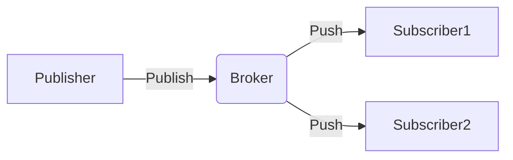
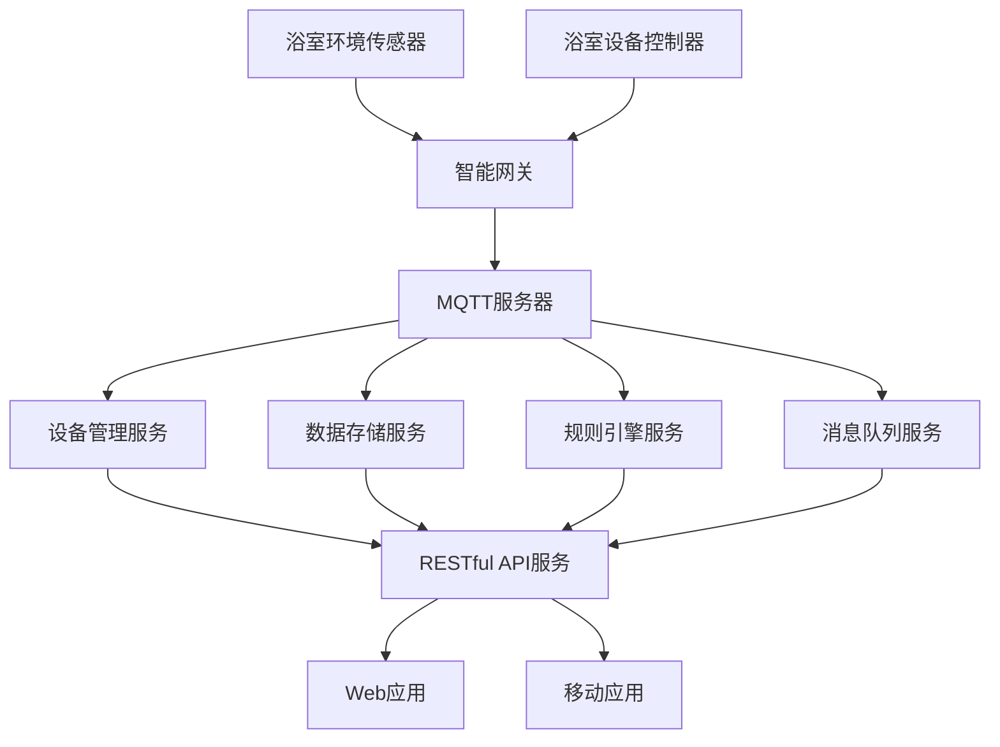

# 基于MQTT协议和RESTful API的智能浴室管理系统

作者：禅与计算机程序设计艺术

## 1. 背景介绍
### 1.1 物联网时代的到来
#### 1.1.1 物联网的定义和特点
#### 1.1.2 物联网的发展历程和现状
#### 1.1.3 物联网给生活带来的变革
### 1.2 智能家居的兴起
#### 1.2.1 智能家居的概念和内涵
#### 1.2.2 智能家居的发展现状和趋势
#### 1.2.3 智能家居的应用场景和优势
### 1.3 智能浴室管理系统的提出
#### 1.3.1 传统浴室管理的痛点
#### 1.3.2 智能浴室管理系统的目标和意义
#### 1.3.3 智能浴室管理系统的技术路线

## 2. 核心概念与联系
### 2.1 MQTT协议
#### 2.1.1 MQTT协议的定义和特点
MQTT（Message Queuing Telemetry Transport）是一种基于发布/订阅模式的轻量级通讯协议，专门针对低带宽和不稳定网络环境进行优化设计。它具有开放性、简单性、轻量级等特点，非常适合物联网场景下的数据传输。

MQTT协议的主要特点包括：
- 发布/订阅模式：MQTT基于发布/订阅模式，设备作为客户端，通过主题订阅感兴趣的消息。
- 消息持久化：MQTT支持消息持久化，保证消息不丢失。
- 三种服务质量：MQTT定义了三种消息发布服务质量（QoS），可根据需求选择。
- 心跳机制：MQTT内置心跳机制，可检测客户端连接状态。
- 安全机制：MQTT提供用户名密码认证和SSL/TLS安全传输。
- 消息分发灵活：MQTT支持一对多、多对多的消息分发。

#### 2.1.2 MQTT的工作原理和通信模型
MQTT遵循发布/订阅通信模型，其工作原理如下：
1. 客户端与MQTT服务器（Broker）建立TCP连接。
2. 客户端向Broker发送CONNECT消息，Broker验证身份后建立会话。
3. 客户端订阅感兴趣的主题，向Broker发送SUBSCRIBE消息。
4. 当有消息发布到被订阅的主题时，Broker将消息推送给订阅的客户端。
5. 客户端接收到消息后，向Broker发送PUBACK消息确认。
6. 客户端可发布消息到指定主题，向Broker发送PUBLISH消息。
7. 客户端可取消订阅主题，向Broker发送UNSUBSCRIBE消息。
8. 客户端可主动断开连接，向Broker发送DISCONNECT消息。

MQTT的通信模型如下图所示：

#### 2.1.3 MQTT在物联网中的应用优势
MQTT凭借其轻量级、低带宽、低功耗等特点，在物联网领域得到广泛应用。其主要优势包括：
- 适合资源受限设备：MQTT客户端代码量小，资源占用低，适合嵌入式设备。
- 支持不稳定网络：MQTT在不稳定网络下仍能保证消息到达，适应物联网复杂环境。  
- 灵活的消息分发：MQTT支持一对多、多对多的消息分发模式，满足多样化需求。
- 消息实时性高：MQTT消息时延低，满足实时性要求高的物联网应用。
- 可扩展性强：MQTT服务器可通过集群横向扩展，支持海量设备接入。

### 2.2 RESTful API
#### 2.2.1 RESTful架构的定义和特点
REST（Representational State Transfer）是一种软件架构风格，由Roy Fielding在2000年提出。RESTful是基于REST原则的Web服务架构。

RESTful架构的主要特点包括：
- 资源（Resource）：网络上一个具体的信息实体，可用URI唯一标识。
- 统一接口（Uniform Interface）：所有资源都通过统一的接口进行访问和操作，包括GET、POST、PUT、DELETE等。
- 无状态（Stateless）：服务端不保存客户端状态，每个请求都包含处理该请求所需的全部信息。
- 可缓存（Cacheable）：服务端对请求的响应可标记为可缓存，减轻服务端压力。
- 分层系统（Layered System）：服务端和客户端之间可以有多个中间层，如代理、网关等。
- 按需代码（Code-On-Demand）：服务端可将代码发送给客户端执行，提高灵活性，该特点为可选。

#### 2.2.2 RESTful API的设计原则和最佳实践
RESTful API设计应遵循一定的原则和最佳实践，主要包括：
- 使用名词而不是动词：URI表示资源，应该使用名词而不是动词。
- 使用复数名词：表示资源集合时使用复数名词。
- 使用嵌套关系：表示资源之间的层级关系时使用URI的路径部分。
- 使用正确的HTTP方法：根据操作资源的语义使用对应的HTTP方法。
- 提供过滤、排序和分页：为集合资源提供过滤、排序和分页等参数。
- 使用HTTP状态码：使用合适的HTTP状态码表示请求处理结果。
- 版本化API：在URI中包含版本号，便于 API 演进。
- 使用HATEOAS：返回结果中包含到其他资源的超链接，便于 API 自描述和导航。

#### 2.2.3 RESTful API在Web开发中的优势
RESTful API 在 Web 开发中具有诸多优势，主要包括：
- 轻量级：相比传统的 SOAP 等 Web 服务，RESTful API 更加轻量级，减少了网络传输和数据解析开销。
- 易于理解和使用：RESTful API 遵循标准的 HTTP 协议，调用简单，文档清晰，学习成本低。
- 跨平台：任何支持 HTTP 协议的设备和平台都可以访问 RESTful API，具有良好的跨平台性。
- 可扩展性强：RESTful API 通过 URL 参数和请求负载传递数据，服务端可灵活扩展。
- 易于缓存：可通过 HTTP 缓存机制减轻服务端压力，提高性能。
- 松耦合：客户端和服务端之间通过 API 接口进行通信，实现低耦合。

### 2.3 智能浴室管理系统架构设计
#### 2.3.1 系统整体架构
智能浴室管理系统采用典型的物联网分层架构，由感知层、网络层、平台层和应用层组成。

感知层包括各种传感器和执行器，如温湿度传感器、人体红外传感器、电磁阀等，负责采集浴室环境数据和控制设备。

网络层采用MQTT协议进行数据传输，感知层设备作为MQTT客户端，通过无线网络接入智能网关，并与MQTT服务器通信。

平台层包括设备管理、数据存储、规则引擎、消息队列等，提供设备接入、数据处理、业务逻辑实现等功能。外部系统可通过 RESTful API 访问平台数据。

应用层提供面向最终用户的 Web 和移动应用，实现浴室环境监测、设备控制、用户交互等功能。

系统整体架构如下图所示：

#### 2.3.2 MQTT主题设计
MQTT主题代表了系统中数据和指令的类别，是设备间通信的基础。智能浴室系统的主题设计如下：
- 环境数据主题：`bathroom/sensor/temperature`、`bathroom/sensor/humidity` 等，用于上报浴室环境传感器采集的数据。
- 设备控制主题：`bathroom/device/light`、`bathroom/device/fan` 等，用于下发设备控制指令。
- 设备状态主题：`bathroom/status/light`、`bathroom/status/fan` 等，用于设备上报当前工作状态。
- 系统配置主题：`bathroom/config`，用于下发系统参数配置。

#### 2.3.3 RESTful API设计
智能浴室管理平台对外提供RESTful API，供 Web 和移动应用访问。主要API设计如下：

| 资源                | URI                    | 操作                                 |
|-------------------|------------------------|-------------------------------------|
| 浴室环境数据        | /bathrooms/{id}/env    | GET：获取浴室环境数据                   |
| 浴室设备            | /bathrooms/{id}/devices| GET：获取浴室设备列表  POST：添加设备     |
| 浴室设备            | /devices/{id}          | GET：获取设备信息 PUT：控制设备 DELETE：删除设备 |                                
| 用户                | /users                | GET：获取用户列表 POST：添加用户         |
| 用户                | /users/{id}            | GET：获取用户信息 PUT：修改用户 DELETE：删除用户 |

## 3. 核心算法原理具体操作步骤
### 3.1 设备自动发现与绑定
#### 3.1.1 设备接入流程
智能浴室系统中，新设备接入时需要实现自动发现与绑定，主要流程如下：
1. 设备上电，连接无线网络，获取MQTT服务器地址。
2. 设备以`bathroom/device/join`为主题，向MQTT服务器发送设备信息，包括设备ID、类型、型号等。
3. 设备管理服务订阅`bathroom/device/join`主题，收到设备信息后，将设备信息保存到数据库。
4. 设备管理服务以`bathroom/device/config/{设备ID}`为主题，向设备下发配置信息，包括心跳周期、数据上报周期等。
5. 设备订阅`bathroom/device/config/{设备ID}`主题，收到配置信息后，完成初始化，开始数据采集和上报。

#### 3.1.2 设备认证机制
为保证只有合法设备才能接入系统，避免非法设备的干扰，需要实现设备认证机制。
设备认证可基于MQTT协议的用户名密码机制，每个设备烧录唯一的用户名和密码，通过MQTT的CONNECT报文进行认证。认证流程如下：
1. 设备连接MQTT服务器时，在CONNECT报文中填写用户名和密码。
2. MQTT服务器收到CONNECT报文后，将用户名密码发送给设备管理服务进行认证。
3. 设备管理服务查询数据库，验证用户名密码的合法性，并返回认证结果。
4. 若认证通过，MQTT服务器建立连接，否则返回认证失败错误码，断开连接。

### 3.2 设备状态监测与控制
#### 3.2.1 设备状态上报
智能浴室系统需要实时监测设备状态，设备通过MQTT定时向平台上报状态，主要流程如下：
1. 设备以`bathroom/status/{设备ID}`为主题，定时向MQTT服务器发布设备状态信息，包括当前工作状态、故障信息等。
2. 设备管理服务订阅`bathroom/status/#`主题，收到设备状态信息后，更新数据库中的设备状态。
3. 设备管理服务可根据设备状态进行告警、通知等处理。

#### 3.2.2 设备控制指令下发
用户通过 Web 或移动应用对设备进行控制，平台将控制指令通过MQTT协议下发到设备，主要流程如下：
1. 用户在 Web 或移动应用上进行设备控制操作，应用通过调用 RESTful API 将控制指令发送给设备管理服务。
2. 设备管理服务根据控制指令，以`bathroom/device/{设备ID}`为主题，向MQTT服务器发布控制消息。
3. 设备订阅`bathroom/device/{设备ID}`主题，收到控制消息后，执行相应的操作，并将操作结果以`bathroom/status/{设备ID}`为主题进行发布。
4. 设备管理服务收到操作结